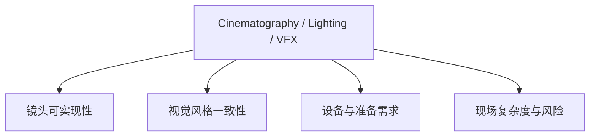
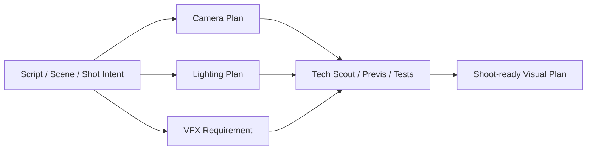
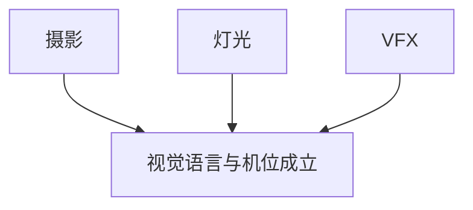
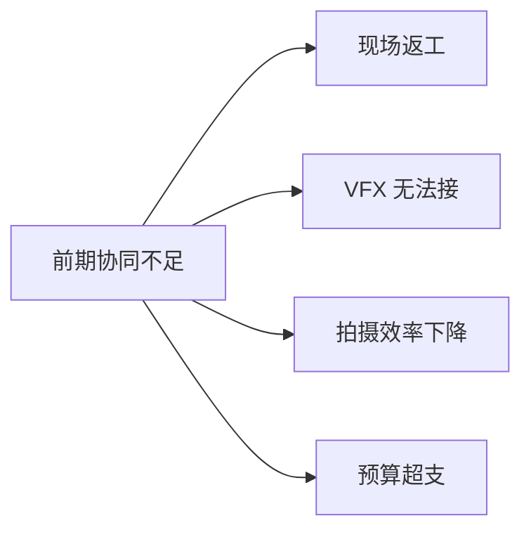
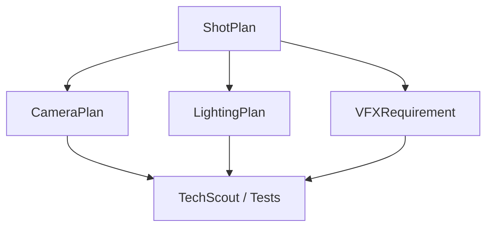
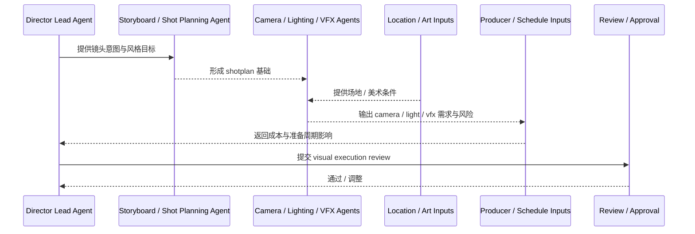
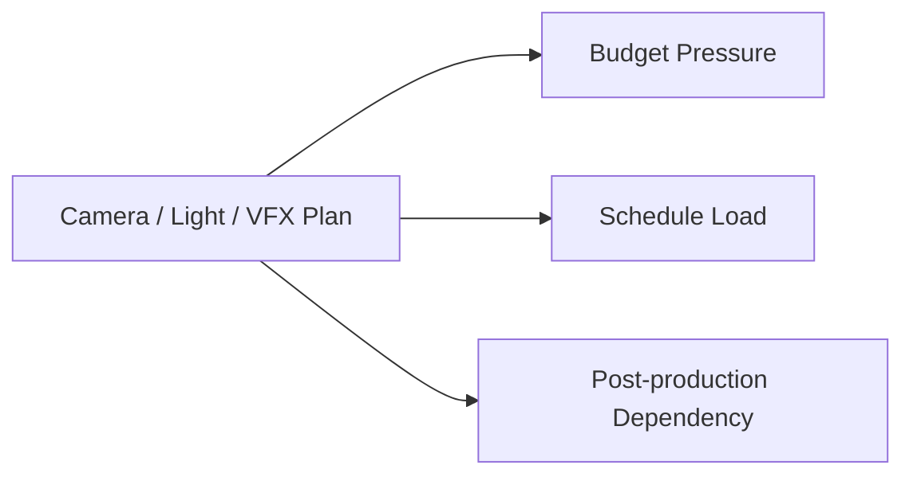

# 32. 摄影、灯光与 VFX 前期协同

## 这篇文档回答什么问题

电影前期最容易被拆散的一组部门，是摄影、灯光和 VFX。现实里它们常常同时决定“这场戏最终能不能按导演想要的方式被拍出来”。

本篇重点回答：

1. 为什么摄影、灯光和 VFX 在前期就必须协同。
2. 它们与剧本、场地、预算、分镜之间是什么关系。
3. 在导演智能体平台里，这组能力应如何对象化和角色化。

---

## 一、这组协同本质上在定义“镜头能否成立”

在现实项目里，很多镜头不是到了现场才决定能不能拍，而是在前期就已经被摄影、灯光和 VFX 的联合评估决定了。

---

## 二、传统前期协同链是怎样的

也就是说，这一组协同并不是拍摄附属品，而是 shotplan 能否落地的关键中间层。

---

## 三、摄影视角通常关心什么

- 景别、机位、焦段、运动是否匹配情绪
- 场地空间是否允许镜头语言成立
- 摄影机、镜头、稳定设备、轨道等是否可执行
- 与灯光和美术材质是否兼容

## 四、灯光视角通常关心什么

- 该场景的光线风格和时间设定
- 场地供电、吊装、布光空间
- 是否需要大规模控光
- 是否影响拍摄效率

## 五、VFX 前期视角通常关心什么

- 哪些镜头需要后期扩展或合成
- 现场需要拍什么参考
- 是否需要 tracking markers、HDRI、clean plate、green/blue screen
- 哪些镜头可以 practical，哪些必须 VFX

---

## 六、为什么这一组必须在前期就联动

如果这组协同不在前期完成，现场最容易出现：

- 镜头语言很好，但场地无法布光
- 现场拍到了素材，但后期无法无缝合成
- VFX 需要的 reference 没拍到
- 灯光方案和拍摄节奏严重冲突

---

## 七、平台中的对象映射建议

建议至少建模以下对象：

- `ShotPlan`
- `CameraPlan`
- `LightingPlan`
- `VFXRequirement`
- `TechScoutNote`
- `PrevisOrTestPackage`

### 建议字段

#### `CameraPlan`

- `scene_id`
- `shot_ids`
- `lens_notes`
- `movement_notes`
- `equipment_needs`
- `constraints`

#### `LightingPlan`

- `scene_id`
- `look_reference`
- `power_and_rigging_notes`
- `day_night_strategy`
- `constraints`

#### `VFXRequirement`

- `shot_ids`
- `vfx_type`
- `on_set_capture_requirements`
- `risk_level`
- `dependency_notes`

---

## 八、平台里的协同工作流建议

---

## 九、这组协同与预算、排期的关系

摄影、灯光和 VFX 的前期方案，会直接决定：

- 设备成本
- 准备时间
- 每日可拍负荷
- 现场复杂度
- 后期成本和交付压力

---

## 十、为什么这组协同特别适合做成智能体子系统

这组工作非常适合智能体化，因为它们都具备：

- 高专业度规则
- 强结构化输入
- 强跨部门依赖
- 强风险识别价值

---

## 十一、对导演智能体平台和 Hermes 的启发

在平台中，这组能力最值得优先做成：

- `ShotPlan` 驱动的下游视觉执行对象
- `CameraPlan` / `LightingPlan` / `VFXRequirement` 的结构化 artifact
- visual execution review 流程

对 Hermes 来说，优先可补的能力包括：

- 镜头语言与视觉执行角色
- 风险与准备周期评估
- 与 location / art / schedule 的联动 review

---

## 十二、结论

摄影、灯光与 VFX 前期协同，本质上是在决定“导演想要的镜头是否能被稳定实现”。

在导演智能体平台里，它应被理解成：

- shotplan 的下游执行验证层
- 视觉风格与可执行性对齐层
- 与预算、排期、美术、场地强耦合的专业协同系统

只有把这组能力正式对象化和工作流化，平台才真正开始接近电影前期的技术预演现实。

---

## 相关文档

- [31-art-costume-props-collaboration.md](./31-art-costume-props-collaboration.md)
- [33-text-storyboard-and-shot-list.md](./33-text-storyboard-and-shot-list.md)
- [35-style-reference-analysis-and-unification.md](./35-style-reference-analysis-and-unification.md)
- [60-cinematography-language-subagent-design.md](./60-cinematography-language-subagent-design.md)
- [65-shotplan-storyboard-promptpack-object-system.md](./65-shotplan-storyboard-promptpack-object-system.md)
