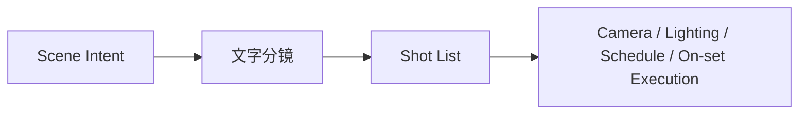
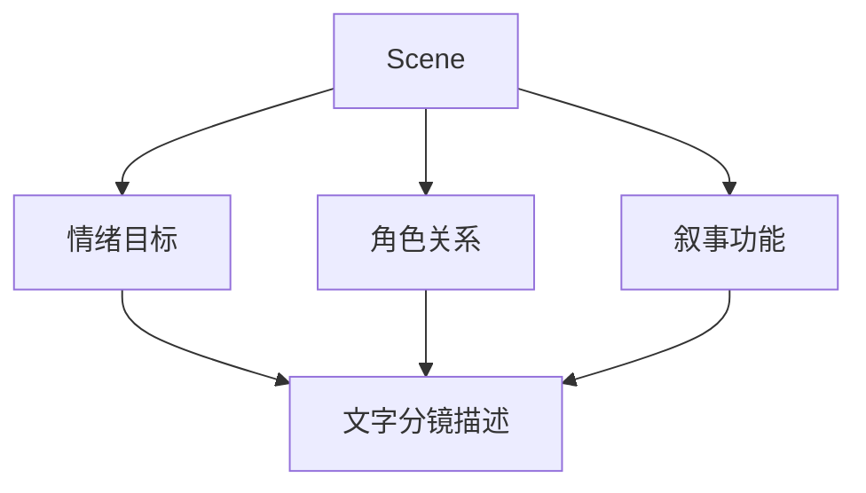
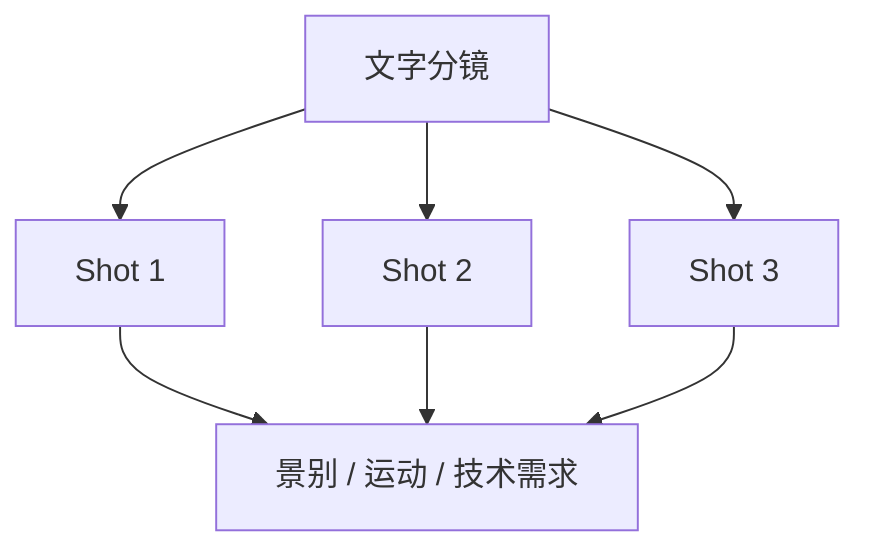
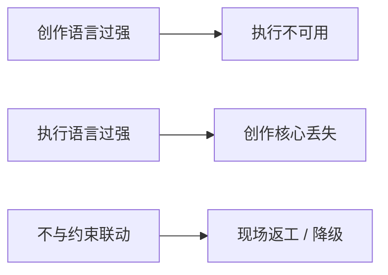
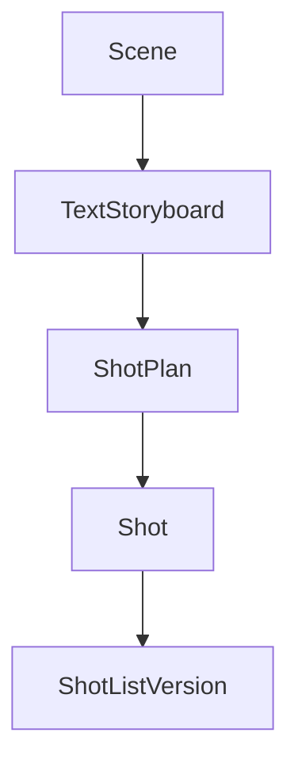
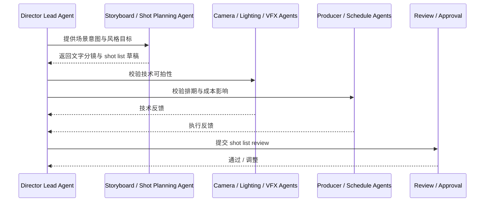
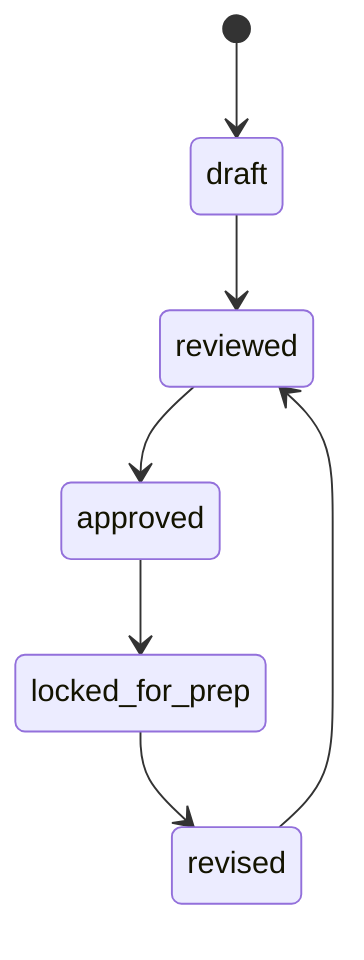
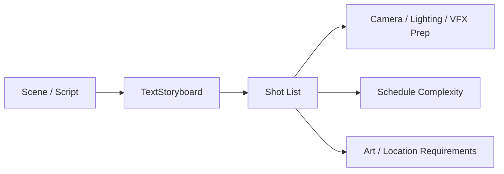

# 33. 文字分镜与 Shot List

## 这篇文档回答什么问题

前期制作走到摄影、灯光、VFX、场地和美术协同之后，下一步需要把导演脑中的镜头组织成可执行语言。最基础也最关键的载体，就是文字分镜和 shot list。

本篇重点回答：

1. 文字分镜和 shot list 在传统电影项目里分别承担什么作用。
2. 它们为什么不是“创意备忘”，而是执行链上的正式对象。
3. 在导演智能体平台里，文字分镜与 shot list 应如何映射成对象、角色和工作流。

---

## 一、文字分镜和 shot list 不是一回事

现实里，这两个概念经常被混用，但它们关注点不同。

- 文字分镜更强调镜头意图、情绪、节奏和叙事作用
- shot list 更强调镜头组织、执行顺序、技术需求和生产可拍性

可以把它们理解为：

- 文字分镜：导演语言向镜头语言的第一次翻译
- shot list：镜头语言向执行语言的第一次收敛

---

## 二、传统文字分镜通常在做什么

文字分镜并不是机械写“近景、中景、远景”，而是在说明：

- 这一组镜头想让观众感受到什么
- 角色关系如何在镜头中展开
- 这一段戏的节奏如何推进
- 哪些镜头是必须保住的核心表达

---

## 三、传统 shot list 通常在做什么

Shot list 往往会进一步落到：

- shot 编号
- 景别
- 机位或运动
- 拍摄重点
- 复杂度
- 对设备、灯光、VFX、场地的要求

Shot list 的价值在于：让摄影、灯光、副导演、制片等部门对“要拍什么”达成可执行共识。

---

## 四、传统文字分镜 / shot list 的主要难点

### 1. 容易只讲感觉，不讲执行

这会导致：

- 导演觉得想法清楚
- 但摄影、灯光、制片无法据此做准备

### 2. 容易只讲执行，不保创作核心

这会导致：

- shot list 很整齐
- 但真正重要的镜头意图丢失

### 3. 与 schedule、location、camera plan 不联动

结果就是现场发现根本拍不出来，或者拍出来不是想要的。

---

## 五、在平台中的对象映射建议

建议至少建模以下对象：

- `ShotPlan`
- `Shot`
- `TextStoryboard`
- `ShotListVersion`

### 建议字段

#### `TextStoryboard`

- `scene_id`
- `creative_goal`
- `emotional_beats`
- `camera_language_notes`
- `must_keep_moments`

#### `Shot`

- `shot_id`
- `scene_id`
- `size`
- `movement`
- `blocking_summary`
- `technical_requirements`
- `priority`

---

## 六、平台里的工作流建议

---

## 七、为什么文字分镜和 shot list 必须进入正式状态链

现实里很多项目会把 shot list 当成临时文件，但导演智能体平台里更合理的做法是把它看作正式对象。

这样做的价值是：

- 哪个版本生效很清楚
- 下游 camera / lighting / schedule 有稳定基线
- 改动会被显式视为变更

---

## 八、与前期其他链路的关系

这说明文字分镜和 shot list 是连接“创作表达”与“技术执行”的关键桥梁。

---

## 九、对导演智能体平台和 Hermes 的启发

在平台中，这组能力最适合由：

- 导演主智能体定义创作意图
- Storyboard / Shot Planning Agent 输出结构化镜头草稿
- Camera / Lighting / Producer / Schedule 角色共同 review

对 Hermes 而言，优先可补的能力包括：

- `TextStoryboard` / `ShotPlan` / `Shot` 对象
- shot list artifact 文件
- 镜头优先级、复杂度和风险字段

---

## 十、结论

文字分镜和 shot list 在电影前期不是草稿附件，而是把导演意图正式翻译成镜头组织与执行准备的核心对象。

在导演智能体平台里，它们应被理解成：

- 创作意图的结构化载体
- 技术与排期校验的上游对象
- camera / lighting / schedule / location 等多个部门的共同基线

只有把这组对象正式化，平台才真正进入“镜头级前期准备”的阶段。

---

## 相关文档

- [32-cinematography-lighting-vfx-preproduction.md](./32-cinematography-lighting-vfx-preproduction.md)
- [34-static-storyboards-and-moodboards.md](./34-static-storyboards-and-moodboards.md)
- [35-style-reference-analysis-and-unification.md](./35-style-reference-analysis-and-unification.md)
- [55-storyboard-subagent-design.md](./55-storyboard-subagent-design.md)
- [65-shotplan-storyboard-promptpack-object-system.md](./65-shotplan-storyboard-promptpack-object-system.md)
