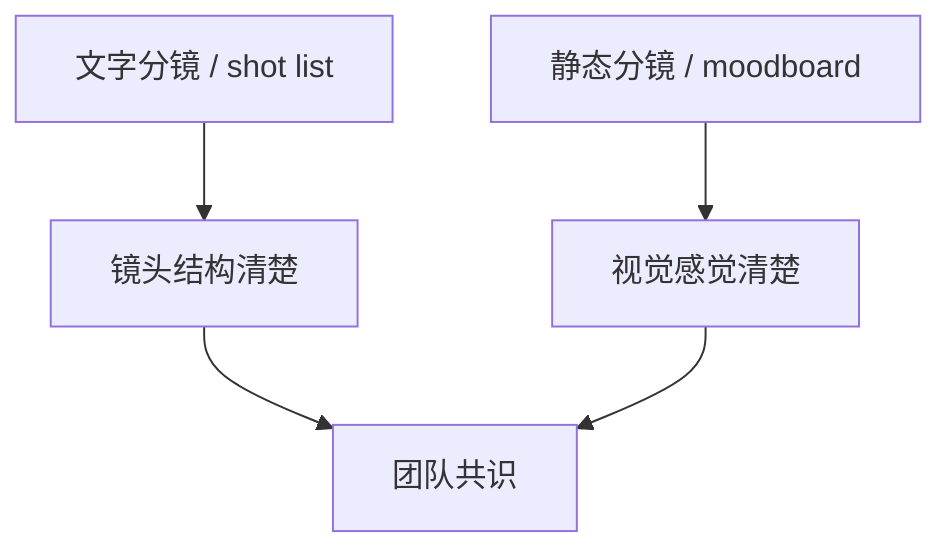
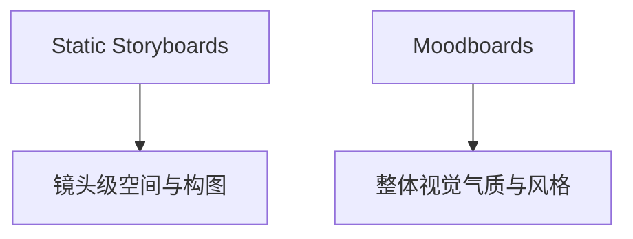
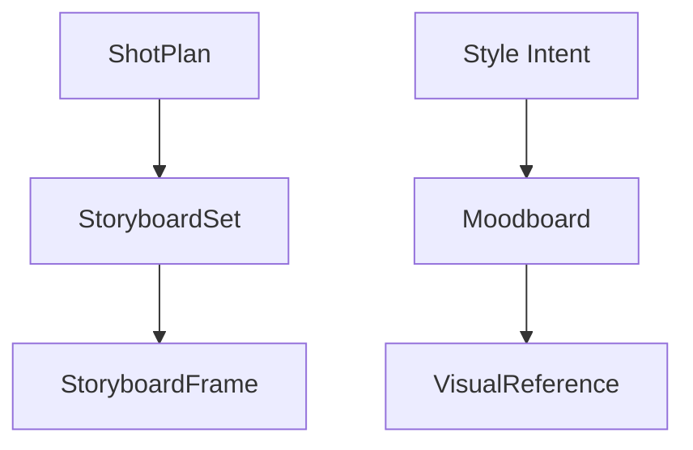
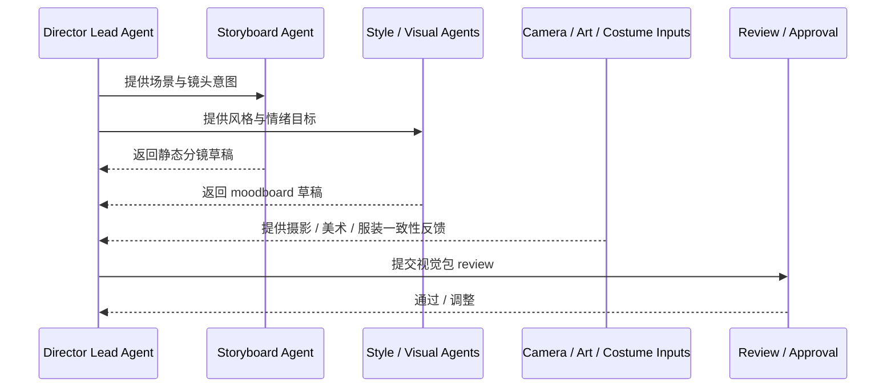
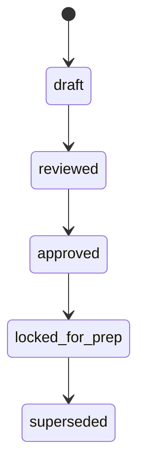
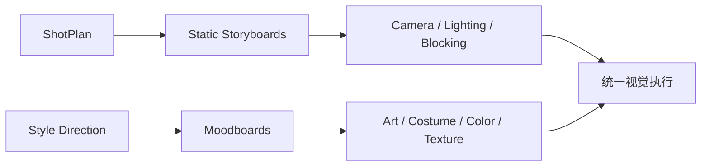

# 34. 静态分镜与 Moodboard

## 这篇文档回答什么问题

文字分镜和 shot list 解决了镜头语言的结构化问题，但很多视觉信息仍然需要更直观的载体来统一团队理解。现实里，这通常依赖静态分镜和 moodboard。

本篇重点回答：

1. 静态分镜与 moodboard 分别在传统前期中承担什么作用。
2. 它们为什么不是“漂亮参考图合集”，而是协同对象。
3. 在导演智能体平台里，这些视觉资产应如何对象化、版本化和进入 review。

---

## 一、静态分镜与 moodboard 解决的是“视觉共识”

在电影前期，文字可以描述意图，但无法总是稳定传达：

- 空间关系
- 光线质感
- 构图重心
- 色调气氛
- 画面密度

---

## 二、静态分镜通常在做什么

静态分镜更偏镜头级视觉预演，通常帮助团队确认：

- 角色和空间的位置关系
- 构图和镜头重心
- 机位大致逻辑
- 镜头切换关系

---

## 三、Moodboard 通常在做什么

Moodboard 更偏风格与氛围统一，通常帮助团队确认：

- 色彩方向
- 材质和质感
- 光线气质
- 情绪氛围
- 世界观的视觉基调

---

## 四、这两者为什么不能混为一谈

现实里很多项目会把所有视觉参考都混在一起，但静态分镜和 moodboard 的核心目标不同：

- 静态分镜更偏“怎么拍”
- moodboard 更偏“拍出来应该像什么”

如果不区分，团队很容易：

- 有很多好看的参考，但镜头执行不清楚
- 有镜头构图草图，但风格不统一

---

## 五、在平台中的对象映射建议

建议至少建模以下对象：

- `StoryboardSet`
- `StoryboardFrame`
- `Moodboard`
- `VisualReference`

### 建议字段

#### `StoryboardFrame`

- `scene_id`
- `shot_id`
- `frame_purpose`
- `composition_notes`
- `camera_notes`

#### `Moodboard`

- `theme`
- `color_direction`
- `material_direction`
- `lighting_direction`
- `reference_links_or_assets`

---

## 六、平台里的协同工作流建议

---

## 七、为什么视觉资产必须版本化

如果静态分镜和 moodboard 不版本化，前期很容易发生：

- 不知道当前生效的是哪一版视觉方向
- 不同部门各自参考不同图片
- 旧参考混进新方案

---

## 八、静态分镜 / moodboard 与前期其他系统的关系

这说明它们并不是“创意附件”，而是多个部门共享的视觉控制面。

---

## 九、对导演智能体平台和 Hermes 的启发

在导演智能体平台里，这组对象最值得做成：

- 可 review 的视觉资产集合
- 与 shotplan、style、camera、art 强绑定的 artifact
- 有明确状态和版本边界的视觉基线

对 Hermes 而言，优先可补的能力包括：

- `StoryboardSet` / `Moodboard` 对象
- 视觉资产目录规范
- 视觉包 review 流程

---

## 十、结论

静态分镜与 moodboard 在电影前期真正解决的是“视觉共识”问题。

在导演智能体平台里，它们应被理解成：

- 镜头级视觉预演对象
- 风格级统一对象
- 多部门共享、可 review、可锁定的正式视觉资产

只有把这些视觉资产从“参考图合集”升级成正式对象，平台才能真正支撑前期视觉统一。

---

## 相关文档

- [33-text-storyboard-and-shot-list.md](./33-text-storyboard-and-shot-list.md)
- [35-style-reference-analysis-and-unification.md](./35-style-reference-analysis-and-unification.md)
- [55-storyboard-subagent-design.md](./55-storyboard-subagent-design.md)
- [65-shotplan-storyboard-promptpack-object-system.md](./65-shotplan-storyboard-promptpack-object-system.md)
- [69-memory-and-knowledge-capture-design.md](./69-memory-and-knowledge-capture-design.md)
