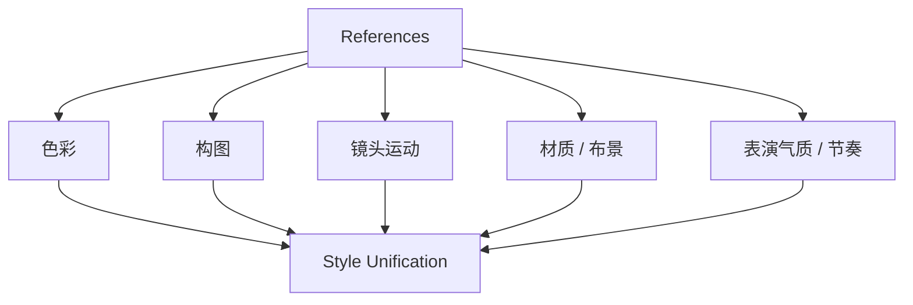
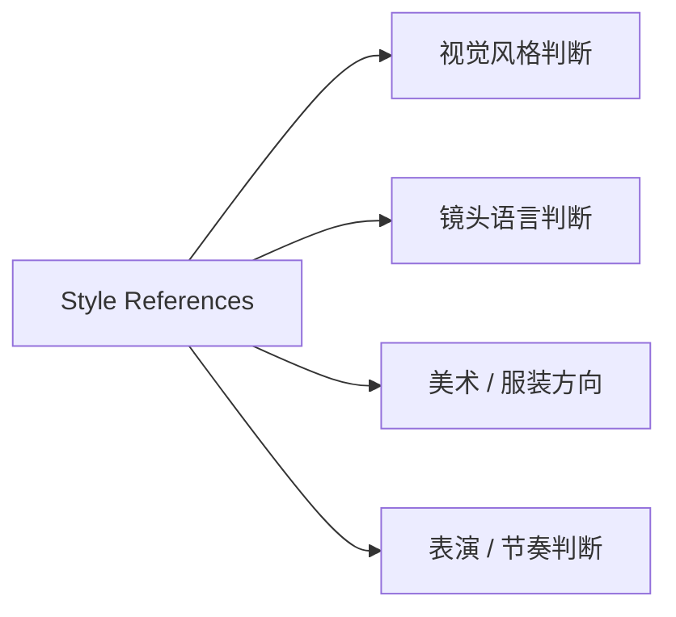
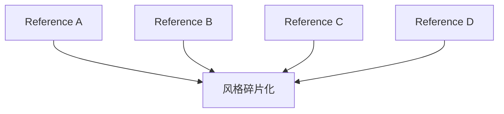
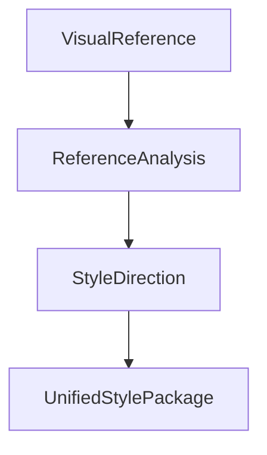
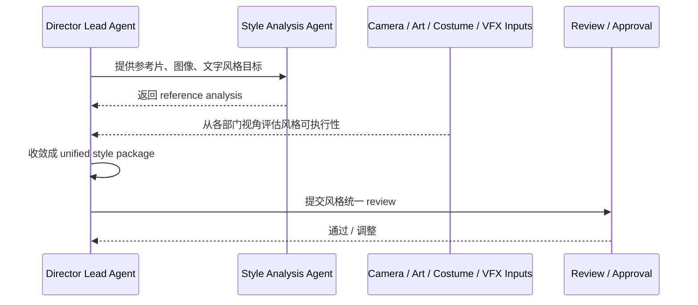
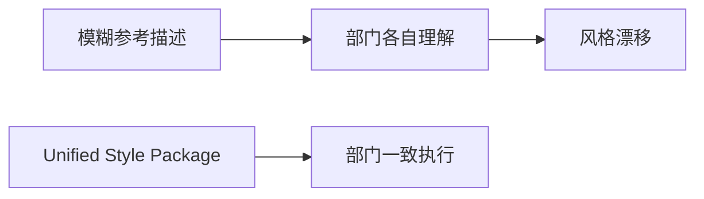
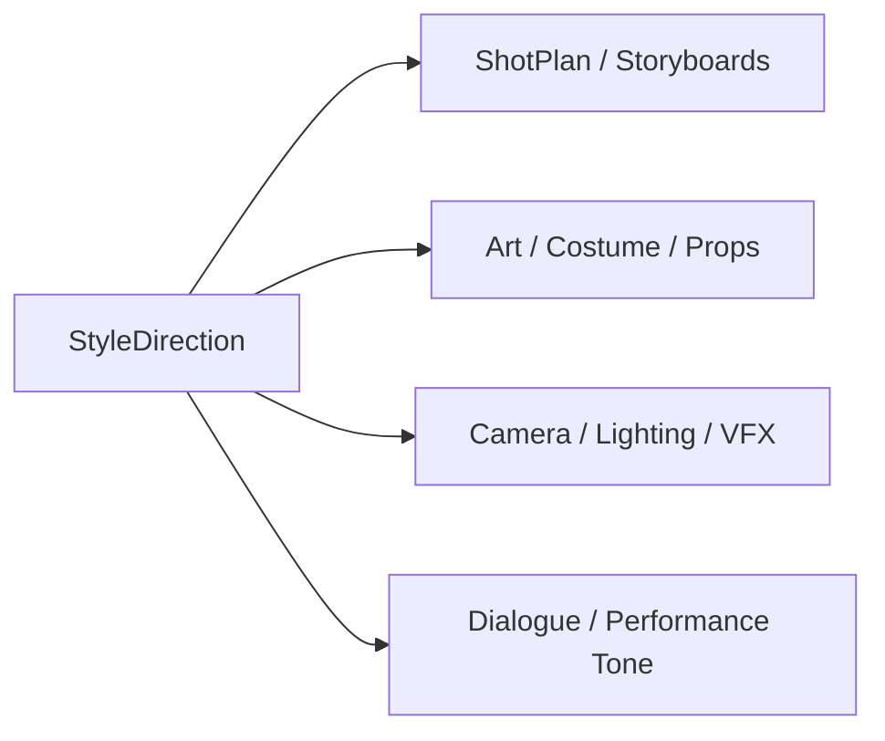

# 35. 风格参考分析与统一

## 这篇文档回答什么问题

电影前期里最常见的一种失控，是每个部门都在说“我理解导演想要的风格”，但理解的根本不是同一件事。

本篇重点回答：

1. 风格参考在传统电影项目里为什么重要。
2. 为什么“参考很多”不等于“风格统一”。
3. 在导演智能体平台里，风格参考分析和统一应如何对象化、结构化和治理化。

---

## 一、风格参考不是收藏夹，而是共识工具

在现实项目里，导演、摄影、美术、服装、调色、VFX 都会参考大量影片、摄影作品、绘画或设计图像。但如果没有统一分析，这些参考很容易相互冲突。

---

## 二、传统风格参考的真实用途

现实中的 style references 通常用来帮助团队回答：

- 画面大概偏什么色温和对比度
- 镜头语言偏稳定还是侵入式
- 空间压迫感强不强
- 美术材质和时代感应怎样表达
- 表演节奏和对白节奏偏克制还是外放

---

## 三、为什么“参考很多”反而可能更危险

传统前期最常见的问题之一，就是 reference 爆炸：

- 导演引用 A 片的构图
- 摄影引用 B 片的光线
- 美术引用 C 片的材质
- 服装引用 D 片的年代感

最后合在一起并不统一。

所以真正重要的不是“找更多参考”，而是做 reference analysis 和 style unification。

---

## 四、风格统一在平台中的对象映射建议

建议至少建模以下对象：

- `VisualReference`
- `ReferenceAnalysis`
- `StyleDirection`
- `UnifiedStylePackage`

### 建议字段

#### `ReferenceAnalysis`

- `reference_id`
- `color_notes`
- `composition_notes`
- `movement_notes`
- `texture_notes`
- `mood_notes`
- `department_relevance`

#### `UnifiedStylePackage`

- `core_style_statement`
- `allowed_ranges`
- `forbidden_patterns`
- `department_guidance`
- `reference_bundle`

---

## 五、平台里的风格统一工作流建议

---

## 六、为什么风格统一必须写成“可执行说明”

现实里很多风格方案写成：

- “偏冷”
- “高级一点”
- “像某某电影”

这类描述对部门协作帮助很有限。

更有效的做法是把风格统一写成：

- 明确的核心气质
- 可接受范围
- 不应该出现的偏差
- 各部门的解释说明

---

## 七、与前期其他对象的关系

这说明风格统一并不是视觉部门专属事项，而是整个前期制作的上游控制面之一。

---

## 八、对导演智能体平台和 Hermes 的启发

在平台里，这组能力最值得优先做成：

- 参考分析对象
- 统一风格包对象
- 跨部门 style review 流程

对 Hermes 来说，优先可补的能力包括：

- reference analysis artifact
- `UnifiedStylePackage`
- 与 storyboard、art、camera、dialogue 的联动约束注入

---

## 九、结论

风格参考分析与统一，在电影前期真正解决的是“多个部门如何理解同一部电影的气质”。

在导演智能体平台里，它应被理解成：

- 从参考资产中提炼共识的分析过程
- 一个可执行、可 review、可版本化的统一风格对象
- 影响镜头、美术、服装、灯光、VFX、对白节奏的上游控制面

只有把 style unification 做实，平台才能防止前期制作在部门协作中逐渐失真。

---

## 相关文档

- [31-art-costume-props-collaboration.md](./31-art-costume-props-collaboration.md)
- [34-static-storyboards-and-moodboards.md](./34-static-storyboards-and-moodboards.md)
- [36-dialogue-design-and-polish.md](./36-dialogue-design-and-polish.md)
- [65-shotplan-storyboard-promptpack-object-system.md](./65-shotplan-storyboard-promptpack-object-system.md)
- [69-memory-and-knowledge-capture-design.md](./69-memory-and-knowledge-capture-design.md)
