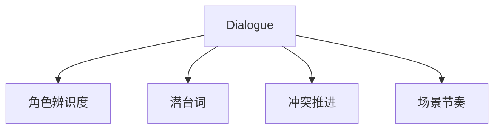
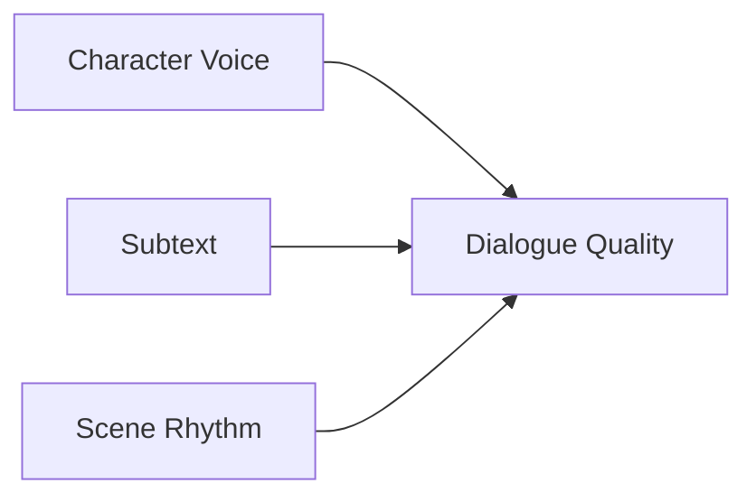
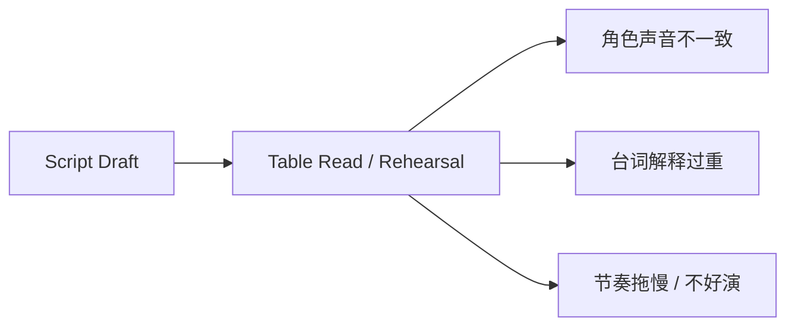
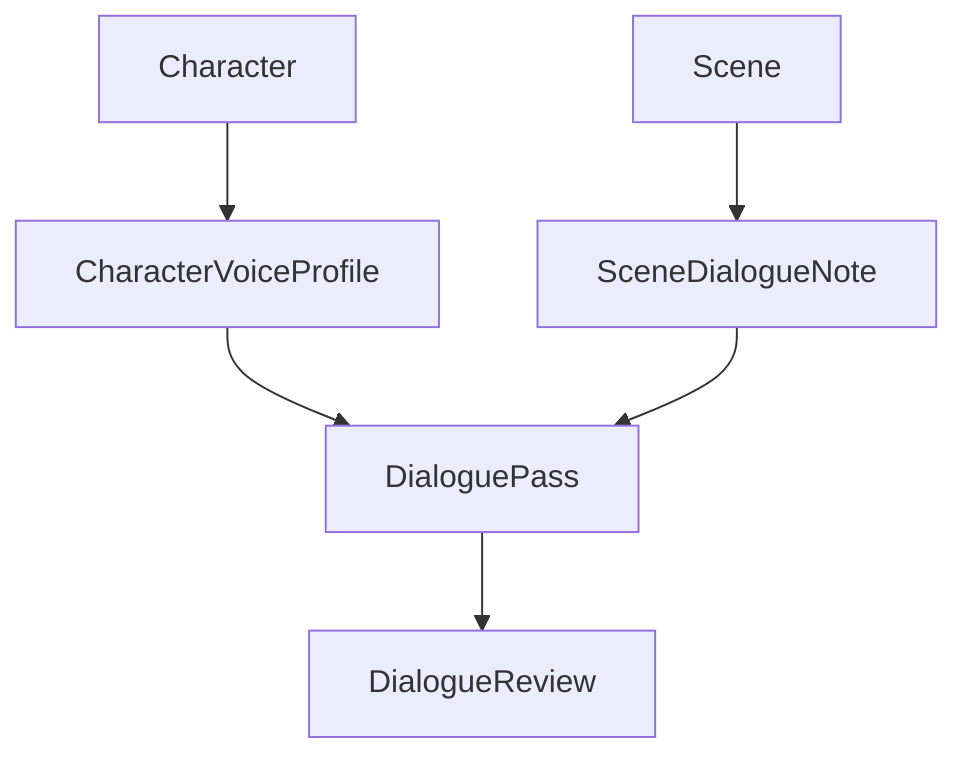
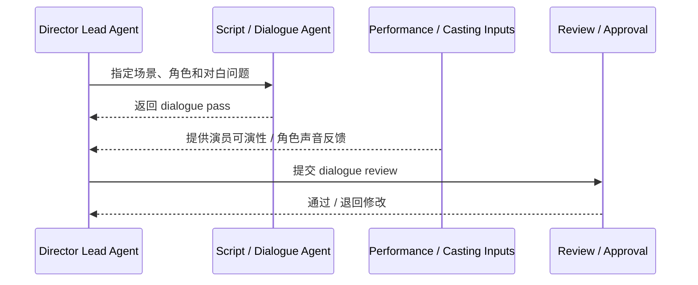
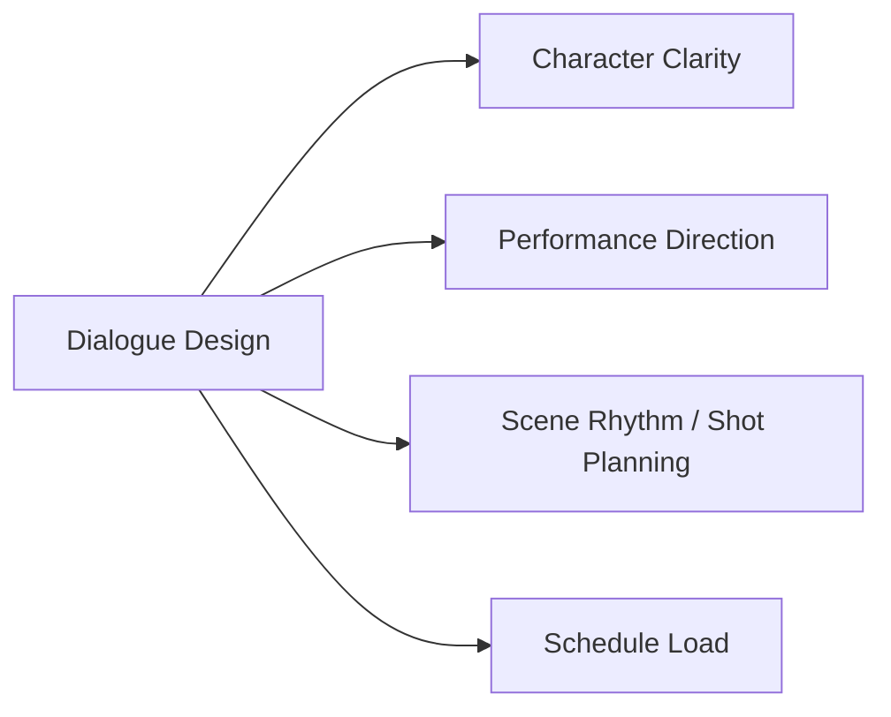
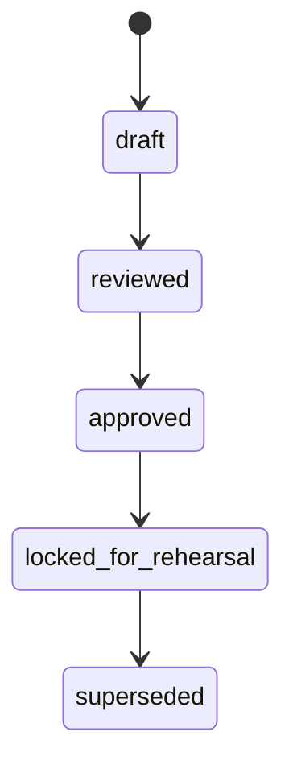
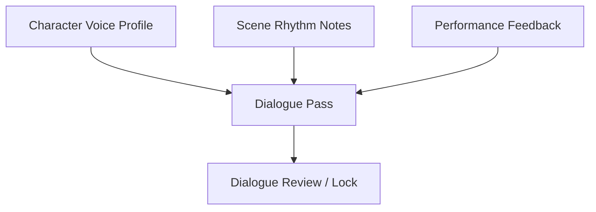

# 36. 对白设计与润色

## 这篇文档回答什么问题

电影前期里，对白经常被误解成“编剧最后再修修词句”。但现实里，对白设计往往直接影响：

- 角色是否成立
- 场景冲突是否清楚
- 演员是否好演
- 节奏是否自然

本篇重点回答：

1. 对白设计在传统电影前期中承担什么作用。
2. 为什么对白润色不是文学修辞，而是角色、表演和节奏的联合设计。
3. 在导演智能体平台里，对白设计应如何对象化与工作流化。

---

## 一、对白不是装饰，而是角色行动的一部分

好的电影对白并不只是“好听”，而是服务于：

- 人物动机
- 潜台词
- 冲突推进
- 情绪节奏

---

## 二、传统对白设计通常解决什么问题

### 1. 每个角色说话方式是否区分明显

### 2. 信息是不是通过戏剧动作自然出现，而不是解释性台词

### 3. 对白是否和场景节奏匹配

### 4. 是否适合演员表演和现场执行

---

## 三、为什么对白问题经常在前期后段才暴露

现实里很多对白看起来在纸面上没问题，但一旦进入：

- table read
- rehearsal
- shot planning
- performance discussion

就会暴露出问题。

所以对白润色应被视为前期制作中的正式收敛过程，而不是最后的小修小补。

---

## 四、对白设计在平台中的对象映射建议

建议至少建模以下对象：

- `DialoguePass`
- `SceneDialogueNote`
- `CharacterVoiceProfile`
- `DialogueReview`

### 建议字段

#### `CharacterVoiceProfile`

- `character_id`
- `speech_style`
- `vocabulary_range`
- `subtext_pattern`
- `forbidden_tropes`

#### `DialoguePass`

- `script_version_id`
- `target_scenes`
- `goal`
- `changes_summary`
- `status`

---

## 五、平台里的对白工作流建议

---

## 六、对白设计与前期其他链路的关系

对白并不是只属于编剧，它会影响：

- 角色塑造
- 演员准备
- 镜头节奏
- 场景长度与拍摄负荷

这说明对白润色其实也是生产链的一部分。

---

## 七、为什么对白也需要正式状态

如果对白修改总是散落在聊天里，会出现：

- 不知道哪一版台词生效
- 演员看到的版本和镜头准备依据不一致
- 现场临时改词没有进入正式记录

---

## 八、对白润色对导演智能体平台的启发

平台中，对白设计最值得补的不是“自动生成更华丽的句子”，而是：

- 角色声音一致性
- 场景节奏和潜台词分析
- 与 performance / shot planning 联动
- 正式 dialogue pass 和 review 记录

---

## 九、对 Hermes 的直接实现启发

对 Hermes 来说，优先可补的能力包括：

- `CharacterVoiceProfile`
- `DialoguePass`
- scene-level dialogue note artifact
- 与 casting / performance / shot planning 的联动 review

这也意味着 Dialogue Agent 更适合被视为：

- 角色一致性与表演可演性的专业子智能体

而不是单纯的“润色机器人”。

---

## 十、结论

对白设计与润色，在电影前期真正解决的是：

- 角色说话是否像自己
- 场景冲突是否清楚
- 节奏是否成立
- 演员是否好演

在导演智能体平台里，它应被理解成：

- 与角色和 scene 强绑定的对象化修订过程
- 可 review、可锁定的正式 dialogue pass
- 连接 script、performance、shot planning 的创作控制面之一

只有把对白从“临时改词”升级成正式对象和工作流，平台才真正能承接更深的创作质量控制。

---

## 相关文档

- [25-script-development-and-lock.md](./25-script-development-and-lock.md)
- [33-text-storyboard-and-shot-list.md](./33-text-storyboard-and-shot-list.md)
- [35-style-reference-analysis-and-unification.md](./35-style-reference-analysis-and-unification.md)
- [42-performance-direction-and-feedback.md](./42-performance-direction-and-feedback.md)
- [63-script-scene-character-object-system.md](./63-script-scene-character-object-system.md)
