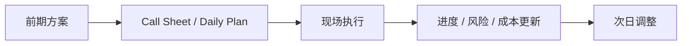
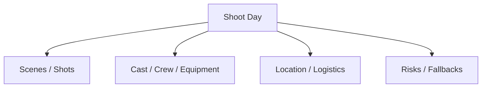
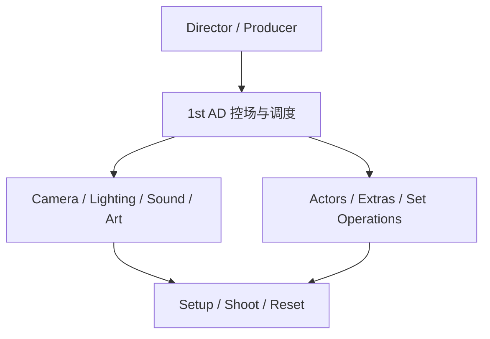
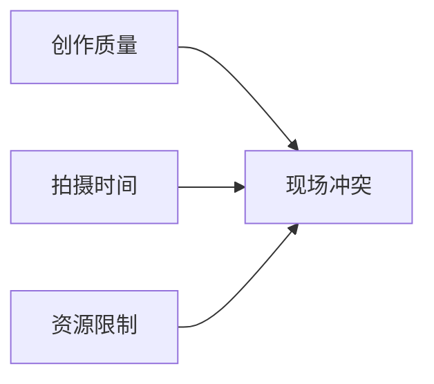
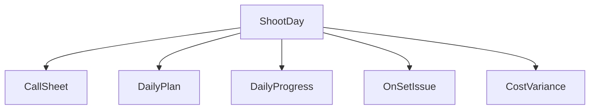
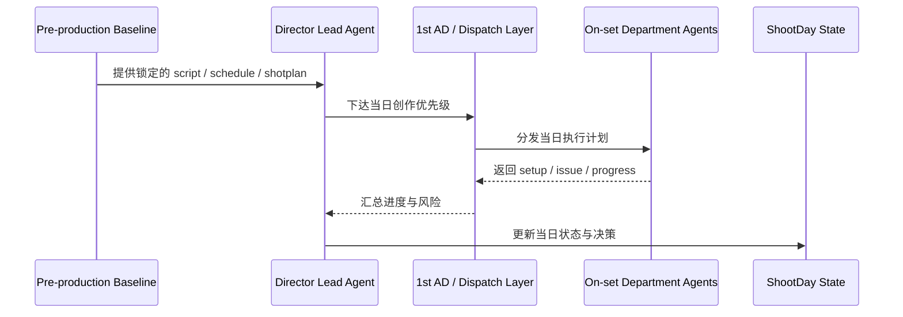
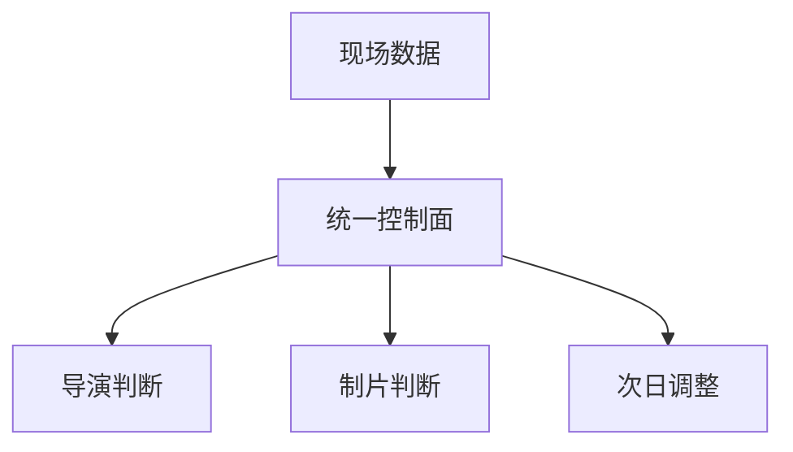

# 37. 正式拍摄阶段的运行方式

## 这篇文档回答什么问题

前期制作解决的是“怎么准备”，正式拍摄解决的是“怎么在每天有限时间里把关键镜头真正完成”。

本篇重点回答：

1. 传统 principal photography 阶段到底是如何运转的。
2. 为什么拍摄现场本质上是一个实时调度与决策系统。
3. 在导演智能体平台里，正式拍摄应如何被映射成对象、角色和控制面。

---

## 一、拍摄阶段不是继续策划，而是高压执行

一旦进入 principal photography，项目的主矛盾就从“方案是否合理”变成：

- 今天能不能完成目标镜头
- 突发问题如何快速处理
- 创作质量与进度、成本如何平衡

拍摄阶段的核心不是“继续讨论”，而是“持续执行与持续修正”。

---

## 二、传统拍摄现场的核心运行单元

正式拍摄通常围绕“拍摄日”而不是“整部片”来管理。

每个拍摄日都要回答：

- 今天拍哪些 scene / shots
- 哪些镜头是 must-get
- 哪些资源今天会被使用
- 哪些风险可能导致掉页或超时

这说明拍摄阶段的控制面要比前期更细、更实时。

---

## 三、拍摄阶段的传统组织逻辑

现场并不是所有人都直接听导演单线指挥，而是一个分层组织系统。

其中：

- 导演负责创作判断
- 1st AD 负责现场节奏与命令链
- 各部门负责把当前 setup 变成可拍状态

---

## 四、传统拍摄的主要矛盾

### 1. 时间与质量冲突

镜头拍得越精细，通常越耗时间。

### 2. 现场变化不可避免

例如：

- 天气变化
- 演员延迟
- 场地限制突发变化
- 设备问题

### 3. 每个部门都看到局部最优

现场真正困难的是把局部最优收敛成全局最优。

---

## 五、在平台中的对象映射建议

正式拍摄阶段建议至少建模以下对象：

- `ShootDay`
- `DailyPlan`
- `CallSheet`
- `OnSetIssue`
- `DailyProgress`
- `CostVariance`

这些对象共同构成拍摄阶段的现场控制面。

---

## 六、平台里的正式拍摄工作流建议

---

## 七、为什么拍摄阶段特别适合做成控制面

拍摄现场最大的系统价值，不在于“再生成内容”，而在于：

- 把现场状态看清
- 快速升级关键问题
- 让导演与制片看到统一面板

这比单纯生成建议更接近真实生产价值。

---

## 八、对导演智能体平台和 Hermes 的启发

对平台而言，principal photography 最重要的不是更多创意输出，而是：

- `ShootDay` 状态管理
- 实时 issue / risk / escalation 维护
- daily plan 与 daily progress 联动

对 Hermes 来说，优先可补的能力包括：

- 拍摄日对象
- 现场问题对象
- progress / variance 更新工具
- 与 1st AD 调度系统联动

---

## 九、结论

正式拍摄阶段，本质上是一套实时执行和控制系统。

在导演智能体平台里，它应被理解成：

- 以 shoot day 为单位的状态机
- 以 1st AD 为核心的现场调度链
- 以 progress / issue / cost 为核心的动态控制面

只有把拍摄阶段对象化和实时化，平台才真正开始承接电影工业的生产现场。

---

## 相关文档

- [38-call-sheet-and-daily-plan.md](./38-call-sheet-and-daily-plan.md)
- [39-assistant-director-dispatch-system.md](./39-assistant-director-dispatch-system.md)
- [40-progress-and-cost-control.md](./40-progress-and-cost-control.md)
- [41-on-set-escalation-and-decision-making.md](./41-on-set-escalation-and-decision-making.md)
- [44-dailies-output-and-review.md](./44-dailies-output-and-review.md)
- [67-workflow-state-machine-design.md](./67-workflow-state-machine-design.md)
