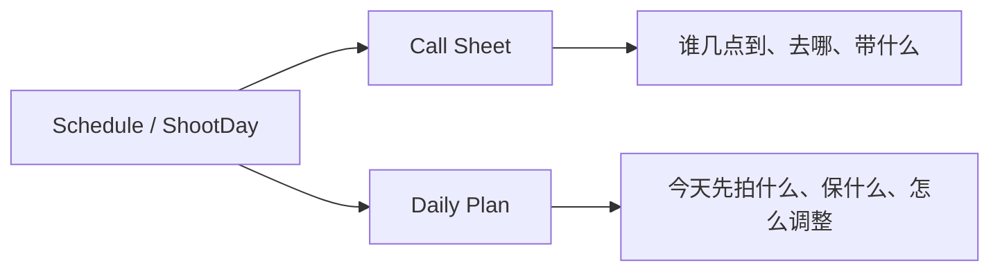
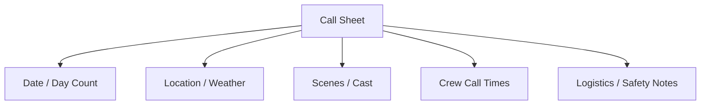
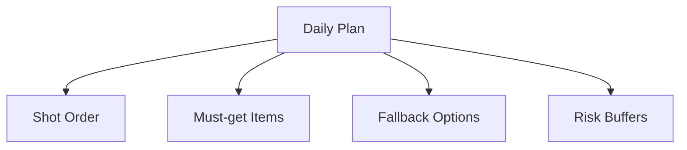
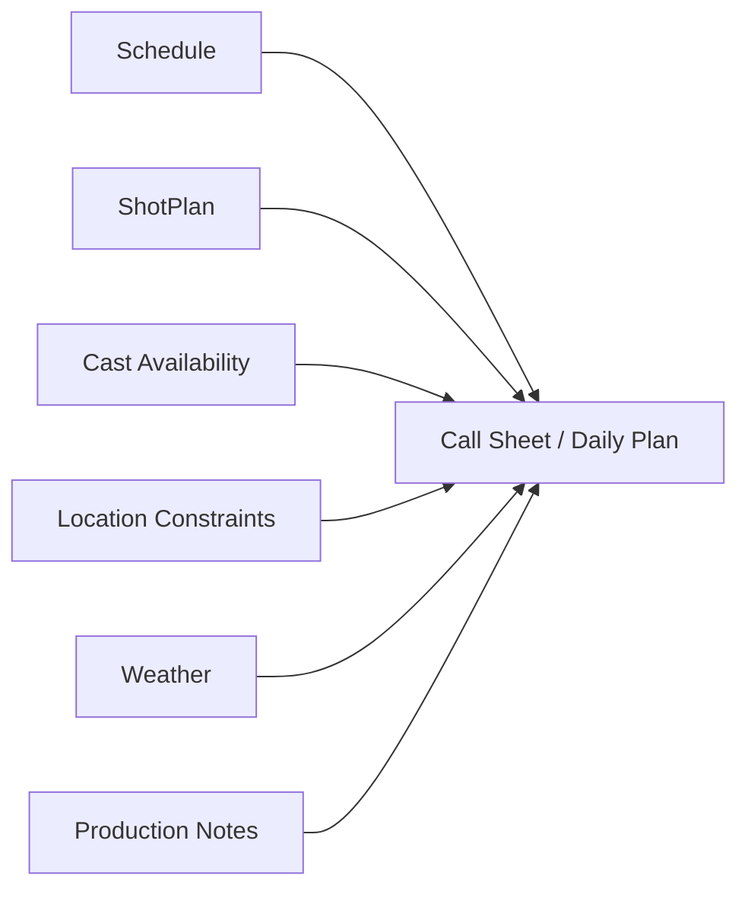
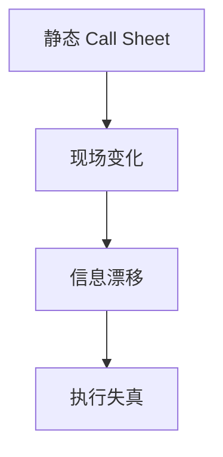
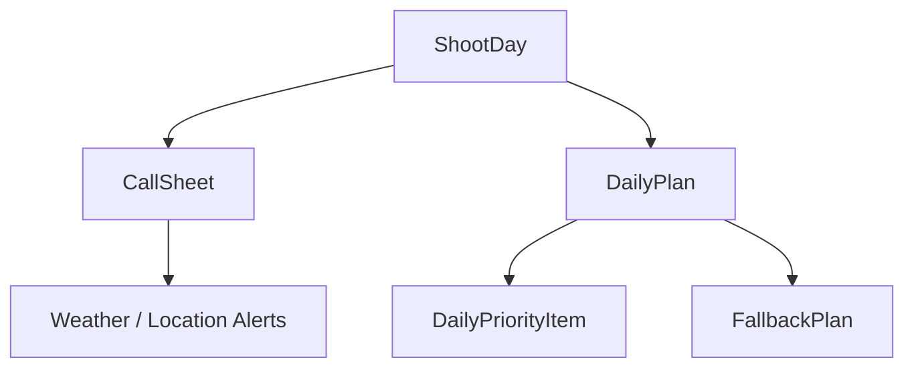
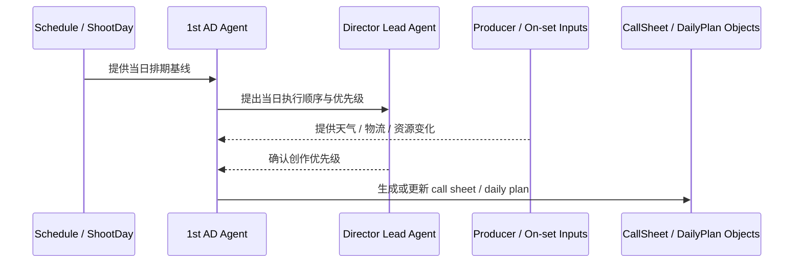
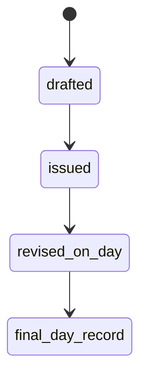

# 38. Call Sheet 与 Daily Plan

## 这篇文档回答什么问题

拍摄阶段真正把一天组织起来的，不是抽象 schedule，而是 call sheet 和 daily plan。

本篇重点回答：

1. Call sheet 和 daily plan 在传统拍摄中分别承担什么作用。
2. 为什么它们是现场最关键的“日级控制文档”。
3. 在导演智能体平台里，这两者应如何对象化、版本化和动态更新。

---

## 一、Call Sheet 和 Daily Plan 不是同一件事

现实里两者关系很紧，但关注点不同。

- Call sheet 更像正式通知与组织文件
- Daily plan 更像当天的执行计划与优先级安排

---

## 二、传统 call sheet 通常包含什么

常见内容包括：

- 拍摄日期与 day count
- 集合与开机时间
- 场地与天气
- 当日 scene / pages
- 演员到场信息
- 主要部门和注意事项
- 交通、餐食、安全信息

---

## 三、传统 daily plan 通常包含什么

Daily plan 更强调“现场实际怎么打”：

- 当前 shot order
- must-get shots
- fallback 顺序
- setup 切换逻辑
- 时间缓冲和风险点

---

## 四、为什么这两者是现场控制核心

因为它们把上游的 schedule、shotplan、cast、location、weather 等信息压缩成当天所有人能执行的一张图。

没有这层日级文档，现场会只有局部信息，没有统一节奏。

---

## 五、现实中的主要问题

### 1. call sheet 发了，但当天实际打法变了

### 2. daily plan 在群聊里不断变化，没有正式回写

### 3. 导演、1st AD、制片看到的当天优先级并不完全一致

这也是为什么导演智能体平台需要把它们对象化，而不是只看成 PDF 文档。

---

## 六、平台中的对象映射建议

建议至少建模：

- `CallSheet`
- `DailyPlan`
- `DailyPriorityItem`
- `FallbackPlan`
- `WeatherOrLocationAlert`

### 建议字段

#### `CallSheet`

- `shoot_day_id`
- `day_count`
- `date`
- `location`
- `weather_summary`
- `cast_calls`
- `crew_calls`
- `scene_ids`

#### `DailyPlan`

- `shoot_day_id`
- `shot_order`
- `must_get_items`
- `fallback_items`
- `risk_notes`
- `status`

---

## 七、平台里的工作流建议

---

## 八、为什么 call sheet / daily plan 必须可更新而不是一次生成

现实里当天变化非常多，所以平台中应支持：

- 发布版
- 调整版
- 最新现场版

---

## 九、对导演智能体平台和 Hermes 的启发

对平台来说，这两类对象是拍摄阶段最关键的日级控制接口。

对 Hermes 来说，优先可补的能力包括：

- `CallSheet` / `DailyPlan` 对象
- call sheet 模板生成
- 当日变更的状态更新
- must-get / fallback / risk 的显式字段

---

## 十、结论

Call sheet 和 daily plan 在电影拍摄现场的价值，不只是通知，而是把上游全部计划收敛成当天的正式执行界面。

在导演智能体平台里，它们应被理解成：

- `ShootDay` 的正式控制对象
- 可发出、可更新、可归档的日级产物
- 导演、1st AD、制片和各部门共享的执行基线

只有把它们对象化，平台才真正能支撑拍摄当天的组织现实。

---

## 相关文档

- [37-principal-photography-operations.md](./37-principal-photography-operations.md)
- [39-assistant-director-dispatch-system.md](./39-assistant-director-dispatch-system.md)
- [40-progress-and-cost-control.md](./40-progress-and-cost-control.md)
- [44-dailies-output-and-review.md](./44-dailies-output-and-review.md)
- [67-workflow-state-machine-design.md](./67-workflow-state-machine-design.md)
