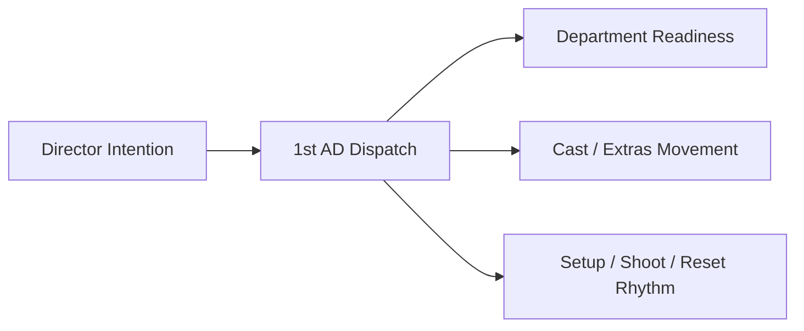
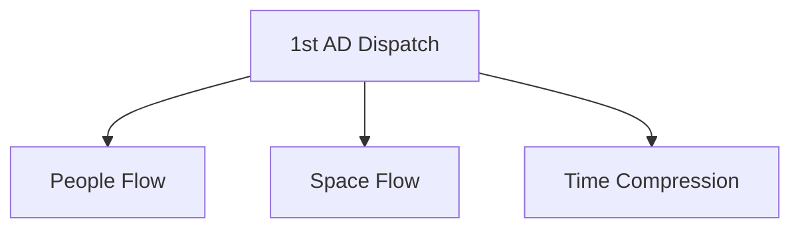
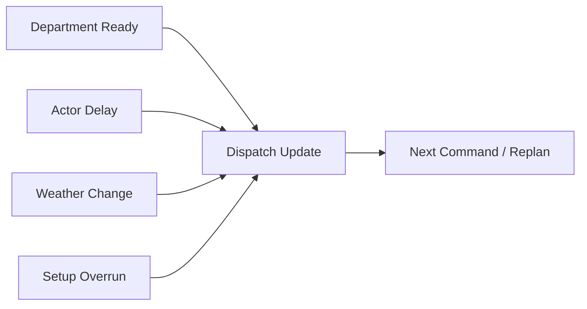
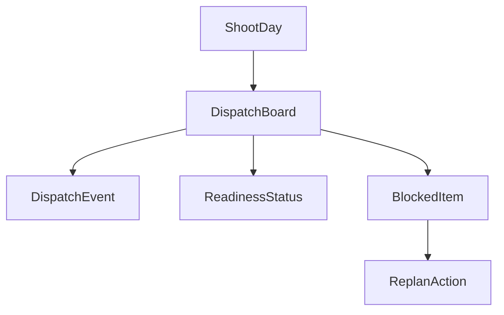
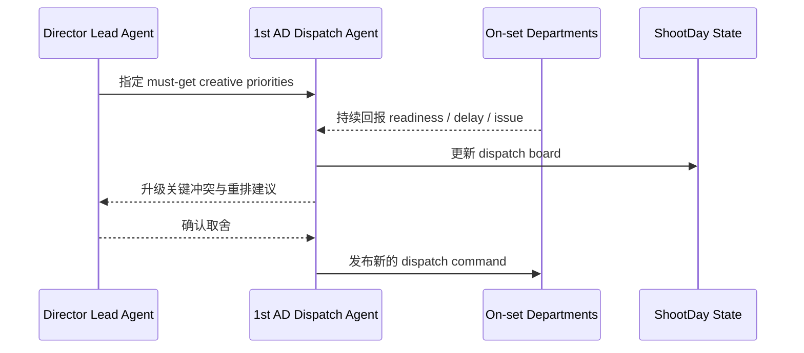
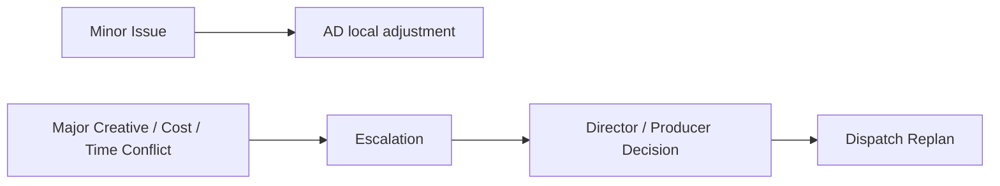
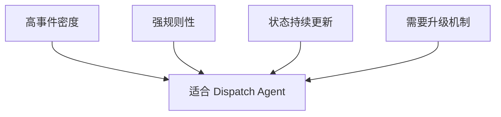

# 39. 副导演调度系统

## 这篇文档回答什么问题

电影拍摄现场最接近“操作系统调度器”的岗位，其实不是导演，而是副导演组，尤其是 1st AD。

本篇重点回答：

1. 副导演调度在传统拍摄中具体在调什么。
2. 为什么 1st AD 视角非常适合被映射成智能体平台中的 dispatch system。
3. 在导演智能体平台里，副导演调度应如何对象化和事件化。

---

## 一、1st AD 本质上是现场调度器

导演负责作品判断，1st AD 负责把这份判断转成现场秩序。

所以副导演系统不是“辅助沟通”，而是拍摄节奏的核心控制器。

---

## 二、传统副导演系统通常在调什么

### 1. 人的流动

- 演员什么时候到位
- 群演何时上场
- 哪个部门何时准备完毕

### 2. 空间的切换

- 哪个场景先布
- 哪个区域封控
- 哪个 setup 切换为下一个

### 3. 时间的压缩

- 当前是否落后
- 是否需要砍次优镜头
- 是否需要启动 fallback

---

## 三、传统副导演调度的事件流

现场调度经常不是按静态计划推进，而是由事件驱动。

这也说明副导演系统非常适合被建模成：

- 事件流
- 阻塞项
- 优先级切换

---

## 四、平台中的对象映射建议

建议至少建模：

- `DispatchBoard`
- `DispatchEvent`
- `ReadinessStatus`
- `BlockedItem`
- `ReplanAction`

### 建议字段

#### `DispatchEvent`

- `event_type`
- `timestamp`
- `source_department`
- `impact_summary`
- `severity`

#### `ReadinessStatus`

- `department`
- `current_setup`
- `ready_state`
- `eta`

---

## 五、平台里的副导演调度工作流建议

---

## 六、为什么调度系统必须和升级链绑定

副导演不是最终创作决策者，所以当发生重大冲突时，必须升级给导演和制片层。

这条升级链如果不显式建模，平台会很快失控。

---

## 七、为什么这是一个特别适合智能体化的系统

副导演调度系统天然适合做成智能体子系统，因为它：

- 事件密度高
- 规则性强
- 需要持续更新状态
- 非常适合和控制面结合

---

## 八、对导演智能体平台和 Hermes 的启发

对平台而言，1st AD dispatch system 最值得优先补的不是“多会说话”，而是：

- `DispatchBoard`
- readiness / blocked / replan 状态
- escalation trigger
- 与 call sheet / daily plan / progress 的联动

对 Hermes 来说，这意味着后续可以在：

- `ShootDay State`
- 调度事件对象
- 升级流工具

上逐步增强。

---

## 九、结论

副导演调度系统在传统电影拍摄现场，本质上就是执行层的实时调度器。

在导演智能体平台里，它应被理解成：

- 以事件为驱动的 dispatch board
- 连接导演创作优先级与各部门 readiness 的中枢
- 拍摄现场最重要的节奏控制和升级控制系统之一

只有把这套调度逻辑正式对象化和事件化，平台才真正能进入“现场操作系统”层面。

---

## 相关文档

- [38-call-sheet-and-daily-plan.md](./38-call-sheet-and-daily-plan.md)
- [40-progress-and-cost-control.md](./40-progress-and-cost-control.md)
- [41-on-set-escalation-and-decision-making.md](./41-on-set-escalation-and-decision-making.md)
- [43-on-set-collaboration-camera-light-sound-vfx.md](./43-on-set-collaboration-camera-light-sound-vfx.md)
- [44-dailies-output-and-review.md](./44-dailies-output-and-review.md)
