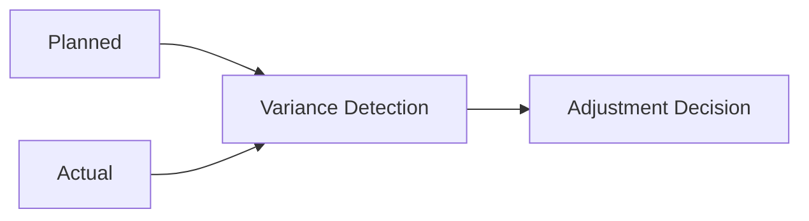
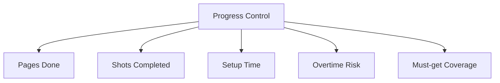
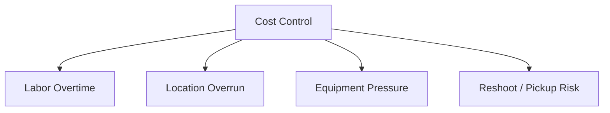
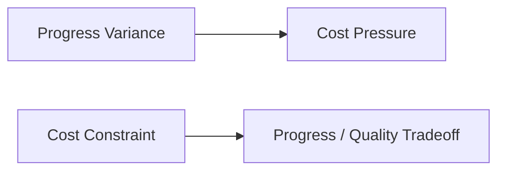
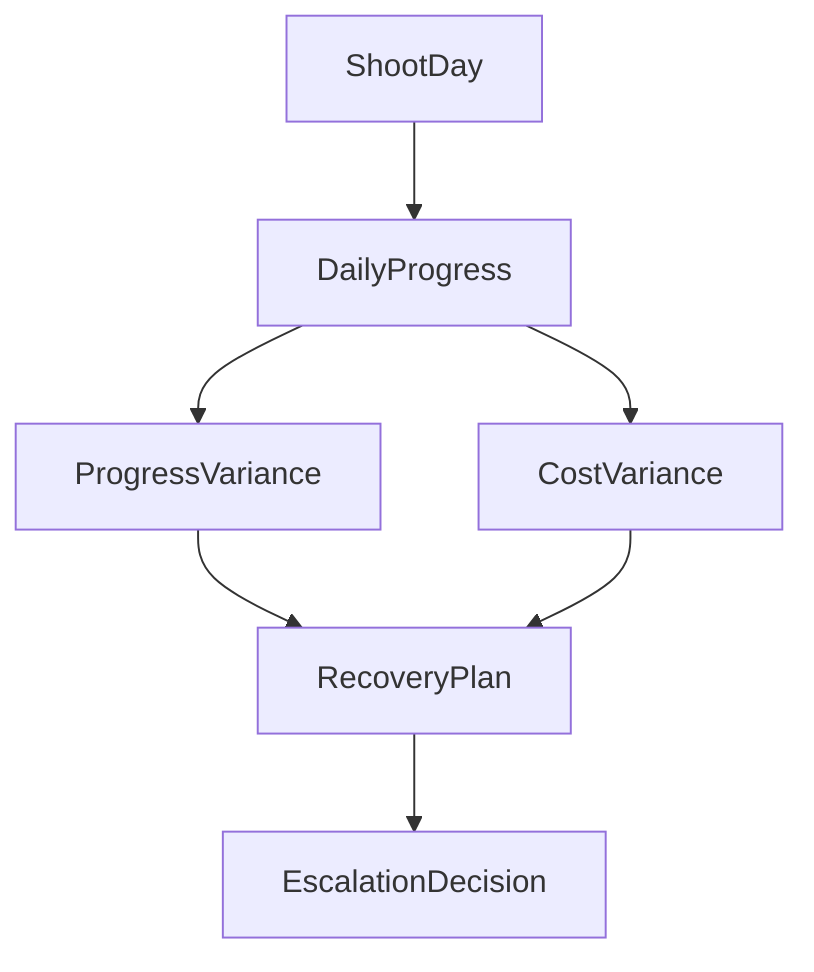
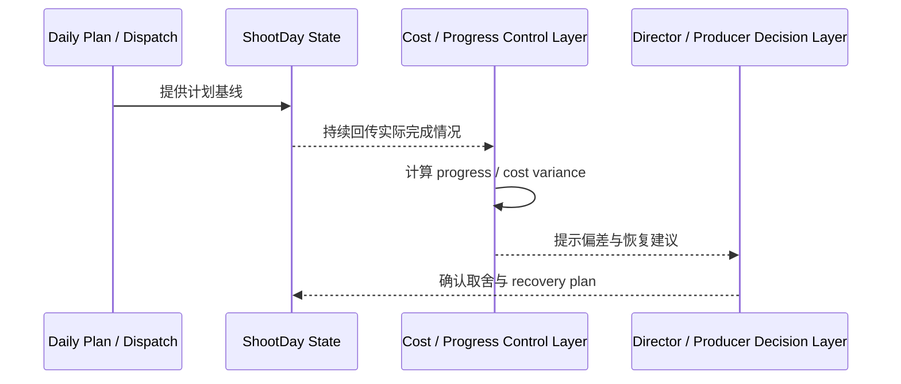
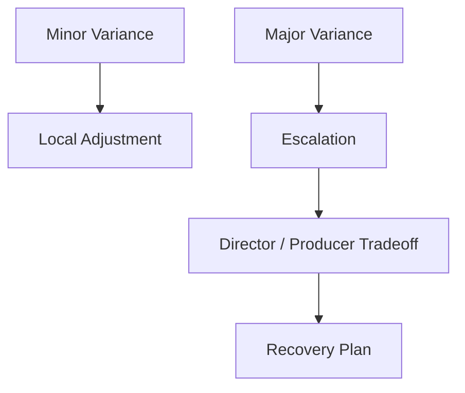
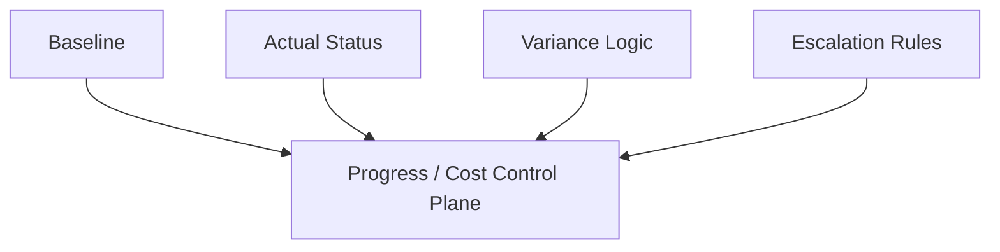

# 40. 进度与成本控制

## 这篇文档回答什么问题

拍摄现场最危险的一件事，不是偶尔出一个问题，而是问题发生了但没人能快速看出它已经开始吞掉：

- 时间
- 页数
- 钱

本篇重点回答：

1. 传统拍摄中的进度与成本控制是怎么做的。
2. 为什么它必须和 daily plan、dispatch、shoot day state 连在一起。
3. 在导演智能体平台里，progress 和 cost control 应如何成为实时控制面。

---

## 一、进度与成本控制的本质是“偏差管理”

拍摄现场很少完全按理想计划走，所以控制的核心不是“零偏差”，而是：

- 偏差能否被尽早看见
- 偏差是否在可承受范围内
- 是否需要马上调整后续计划

---

## 二、传统进度控制通常在看什么

常见观察指标包括：

- 今日计划页数 vs 实际完成页数
- 计划镜头数 vs 完成镜头数
- setup 数量与耗时
- 是否 overtime
- must-get 是否保住

---

## 三、传统成本控制通常在看什么

成本控制并不只是拍完之后看花了多少钱，而是现场就要关注：

- 人工 overtime
- 特殊资源追加
- 场地延时
- 设备超时或替换
- 返工 / pickup / reshoot 风险

---

## 四、为什么进度和成本必须一起看

现实里很多问题看起来只是“进度慢一点”，但实际上很快就会变成成本问题；反过来，某些成本压缩也会导致进度和质量问题。

所以导演智能体平台不能把这两者拆成两个独立面板。

---

## 五、平台中的对象映射建议

建议至少建模：

- `DailyProgress`
- `ProgressVariance`
- `CostVariance`
- `RecoveryPlan`
- `EscalationDecision`

### 建议字段

#### `DailyProgress`

- `shoot_day_id`
- `planned_pages`
- `actual_pages`
- `planned_shots`
- `actual_shots`
- `must_get_status`

#### `CostVariance`

- `shoot_day_id`
- `planned_cost`
- `actual_cost`
- `variance_reason`
- `severity`

---

## 六、平台里的工作流建议

---

## 七、偏差达到什么程度需要升级

并不是所有偏差都需要升级，但以下情况通常需要显式升级：

- must-get 镜头保不住
- 当天掉页已影响后续 schedule
- overtime 已显著影响预算
- 为保进度必须牺牲关键创作点

---

## 八、为什么这层控制特别适合做平台能力

因为它天然需要：

- 统一计划基线
- 实时状态更新
- 偏差计算
- 升级机制

这正是智能体平台和对象系统很擅长承接的部分。

---

## 九、对导演智能体平台和 Hermes 的启发

对平台而言，进度与成本控制最值得优先补的不是复杂 BI，而是：

- 每日基线与实际值
- variance 对象
- recovery plan
- escalation decision

对 Hermes 来说，后续可补的能力包括：

- progress / cost update 工具
- variance 计算对象
- 与 dispatch、call sheet、shoot day state 联动的控制层

---

## 十、结论

进度与成本控制在拍摄现场，本质上是在管理偏差，而不是做事后统计。

在导演智能体平台里，它应被理解成：

- 连接计划与实际的实时控制面
- 与 call sheet、daily plan、dispatch system 紧耦合的核心对象群
- 导演与制片做取舍判断的升级输入层

只有把 progress 和 cost control 做成正式对象与工作流，平台才真正开始具备“生产管理能力”，而不是只会描述现场发生了什么。

---

## 相关文档

- [38-call-sheet-and-daily-plan.md](./38-call-sheet-and-daily-plan.md)
- [39-assistant-director-dispatch-system.md](./39-assistant-director-dispatch-system.md)
- [41-on-set-escalation-and-decision-making.md](./41-on-set-escalation-and-decision-making.md)
- [44-dailies-output-and-review.md](./44-dailies-output-and-review.md)
- [64-budget-schedule-resource-object-system.md](./64-budget-schedule-resource-object-system.md)
