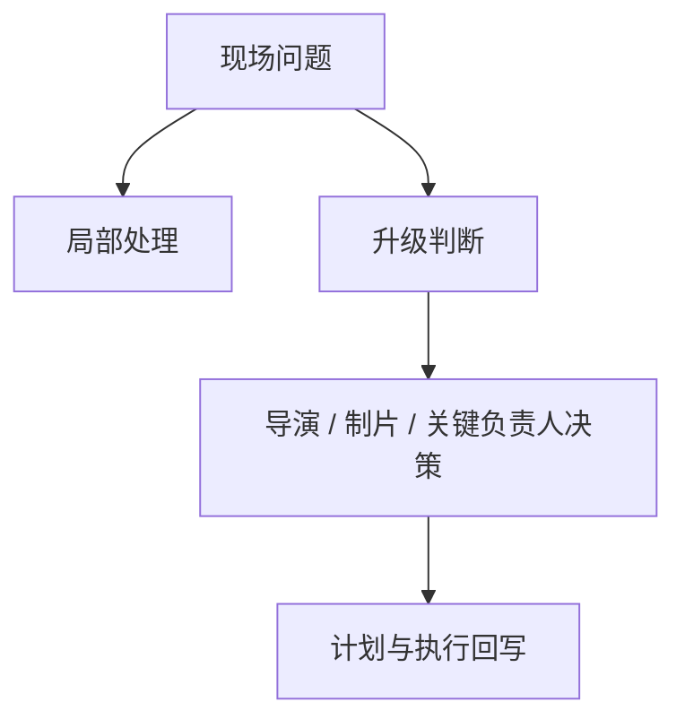
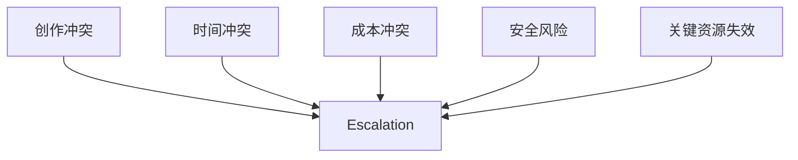
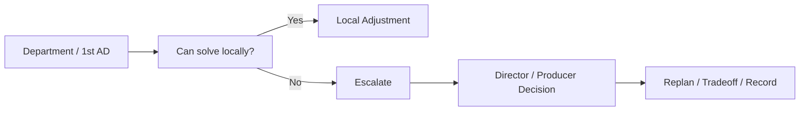
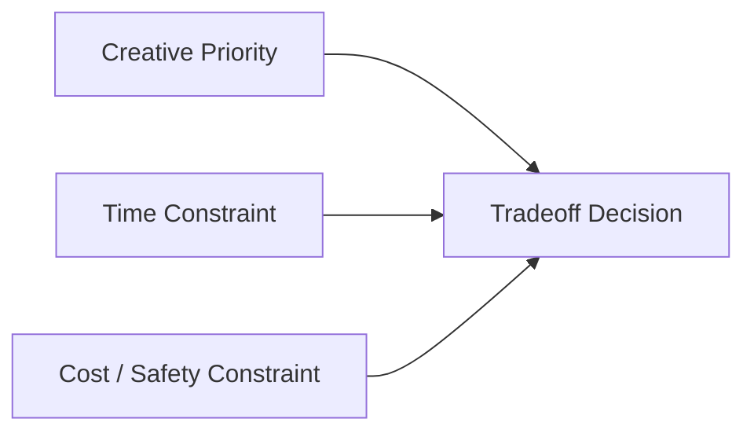
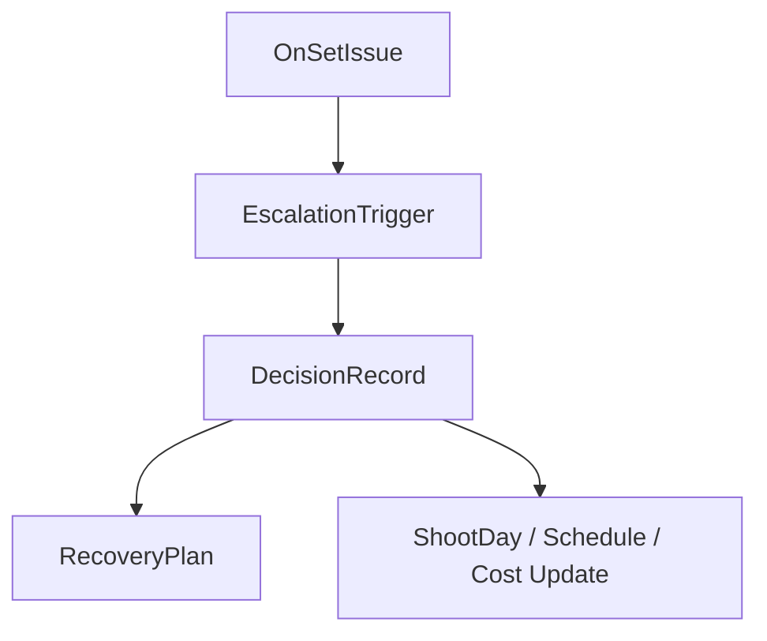
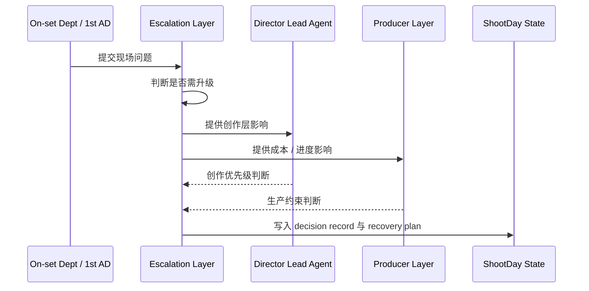
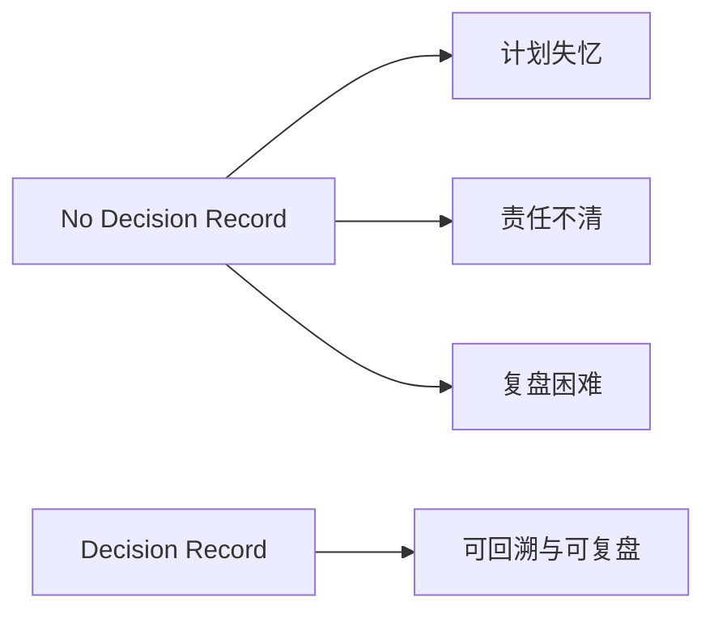
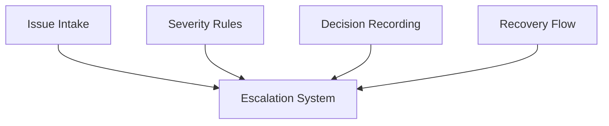

# 41. 现场升级与决策机制

## 这篇文档回答什么问题

拍摄现场最怕的不是出问题，而是问题出了之后没人知道：

- 该不该升级
- 升级给谁
- 谁来拍板
- 拍板之后怎么回写到计划里

本篇重点回答：

1. 传统片场里的升级链和决策链是怎样运作的。
2. 为什么“升级机制”是拍摄现场控制面的核心，而不是附属流程。
3. 在导演智能体平台里，现场升级与决策应如何对象化、状态化和留痕化。

---

## 一、现场不是所有问题都该升级，但重大问题必须升级

现实片场里，大量小问题会在部门内部或副导演层处理；但一旦涉及创作、成本、时间和安全的重大冲突，就必须升级。

这意味着升级机制本质上是“局部自治”和“高层决策”之间的边界系统。

---

## 二、传统现场常见的升级场景

通常需要升级的问题包括：

- must-get 镜头可能保不住
- 演员状态或表演方向和当前镜头目标冲突
- 天气、场地、设备问题导致原计划失效
- overtime 已明显影响预算或后续拍摄节奏
- 安全风险超出现场常规处理能力

---

## 三、传统现场的决策链通常长什么样

不同项目有差异，但常见模式是：

- 部门负责人或 1st AD 先判断是否局部可解
- 如不可解，升级给导演、制片或执行制片
- 重大问题由导演和制片共同做取舍

---

## 四、现场决策的核心不只是“给答案”，而是做取舍

真实片场的大部分升级问题都没有完美答案，只有权衡：

- 保镜头还是保时间
- 保时间还是保成本
- 保表达还是保日进度

所以导演智能体平台里的决策层，不应只是问答系统，而必须承接 tradeoff logic。

---

## 五、在平台中的对象映射建议

建议至少建模：

- `OnSetIssue`
- `EscalationTrigger`
- `DecisionRecord`
- `RecoveryPlan`
- `RiskSeverity`

### 建议字段

#### `OnSetIssue`

- `issue_id`
- `category`
- `impact_scope`
- `severity`
- `local_resolution_possible`

#### `DecisionRecord`

- `decision_id`
- `issue_id`
- `decision_summary`
- `tradeoff_type`
- `approved_by`
- `follow_up_actions`

---

## 六、平台里的现场升级工作流建议

---

## 七、为什么现场决策必须留痕

现实里很多现场决策如果不留痕，后果是：

- 第二天没人记得为何改了计划
- 后期 review 时无法解释素材缺口
- 成本超支找不到关键决策点

---

## 八、为什么这一层特别适合做成平台能力

升级与决策机制天然需要：

- 统一问题入口
- 严重级别判断
- 决策留痕
- recovery plan 回写

这不是单个助手能稳定完成的，而是控制面该承担的事情。

---

## 九、对导演智能体平台和 Hermes 的启发

对平台而言，现场升级系统最值得优先补的是：

- `OnSetIssue`
- `DecisionRecord`
- `RecoveryPlan`
- 严重级别与升级触发规则

对 Hermes 而言，后续可补的能力包括：

- escalation tool
- issue / decision artifact
- 与 dispatch、progress、cost control 联动的升级流

---

## 十、结论

现场升级与决策机制，在电影拍摄阶段本质上是在管理“何时必须从局部执行切换到全局判断”。

在导演智能体平台里，它应被理解成：

- 现场冲突进入控制面的入口层
- 导演与制片进行取舍判断的决策层
- 会反向改写 dispatch、daily plan、progress 与成本控制的上游机制

只有把 escalation 做成正式对象与工作流，平台才真正能控制拍摄现场的不确定性。

---

## 相关文档

- [39-assistant-director-dispatch-system.md](./39-assistant-director-dispatch-system.md)
- [40-progress-and-cost-control.md](./40-progress-and-cost-control.md)
- [42-performance-direction-and-feedback.md](./42-performance-direction-and-feedback.md)
- [43-on-set-collaboration-camera-light-sound-vfx.md](./43-on-set-collaboration-camera-light-sound-vfx.md)
- [68-approval-and-escalation-flow-design.md](./68-approval-and-escalation-flow-design.md)
