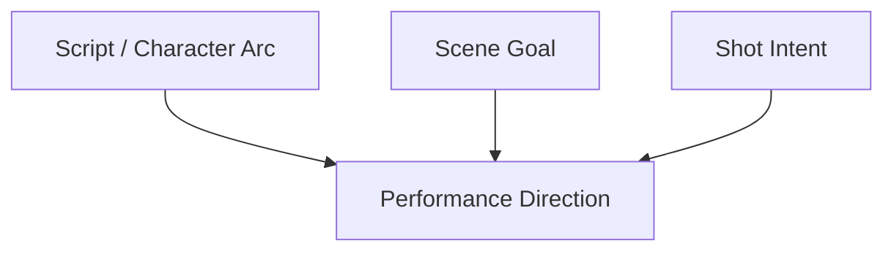
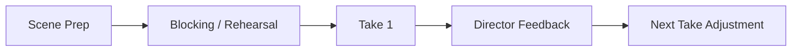
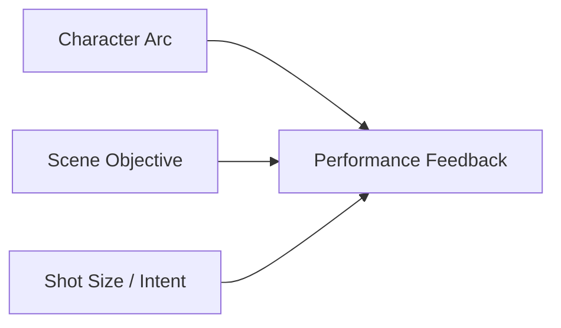
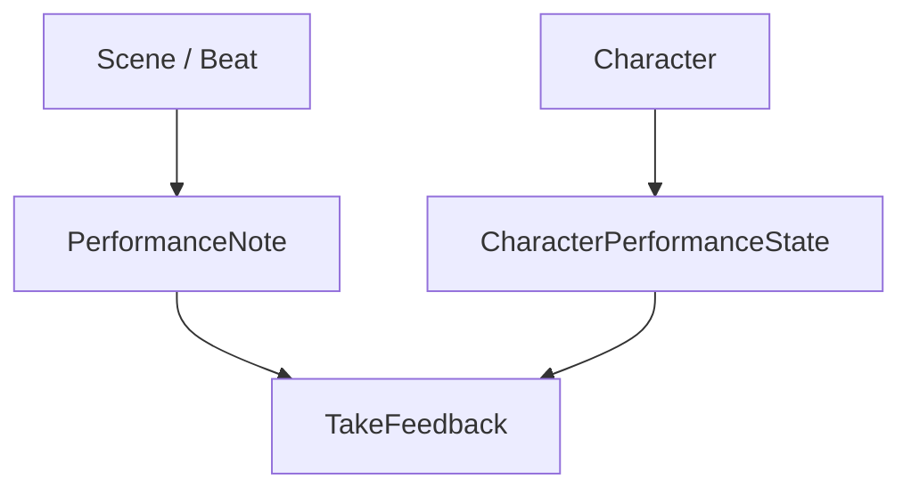
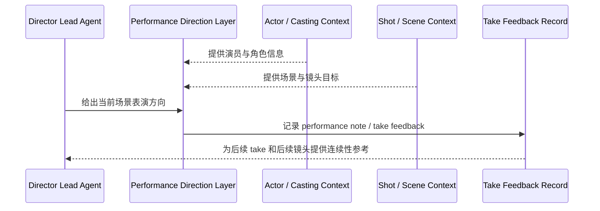
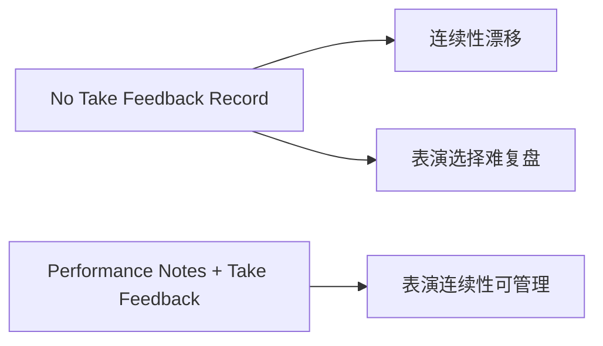
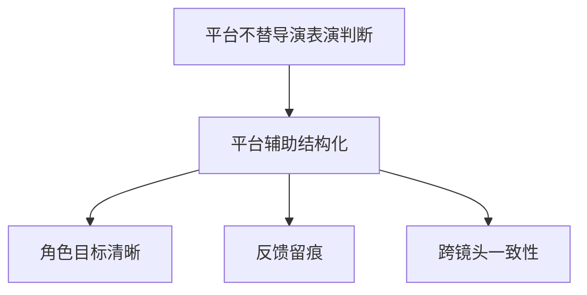

# 42. 表演指导与反馈

## 这篇文档回答什么问题

拍摄现场里，最难被系统化但又最不能缺的一条链，是导演如何和演员工作，以及反馈如何在多 take、多镜头、多场次中保持一致。

本篇重点回答：

1. 表演指导在传统片场里到底在做什么。
2. 为什么演员反馈不只是导演临场发挥，而是和剧本、镜头、节奏、角色弧线共同构成的控制面。
3. 在导演智能体平台里，表演指导与反馈应如何对象化和留痕化。

---

## 一、表演指导本质上是在把角色弧线落到当下镜头

现实里导演给演员的反馈，不只是“再来一遍”或“更强一点”，而是在回答：

- 角色此刻真正想要什么
- 情绪强度应落在哪个区间
- 这一镜该保什么，不该过什么

---

## 二、传统现场的表演指导链

通常会经历：

- 开拍前场景说明
- rehearsal 或 blocking 后反馈
- 每条 take 后微调
- 关键镜头之间校准角色连续性

这说明 performance direction 不是单点动作，而是连续反馈循环。

---

## 三、传统现场表演指导的主要难点

### 1. 同一场景会被拆成多个镜头、多个 take

所以反馈必须跨镜头保持角色目标和情绪连续。

### 2. 导演语言很容易抽象化

例如：

- “再克制一点”
- “更危险一点”
- “别那么表演”

这些如果不和具体场景、角色目标、镜头用途绑定，容易失真。

### 3. 演员表演反馈与镜头设计高度耦合

近景和大全景对表演强度的要求完全可能不同。

---

## 四、在平台中的对象映射建议

建议至少建模：

- `PerformanceNote`
- `TakeFeedback`
- `CharacterPerformanceState`
- `SceneBeat`

### 建议字段

#### `PerformanceNote`

- `scene_id`
- `character_id`
- `beat_goal`
- `subtext_note`
- `intensity_range`
- `forbidden_direction`

#### `TakeFeedback`

- `take_id`
- `performance_strengths`
- `performance_issues`
- `next_take_adjustment`

---

## 五、平台里的工作流建议

---

## 六、为什么表演反馈必须留痕

现实里如果 performance feedback 不留痕，会出现：

- 同一场景不同镜头表演强度漂移
- 不同拍摄日回到角色时找不到连续性基线
- 后期看素材时很难理解导演当时保的是哪种表演版本

---

## 七、为什么这一层不能简单自动化替代

表演指导是高度主观和导演化的，但平台仍然可以帮助做三件事：

- 把角色与 scene beat 信息整理得更清楚
- 把导演反馈结构化留痕
- 让 shot intent 和 performance direction 保持一致

---

## 八、对导演智能体平台和 Hermes 的启发

对平台来说，performance direction 最值得优先补的不是“自动给演员指令”，而是：

- `PerformanceNote`
- `TakeFeedback`
- scene beat / role arc 对齐
- 与 shot intent 联动

对 Hermes 而言，后续可补的能力包括：

- performance feedback artifact
- character performance continuity note
- 与 dialogue、shotplan、dailies review 联动的反馈系统

---

## 九、结论

表演指导与反馈，在拍摄现场真正解决的是“角色如何在具体镜头里成立”。

在导演智能体平台里，它应被理解成：

- 角色弧线、scene beat 与 shot intent 的交汇层
- 可留痕、可复盘、可跨镜头延续的反馈系统
- 导演创作判断最需要被精细记录的一条现场控制链

只有把 performance direction 纳入正式对象和反馈流，平台才真正能触达到导演工作的核心部分。

---

## 相关文档

- [36-dialogue-design-and-polish.md](./36-dialogue-design-and-polish.md)
- [41-on-set-escalation-and-decision-making.md](./41-on-set-escalation-and-decision-making.md)
- [43-on-set-collaboration-camera-light-sound-vfx.md](./43-on-set-collaboration-camera-light-sound-vfx.md)
- [44-dailies-output-and-review.md](./44-dailies-output-and-review.md)
- [63-script-scene-character-object-system.md](./63-script-scene-character-object-system.md)
