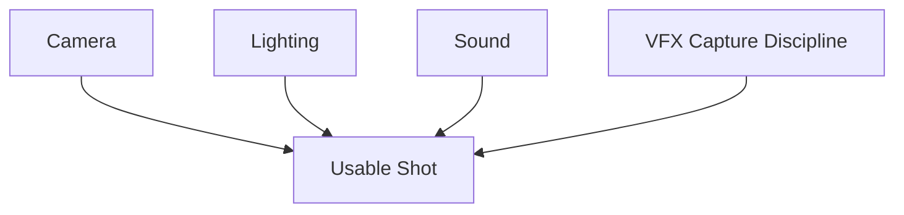
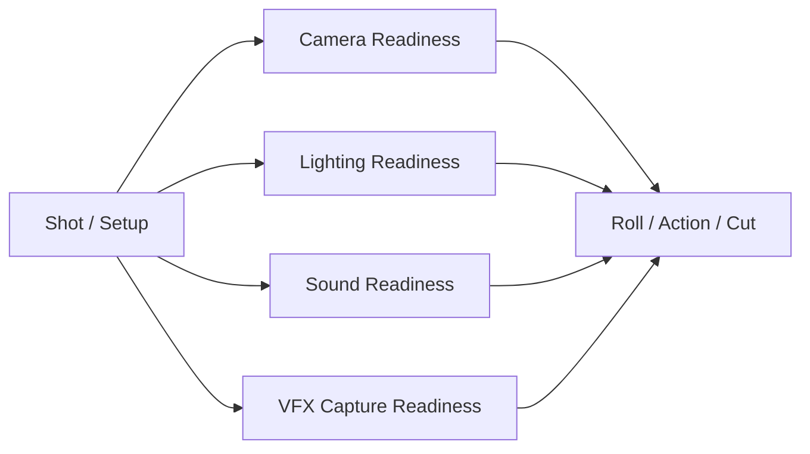
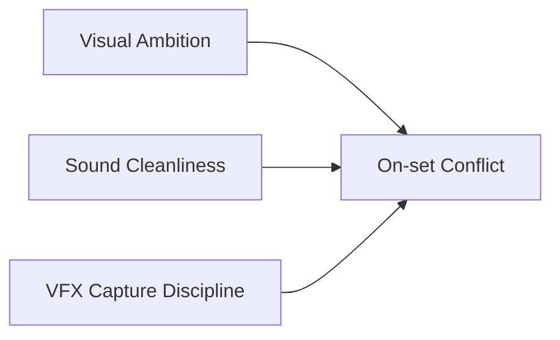
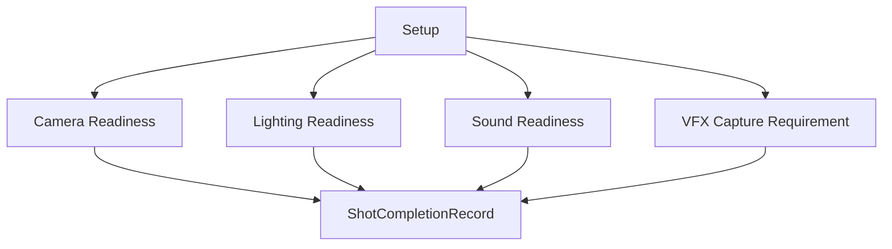
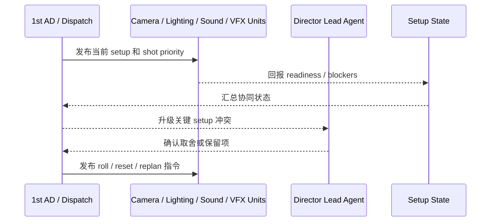

# 43. 现场协作：摄影、灯光、声音与 VFX

## 这篇文档回答什么问题

正式拍摄时，现场最容易出现局部最优互相打架的，就是摄影、灯光、声音和 VFX 这组部门。

本篇重点回答：

1. 为什么这几个部门在现场必须被看作协同系统，而不是并排工种。
2. 它们如何围绕同一个 shot / setup 协作。
3. 在导演智能体平台里，这组协作应如何对象化和状态化。

---

## 一、这组协作共同决定“这个镜头能不能用”

一个镜头即使构图好、表演好，如果声音失控、VFX 需要的参考漏拍或灯光 setup 失真，也可能不能用。

这说明现场不是“各部门都完成自己的任务”就结束，而是要对同一个 usable shot 负责。

---

## 二、传统现场协作逻辑

这张图的关键点在于：所有 readiness 最终都要收敛到同一个 shot setup。

---

## 三、传统现场最常见的冲突

### 1. 摄影和灯光追求更强画面控制，但会拉长 setup 时间

### 2. 声音要求安静与可收录环境，但场地和拍摄节奏不总允许

### 3. VFX 需要特定参考和纪律，但现场节奏容易忽略这些步骤

---

## 四、为什么这组协作必须以 setup 为对象

很多现场问题并不是 scene 级，而是 setup 或 shot 级的。

因此更适合建模成：

- `Setup`
- `DepartmentReadiness`
- `CaptureRequirement`
- `ShotCompletionRecord`

---

## 五、平台中的对象映射建议

建议至少建模：

- `Setup`
- `DepartmentReadiness`
- `SoundConstraint`
- `VFXCaptureChecklist`
- `ShotCompletionRecord`

### 建议字段

#### `DepartmentReadiness`

- `setup_id`
- `department`
- `status`
- `blocking_issue`
- `eta`

#### `ShotCompletionRecord`

- `shot_id`
- `take_ids`
- `camera_ok`
- `sound_ok`
- `vfx_capture_ok`
- `notes`

---

## 六、平台里的现场协同工作流建议

---

## 七、为什么“usable shot”需要明确完成定义

现实里一个镜头被拍完，不一定真的可以进入后续使用。

可能出现：

- 画面可用但声音不可用
- 表演可用但 VFX 参考缺失
- 技术上拍到，但 continuity 断了

这意味着平台不该只记录“拍了”，而应记录“是否完整可用”。

---

## 八、对导演智能体平台和 Hermes 的启发

对平台而言，这组现场协作最值得优先补的是：

- setup 级 readiness
- sound / vfx capture checklist
- shot completion record
- 与 dispatch / dailies / progress control 联动

对 Hermes 而言，后续可补的能力包括：

- setup state 对象
- department readiness 更新
- usable shot 记录逻辑

---

## 九、结论

摄影、灯光、声音与 VFX 的现场协作，本质上是在定义一个镜头是否作为“可用素材”真正成立。

在导演智能体平台里，它应被理解成：

- 围绕 setup / shot 的多部门 readiness 系统
- 以 usable shot 为目标的协同控制面
- dispatch、dailies、progress control 的关键输入层

只有把这组协作正式对象化，平台才真正开始触到现场技术协作的核心。

---

## 相关文档

- [39-assistant-director-dispatch-system.md](./39-assistant-director-dispatch-system.md)
- [41-on-set-escalation-and-decision-making.md](./41-on-set-escalation-and-decision-making.md)
- [42-performance-direction-and-feedback.md](./42-performance-direction-and-feedback.md)
- [44-dailies-output-and-review.md](./44-dailies-output-and-review.md)
- [48-vfx-post-collaboration-and-delivery.md](./48-vfx-post-collaboration-and-delivery.md)
