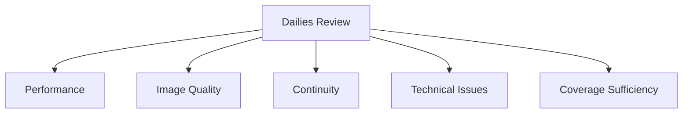
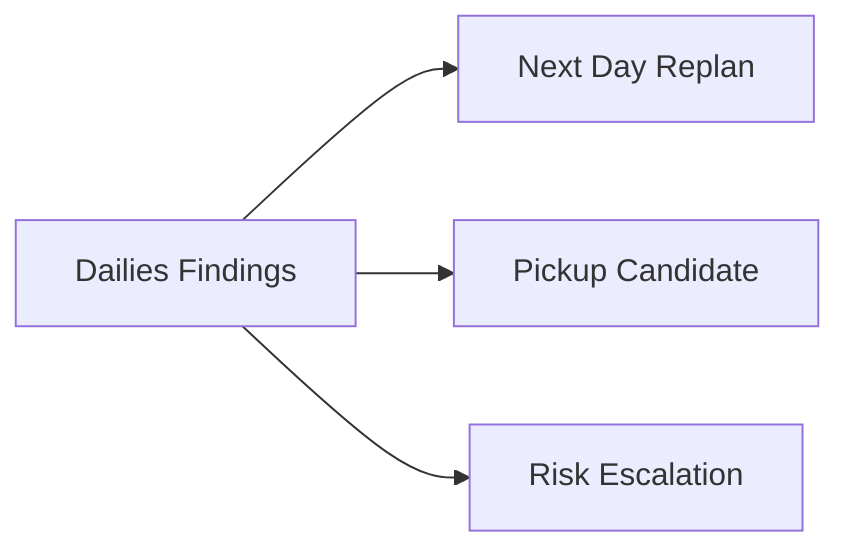
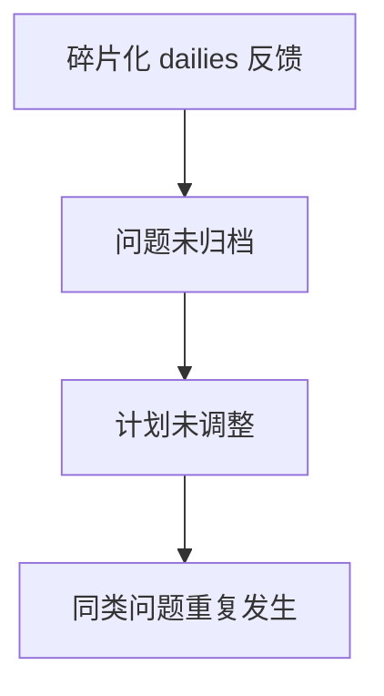
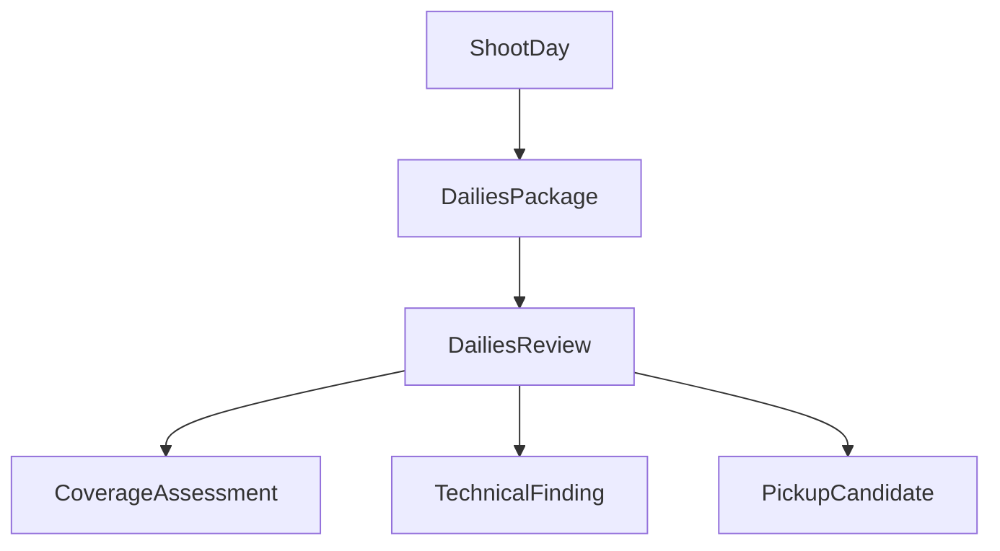
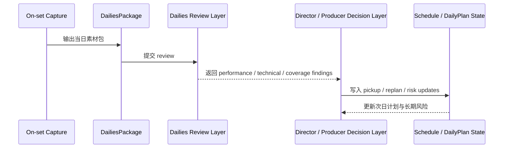
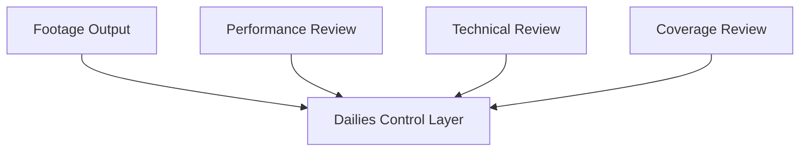

# 44. Dailies 输出与回看评审

## 这篇文档回答什么问题

拍摄现场最关键的闭环之一，是当天拍完之后，素材如何被整理、输出、回看、判断并反哺次日决策。这就是 dailies 的价值。

本篇重点回答：

1. Dailies 在传统电影拍摄中的真实作用是什么。
2. 为什么 dailies review 不是“看看拍得怎么样”，而是生产控制链的一部分。
3. 在导演智能体平台里，dailies 输出与 review 应如何对象化、版本化和回写。

---

## 一、Dailies 的本质是“素材级日结”

拍摄现场如果只看当天是否拍了，而不看素材是否真的可用，第二天的计划就会建立在幻觉上。

这说明 dailies review 是拍摄阶段的反馈闭环，不是附属欣赏环节。

---

## 二、传统 dailies 通常关注什么

回看 dailies 时，常见关注点包括：

- 表演是否成立
- 对焦、曝光、构图是否可靠
- continuity 是否断裂
- 声音或技术问题是否可接受
- 是否已经拿到 must-get coverage

---

## 三、为什么 dailies review 会直接影响后续计划

如果 dailies 回看发现：

- 关键表演没拿到
- 核心镜头 technically unusable
- coverage 不够剪
- continuity 有问题

那么第二天的计划、后续 schedule，甚至 pickup / reshoot 策略都可能要变。

---

## 四、传统 dailies review 的主要问题

### 1. 意见分散

不同部门可能在不同渠道表达不同看法。

### 2. 结论不结构化

很多时候只说“这条不太对”“感觉不稳”，但没有形成正式问题记录。

### 3. 不能回写计划

看完素材之后，发现问题，但次日 call sheet、daily plan、progress record 没有同步更新。

---

## 五、在平台中的对象映射建议

建议至少建模：

- `DailiesPackage`
- `DailiesReview`
- `CoverageAssessment`
- `PickupCandidate`
- `TechnicalFinding`

### 建议字段

#### `DailiesReview`

- `shoot_day_id`
- `reviewer_roles`
- `summary`
- `performance_findings`
- `technical_findings`
- `coverage_findings`

#### `PickupCandidate`

- `scene_id`
- `shot_id`
- `reason`
- `urgency`
- `suggested_window`

---

## 六、平台里的 dailies 工作流建议

---

## 七、为什么 dailies 必须和“usable shot”逻辑联动

现场记录“拍到了”不够，dailies review 需要进一步确认：

- 是否是可用版本
- 是否达到创作要求
- 是否达到剪辑所需 coverage

这让 dailies 成为 shot completion 逻辑的真实验证层。

---

## 八、为什么这层特别适合做成平台能力

因为 dailies review 天然需要：

- 对拍摄日素材的统一入口
- 多维度 finding 结构化记录
- 与次日计划和长期 schedule 的联动

这正是平台比零散聊天和口头反馈更有价值的地方。

---

## 九、对导演智能体平台和 Hermes 的启发

对平台而言，dailies 最值得优先补的是：

- `DailiesPackage`
- `DailiesReview`
- `PickupCandidate`
- 与 dispatch / schedule / progress control 的回写链

对 Hermes 而言，后续可补的能力包括：

- dailies review artifact
- pickup / reshoot 风险项
- 与 shot completion record 联动的反馈系统

---

## 十、结论

Dailies 输出与回看评审，在拍摄阶段真正解决的是“今天拍到的东西是否真的能支持整部电影继续往前走”。

在导演智能体平台里，它应被理解成：

- 当日素材的正式 review 层
- 从现场执行回流到计划控制面的关键闭环
- pickup / reshoot / 次日调整的高价值输入源

只有把 dailies 从“看素材”升级成正式对象和 review 工作流，平台才真正具备拍摄阶段的学习与纠偏能力。

---

## 相关文档

- [38-call-sheet-and-daily-plan.md](./38-call-sheet-and-daily-plan.md)
- [40-progress-and-cost-control.md](./40-progress-and-cost-control.md)
- [42-performance-direction-and-feedback.md](./42-performance-direction-and-feedback.md)
- [45-editing-workflow-and-versioning.md](./45-editing-workflow-and-versioning.md)
- [49-review-flow-versioning-and-release-package.md](./49-review-flow-versioning-and-release-package.md)
