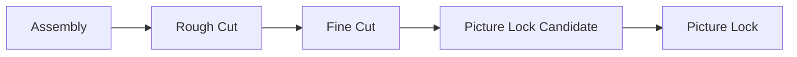
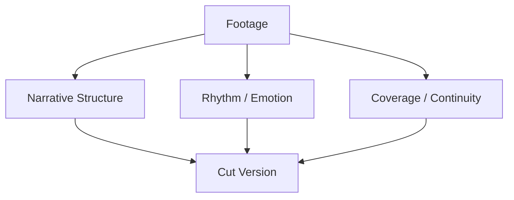
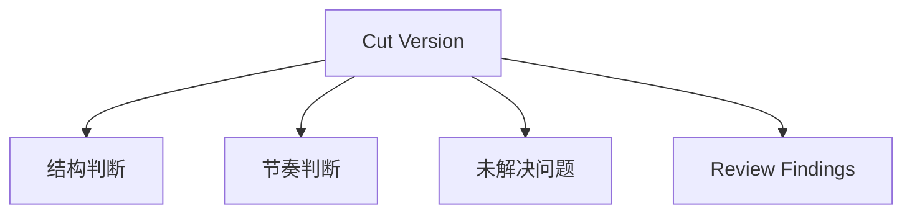
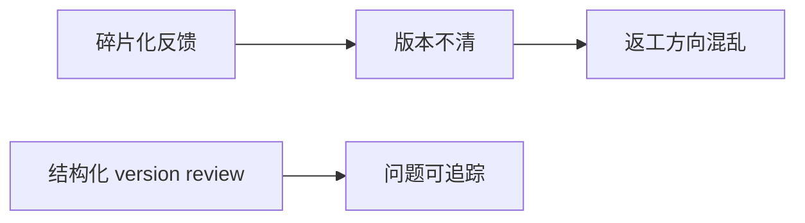
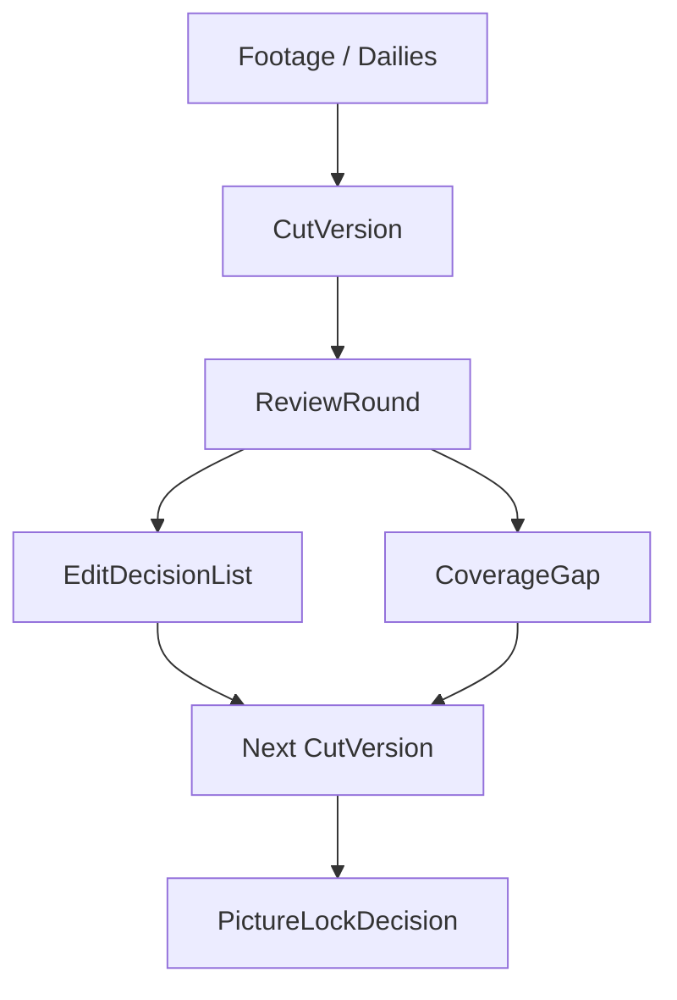
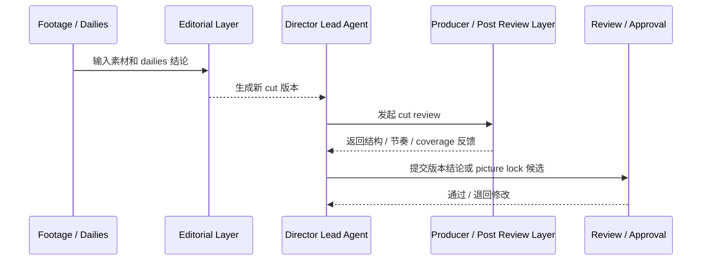
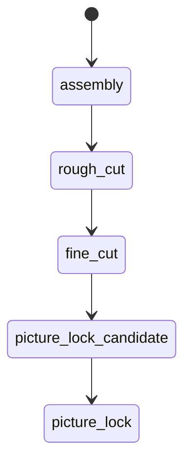

# 45. 剪辑流程与版本管理

## 这篇文档回答什么问题

拍摄结束之后，电影并不会自然变成成片。后期的第一条主链，通常从剪辑开始，而剪辑最核心的问题不是“怎么剪”，而是“版本如何收敛”。

本篇重点回答：

1. 传统剪辑流程通常如何推进。
2. 为什么剪辑流程天然是版本驱动、review 驱动的系统。
3. 在导演智能体平台里，editing workflow 和 versioning 应如何对象化和治理化。

---

## 一、剪辑不是线性加工，而是版本收敛过程

现实里，后期剪辑很少是一条直线，而是一个持续 review、持续调整、持续收敛的版本链。

每一步都可能触发：

- 节奏重组
- 结构删改
- 表演版本替换
- coverage 不足后的 pickup 判断

所以剪辑首先是版本问题，其次才是技术输出问题。

---

## 二、传统剪辑流程通常在解决什么

### 1. 叙事成立

- 结构是否清楚
- 场景顺序是否有效
- 信息释放是否得当

### 2. 情绪和节奏成立

- 镜头长短是否合适
- 表演强度是否匹配
- 转场是否自然

### 3. 素材可用性成立

- coverage 是否够
- continuity 问题是否可接受
- 有没有必须补拍的缺口

---

## 三、为什么剪辑天生就是版本管理系统

现实后期中，一个版本不是“文件名”，而是一组正式判断：

- 当前剪辑结构
- 当前节奏判断
- 当前未解决问题
- 当前 review 结论

因此平台里不能只保存“latest cut”，而必须保存版本链和每版的评审结论。

---

## 四、传统剪辑 review 的主要问题

### 1. 反馈分散

导演、制片、剪辑、试映反馈可能来自不同渠道。

### 2. 反馈和版本脱钩

大家记得“那次说过这个问题”，但不记得是针对哪个 cut。

### 3. 问题未分类

比如：

- 结构问题
- 表演问题
- 节奏问题
- coverage 问题

被混在一起，很难推动解决。

---

## 五、在平台中的对象映射建议

建议至少建模：

- `CutVersion`
- `EditDecisionList`
- `ReviewRound`
- `CoverageGap`
- `PictureLockDecision`

### 建议字段

#### `CutVersion`

- `cut_id`
- `version_label`
- `cut_type`
- `source_material_scope`
- `summary`
- `known_issues`
- `status`

#### `CoverageGap`

- `scene_id`
- `issue_type`
- `impact_summary`
- `pickup_needed`
- `urgency`

---

## 六、平台里的剪辑工作流建议

---

## 七、为什么 Picture Lock 必须是治理节点

Picture lock 并不意味着电影完全结束，而是意味着：

- 画面结构和镜头基本冻结
- 后续声音、调色、VFX 可据此稳定推进
- 任何画面层改动都要被视为高成本变更

这和前期的 script lock 很像，都是 downstream 的基线切换。

---

## 八、对导演智能体平台和 Hermes 的启发

对平台来说，剪辑流程最值得优先补的是：

- `CutVersion`
- version-linked review
- coverage gap / pickup decision
- picture lock 状态

对 Hermes 来说，后续可补的能力包括：

- cut review artifact
- coverage gap 与 pickup 候选对象
- 与 dailies、ADR、VFX、color 的后期状态联动

---

## 九、结论

剪辑流程在后期制作里，本质上是一个版本驱动和 review 驱动的收敛系统。

在导演智能体平台里，它应被理解成：

- 连接素材与最终成片结构的核心对象链
- 可 review、可追踪、可锁定的版本系统
- 声音、调色、VFX 等下游工作的正式上游基线

只有把 editing workflow 作为正式 versioning 系统建起来，后期制作才真正具备治理能力。

---

## 相关文档

- [46-adr-music-sound-collaboration.md](./46-adr-music-sound-collaboration.md)
- [47-color-grading-and-visual-consistency.md](./47-color-grading-and-visual-consistency.md)
- [48-vfx-post-collaboration-and-delivery.md](./48-vfx-post-collaboration-and-delivery.md)
- [49-review-flow-versioning-and-release-package.md](./49-review-flow-versioning-and-release-package.md)
- [66-review-approval-release-package-object-system.md](./66-review-approval-release-package-object-system.md)
- [70-artifact-version-and-archive-system.md](./70-artifact-version-and-archive-system.md)
