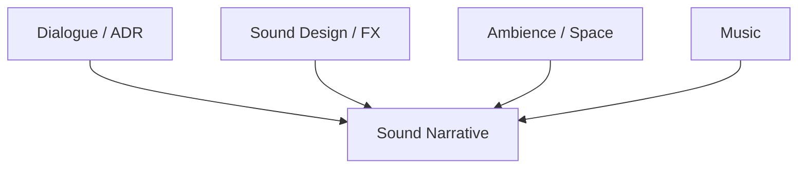
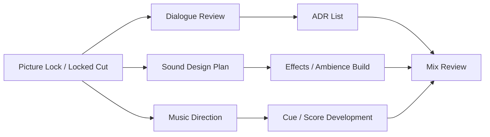
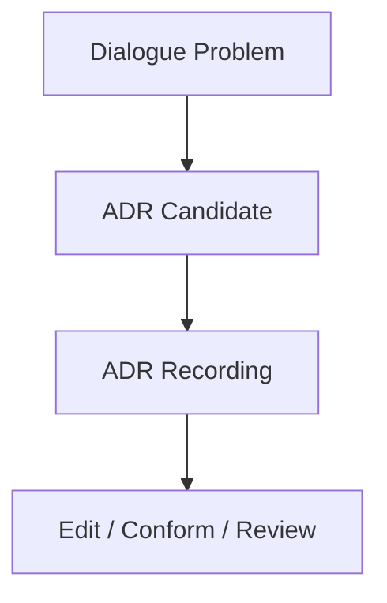
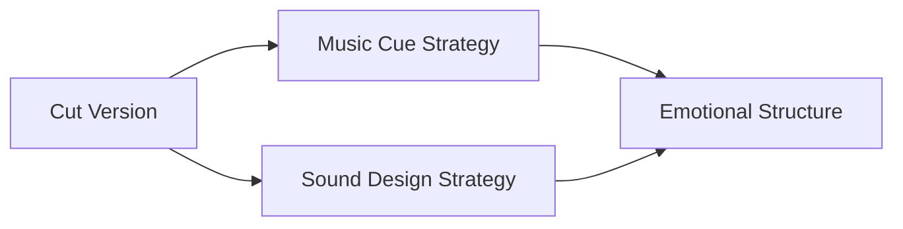
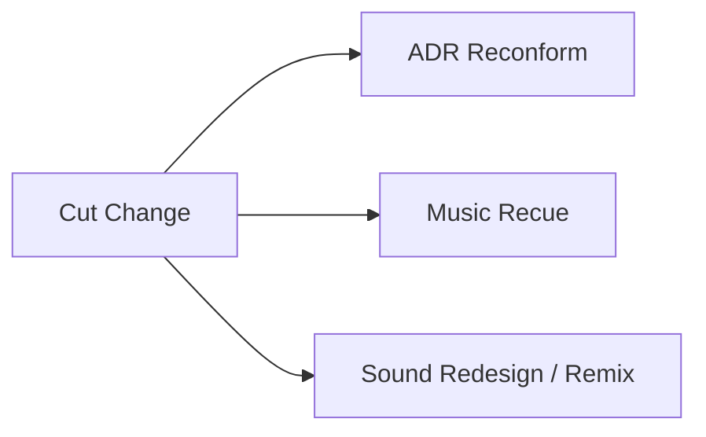
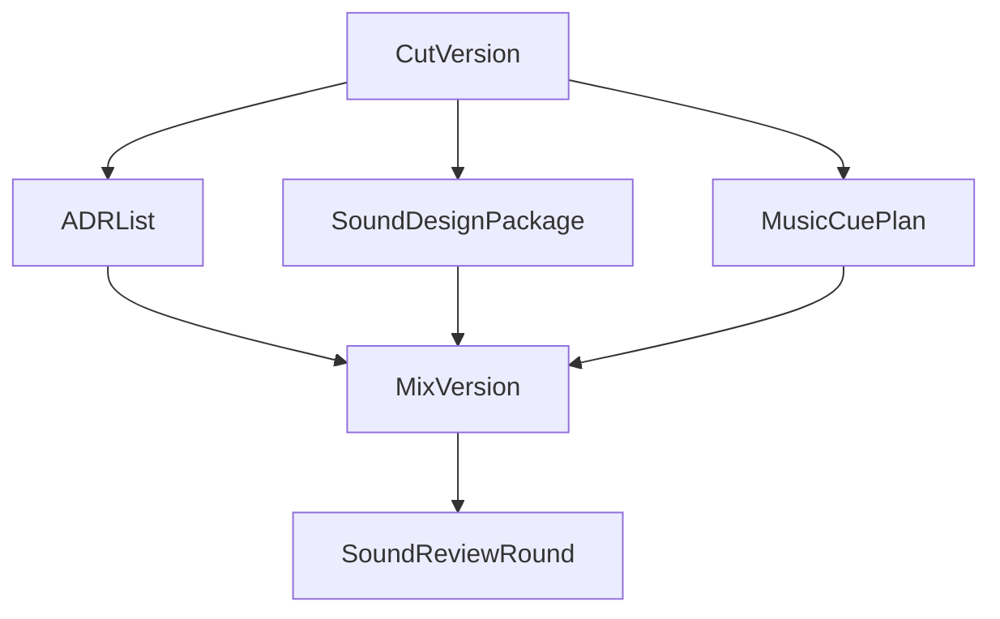
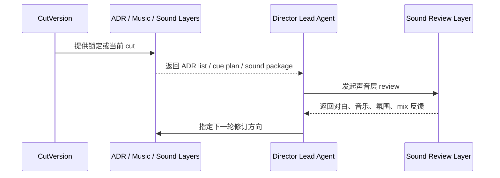
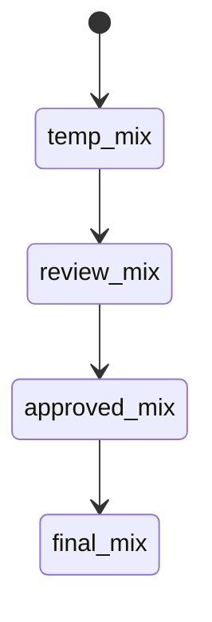

# 46. ADR、音乐与声音协作

## 这篇文档回答什么问题

很多项目在 picture lock 之后，真正开始发现电影“能不能成立”的另一半，来自声音层：对白是否清晰、环境是否可信、音乐是否推动情绪、声音设计是否与画面同频。

本篇重点回答：

1. ADR、音乐与声音在传统后期中如何协同。
2. 为什么它们不是独立后期工种，而是一组围绕 cut version 的协作系统。
3. 在导演智能体平台里，这组协作应如何对象化和 review 化。

---

## 一、声音层不是修饰，而是叙事的一半

在现实电影中，很多节奏、情绪、空间感和信息清晰度都由声音层完成。

因此，ADR、音乐和声音协作不是“后面再补一补”，而是正式叙事建构过程。

---

## 二、传统声音协同通常怎么走

这说明三条链都围绕 lock 后的 cut version 协同推进。

---

## 三、ADR 通常在解决什么

ADR 不是简单重录对白，而是在解决：

- 现场收音不可用
- 台词清晰度不足
- 情绪或节奏需要更精准控制
- 语言版本或技术要求需要补录

---

## 四、音乐与声音设计通常在解决什么

### 音乐

- 情绪承托
- 节奏推进
- 主题动机强化

### 声音设计

- 空间真实感
- 叙事重点强化
- 观众注意力引导

---

## 五、为什么这一层最容易失控

### 1. 反馈很主观

“不够有感觉”“太满了”“不够沉浸”这类意见很常见，但如果不结构化，就难以落地。

### 2. 多条工作链相互耦合

- ADR 改对白会影响节奏
- 音乐上去会影响对白空间
- 声音设计变化会影响氛围和张力

### 3. 它们强依赖 cut version

只要剪辑再动，许多声音工作都要重跟。

---

## 六、在平台中的对象映射建议

建议至少建模：

- `ADRList`
- `SoundDesignPackage`
- `MusicCuePlan`
- `SoundReviewRound`
- `MixVersion`

### 建议字段

#### `ADRList`

- `scene_id`
- `line_reference`
- `reason`
- `priority`
- `recording_status`

#### `MusicCuePlan`

- `cue_id`
- `scene_range`
- `emotional_goal`
- `timing_notes`
- `status`

---

## 七、平台里的工作流建议

---

## 八、为什么 Mix Version 也必须版本化

现实里后期常出现“剪辑版号清楚，但声音版号混乱”的情况。

更合理的做法是把 mix 也建成正式版本链。

---

## 九、对导演智能体平台和 Hermes 的启发

对平台来说，这组协作最值得优先补的是：

- ADR list
- cue / sound design package
- mix version
- sound review findings

对 Hermes 来说，后续可补的能力包括：

- sound layer artifact
- 与 cut version 强绑定的声音任务对象
- sound review 和后续修订回写链

---

## 十、结论

ADR、音乐和声音协作，在后期制作中本质上是在围绕 cut version 构建完整的声音叙事层。

在导演智能体平台里，它应被理解成：

- 与 picture lock 和 cut version 强绑定的协作系统
- 多条后期工作链共同收敛到 mix version 的版本流
- 一个高度依赖 review 和版本留痕的正式对象群

只有把声音层对象化和版本化，后期制作才不会在“感觉型反馈”中失控。

---

## 相关文档

- [45-editing-workflow-and-versioning.md](./45-editing-workflow-and-versioning.md)
- [47-color-grading-and-visual-consistency.md](./47-color-grading-and-visual-consistency.md)
- [49-review-flow-versioning-and-release-package.md](./49-review-flow-versioning-and-release-package.md)
- [66-review-approval-release-package-object-system.md](./66-review-approval-release-package-object-system.md)
- [70-artifact-version-and-archive-system.md](./70-artifact-version-and-archive-system.md)
