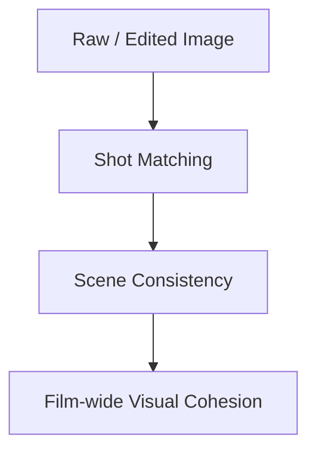
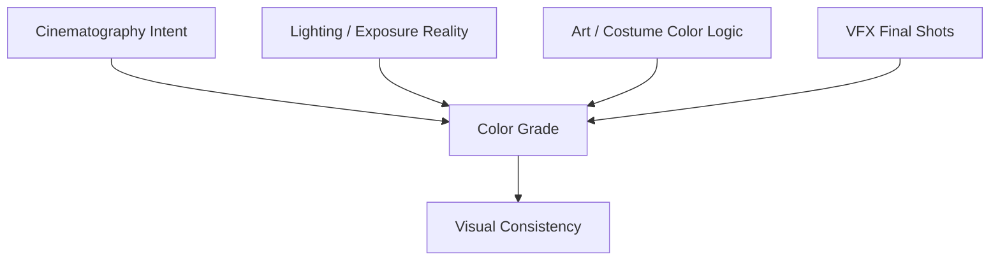
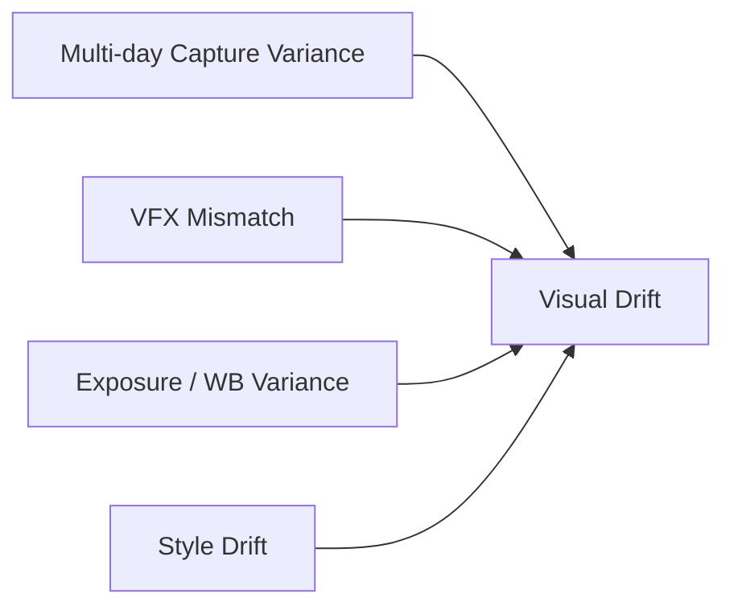
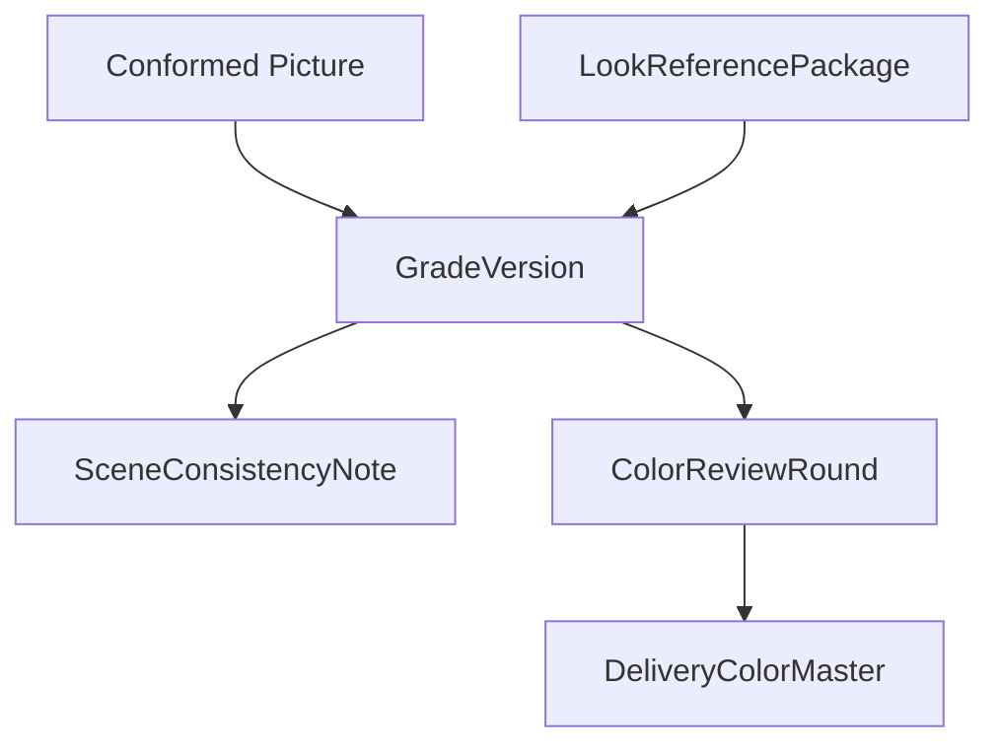
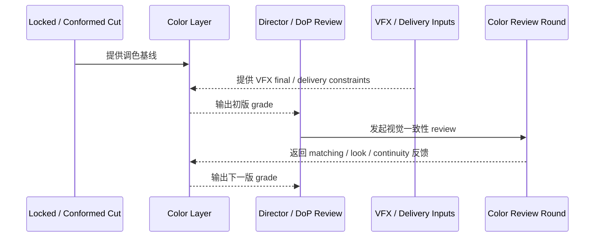
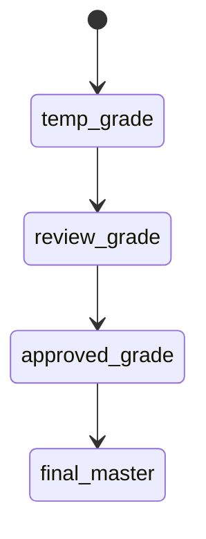

# 47. 调色与视觉一致性

## 这篇文档回答什么问题

电影后期进入调色阶段后，真正要解决的已经不只是“画面更好看”，而是整部片子的视觉一致性和情绪统一是否成立。

本篇重点回答：

1. 调色在传统后期制作中具体承担什么作用。
2. 为什么调色不是孤立工序，而是与摄影、美术、VFX、发行交付强关联的统一层。
3. 在导演智能体平台里，color grading 和 visual consistency 应如何对象化和治理化。

---

## 一、调色的核心不是修饰，而是统一

现实里的调色首先要解决的通常不是“美化”，而是：

- 镜头间一致性
- 场景情绪一致性
- 片子整体风格统一
- 技术交付可控

---

## 二、传统调色流程通常怎么走

这个流程说明：调色既有技术面，也有风格面，而且 review 驱动非常强。

---

## 三、调色真正依赖哪些上游条件

调色并不是脱离前期和拍摄独立存在，它通常依赖：

- 摄影风格基线
- 灯光策略
- 美术 / 服装的色彩设计
- VFX 合成结果
- 发行交付标准

---

## 四、为什么视觉一致性经常失控

现实里最常见的问题包括：

- 不同拍摄日素材差异大
- VFX 镜头与实拍镜头不融合
- 同一场戏镜头之间曝光、色温、质感跳动
- 整体风格和前期设定逐渐偏离

所以 color grading 的核心之一，是抵抗 visual drift。

---

## 五、在平台中的对象映射建议

建议至少建模：

- `GradeVersion`
- `LookReferencePackage`
- `SceneConsistencyNote`
- `ColorReviewRound`
- `DeliveryColorMaster`

### 建议字段

#### `GradeVersion`

- `grade_id`
- `source_cut_id`
- `look_goal`
- `consistency_notes`
- `vfx_dependency_notes`
- `status`

#### `SceneConsistencyNote`

- `scene_id`
- `matching_issues`
- `look_deviation`
- `fix_priority`

---

## 六、平台里的调色工作流建议

---

## 七、为什么调色也必须有正式版本链

现实中常见误区是把调色看成“一次修完”。实际上它往往也要经历多个版本。

有了版本链，团队才知道：

- 当前 review 针对的是哪一版
- 哪些问题已解决
- 哪一版可进入正式交付

---

## 八、对导演智能体平台和 Hermes 的启发

对平台来说，调色与视觉一致性最值得优先补的是：

- grade version
- visual consistency notes
- 与 VFX、look reference、delivery 的联动 review

对 Hermes 来说，后续可补的能力包括：

- color review artifact
- consistency issue 对象
- 与 style package、VFX 和 release package 关联的后期状态

---

## 九、结论

调色与视觉一致性，在后期制作中本质上是在把多来源、多拍摄日、多工序的画面收敛成统一的电影视觉。

在导演智能体平台里，它应被理解成：

- 一个版本驱动的视觉统一系统
- 连接前期 style intent、拍摄 reality、VFX final 和交付标准的关键中间层
- 一个必须通过 review 和 consistency notes 持续收敛的正式对象链

只有把 grading 从“最后修一下颜色”升级成正式对象和工作流，后期视觉才能真正稳定。

---

## 相关文档

- [45-editing-workflow-and-versioning.md](./45-editing-workflow-and-versioning.md)
- [46-adr-music-sound-collaboration.md](./46-adr-music-sound-collaboration.md)
- [48-vfx-post-collaboration-and-delivery.md](./48-vfx-post-collaboration-and-delivery.md)
- [49-review-flow-versioning-and-release-package.md](./49-review-flow-versioning-and-release-package.md)
- [66-review-approval-release-package-object-system.md](./66-review-approval-release-package-object-system.md)
