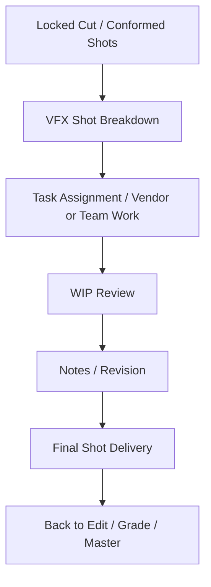
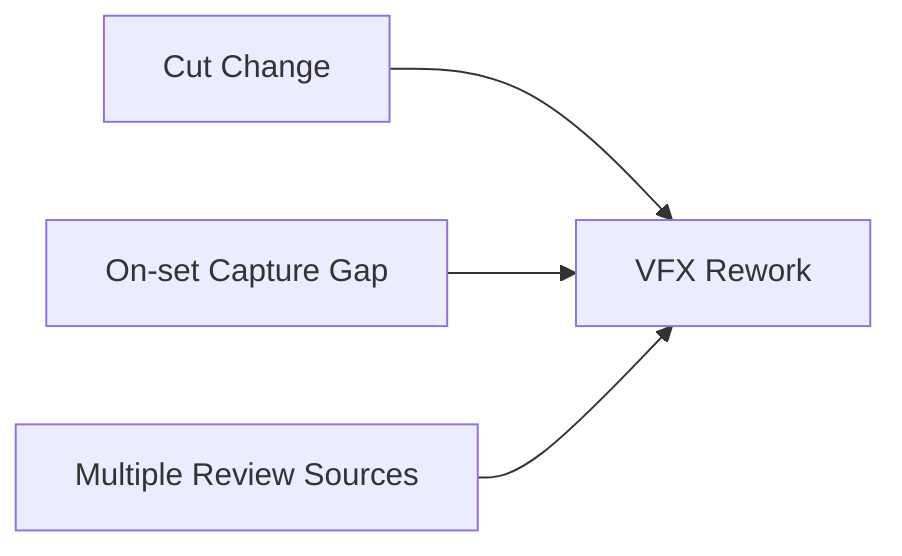
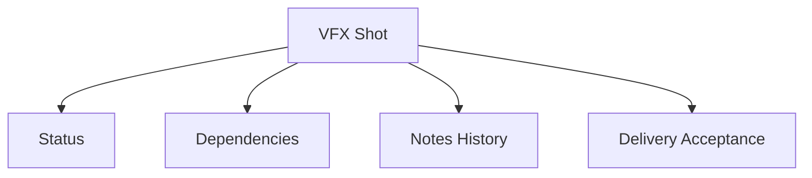
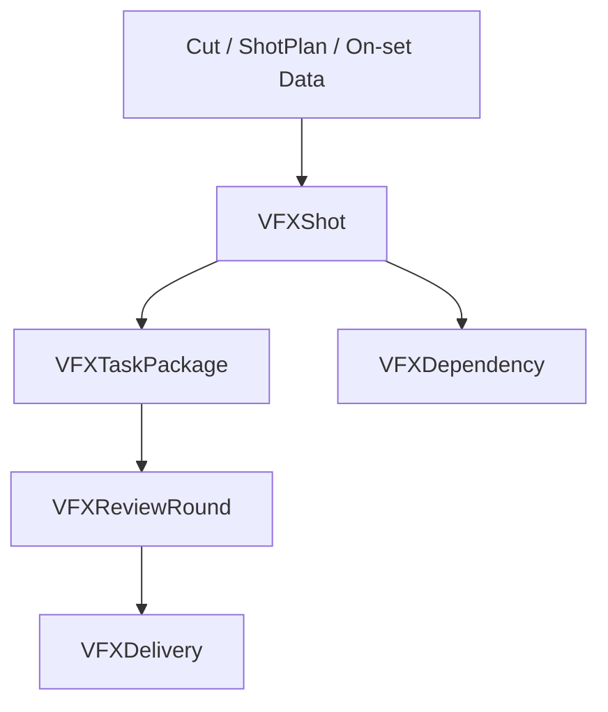
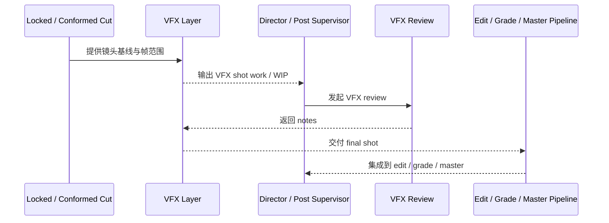
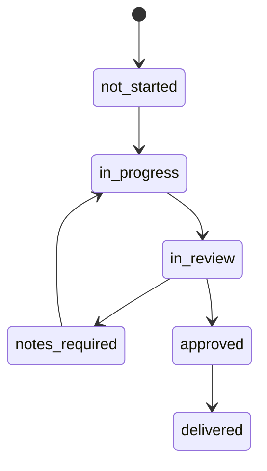

# 48. VFX 后期协作与交付

## 这篇文档回答什么问题

VFX 在后期最容易失控的地方，不是单个镜头难，而是它天然横跨：

- 前期规划
- 现场拍摄纪律
- 后期版本变更
- 最终交付验收

本篇重点回答：

1. VFX 后期协作在传统电影项目里是怎么运作的。
2. 为什么 VFX 是最需要正式任务对象、状态流和交付标准的一条后期链。
3. 在导演智能体平台里，VFX post collaboration 与 delivery 应如何对象化和治理化。

---

## 一、VFX 后期不是“最后做特效”，而是跨阶段长链

现实里 VFX 往往从前期就开始定义，到后期才进入集中交付。

所以 VFX 在平台里不应该只出现于后期文档，而应当贯穿全流程；这里只聚焦 post 阶段的集中协作与交付。

---

## 二、传统 VFX 后期协作通常怎么走

这说明 VFX 天生就是：

- shot-based
- note-driven
- delivery-driven

的系统。

---

## 三、为什么 VFX 特别容易失控

### 1. 与 cut version 高度耦合

镜头版本、时长、帧范围一变，VFX 就要重跟。

### 2. 与 on-set capture 强耦合

如果现场 reference、tracking、clean plate 不完整，后期难度会暴涨。

### 3. review 往往迭代次数多

而且反馈既可能来自导演，也可能来自制片、摄影或后期 supervisor。

---

## 四、VFX 后期真正需要管理的是什么

不是“有没有做”，而是：

- shot status
- dependency status
- review notes
- final delivery acceptance

---

## 五、在平台中的对象映射建议

建议至少建模：

- `VFXShot`
- `VFXTaskPackage`
- `VFXReviewRound`
- `VFXDependency`
- `VFXDelivery`

### 建议字段

#### `VFXShot`

- `shot_id`
- `cut_version_id`
- `vfx_type`
- `capture_readiness`
- `status`
- `delivery_due`

#### `VFXDelivery`

- `vfx_shot_id`
- `delivery_version`
- `delivery_status`
- `accepted_by`
- `integration_notes`

---

## 六、平台里的 VFX 工作流建议

---

## 七、为什么 VFX 需要显式状态机

VFX 最大的问题之一，就是镜头数量多、依赖复杂，如果没有清晰状态，团队很快就会失控。

---

## 八、为什么 VFX 交付必须和后续环节联动

一个 VFX 镜头“交付了”不等于项目结束，它还要进入：

- 编辑复核
- 调色
- 最终 master

所以 VFX delivery 是中间交付，不是终点。

---

## 九、对导演智能体平台和 Hermes 的启发

对平台而言，VFX 后期协作最值得优先补的是：

- `VFXShot` 状态流
- review note 与 dependency 管理
- final delivery acceptance
- 与 cut、grade、release 的联动

对 Hermes 来说，后续可补的能力包括：

- VFX shot registry
- note-driven review artifact
- 与 on-set capture、cut version、release package 的跨阶段连接

---

## 十、结论

VFX 后期协作与交付，在电影项目里本质上是一条跨阶段、跨版本、跨 review 的长链系统。

在导演智能体平台里，它应被理解成：

- shot-based 的正式对象群
- 高依赖 review、状态流和交付验收的治理链
- 从现场 capture 一直连接到 final master 的关键中间层

只有把 VFX 从“做特效任务”升级成正式状态和交付系统，后期制作才真正能在复杂镜头上保持可控。

---

## 相关文档

- [43-on-set-collaboration-camera-light-sound-vfx.md](./43-on-set-collaboration-camera-light-sound-vfx.md)
- [45-editing-workflow-and-versioning.md](./45-editing-workflow-and-versioning.md)
- [47-color-grading-and-visual-consistency.md](./47-color-grading-and-visual-consistency.md)
- [49-review-flow-versioning-and-release-package.md](./49-review-flow-versioning-and-release-package.md)
- [70-artifact-version-and-archive-system.md](./70-artifact-version-and-archive-system.md)
