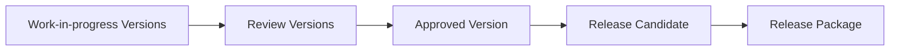
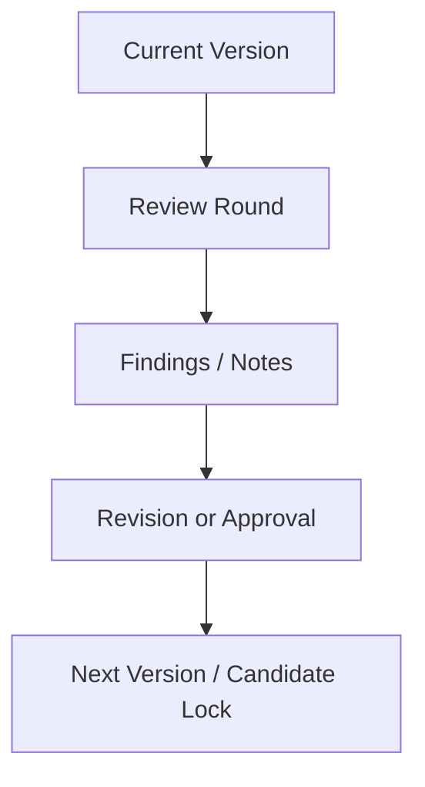
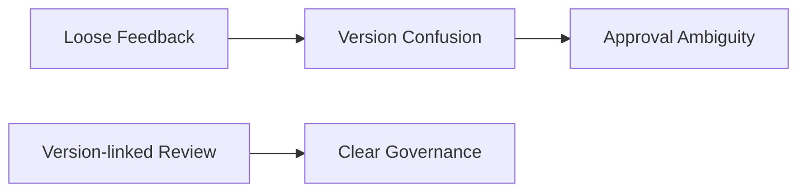
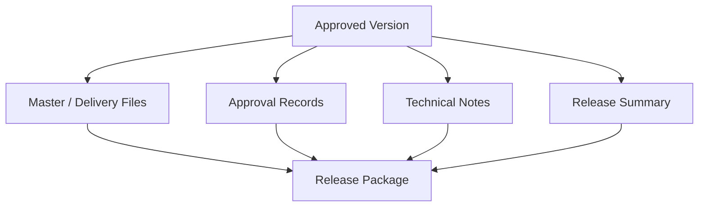
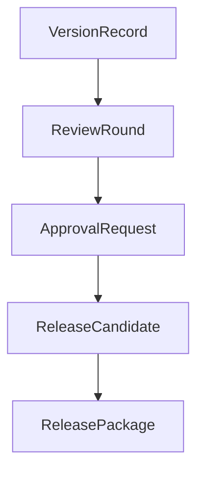
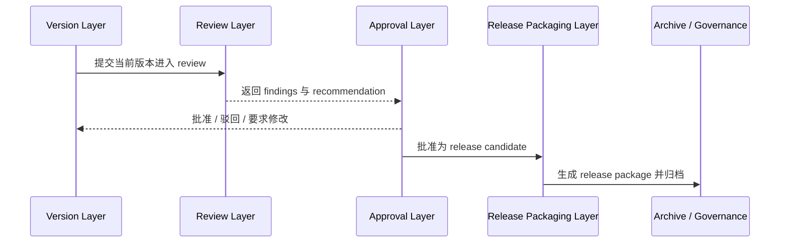
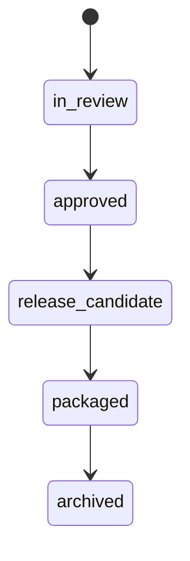
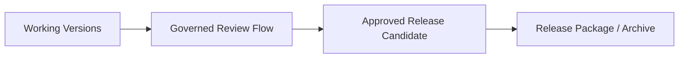

# 49. Review 流、版本管理与 Release Package

## 这篇文档回答什么问题

后期制作真正进入“可交付状态”之前，最关键的问题不是再做一个版本，而是：

- 哪个版本正在被 review
- 哪个版本已经被批准
- 哪个版本可以作为正式 release candidate
- 哪些附件和说明构成完整交付包

本篇重点回答：

1. 传统电影项目中的 review flow 和 versioning 是怎样工作的。
2. 为什么 release package 是治理对象，而不是简单导出文件。
3. 在导演智能体平台里，这条链应如何对象化、状态化和归档化。

---

## 一、后期制作的核心不是“越来越接近成片”，而是“版本逐渐被正式化”

现实里，一部电影后期阶段经常会有很多版本，但不是每个版本都有同等地位。

所以 versioning 的关键，不只是编号，而是版本所处的治理状态。

---

## 二、传统 review flow 通常在做什么

现实中的 review flow 通常解决三件事：

- 当前版本有哪些问题
- 哪些问题必须在下轮修
- 谁批准当前版本进入下一节点

### 常见 review 参与方

- 导演
- 制片
- 剪辑 / 后期总监
- 摄影或调色负责人
- 声音 / VFX 负责人

不同类型的问题，会由不同角色重点评审。

---

## 三、为什么 versioning 和 review 必须绑定

如果 review 不绑定具体版本，就会立刻出现混乱：

- 不知道反馈针对哪一版
- 同一问题是否已解决无法确认
- release candidate 的边界不清晰

所以平台里的 review note 必须显式绑定：

- version id
- review round id
- finding category
- decision status

---

## 四、什么是 Release Package

Release package 不只是一个导出文件，而是一组被正式组织好的交付单元。

它通常包括：

- 当前正式版本标识
- master 文件或交付文件集合
- 技术说明
- 审批记录
- 发布备注或交付说明

---

## 五、在平台中的对象映射建议

建议至少建模：

- `ReviewRound`
- `VersionRecord`
- `ApprovalRequest`
- `ReleaseCandidate`
- `ReleasePackage`

### 建议字段

#### `VersionRecord`

- `version_id`
- `version_label`
- `source_domain`
- `status`
- `known_findings`

#### `ReleasePackage`

- `package_id`
- `approved_version_ids`
- `delivery_files`
- `approval_history`
- `release_notes`
- `archive_pointer`

---

## 六、平台里的治理工作流建议

---

## 七、为什么 Release Candidate 必须和 Release Package 区分

现实里常常需要明确区分：

- 这个版本“看起来差不多了”
- 这个版本“已经达到可正式交付标准”

前者更像 `release_candidate`，后者才是 `release_package`。

---

## 八、为什么这条链对导演智能体平台特别重要

因为它是整个项目从工作中状态转入正式交付状态的总门槛。

没有这层，系统永远停留在“不断做版本”，而无法真正进入“正式交付”。

---

## 九、对导演智能体平台和 Hermes 的启发

对平台而言，这条链最值得优先补的是：

- `ReviewRound`
- `VersionRecord`
- `ReleaseCandidate`
- `ReleasePackage`

对 Hermes 来说，后续可补的能力包括：

- version-linked review artifact
- approval 状态对象
- package 生成与 archive 指针

---

## 十、结论

Review flow、versioning 和 release package，在后期制作与交付阶段本质上是在回答：

- 哪个版本正在被讨论
- 哪个版本已经成立
- 哪个版本可以正式出厂

在导演智能体平台里，它们应被理解成：

- 整个项目治理链的最后一段核心对象流
- 连接工作版本、审批状态与交付状态的正式门槛
- 归档、复盘与企业级管理的关键基础

只有把这条链做实，平台才真正具备“正式交付系统”的能力。

---

## 相关文档

- [45-editing-workflow-and-versioning.md](./45-editing-workflow-and-versioning.md)
- [48-vfx-post-collaboration-and-delivery.md](./48-vfx-post-collaboration-and-delivery.md)
- [50-marketing-assets-and-distribution-collaboration.md](./50-marketing-assets-and-distribution-collaboration.md)
- [66-review-approval-release-package-object-system.md](./66-review-approval-release-package-object-system.md)
- [68-approval-and-escalation-flow-design.md](./68-approval-and-escalation-flow-design.md)
- [70-artifact-version-and-archive-system.md](./70-artifact-version-and-archive-system.md)
