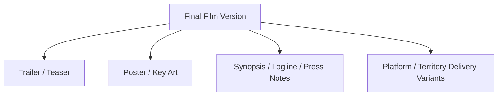
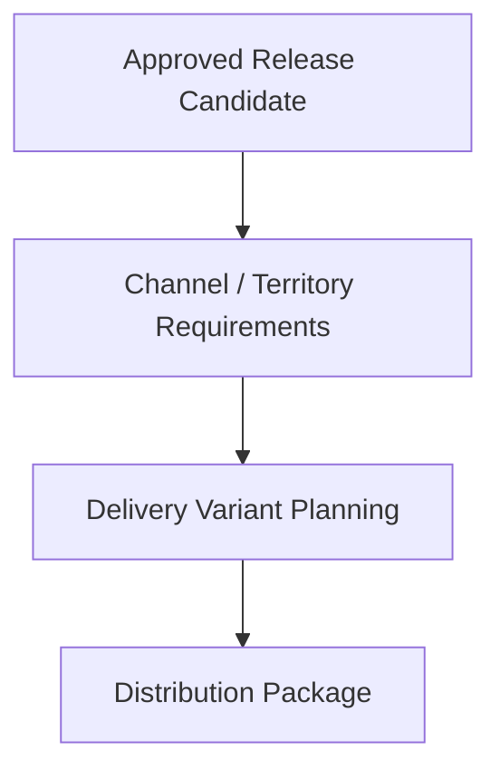
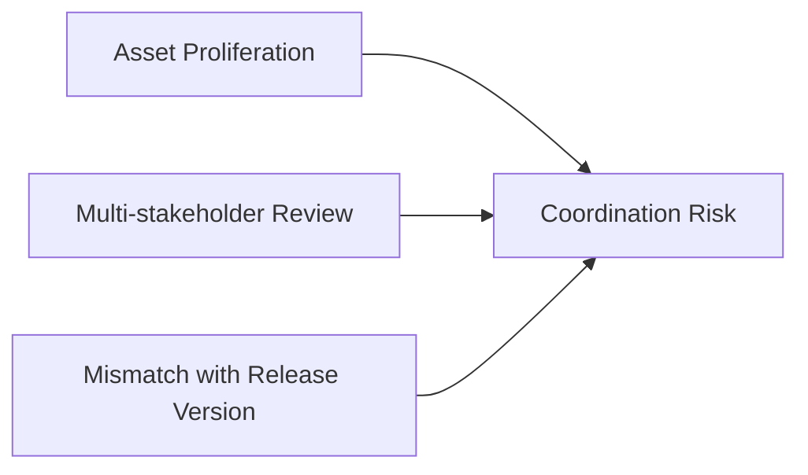
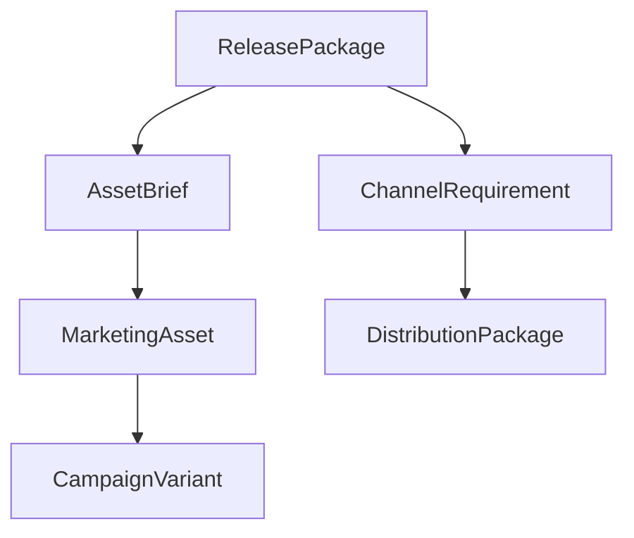
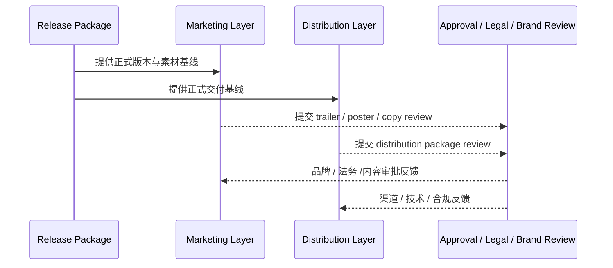
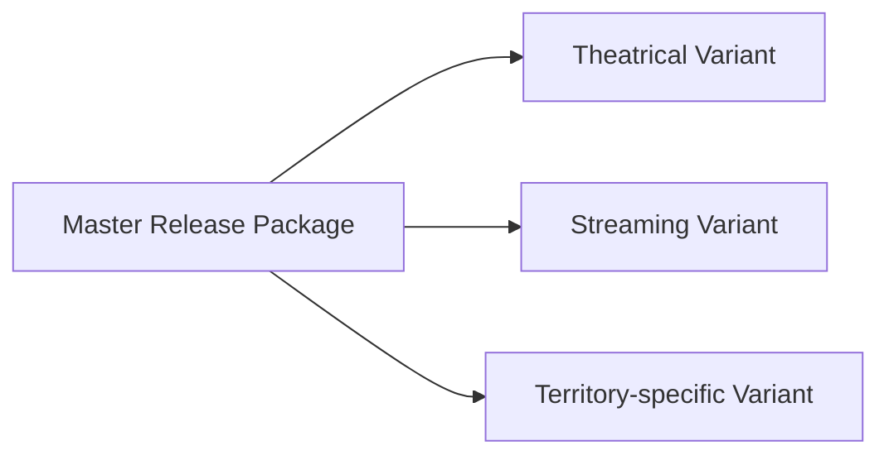
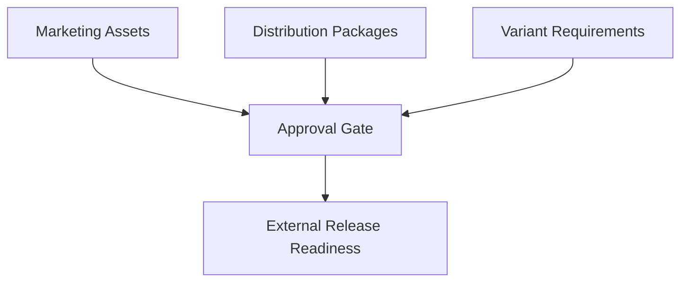

# 50. 宣发物料与发行协作

## 这篇文档回答什么问题

电影项目进入交付阶段后，工作并不会停在“有一个成片版本”。现实里，宣发和发行会把电影拆成一系列外部可见的资产、说明和渠道版本。

本篇重点回答：

1. 宣发物料和发行协作在传统电影项目里通常如何推进。
2. 为什么 marketing assets 和 distribution package 不是后置小任务，而是正式交付链的一部分。
3. 在导演智能体平台里，这组协作应如何对象化、版本化和审批化。

---

## 一、电影对外发布的是“资产集合”，不只是成片

现实中，一部电影正式进入市场时，外部看到的通常是一组资产，而不是单一影片文件。

因此，宣发与发行在平台里应被看作 release 扩展层。

---

## 二、传统宣发物料链通常怎么走

这条链说明：

- 宣发素材不是从零开始，而是基于正式版本和市场策略
- 它们同样需要多轮 review 和批准

---

## 三、传统发行协作通常在做什么

发行协作解决的不是“做不做海报”，而是：

- 不同渠道需要什么交付格式
- 不同市场 / 平台有哪些版本要求
- 交付节奏和审查节奏如何安排

---

## 四、为什么宣发与发行容易失控

### 1. 资产版本多

- trailer v1 / v2 / v3
- teaser 与正式 trailer
- 海报主版与渠道版

### 2. 文案、品牌、法务、发行要求常常交叉

### 3. 对外资产如果和正式 release 版本脱节，会产生严重风险

---

## 五、在平台中的对象映射建议

建议至少建模：

- `MarketingAsset`
- `AssetBrief`
- `CampaignVariant`
- `DistributionPackage`
- `ChannelRequirement`

### 建议字段

#### `MarketingAsset`

- `asset_id`
- `asset_type`
- `source_version_id`
- `target_channel`
- `status`
- `review_history`

#### `DistributionPackage`

- `package_id`
- `target_channel`
- `delivery_requirements`
- `delivery_files`
- `approval_status`

---

## 六、平台里的工作流建议

---

## 七、为什么渠道版本必须显式管理

不同发行场景可能需要：

- 不同时长 trailer
- 不同字幕和语言版本
- 不同平台的技术交付文件
- 不同市场的审查说明

如果不把 variant 显式对象化，交付会非常容易混乱。

---

## 八、为什么这条链也必须进入治理闭环

因为对外资产和发行交付都具有高风险：

- 错版本素材会造成品牌与法务问题
- 错交付包会造成渠道拒收
- 宣发口径和影片版本不一致会伤害项目整体表达

---

## 九、对导演智能体平台和 Hermes 的启发

对平台而言，这组协作最值得优先补的是：

- asset brief
- marketing asset versioning
- channel requirement objects
- distribution package approval

对 Hermes 来说，后续可补的能力包括：

- release-coupled asset artifact
- 渠道交付变体对象
- 与 release package 强绑定的外发治理链

---

## 十、结论

宣发物料与发行协作，在电影项目里本质上是在把正式成片版本转译成外部可见、可传播、可分发的资产体系。

在导演智能体平台里，它应被理解成：

- release package 的外延对象群
- 强版本化、强审批、强渠道约束的交付链
- 项目走向市场之前的最后一层外部表达与分发系统

只有把 marketing 和 distribution 也纳入正式对象与治理流，平台才真正覆盖项目的“出厂阶段”。

---

## 相关文档

- [49-review-flow-versioning-and-release-package.md](./49-review-flow-versioning-and-release-package.md)
- [51-project-retrospective-and-knowledge-capture.md](./51-project-retrospective-and-knowledge-capture.md)
- [66-review-approval-release-package-object-system.md](./66-review-approval-release-package-object-system.md)
- [70-artifact-version-and-archive-system.md](./70-artifact-version-and-archive-system.md)
- [90-enterprise-rollout-roadmap.md](./90-enterprise-rollout-roadmap.md)
