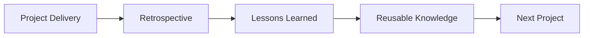
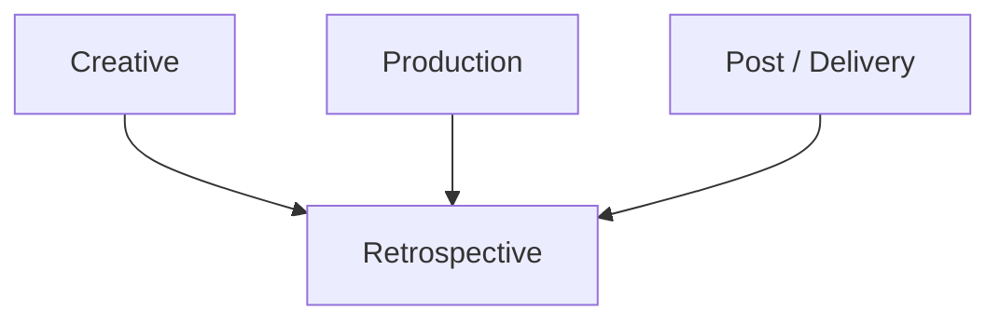
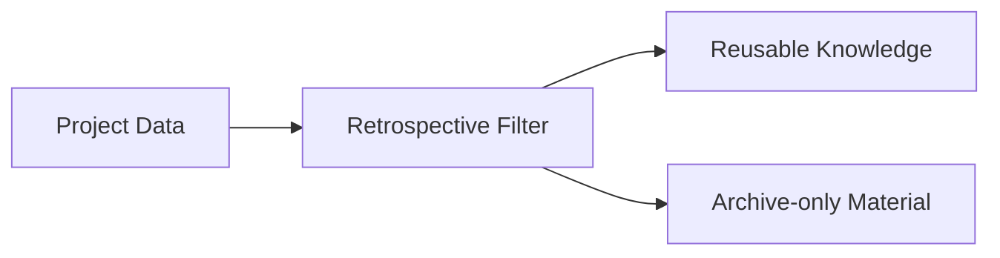
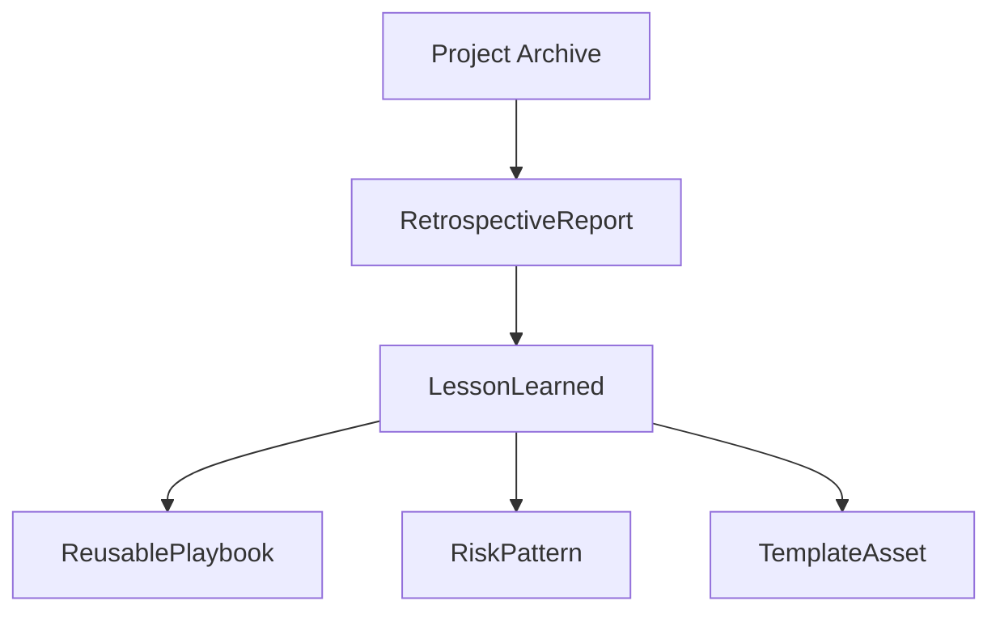
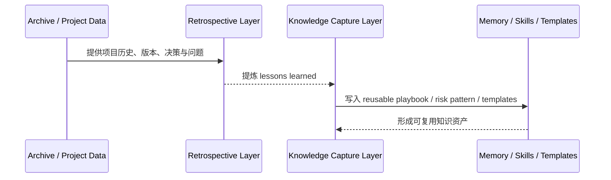
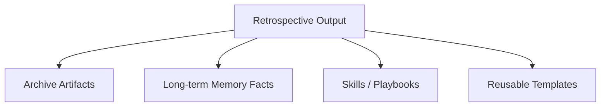
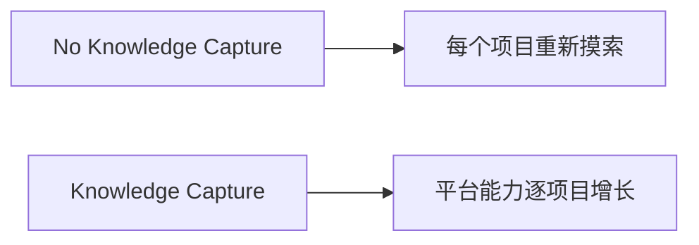

# 51. 项目复盘与知识沉淀

## 这篇文档回答什么问题

电影项目结束后，如果所有经验都留在参与者脑中，那么平台永远只能管理“一部片”，而不能成长为长期系统。

本篇重点回答：

1. 传统电影项目为什么需要复盘。
2. 什么样的信息值得沉淀成长期知识，而不是只留在项目档案里。
3. 在导演智能体平台里，复盘与知识沉淀应如何进入 memory、artifacts 和 reusable playbook。

---

## 一、复盘不是总结会，而是下一部片的起点

现实里，很多项目做完就散，导致：

- 同类错误重复发生
- 有效工作法无法复用
- 好的协作模式和模板不能沉淀

真正有价值的平台，必须把这条链做起来。

---

## 二、传统复盘通常会关注什么

### 1. 创作层

- 剧本开发阶段哪些判断最有效
- 哪些镜头设计和表演方法最成立

### 2. 生产层

- 哪些流程拖慢了拍摄
- 哪些预算 / 排期假设不准

### 3. 后期与交付层

- 哪些 review 机制真正有效
- 哪些版本管理方式造成混乱

---

## 三、不是所有信息都值得进入长期知识

平台不应把所有项目细节都塞进长期 memory，而应筛选真正高价值、可跨项目复用的信息。

### 值得沉淀

- 高复用工作法
- 稳定有效的模板
- 常见风险模式
- 某类题材或规模项目的经验规则

### 不一定值得沉淀

- 单个项目的临时协调细节
- 已失效的局部 workaround
- 纯一次性沟通记录

---

## 四、在平台中的对象映射建议

建议至少建模：

- `RetrospectiveReport`
- `LessonLearned`
- `ReusablePlaybook`
- `RiskPattern`
- `TemplateAsset`

### 建议字段

#### `LessonLearned`

- `lesson_id`
- `domain`
- `summary`
- `evidence`
- `reuse_scope`

#### `ReusablePlaybook`

- `playbook_id`
- `scenario`
- `recommended_workflow`
- `source_projects`
- `status`

---

## 五、平台里的复盘工作流建议

---

## 六、为什么复盘要和 artifacts、memory、skills 分层处理

不同类型的沉淀不应该混在一起。

### 分层建议

- Archive：保留完整项目轨迹
- Memory：保留高价值稳定事实
- Skills / Playbooks：保留可执行方法论
- Templates：保留可直接复用的文档或对象模板

---

## 七、为什么这条链对导演智能体平台特别关键

如果没有复盘与知识沉淀，平台每个项目都要从零开始。

这也是智能体平台区别于一次性工具的关键价值之一。

---

## 八、对导演智能体平台和 Hermes 的启发

对平台而言，复盘与知识沉淀最值得优先补的是：

- retrospective report
- reusable lesson / risk pattern
- template 和 playbook 产出

对 Hermes 来说，后续可补的能力包括：

- retrospective artifact
- lesson-to-skill 转换流程
- 从项目 archive 中提炼可复用知识的机制

---

## 九、结论

项目复盘与知识沉淀，在电影项目平台里本质上是在回答：

- 这部片到底教会了系统什么
- 哪些经验值得跨项目保留
- 哪些模式应该变成模板、技能和长期知识

在导演智能体平台里，它应被理解成：

- 项目生命周期的最后一段正式工作流
- 从一次性项目结果转向长期平台能力的关键桥
- 让 Hermes 从“完成任务”走向“持续进化”的必要机制

只有把 retrospective 和 knowledge capture 做成正式对象链，平台才真正具备长期积累价值。

---

## 相关文档

- [50-marketing-assets-and-distribution-collaboration.md](./50-marketing-assets-and-distribution-collaboration.md)
- [69-memory-and-knowledge-capture-design.md](./69-memory-and-knowledge-capture-design.md)
- [85-pilot-project-implementation-manual.md](./85-pilot-project-implementation-manual.md)
- [116-output-management-and-agent-artifacts-system.md](./116-output-management-and-agent-artifacts-system.md)
- [118-program-governance-roadmap-and-operating-metrics.md](./118-program-governance-roadmap-and-operating-metrics.md)
