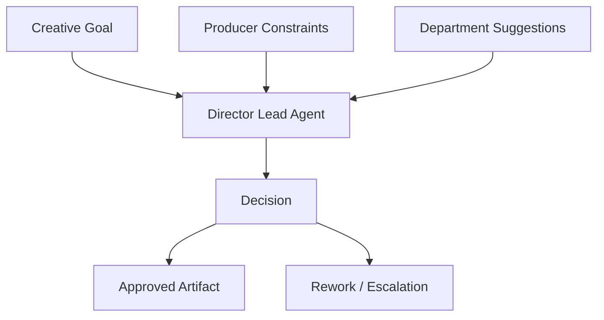
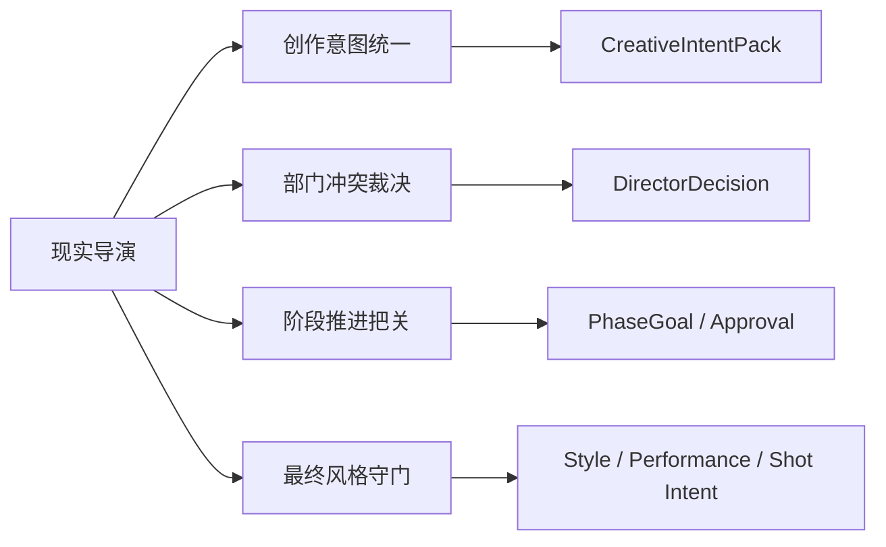
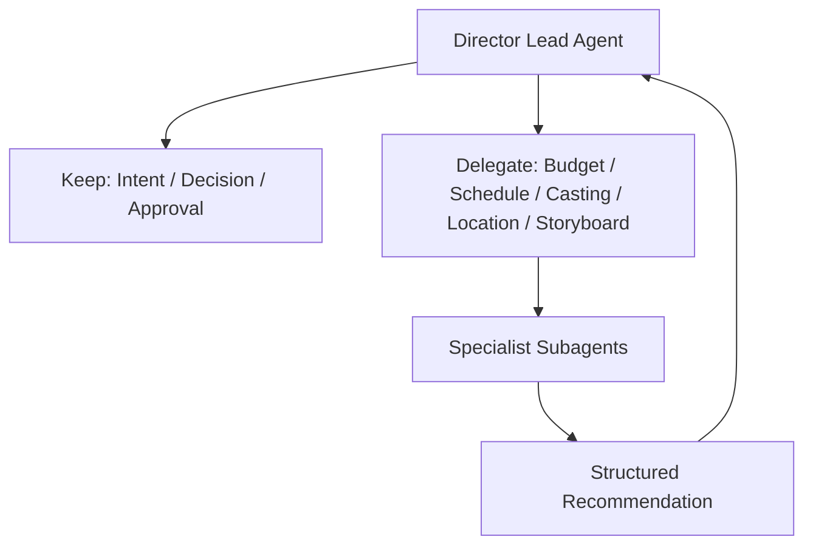
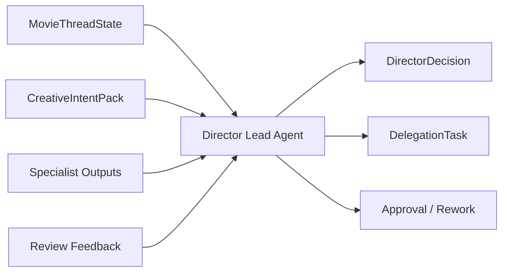
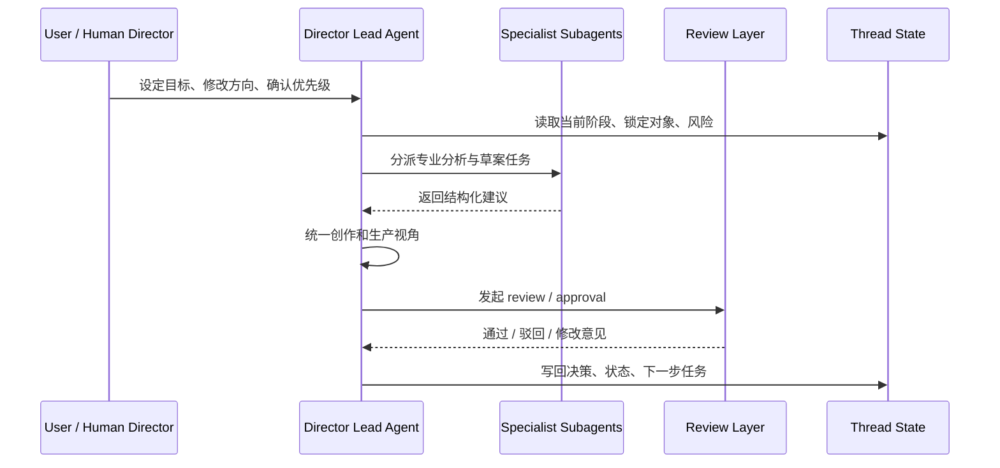
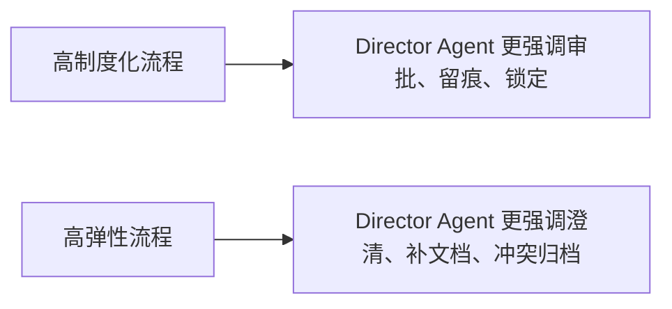
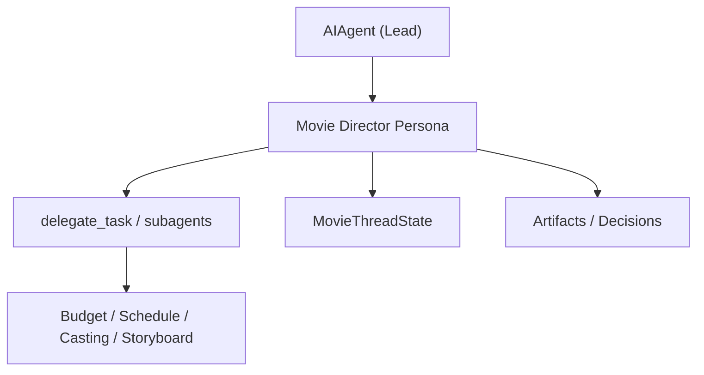
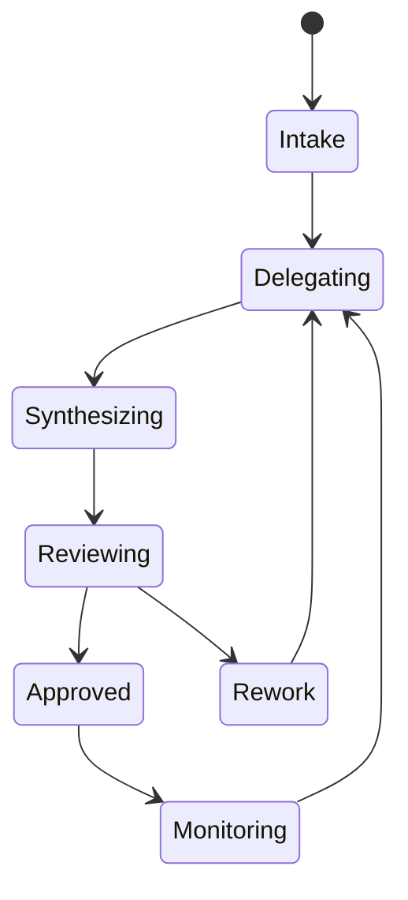
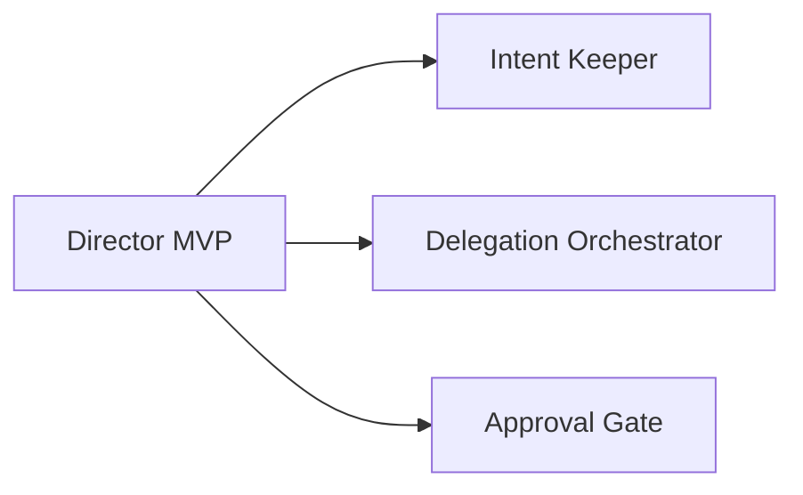

# 52. 导演主智能体设计

## 这篇文档回答什么问题

导演智能体平台里，最容易被误解的角色就是导演主智能体。

很多人会天然把它理解成“最强的那个大模型”，但在正式电影制作里，导演真正承担的不是万能执行者，而是总创作负责人、最高优先级裁决者和阶段推进的主控节点。

本篇重点回答：

1. 导演主智能体到底负责什么，不负责什么。
2. 它和制片、编剧分析、分镜、预算、排期等子智能体如何分工。
3. 在 Hermes Agent 里，这个角色应该如何映射到 lead agent、state、delegation 与 artifacts。

---

## 一、为什么导演主智能体必须是平台的第一角色

现实里的电影制作不是“每个部门都平权投票”的组织，而是围绕导演意图、制片约束和正式审批链持续收敛。

如果平台没有一个稳定的导演主控层，就会很快出现这些问题：

- 创作意图在多轮协作中漂移
- 部门建议互相冲突但无人裁决
- 项目阶段切换失去统一标准
- review 通过和正式锁定没有明确责任人

所以导演主智能体不是“内容生成器”，而是全项目的创作控制面。

---

## 二、现实中的导演职责，如何翻译到智能体平台

现实中的导演通常做四类工作：

- 定义作品的总体意图
- 判断某个方案是否符合影片气质
- 在多部门冲突中做创作性裁决
- 在进度和资源压力下决定什么必须保留、什么可以调整

把它翻译到智能体平台后，导演主智能体应主要承担：

- 维护 `CreativeIntentPack`
- 维护 `PhaseGoal`
- 发起或批准关键 review
- 对子智能体输出做整合和取舍
- 在冲突出现时生成 `DirectorDecision`

---

## 三、导演主智能体的职责边界

导演主智能体最重要的不是“能做多少事”，而是“哪些事必须由它来做最终判断”。

### 它必须负责

- 项目目标解释
- 创作方向统一
- 多部门方案取舍
- 锁稿、锁风格、锁镜头原则等关键节点判断
- 高风险变更的升级决策

### 它不应该直接吞掉的工作

- 明细预算测算
- 全量排期编排
- 演员候选清单初筛
- 场景实地约束分析
- 每个镜头的技术执行细节推导

如果导演主智能体亲自完成所有专业工作，它很快会退化成“上下文过载的大模型会话”。

---

## 四、导演主智能体的核心输入与输出

### 核心输入

- `MovieThreadState`
- `CreativeIntentPack`
- 最新 `ScriptVersion`
- 当前阶段活跃的 `RiskRegister`
- 各子智能体提交的结构化建议
- review 反馈与审批结果

### 核心输出

- `DirectorDecision`
- `PhaseGoalUpdate`
- `ReviewRequest`
- `ApprovalRecommendation`
- `DelegationTask`
- 对关键 artifacts 的锁定或退回意见

---

## 五、导演主智能体的决策循环

导演主智能体不是连续说很多话，而是持续执行一个很明确的控制循环。

这个循环的重点不是生成更长的答案，而是让项目始终处在“有人负责裁决”的状态。

---

## 六、国内外流程差异，如何影响导演主智能体设计

导演主智能体的设计不能脱离真实工业环境。

### 在更成熟的制片体系里

- 导演通常面对更严格的文档链和审批链
- 部门产出标准化程度更高
- 导演更像在正式治理结构中做创作裁决

### 在更灵活或更依赖个人协调的环境里

- 口头沟通和即时改动更多
- 文档化程度可能不够稳定
- 导演需要承担更多非正式协调工作

因此导演主智能体必须同时具备：

- 正式治理接口
- 对非结构化输入做收敛的能力

---

## 七、在 Hermes Agent 中的映射建议

这一角色最自然地建立在当前 `AIAgent` / lead agent 机制之上。

### 建议映射

- `run_agent.py` 中的主 agent 实例
- `tools/delegate_tool.py` 负责向专业角色委派
- `hermes_state.py` 或扩展 state 层保存 `MovieThreadState`
- artifacts 层保存锁定版本、决策记录、review 结果

### 额外建议

- 给导演主智能体固定一组高优先级可读对象
- 给它保留唯一的最终 `approve / reject / lock` 能力
- 让子智能体默认只提交建议，不直接锁定核心对象

---

## 八、建议的内部状态机

导演主智能体本身也应该有一个轻量状态机，防止在不同阶段做错事。

这不是 UI 动画，而是角色行为约束：

- `Intake`：理解目标与约束
- `Delegating`：拆分专业任务
- `Synthesizing`：整合建议
- `Reviewing`：进入正式审核
- `Monitoring`：跟踪已批准计划的执行情况

---

## 九、MVP 设计建议

如果只做第一版，导演主智能体不需要包揽所有阶段，而应优先做三件事：

1. 维护 `CreativeIntentPack`
2. 调用 4 到 6 个专业子智能体
3. 对关键对象执行 `approve / rework / escalate`

只要这三件事稳定，平台就已经具备“导演主控”的雏形。

---

## 十、结论

导演主智能体不是平台里最能写内容的角色，而是：

- 创作意图的最高守门人
- 专业子智能体的调度与裁决中心
- 阶段推进与审批锁定的主控节点

对 Hermes 来说，它应当被实现成电影域的 lead agent，而不是一个泛化聊天角色。

只有先把导演主智能体的职责边界做清楚，后续所有预算、排期、分镜、选角、勘景和后期角色，才有稳定的协作中心。

---

## 相关文档

- [05-agent-system.md](./05-agent-system.md)
- [53-producer-subagent-design.md](./53-producer-subagent-design.md)
- [62-movie-thread-state-design.md](./62-movie-thread-state-design.md)
- [71-lead-agent-transformation-plan.md](./71-lead-agent-transformation-plan.md)
- [77-movie-factory-design.md](./77-movie-factory-design.md)
