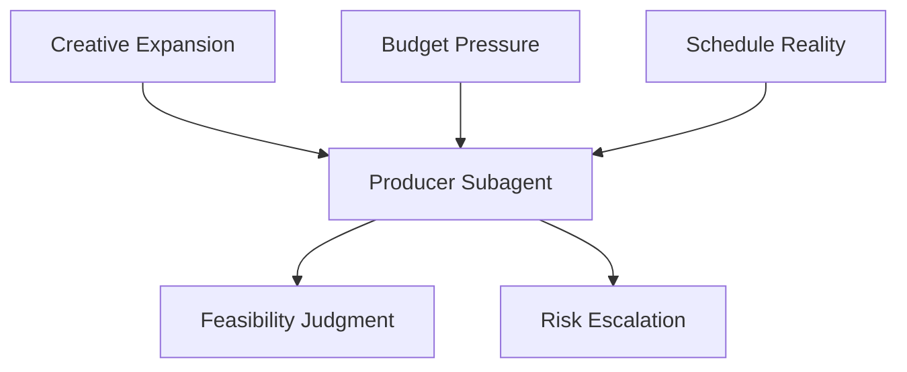
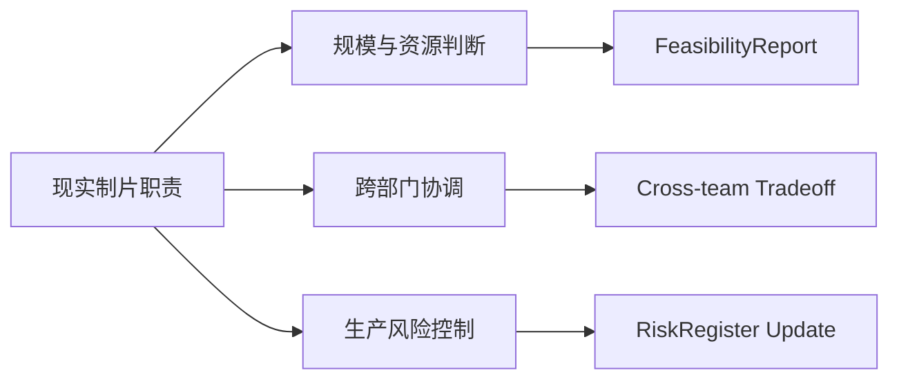
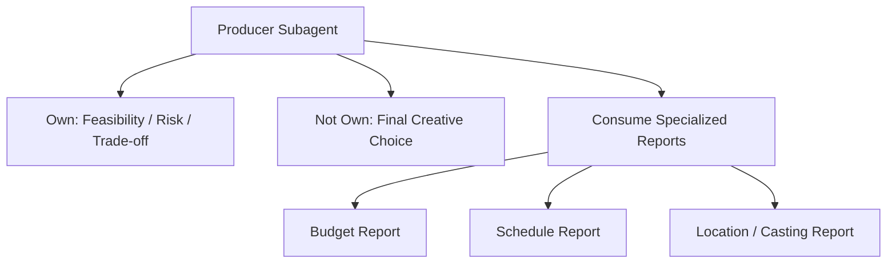
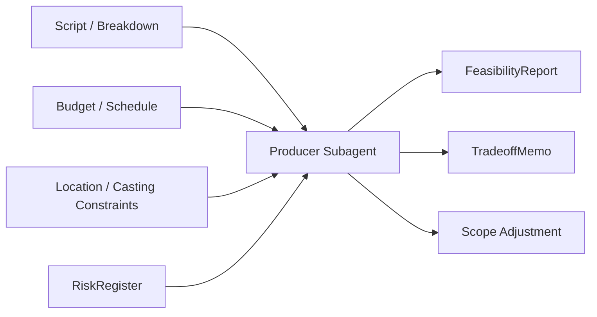
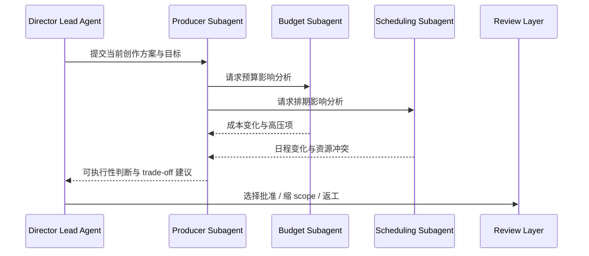
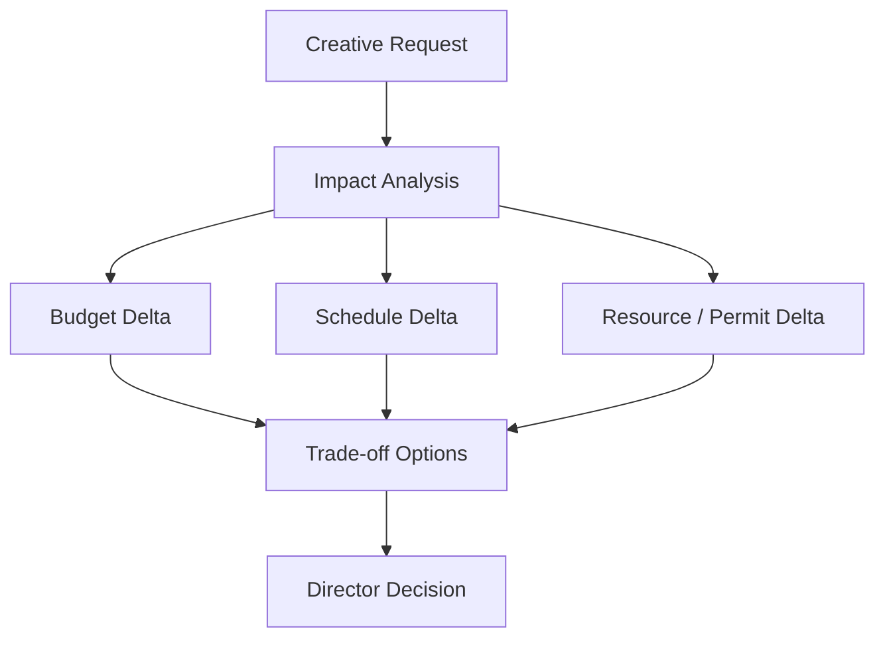
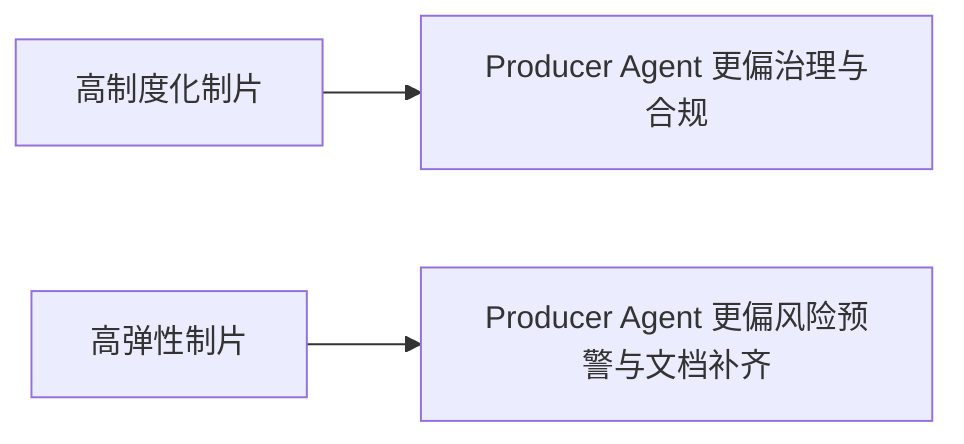
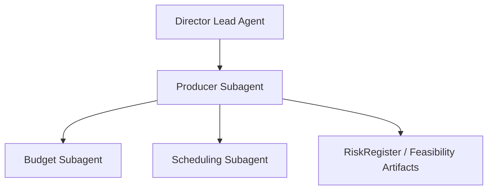
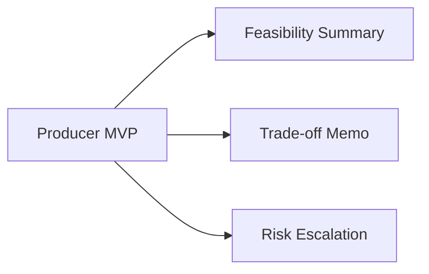

# 53. 制片子智能体设计

## 这篇文档回答什么问题

在任何正式电影项目里，制片视角都不是“限制创作”的外部阻力，而是把项目从想法拉回可执行现实的关键力量。

本篇重点回答：

1. 制片子智能体在导演智能体平台里承担什么职责。
2. 它和导演主智能体、预算智能体、排期智能体之间如何分工。
3. Hermes Agent 应如何把这个角色做成真正的生产约束节点，而不是一个只会说“预算不够”的顾问。

---

## 一、为什么制片角色必须单独建模

如果没有制片视角，创作系统最容易出现的问题不是“想象力不够”，而是：

- 项目规模和资源能力脱节
- 风险没人持续跟踪
- 决策缺乏成本意识和交付意识
- 各部门都在局部最优，没人盯整体可执行性

制片子智能体的意义，是让平台始终存在一个“生产现实解释器”。

---

## 二、现实中的制片职责，如何翻译到平台里

现实里的制片、执行制片、line producer 虽然分工不同，但它们有一个共同点：都在持续回答“这部片能不能按约束做成”。

因此在平台里，制片子智能体应重点承担：

- 规模判断
- 资源配置建议
- 风险登记与升级
- 关键方案的可执行性评估
- 对预算、排期、场地、演员和交付链的联动解释

---

## 三、制片子智能体的职责边界

### 它应负责

- 对方案做可执行性判断
- 给导演主智能体提供 trade-off 解释
- 聚合预算、排期、资源、许可等现实约束
- 识别高风险变更并建议升级

### 它不应负责

- 直接替导演决定风格
- 代替预算智能体做明细成本展开
- 代替排期智能体生成 stripboard 级日程
- 代替选角或勘景角色做专业细节评估

---

## 四、核心输入与输出对象

### 核心输入

- `ScriptVersion`
- `BreakdownSheet`
- `BudgetDraft`
- `ScheduleDraft`
- `LocationPackage`
- `CastingPlan`
- `RiskRegister`

### 核心输出

- `FeasibilityReport`
- `TradeoffMemo`
- `ProducerRecommendation`
- `RiskEscalation`
- `ScopeAdjustmentProposal`

---

## 五、典型工作流

制片子智能体最有价值的场景，不是在项目最开始，而是在“创作冲动”和“现实约束”第一次产生明显摩擦的时候。

---

## 六、制片子智能体应如何处理 trade-off

制片视角最难的，不是指出问题，而是把问题翻译成可决策的选项。

一个好的制片子智能体，不该只说“风险很高”，而应输出：

- 保留方案，但增加哪些成本和时间
- 缩减方案，可以保住什么核心效果
- 换实现路径，会影响哪些部门

---

## 七、国内外差异对角色设计的影响

### 在成熟工业流程里

- 制片视角更依赖正式文档
- 合同、工会、保险、许可等边界更硬
- 风险升级更早发生

### 在更灵活的环境里

- 很多协调通过经验和关系完成
- “边拍边改”更常见
- 非正式风险容易积累到后段爆发

这意味着制片子智能体需要同时支持：

- 正式治理模式
- 混合协调模式

---

## 八、在 Hermes Agent 中的映射建议

这个角色最适合实现成导演主智能体可调用的核心常驻子智能体之一。

### 工程层建议

- 通过 `delegate_tool.py` 发起角色化委派
- 给制片子智能体默认可读预算、排期、场地、演员相关对象
- 限制其直接锁定创作对象的权限
- 允许其提交 `RiskEscalation` 和 `TradeoffMemo`

---

## 九、MVP 设计建议

第一版不需要把制片角色做成覆盖所有法务、保险、合规的复杂系统，先把三件事做好即可：

1. 可执行性摘要
2. 跨部门 trade-off 解释
3. 风险升级建议

---

## 十、结论

制片子智能体的价值，不是替导演保守，而是让创作决策始终面对真实生产成本和交付压力。

它在平台中应被理解成：

- 现实约束的解释层
- 风险与 trade-off 的整合层
- 导演主智能体最重要的生产侧搭档

只有把制片角色做成正式子智能体，导演平台才不会陷入“只会想，不会做成”的空转状态。

---

## 相关文档

- [52-director-lead-agent-design.md](./52-director-lead-agent-design.md)
- [56-budget-subagent-design.md](./56-budget-subagent-design.md)
- [57-scheduling-subagent-design.md](./57-scheduling-subagent-design.md)
- [64-budget-schedule-resource-object-system.md](./64-budget-schedule-resource-object-system.md)
- [73-subagent-registry-cinema-extension.md](./73-subagent-registry-cinema-extension.md)
