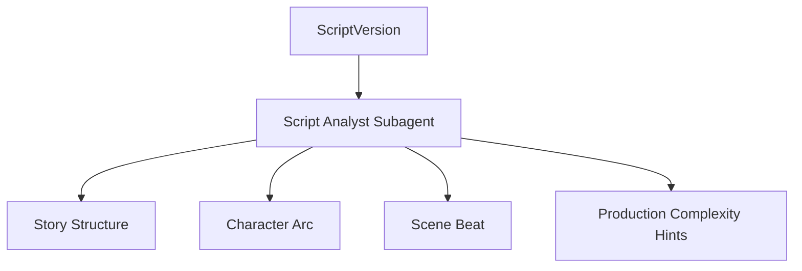
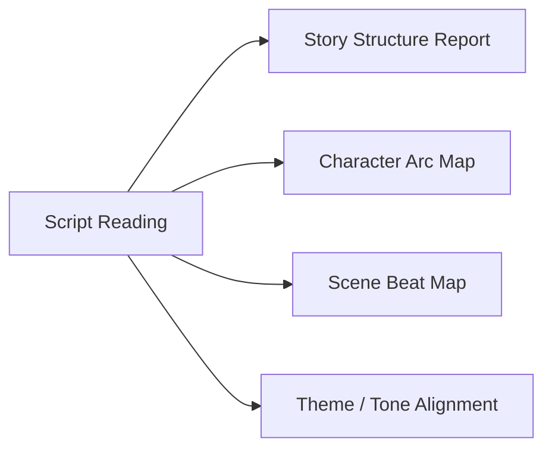
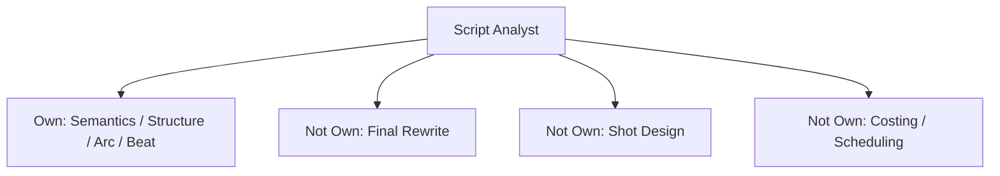
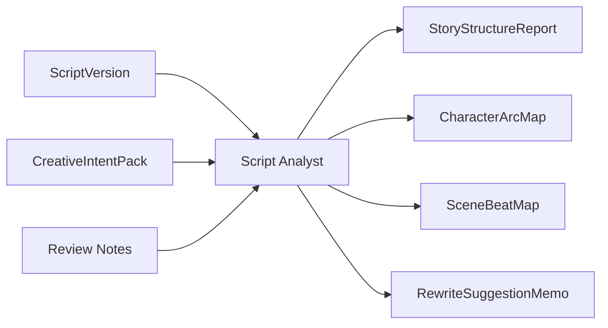
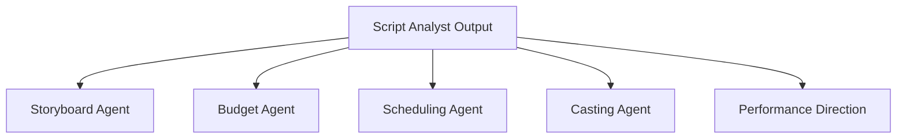
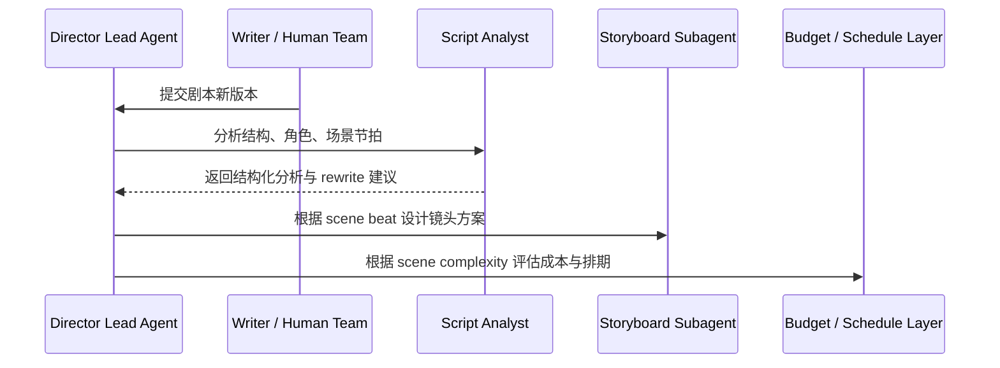
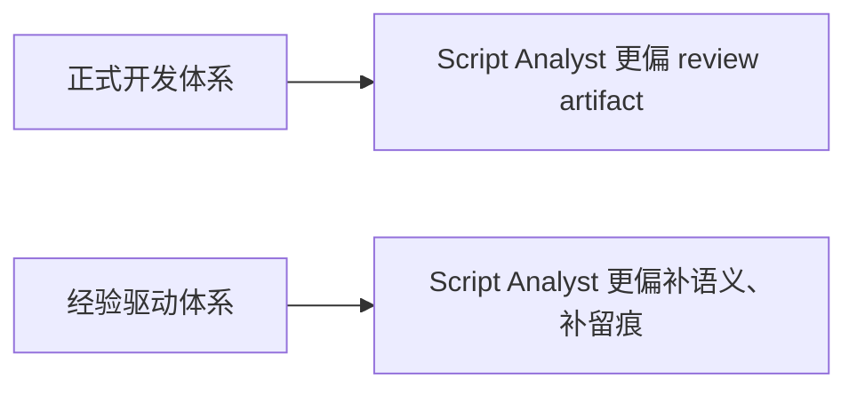
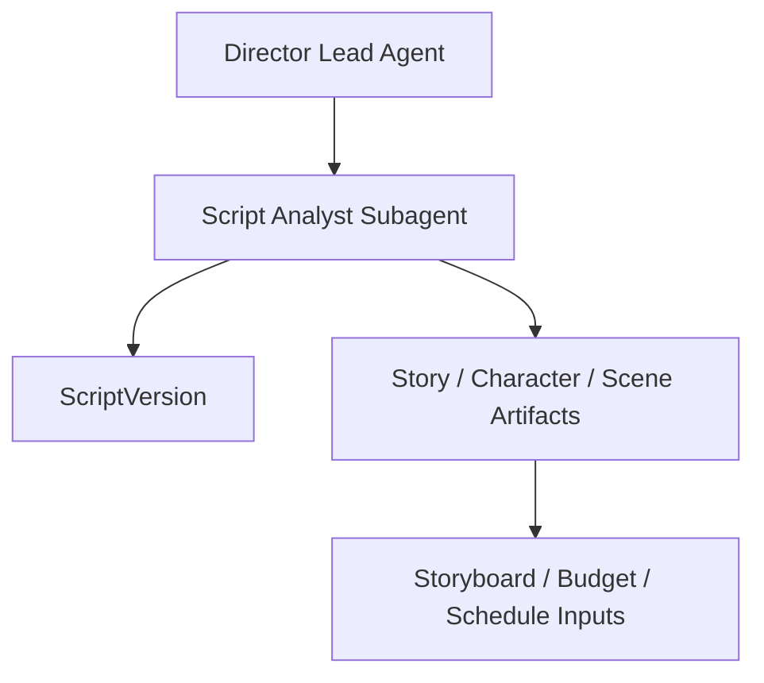
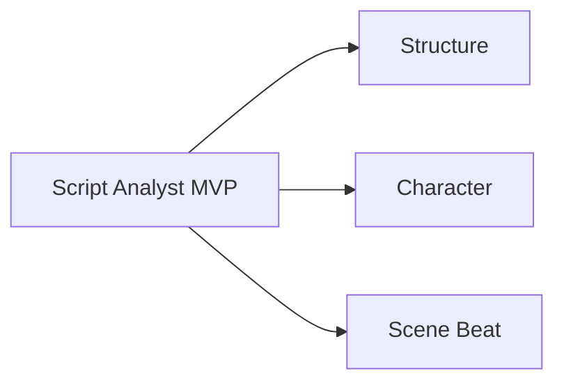

# 54. 剧本分析子智能体设计

## 这篇文档回答什么问题

在电影项目里，很多后续问题其实都源于对剧本理解不够稳定。

如果平台没有一个专门负责结构、角色、情绪与场景意图解析的角色，那么预算、排期、分镜、选角和表演指导都会建立在含混理解之上。

本篇重点回答：

1. 剧本分析子智能体到底应该分析什么。
2. 它的输出如何成为前期制作和拍摄执行的语义底座。
3. Hermes Agent 应如何把它做成可持续复用的“脚本语义层”。

---

## 一、为什么剧本分析必须独立出来

剧本不是一个普通文本文件，它同时承载：

- 故事结构
- 角色弧线
- 场景目标
- 情绪节拍
- 制作复杂度

如果这些信息没有被系统化拆出来，后面各部门就只能各自解读，很快会产生偏差。

---

## 二、现实中的剧本分析工作，如何映射到平台

现实中，这项工作可能由导演、编剧、script consultant、script supervisor、development executive 等多个角色分担。

在平台里，剧本分析子智能体应把这些分散动作标准化为：

- 结构分析
- 角色分析
- 场景意图标注
- 情绪和冲突标注
- 对后续 breakdown 和 shot planning 提供结构化输入

---

## 三、职责边界

### 它应负责

- 把剧本从自然语言翻译成结构化创作对象
- 识别结构问题和角色问题
- 为前期和拍摄提供场景语义标签

### 它不应负责

- 替编剧完成最终改写
- 替导演决定镜头语言
- 替预算或排期角色计算执行成本

---

## 四、核心输入与输出对象

### 输入

- `ScriptVersion`
- `CreativeIntentPack`
- 导演或编剧给出的修改目标
- 历史 review comments

### 输出

- `StoryStructureReport`
- `CharacterArcMap`
- `SceneBeatMap`
- `ThemeToneAlignmentReport`
- `RewriteSuggestionMemo`

---

## 五、它如何支撑后续角色

剧本分析子智能体的价值，不在它自己写得多漂亮，而在于它让后续角色都能站在同一份语义底图上工作。

例如：

- `SceneBeatMap` 可以直接支撑镜头意图设计
- `CharacterArcMap` 可以支撑选角与表演指导
- `StoryStructureReport` 可以支撑锁稿判断

---

## 六、典型协作时序

---

## 七、国内外差异对角色设计的影响

### 更成熟的剧本开发体系

- 多轮 table read、notes、coverage 更常见
- 结构分析与开发反馈更加正式
- 锁稿前的证据链更完整

### 更快速或更依赖经验的体系

- 修改依赖口头交流较多
- 分析过程不一定留档
- 很多问题会推迟到前期或拍摄才显形

所以这个角色既要能服务成熟工作流，也要能帮低文档化团队把隐性理解显性化。

---

## 八、在 Hermes Agent 中的映射建议

剧本分析子智能体适合实现成一个高频调用、低写权限的专业角色。

### 工程建议

- 通过 `delegate_task` 传入剧本版本和创作目标
- 输出固定 schema，而不是只返回长文本
- 把结果写入 artifacts 或 thread state 的 script analysis 区
- 默认无权直接锁定 `ScriptVersion`

---

## 九、MVP 设计建议

第一版先做三类稳定输出即可：

1. `StoryStructureReport`
2. `CharacterArcMap`
3. `SceneBeatMap`

只要这三份对象稳定，后续很多角色就有了统一输入。

---

## 十、结论

剧本分析子智能体本质上是导演平台的语义地基层。

它让系统不再只是“读过剧本”，而是能够：

- 结构化理解故事
- 结构化理解角色
- 结构化理解每场戏到底在干什么

只有先把这层语义拆出来，前期、拍摄、后期的很多自动化和协同才不会建立在模糊共识上。

---

## 相关文档

- [25-script-development-and-lock.md](./25-script-development-and-lock.md)
- [52-director-lead-agent-design.md](./52-director-lead-agent-design.md)
- [55-storyboard-subagent-design.md](./55-storyboard-subagent-design.md)
- [63-script-scene-character-object-system.md](./63-script-scene-character-object-system.md)
- [73-subagent-registry-cinema-extension.md](./73-subagent-registry-cinema-extension.md)
