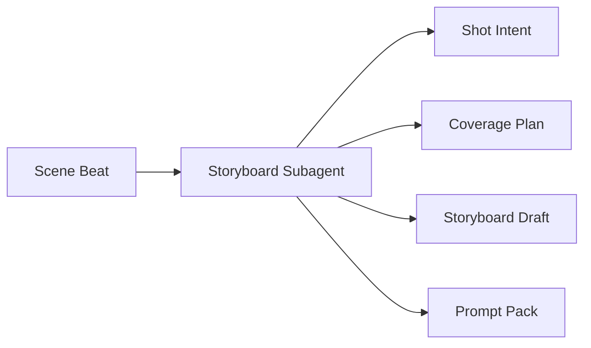
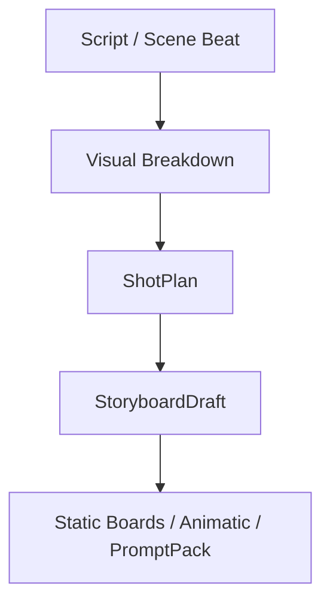
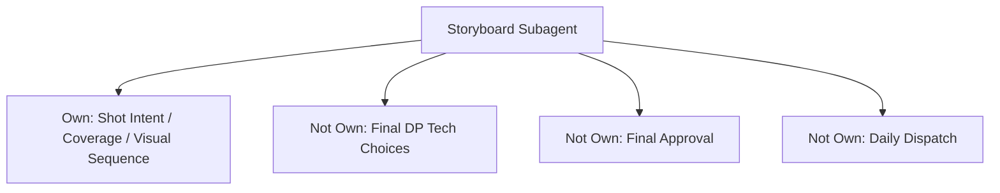
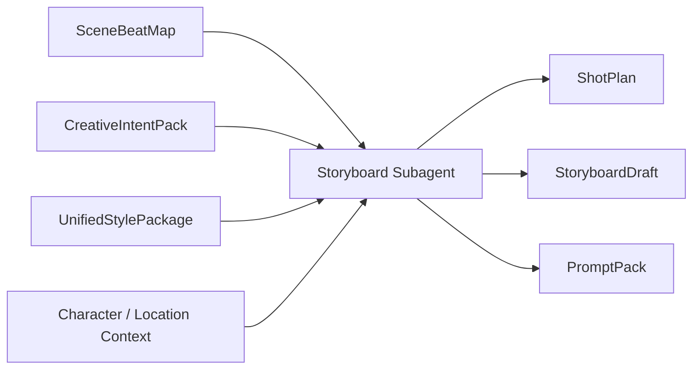
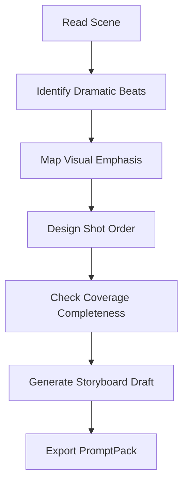
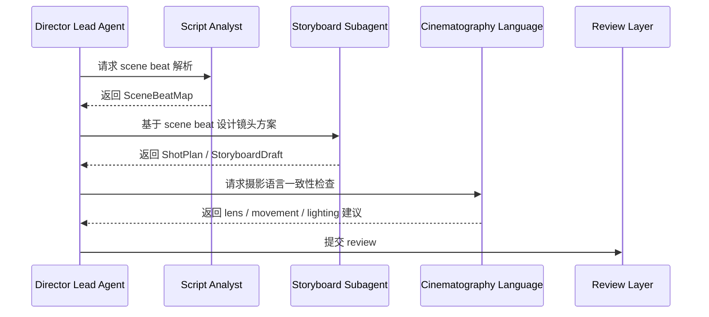
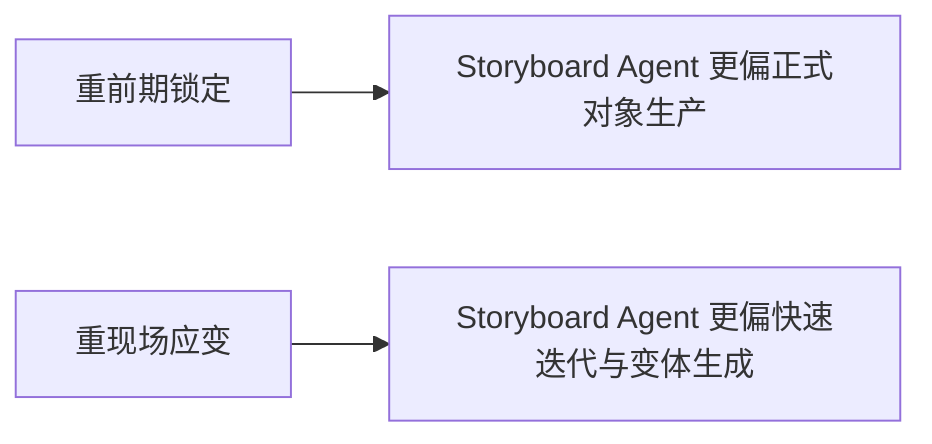
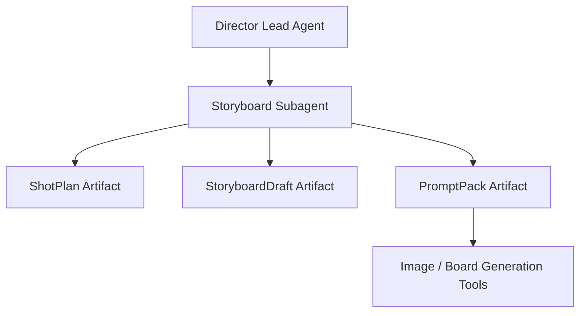

# 55. 分镜子智能体设计

## 这篇文档回答什么问题

从剧本到可拍摄方案，中间最关键的一座桥就是分镜和镜头规划。

分镜子智能体不只是“画图 agent”，它更像一个把戏剧语义翻译成视觉执行语言的中间层。

本篇重点回答：

1. 分镜子智能体的职责边界是什么。
2. 它如何和剧本分析、摄影语言、导演主智能体协作。
3. 在 Hermes Agent 里，如何把它做成 `Scene -> ShotPlan -> StoryboardDraft -> PromptPack` 的稳定生产器。

---

## 一、为什么分镜角色必须独立存在

一场戏写得清楚，不代表镜头一定拍得出来。

真正进入拍摄可执行层之前，必须先回答这些问题：

- 这场戏的视觉重心是什么
- 信息通过哪些镜头被交付
- coverage 如何保证剪辑空间
- 哪些镜头是必须保留的导演表达

---

## 二、现实中的分镜工作，如何映射到平台

现实里，分镜工作可能由导演、分镜师、摄影指导、visual development artist 共同完成。

在平台里，分镜子智能体应把这项工作标准化成：

- 场景级视觉拆解
- 镜头级意图设计
- coverage 完整性检查
- 为静态图生成和技术预演准备结构化描述

---

## 三、职责边界

### 它应负责

- 将 `SceneBeatMap` 转成 `ShotPlan`
- 标注每个镜头的 narrative purpose
- 定义 coverage 和信息交付顺序
- 生成可供 storyboard / prompt 使用的结构化描述

### 它不应负责

- 最终决定摄影器材和灯光方案
- 代替导演做最终风格裁决
- 代替现场 AD 做执行调度

---

## 四、核心输入与输出对象

### 输入

- `ScriptVersion`
- `SceneBeatMap`
- `CreativeIntentPack`
- `UnifiedStylePackage`
- 角色、场地、动作和情绪相关对象

### 输出

- `ShotPlan`
- `CoveragePlan`
- `StoryboardDraft`
- `VisualBeatSheet`
- `PromptPack`

---

## 五、镜头规划的内部工作流

这里最重要的不是镜头数量，而是每个镜头为什么存在。

---

## 六、与其他角色的协作关系

分镜角色不是孤立画图，而是夹在“剧本语义”和“摄影执行”之间的桥。

---

## 七、国内外差异对角色设计的影响

### 在更工业化的体系里

- storyboard、previs、shot list 更早形成正式链条
- coverage 和 second unit 规划更强调提前锁定
- 分镜对象更容易成为正式协作基准

### 在更灵活的体系里

- 导演现场临时变化更多
- 前期分镜可能更粗
- 需要更强的“快速重排”能力

---

## 八、在 Hermes Agent 中的映射建议

这个角色最适合和 `PromptPack`、图像生成工具、静态分镜文件流紧密绑定。

### 工程建议

- 给该子智能体默认读取场景、角色、风格与地点对象
- 输出固定镜头 schema
- 把 `ShotPlan` 与 `StoryboardDraft` 分开建模
- 允许其生成多个 coverage 方案供导演比较

---

## 九、MVP 设计建议

第一版优先确保以下三种能力：

1. 从 `SceneBeatMap` 生成 `ShotPlan`
2. 从 `ShotPlan` 生成 `StoryboardDraft`
3. 从 `StoryboardDraft` 生成 `PromptPack`

---

## 十、结论

分镜子智能体不是附属美术工具，而是：

- 戏剧语义到视觉执行的翻译层
- 拍摄准备阶段最关键的镜头规划器
- 图像生成、静态分镜、镜头表和摄影语言之间的桥梁

如果这层做得稳定，平台就能真正把“理解剧本”推进到“可拍摄设计”。

---

## 相关文档

- [33-text-storyboard-and-shot-list.md](./33-text-storyboard-and-shot-list.md)
- [34-static-storyboards-and-moodboards.md](./34-static-storyboards-and-moodboards.md)
- [54-script-analyst-subagent-design.md](./54-script-analyst-subagent-design.md)
- [60-cinematography-language-subagent-design.md](./60-cinematography-language-subagent-design.md)
- [65-shotplan-storyboard-promptpack-object-system.md](./65-shotplan-storyboard-promptpack-object-system.md)
