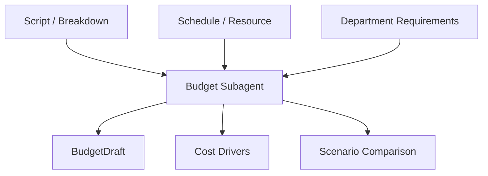
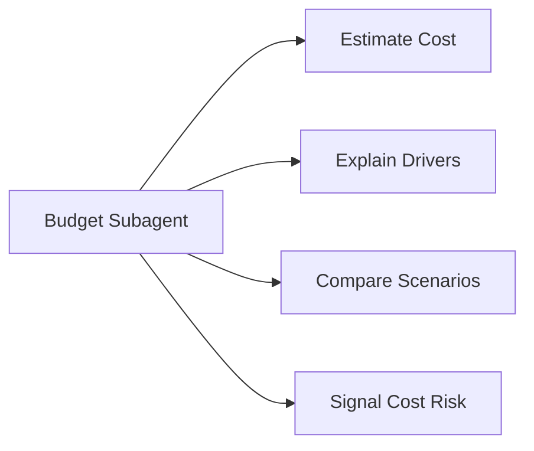
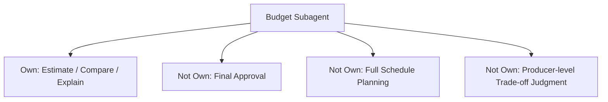
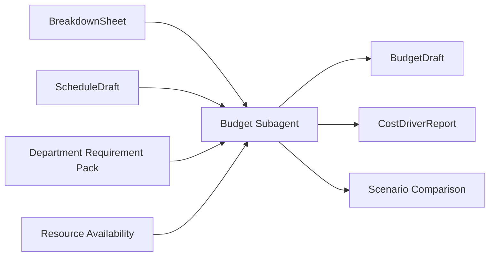
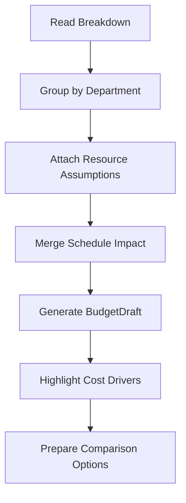
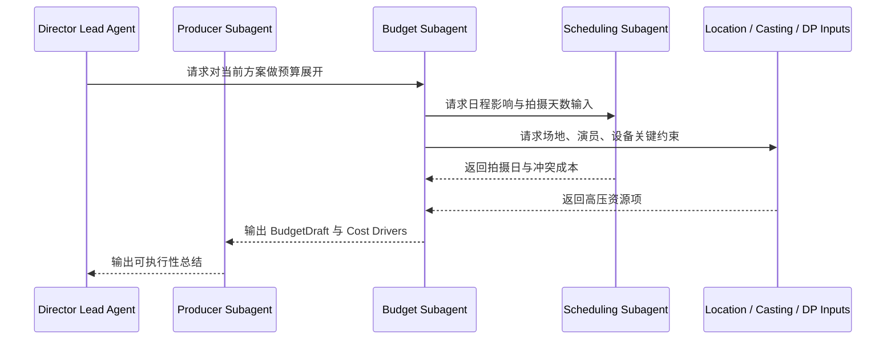
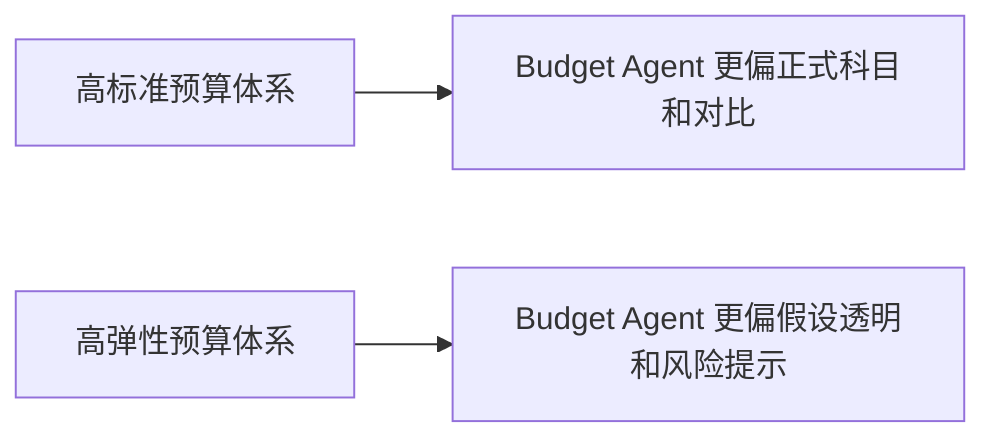
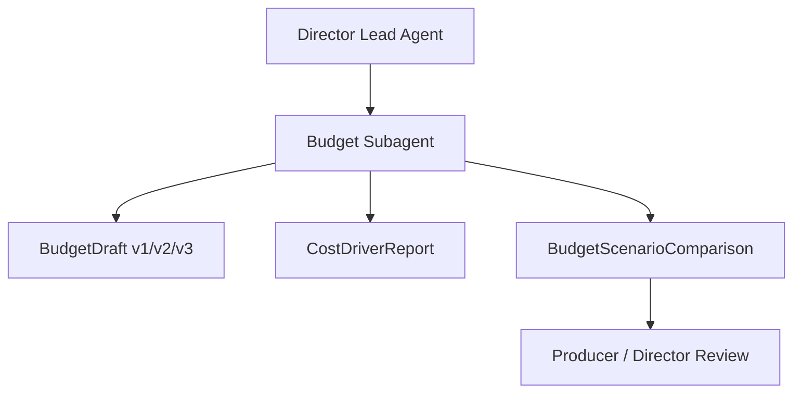
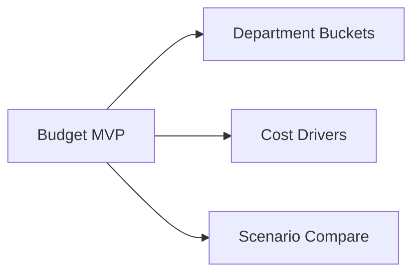

# 56. 预算子智能体设计

## 这篇文档回答什么问题

预算不是一个财务表，而是影片规模、风险和实现路径的量化表达。

预算子智能体如果只是根据关键词估数，就无法服务正式制片；但如果把它做成围绕 breakdown、资源、排期和部门需求的结构化角色，它就会成为导演平台的关键现实接口。

本篇重点回答：

1. 预算子智能体需要围绕哪些对象工作。
2. 它和制片、排期、勘景、摄影等角色如何协同。
3. Hermes Agent 应如何把它实现成可追溯、可比较、可 review 的成本系统入口。

---

## 一、为什么预算不能只是一个附属表格

电影预算的真正意义不是“算钱”，而是回答：

- 这个方案到底属于什么制作规模
- 哪些部门是高压项
- 哪些创作选择会显著拉高成本
- 如果要缩 scope，应该从哪里动

---

## 二、预算子智能体在平台中的定位

预算子智能体不该独立拥有最终审批权，它更像一个：

- 成本结构解释器
- 方案比较器
- 风险前哨

它输出的不是一句“太贵了”，而是：

- 为什么贵
- 贵在哪里
- 有没有替代路径

---

## 三、职责边界

### 它应负责

- 基于 breakdown 形成预算结构
- 识别部门成本驱动项
- 进行版本间预算对比
- 输出预算假设和置信度

### 它不应负责

- 最终决定是否批准预算
- 替排期子智能体安排拍摄日
- 替制片子智能体处理所有风险裁决

---

## 四、核心输入与输出对象

### 输入

- `BreakdownSheet`
- `ScriptVersion`
- `ScheduleDraft`
- `ResourceAvailability`
- `DepartmentRequirementPack`

### 输出

- `BudgetDraft`
- `CostDriverReport`
- `BudgetScenarioComparison`
- `BudgetAssumptionSet`
- `BudgetVarianceAlert`

---

## 五、预算生成的典型流程

预算子智能体应该始终显式写出假设，不然所有数字都会失去可信度。

---

## 六、与其他角色的协作关系

---

## 七、国内外差异对角色设计的影响

### 更成熟工业流程中的预算体系

- 科目更标准化
- union、保险、税务、残值和交付环节更刚性
- 不同版本预算对比要求更强

### 更灵活的预算体系

- 人情协调和临时调配比例更高
- 科目精度不一定一开始就标准
- 风险常常隐含在口头经验里

---

## 八、在 Hermes Agent 中的映射建议

预算子智能体最适合做成围绕对象和版本工作的专门角色。

### 工程建议

- `delegate_task` 传入 breakdown、阶段目标和约束
- 每次预算输出都写明 assumptions
- artifacts 层保留版本比较
- 预算子智能体默认不能直接写 `approved_budget`

---

## 九、MVP 设计建议

第一版先不追求电影工业级全科目精度，优先做好：

1. 部门级成本拆分
2. 成本驱动项解释
3. 方案 A / B 对比

---

## 十、结论

预算子智能体的真正价值，不是替财务记账，而是让创作选择具备成本可见性。

它在导演平台中应被理解成：

- 成本结构层
- 方案比较层
- 风险提示层

只有预算对象和版本链稳定下来，导演主智能体和制片子智能体才能真正做出有现实基础的决策。

---

## 相关文档

- [27-budgeting-and-line-producer-view.md](./27-budgeting-and-line-producer-view.md)
- [53-producer-subagent-design.md](./53-producer-subagent-design.md)
- [57-scheduling-subagent-design.md](./57-scheduling-subagent-design.md)
- [64-budget-schedule-resource-object-system.md](./64-budget-schedule-resource-object-system.md)
- [73-subagent-registry-cinema-extension.md](./73-subagent-registry-cinema-extension.md)
