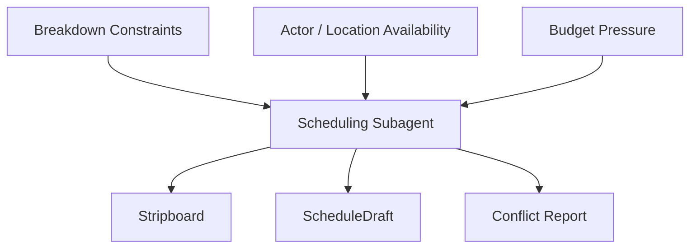
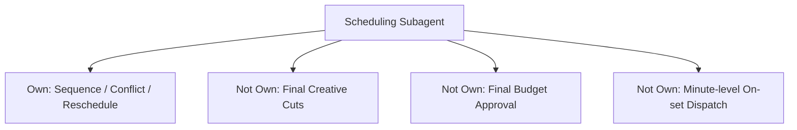
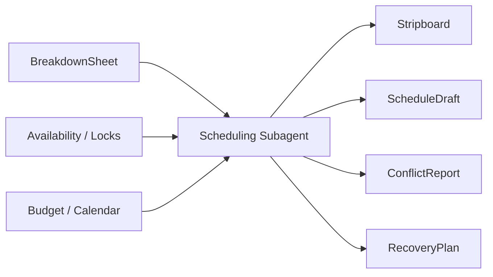
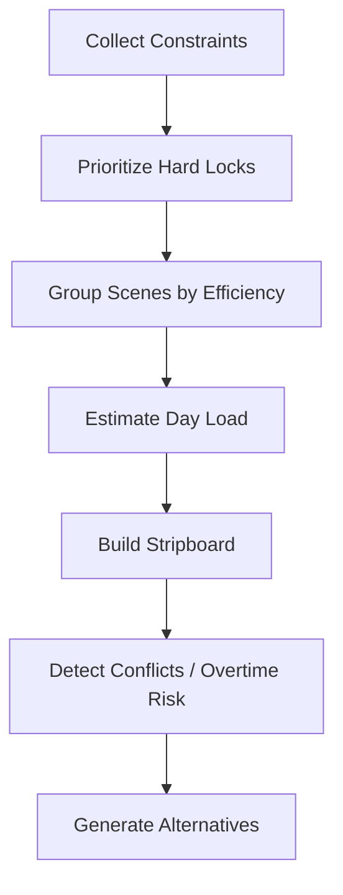
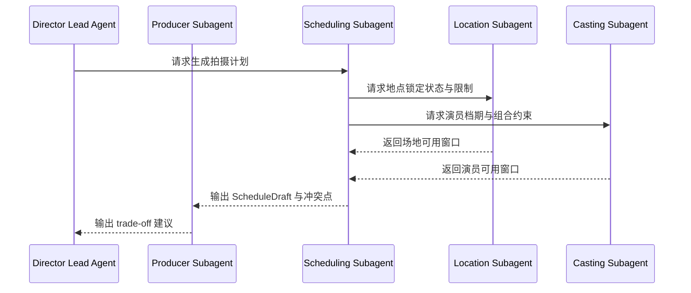
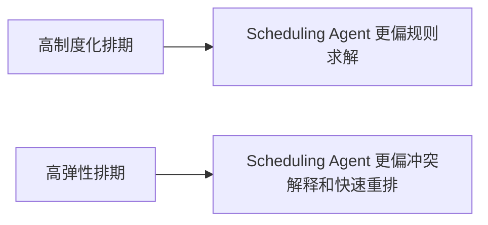
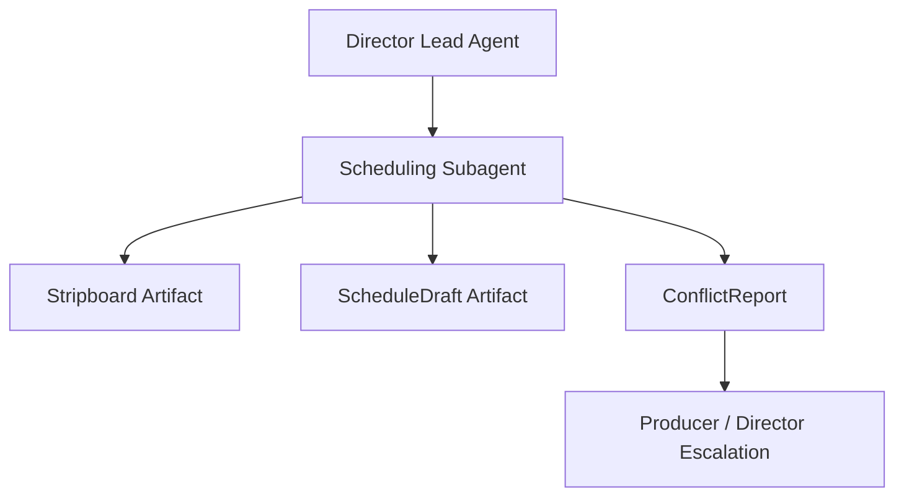
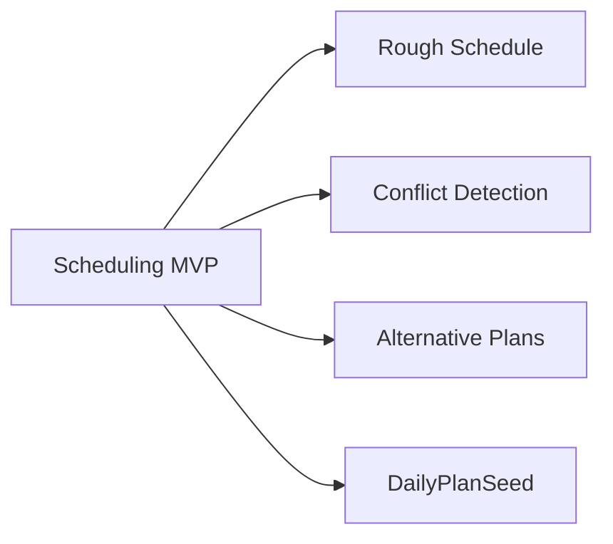

# 57. 排期子智能体设计

## 这篇文档回答什么问题

排期是电影制作里最典型的“看起来像行政工作，实际上决定全局可执行性”的环节。

排期子智能体不是简单排日历，而是把演员、场地、日夜戏、设备、天气、场景复杂度和预算压力收敛成可执行顺序的角色。

本篇重点回答：

1. 排期子智能体要围绕哪些约束工作。
2. 它和导演主智能体、制片、预算、勘景如何协同。
3. Hermes Agent 如何把它实现成从 `Breakdown -> Stripboard -> ScheduleDraft -> DailyPlan` 的关键角色。

---

## 一、为什么排期必须独立出来

很多项目的问题并不是创意不好，而是顺序安排不对。

一旦排期不稳定，就会连锁影响：

- 场地使用成本
- 演员档期可行性
- 夜戏 / 特效 / 群演组织难度
- 每日工作强度与 overtime 风险

---

## 二、现实中的 1st AD / 排期逻辑，如何映射到平台

现实中的 1st AD 或 scheduling 团队，不只是“排表”，而是在解决：

- 用最少天数完成最多有效拍摄
- 控制跨部门切换成本
- 把不可动约束尽量提前锁定

在平台里，排期子智能体应承担：

- 拍摄顺序设计
- 约束冲突识别
- 方案重排
- 与 call sheet / daily plan 的前向衔接

---

## 三、职责边界

### 它应负责

- 根据 breakdown 与约束生成拍摄顺序
- 输出冲突和高风险日
- 为 call sheet 生成提供上游日程骨架

### 它不应负责

- 最终决定创作删改
- 单独批准预算变化
- 代替现场调度系统处理当日分钟级 dispatch

---

## 四、核心输入与输出对象

### 输入

- `BreakdownSheet`
- `ResourceAvailability`
- `ActorAvailability`
- `LocationLockStatus`
- `BudgetDraft`
- `ProductionCalendar`

### 输出

- `Stripboard`
- `ScheduleDraft`
- `ConflictReport`
- `RecoveryPlan`
- `DailyPlanSeed`

---

## 五、排期的内部求解逻辑

这里最关键的是把“硬约束”和“软偏好”区分开。

---

## 六、典型协作时序

---

## 七、国内外差异对角色设计的影响

### 制度化更强的排期体系

- union hour、meal penalty、turnaround 等限制更明显
- stripboard 和 day-out-of-days 更标准化
- 日拍效率与工时风险更容易被正式计算

### 更灵活的排期体系

- 临时借景、临时改场次更常见
- 很多约束不在系统里，而在经验里
- 需要更强的冲突解释和重排能力

---

## 八、在 Hermes Agent 中的映射建议

排期子智能体应与 `MovieThreadState` 的阶段状态、风险状态和日程对象直接联动。

### 工程建议

- `delegate_task` 传入 hard constraints 与 optimization preference
- state 层保留当前有效 `ScheduleDraft`
- 让排期角色输出多个候选版本，而不是单一答案
- 对高风险拍摄日输出 `RecoveryPlan`

---

## 九、MVP 设计建议

第一版优先做四件事：

1. 基于 breakdown 生成粗排
2. 显式标注 hard conflicts
3. 生成 1 到 2 个替代方案
4. 为 `DailyPlanSeed` 提供上游输入

---

## 十、结论

排期子智能体是导演平台里最重要的执行求解器之一。

它把剧本、资源、场地、演员和时间统一到同一张运行图里，让系统真正具备“把计划落到日历上”的能力。

没有这层，导演主智能体只能知道想拍什么，却无法知道什么时候、按什么顺序、以什么代价去拍。

---

## 相关文档

- [28-scheduling-and-first-ad-view.md](./28-scheduling-and-first-ad-view.md)
- [53-producer-subagent-design.md](./53-producer-subagent-design.md)
- [56-budget-subagent-design.md](./56-budget-subagent-design.md)
- [64-budget-schedule-resource-object-system.md](./64-budget-schedule-resource-object-system.md)
- [73-subagent-registry-cinema-extension.md](./73-subagent-registry-cinema-extension.md)
