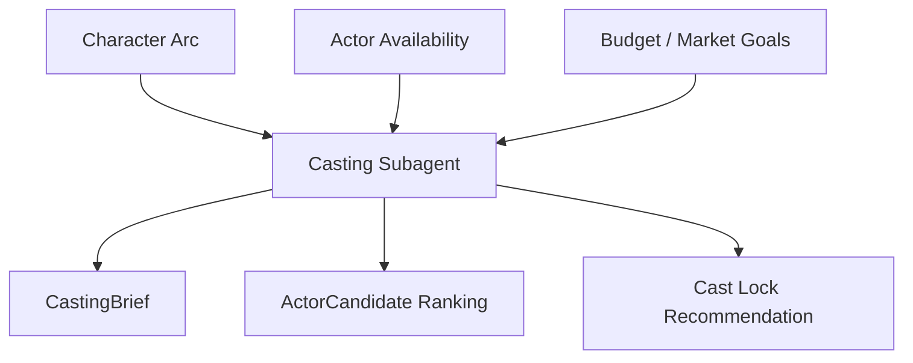
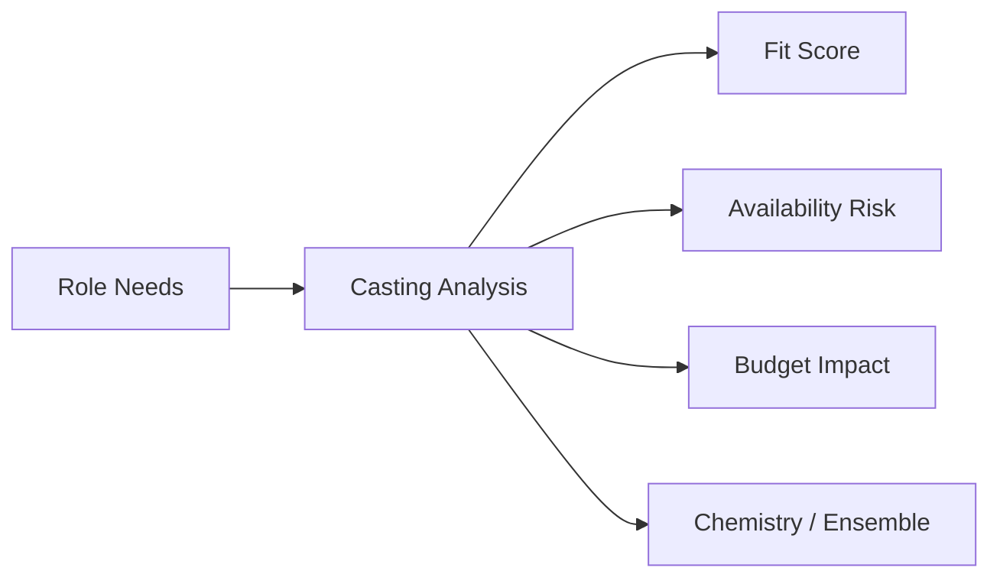
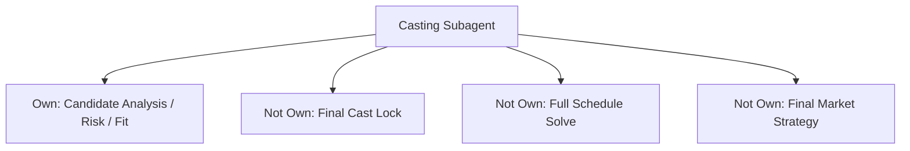
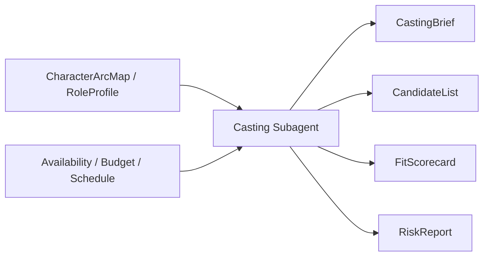
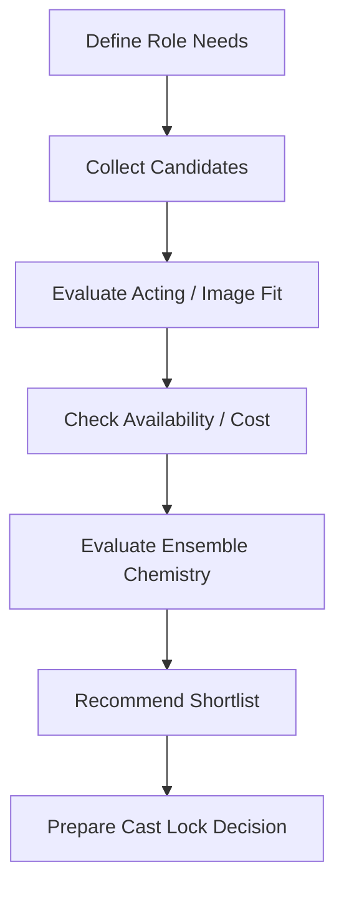
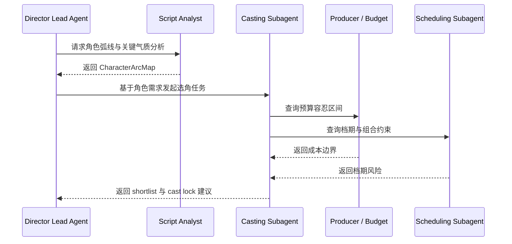
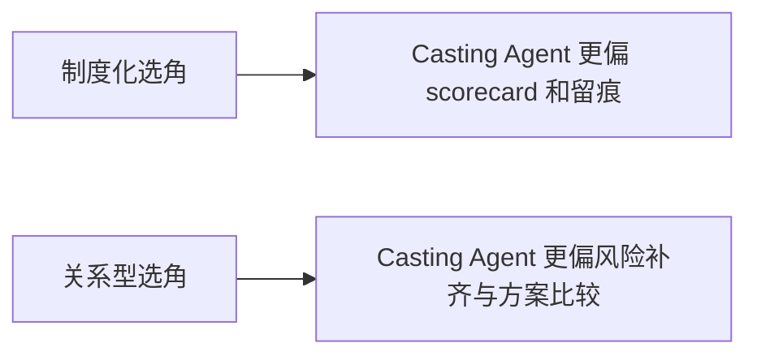
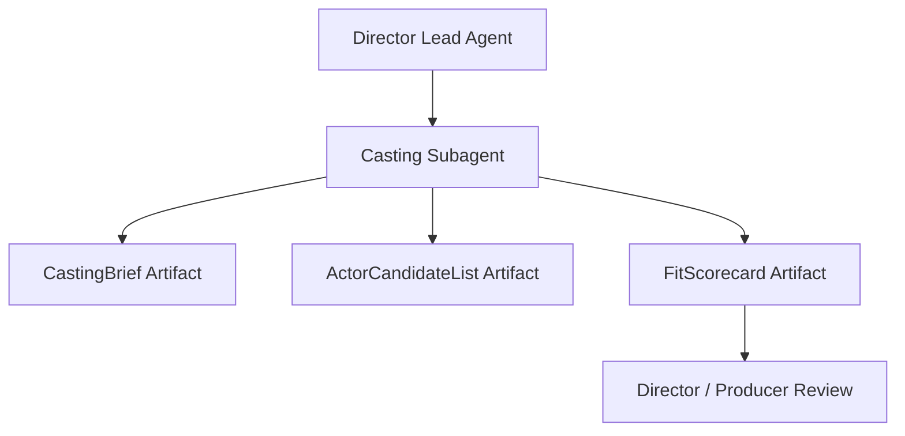
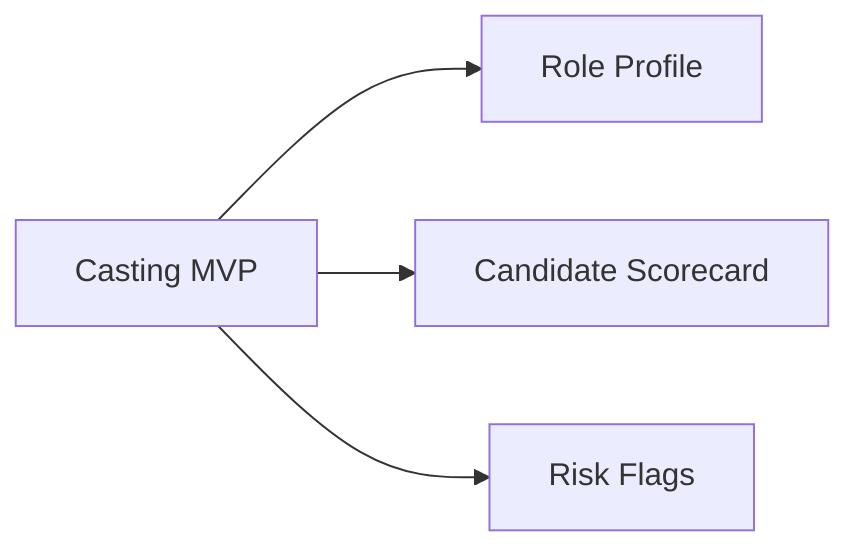

# 58. 选角子智能体设计

## 这篇文档回答什么问题

选角不是“给角色找一个像的人”，而是在角色成立、表演可能性、明星价值、档期、预算和组合 chemistry 之间持续取平衡。

本篇重点回答：

1. 选角子智能体需要同时看哪些维度。
2. 它与导演主智能体、剧本分析、排期、预算如何协同。
3. Hermes Agent 应如何把它实现成围绕 `RoleProfile / CastingBrief / ActorCandidate / CastLock` 工作的正式角色。

---

## 一、为什么选角必须单独建模

选角的复杂度远高于“匹配简历”。

它同时涉及：

- 角色弧线理解
- 表演能力判断
- 角色与角色之间的组合关系
- 演员档期和地域限制
- 预算与市场预期

---

## 二、现实中的选角逻辑，如何映射到平台

现实里，选角导演、导演、制片、演员经纪与资方往往共同影响结果。

平台里的选角子智能体应把这些影响拆成可追踪维度：

- 角色匹配度
- 表演风险
- 档期风险
- 成本影响
- 组合协同性

---

## 三、职责边界

### 它应负责

- 生成 `CastingBrief`
- 整理和比较候选人
- 提示档期和预算风险
- 分析角色组合的协同性

### 它不应负责

- 最终拍板 cast lock
- 代替导演做表演审美裁决
- 代替排期角色求解整体 schedule

---

## 四、核心输入与输出对象

### 输入

- `CharacterArcMap`
- `RoleProfile`
- `CreativeIntentPack`
- `ActorAvailability`
- `BudgetDraft`
- `ScheduleDraft`

### 输出

- `CastingBrief`
- `ActorCandidateList`
- `FitScorecard`
- `CastingRiskReport`
- `CastLockRecommendation`

---

## 五、选角的工作流建议

一个成熟的选角子智能体，不是只给一个名单，而是给一个可解释 shortlist。

---

## 六、典型协作时序

---

## 七、国内外差异对角色设计的影响

### 更成熟工业流程里的选角

- 试镜和测试流程更标准
- 代理、合同、union 等影响更直接
- 选角记录和决策链更正式

### 更灵活的选角环境

- 熟人合作和市场偏好影响更大
- 非正式沟通量更高
- 档期和预算经常在最后阶段波动

---

## 八、在 Hermes Agent 中的映射建议

选角子智能体应围绕角色对象和候选对象展开，而不是直接输出一段建议文字。

### 工程建议

- 给选角子智能体默认读取角色弧线、预算边界与档期信息
- 输出结构化评分与风险标签
- `CastLock` 由导演主智能体或正式 approval 层完成
- 保留 shortlist 版本链，方便回溯

---

## 九、MVP 设计建议

第一版优先确保：

1. 角色需求结构化
2. 候选人多维评分
3. 档期 / 预算风险提示

---

## 十、结论

选角子智能体的真正价值，在于让“谁来演”这件事从印象判断升级成可解释、可比较、可回溯的协作对象链。

它既服务导演的创作判断，也服务制片和排期的现实约束，是电影角色系统里非常典型的跨创作与生产边界角色。

---

## 相关文档

- [29-casting-and-actor-management.md](./29-casting-and-actor-management.md)
- [53-producer-subagent-design.md](./53-producer-subagent-design.md)
- [57-scheduling-subagent-design.md](./57-scheduling-subagent-design.md)
- [64-budget-schedule-resource-object-system.md](./64-budget-schedule-resource-object-system.md)
- [73-subagent-registry-cinema-extension.md](./73-subagent-registry-cinema-extension.md)
