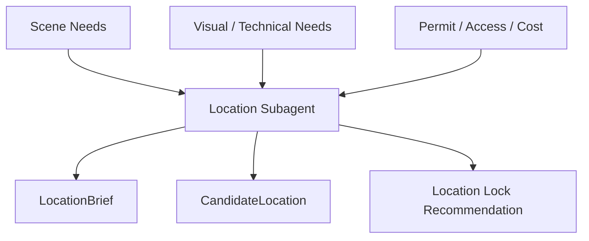
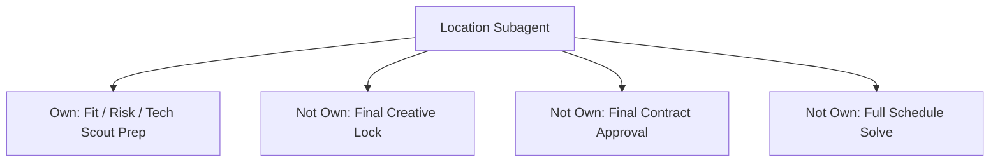
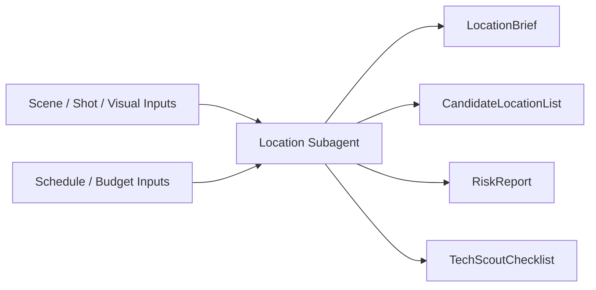
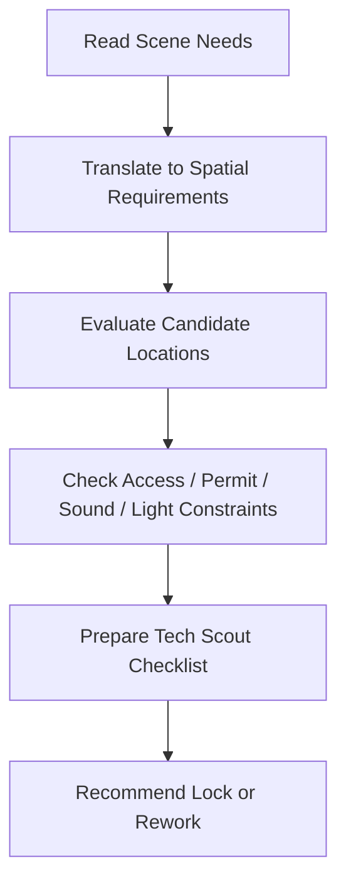
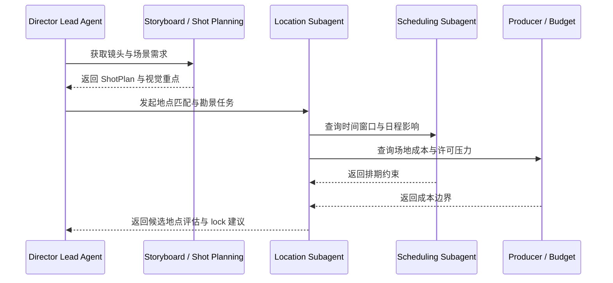
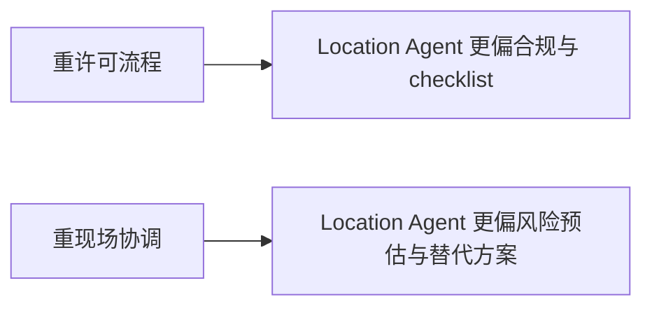
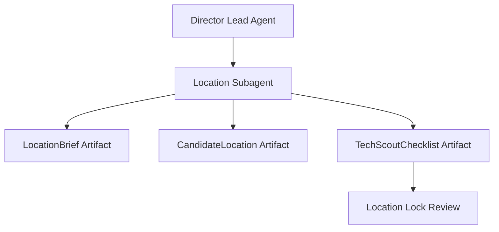
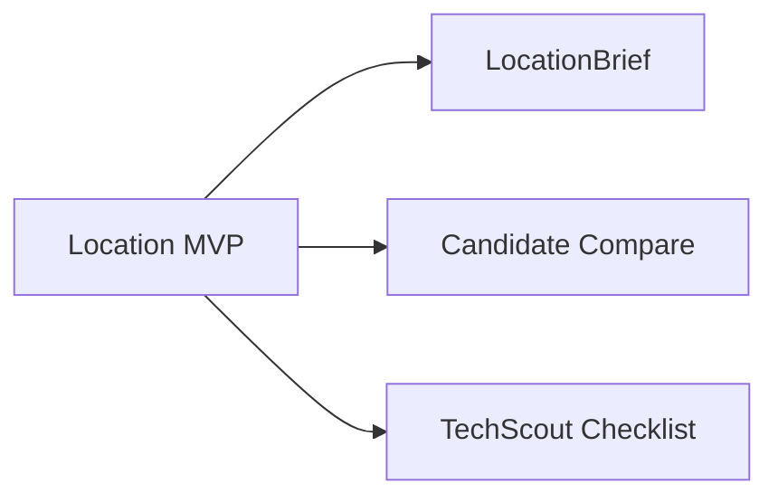

# 59. 勘景子智能体设计

## 这篇文档回答什么问题

勘景不是找一个“看起来差不多”的地方，而是把剧本空间、摄影要求、制作条件、许可限制和拍摄效率统一到真实世界中的过程。

本篇重点回答：

1. 勘景子智能体需要围绕哪些信息做判断。
2. 它与导演主智能体、排期、预算、摄影语言如何协同。
3. Hermes Agent 应如何把它实现成围绕 `LocationBrief / CandidateLocation / TechScout / LocationLock` 工作的正式角色。

---

## 一、为什么勘景必须独立建模

很多看起来只是“找场地”的工作，实际上会决定：

- 场景是否能按剧本成立
- 镜头运动和灯光是否可执行
- 通行、噪音、时间窗口是否可控
- 成本和拍摄效率是否失衡

---

## 二、现实中的勘景逻辑，如何映射到平台

现实里，勘景通常经历：

- 场景需求定义
- 候选地点收集
- 视觉与技术可行性评估
- tech scout
- 正式锁定

平台中的勘景子智能体应让这条链变成正式对象流。

---

## 三、职责边界

### 它应负责

- 把剧本场景需求翻译成现实空间需求
- 比较候选场地的视觉与执行适配度
- 输出勘景风险和 tech scout 要点

### 它不应负责

- 最终决定镜头设计
- 单独批准场地锁定
- 代替排期系统编排整体日程

---

## 四、核心输入与输出对象

### 输入

- `SceneBeatMap`
- `ShotPlan`
- `VisualLanguageGuide`
- `ScheduleDraft`
- `BudgetDraft`

### 输出

- `LocationBrief`
- `CandidateLocationList`
- `LocationRiskReport`
- `TechScoutChecklist`
- `LocationLockRecommendation`

---

## 五、勘景的内部工作流

勘景子智能体最关键的能力，是把“好看”翻译成“可拍且可控”。

---

## 六、典型协作时序

---

## 七、国内外差异对角色设计的影响

### 更成熟工业流程中的地点管理

- permit、insurance、union、traffic control 要求更明确
- tech scout 更正式
- 场地锁定的文档链更重

### 更灵活的场地使用环境

- 临时协商和本地关系更常见
- 文档与留痕可能不完整
- 现场临时变量更大

---

## 八、在 Hermes Agent 中的映射建议

勘景子智能体应当与 `LocationPackage`、`TechScout` 和 `ScheduleDraft` 强绑定。

### 工程建议

- 默认读取 scene、shot、style、schedule、budget 相关对象
- 输出场地比较表而不是只给单点建议
- `LocationLock` 必须经正式 review
- 对每个候选地点生成替代方案和主要风险

---

## 九、MVP 设计建议

第一版优先做三件事：

1. 从场景需求生成 `LocationBrief`
2. 对候选地点做结构化比较
3. 输出 `TechScoutChecklist`

---

## 十、结论

勘景子智能体的价值，不是替团队“搜图找地方”，而是让真实空间进入导演平台的正式对象系统。

它让场地从一个模糊背景，变成：

- 可比较
- 可评估
- 可锁定
- 可回溯

只有把勘景做成正式角色，后面的排期、摄影、现场执行才不会建立在错误空间假设上。

---

## 相关文档

- [30-location-scouting-and-lock.md](./30-location-scouting-and-lock.md)
- [57-scheduling-subagent-design.md](./57-scheduling-subagent-design.md)
- [60-cinematography-language-subagent-design.md](./60-cinematography-language-subagent-design.md)
- [64-budget-schedule-resource-object-system.md](./64-budget-schedule-resource-object-system.md)
- [73-subagent-registry-cinema-extension.md](./73-subagent-registry-cinema-extension.md)
