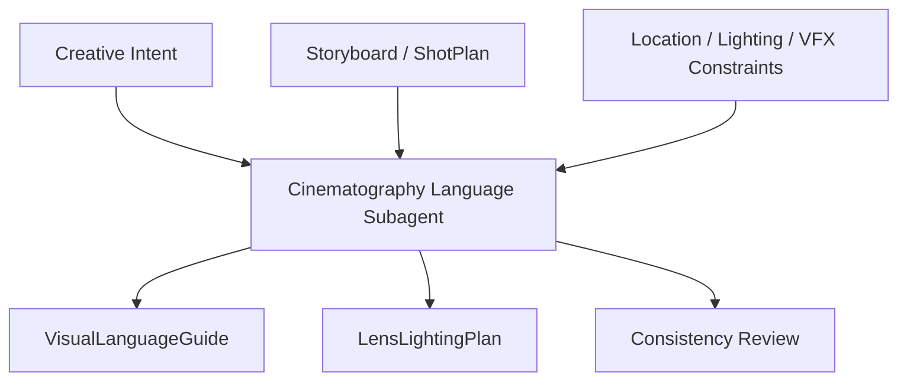
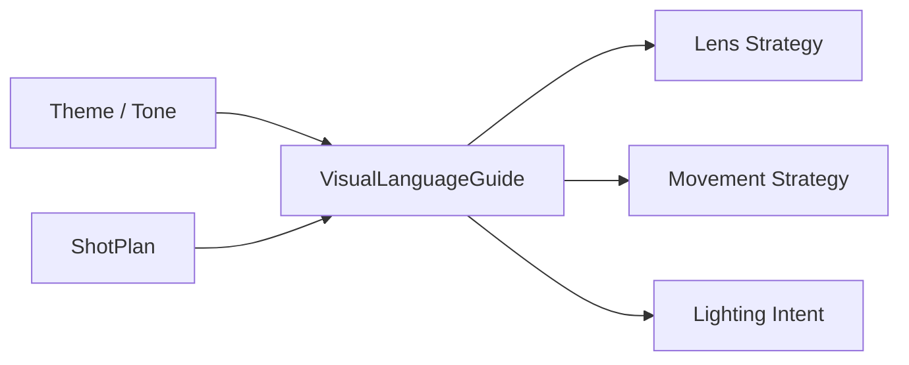
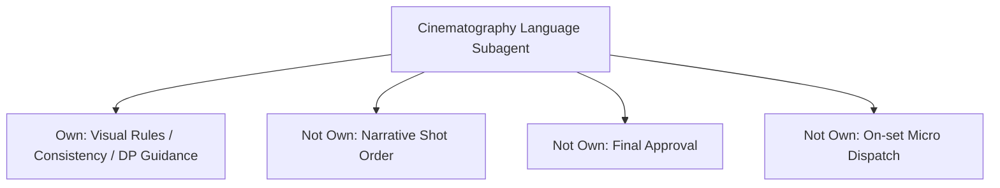
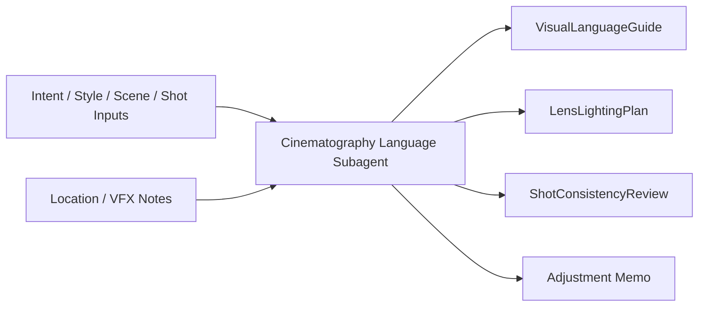
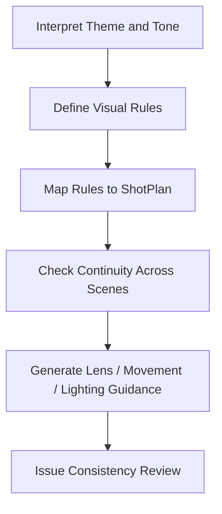
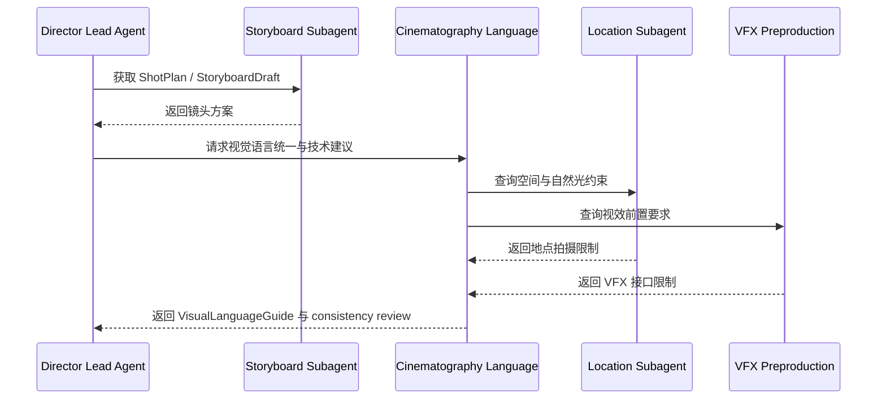
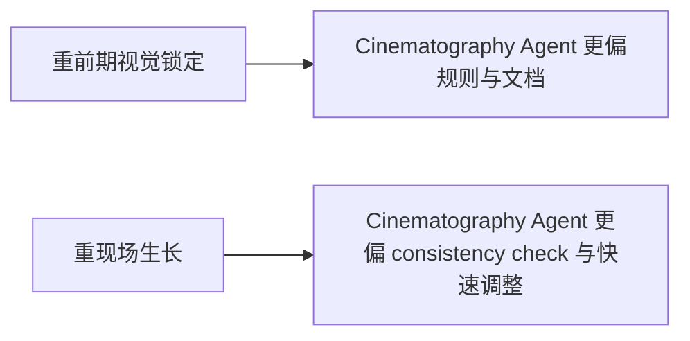
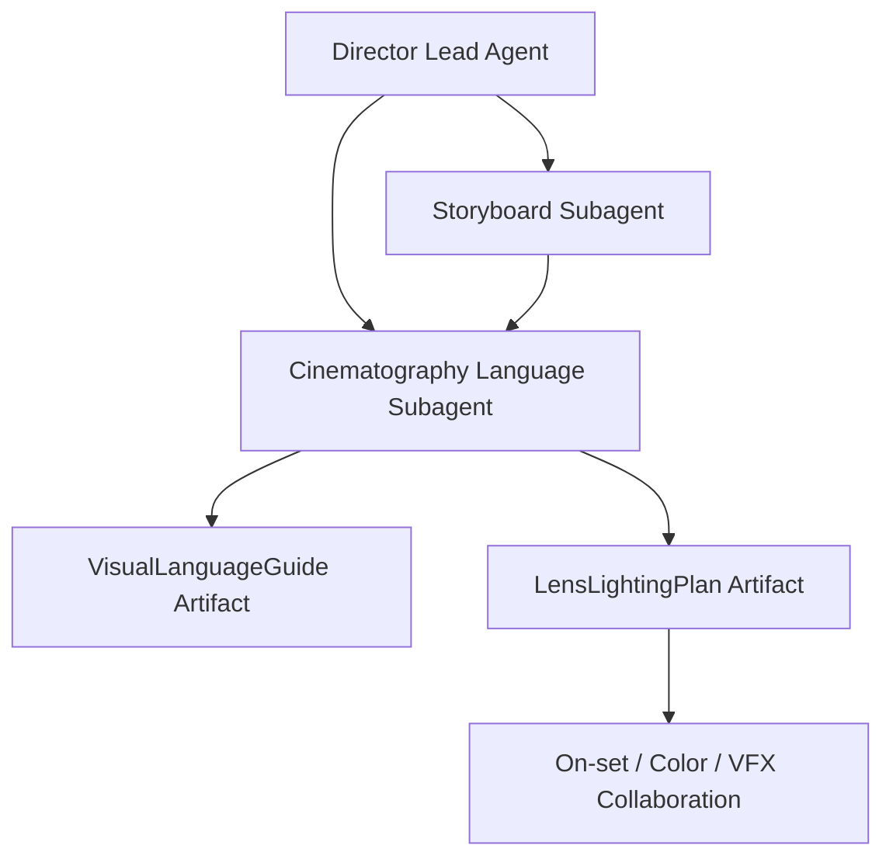
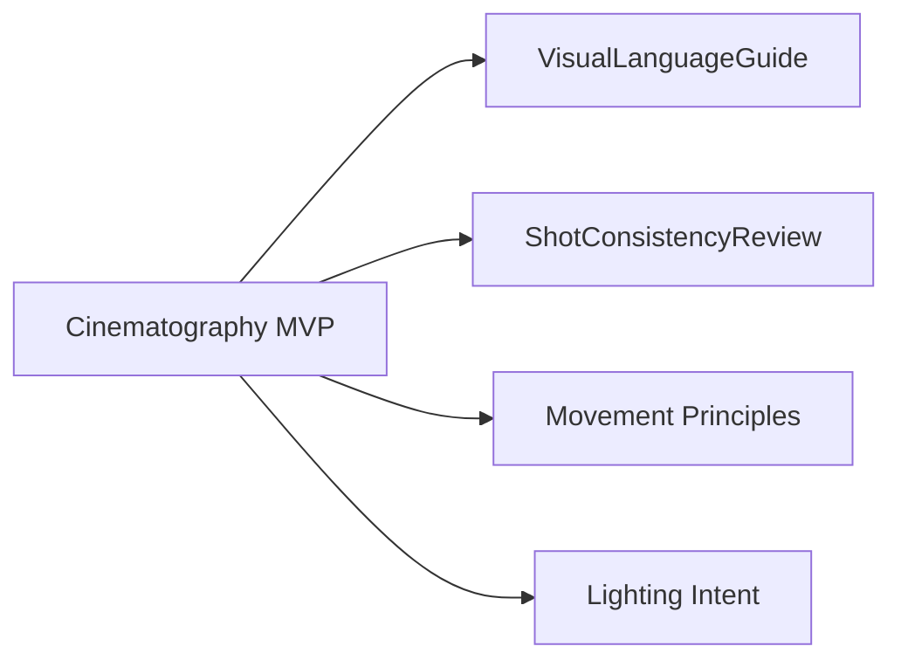

# 60. 摄影语言子智能体设计

## 这篇文档回答什么问题

摄影语言不是“选一个好看的镜头风格”，而是把主题、情绪、空间、表演和镜头技术统一到一套可持续执行的视觉规则里。

本篇重点回答：

1. 摄影语言子智能体在导演平台里应承担什么职责。
2. 它和分镜、导演主智能体、灯光、VFX 前期如何协同。
3. Hermes Agent 应如何把它实现成围绕 `VisualLanguageGuide / LensLightingPlan / ShotConsistencyReview` 工作的正式角色。

---

## 一、为什么摄影语言必须单独建模

如果没有一个稳定的摄影语言层，项目最容易出现的问题是：

- 镜头方案彼此风格断裂
- 不同场景的视觉逻辑不统一
- 分镜、现场执行、后期调色之间缺乏共同参照

---

## 二、现实中的摄影指导工作，如何映射到平台

现实里的摄影指导不仅决定镜头技术，还会持续参与：

- 影像基调建立
- 镜头运动策略
- 焦段和构图哲学
- 与灯光、美术、VFX 的协作

在平台里，摄影语言子智能体应承担：

- 建立视觉规则集
- 校验镜头方案是否一致
- 为前期和现场提供摄影语言说明

---

## 三、职责边界

### 它应负责

- 从创作意图推导视觉规则
- 对 `ShotPlan` 做风格一致性检查
- 输出镜头、焦段、运动、光线层面的建议

### 它不应负责

- 代替分镜角色决定叙事顺序
- 代替现场摄影团队做全部物理执行细节
- 最终批准视觉风格锁定

---

## 四、核心输入与输出对象

### 输入

- `CreativeIntentPack`
- `UnifiedStylePackage`
- `SceneBeatMap`
- `ShotPlan`
- `LocationPackage`
- `VFXPreproductionNotes`

### 输出

- `VisualLanguageGuide`
- `LensLightingPlan`
- `ShotConsistencyReview`
- `CameraMovementPrinciples`
- `SceneVisualAdjustmentMemo`

---

## 五、摄影语言的内部工作流

一个成熟的摄影语言子智能体，不只是给美学词汇，而是输出可以执行和 review 的规则。

---

## 六、与其他角色的协作关系

---

## 七、国内外差异对角色设计的影响

### 更成熟的摄影流程

- LUT、camera test、techvis、prelight 更系统
- DP 与 color / VFX 的前期联动更强
- 风格锁定往往更早形成文档

### 更灵活的摄影流程

- 很多视觉决定保留到现场
- 经验型摄影语言更强，显式文档更少
- 需要更高的动态修正能力

---

## 八、在 Hermes Agent 中的映射建议

摄影语言子智能体应站在分镜之后、现场之前，成为视觉规则守门层。

### 工程建议

- 该角色默认读取 style、shot、location、vfx preproduction 对象
- 输出统一的 visual rule schema
- 支持对不同场景生成局部修正 memo
- 由导演主智能体决定是否锁定视觉语言版本

---

## 九、MVP 设计建议

第一版优先做四件事：

1. 生成 `VisualLanguageGuide`
2. 给 `ShotPlan` 做一致性检查
3. 输出镜头运动和焦段原则
4. 输出基础灯光意图说明

---

## 十、结论

摄影语言子智能体让平台第一次真正具备“视觉规则层”。

它既不是单纯的分镜延长，也不是现场摄影替身，而是：

- 导演意图到影像规则的翻译层
- 分镜、灯光、VFX、调色之间的共识层
- 保证影片视觉一致性的长期守门层

有了这层，导演平台才不只是会规划镜头，而是能持续维护整部片子的影像语言。

---

## 相关文档

- [32-cinematography-lighting-vfx-preproduction.md](./32-cinematography-lighting-vfx-preproduction.md)
- [55-storyboard-subagent-design.md](./55-storyboard-subagent-design.md)
- [59-location-subagent-design.md](./59-location-subagent-design.md)
- [65-shotplan-storyboard-promptpack-object-system.md](./65-shotplan-storyboard-promptpack-object-system.md)
- [73-subagent-registry-cinema-extension.md](./73-subagent-registry-cinema-extension.md)
