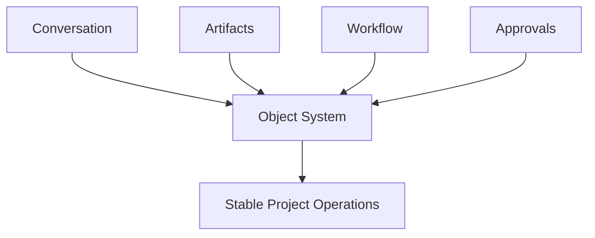
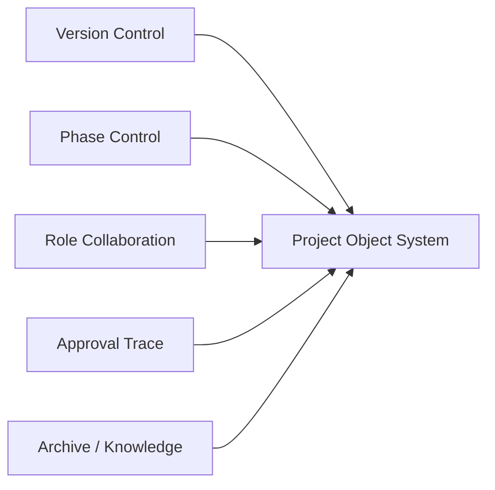
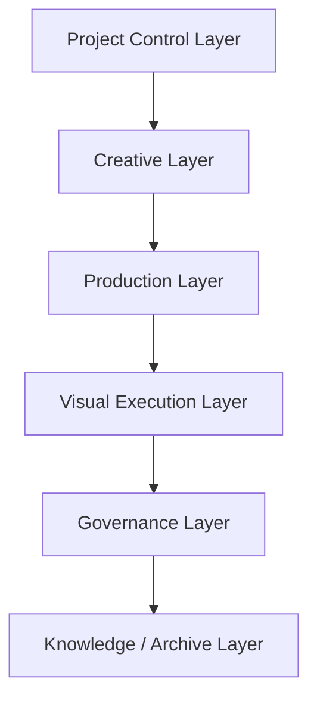
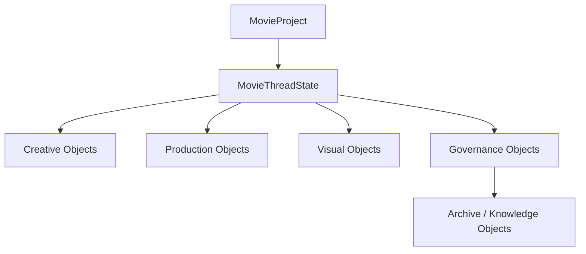
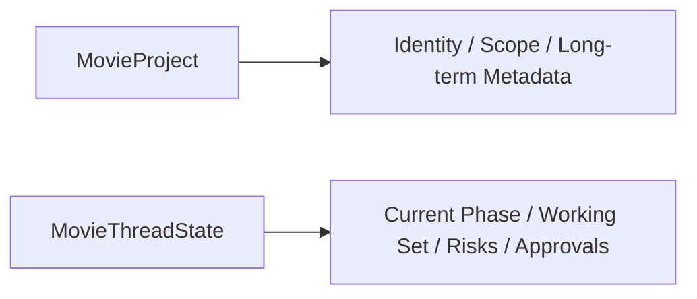
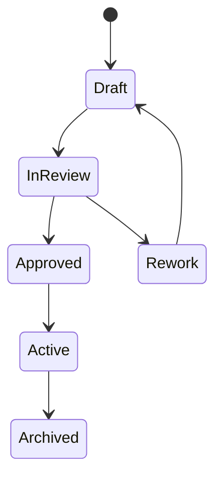
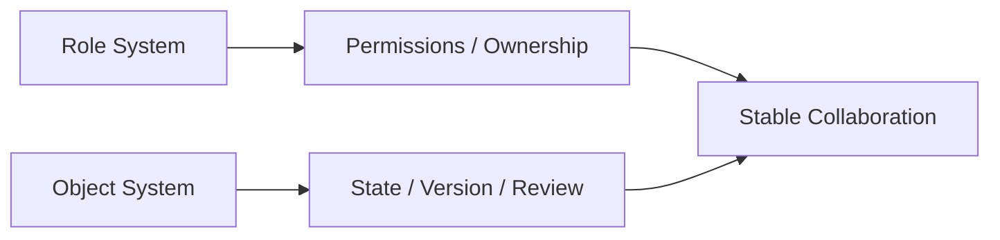
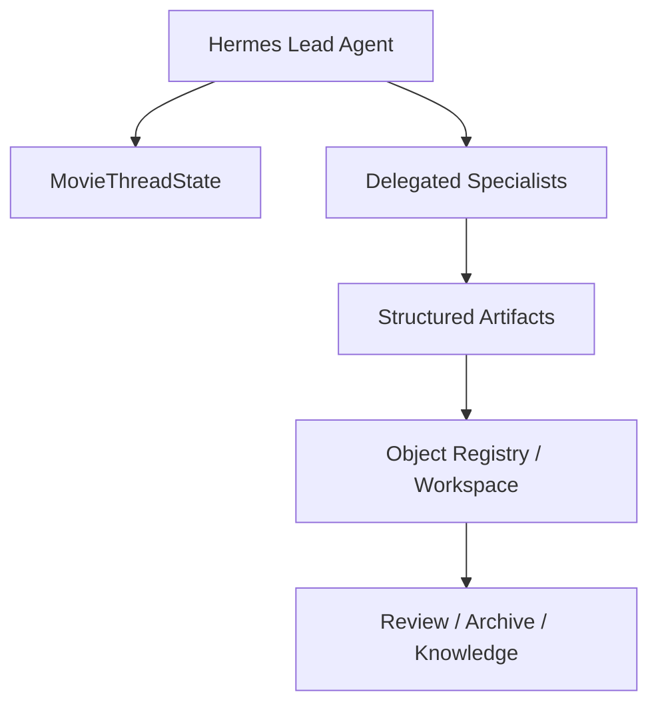
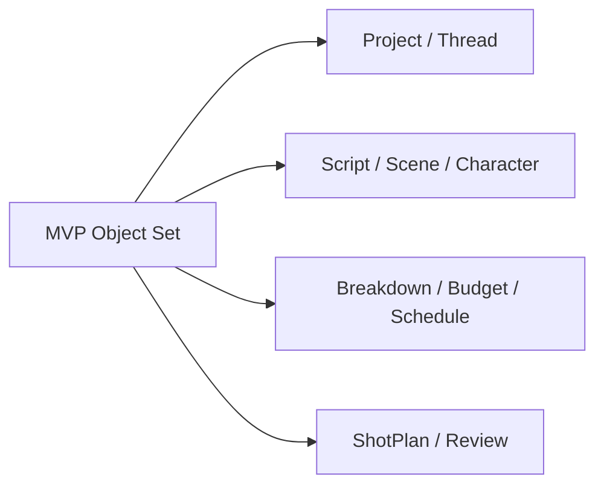

# 61. 项目对象系统总览

## 这篇文档回答什么问题

当导演智能体平台开始同时管理剧本、预算、排期、镜头、审批、归档和知识沉淀时，最容易失控的不是模型能力，而是对象边界。

如果没有统一的项目对象系统，系统很快就会退化成：

- 一堆散落的 Markdown
- 一串串会话历史
- 多个彼此不知道版本关系的文件

本篇重点回答：

1. 电影导演智能体平台为什么必须先建立项目对象系统。
2. 项目对象系统应该如何分层。
3. Hermes Agent 后续扩展时，哪些对象应该成为正式的一等公民。

---

## 一、为什么对象系统是平台的真正底座

电影项目不是一个单次问答，而是一个跨阶段、跨角色、跨版本的长期运行系统。

因此平台真正要解决的，不只是“生成内容”，而是：

- 让每个阶段知道自己正在处理哪个正式对象
- 让每个角色知道自己可以读写哪些对象
- 让每次决策都能挂到明确对象上
- 让 review、approval、archive 都有清晰落点

对象系统不是附属数据层，而是平台治理能力的基础。

---

## 二、对象系统要解决的核心问题

一个成熟的项目对象系统，至少要回答五个问题：

1. 当前正式版本是什么。
2. 当前阶段的控制面在哪里。
3. 子智能体应该围绕什么对象工作。
4. review / approval 到底批准的是谁。
5. 归档和知识沉淀从哪些对象提取。

如果其中任意一项没有对象承载，平台就只能靠上下文猜。

---

## 三、建议的对象分层

建议把电影导演智能体平台的对象系统分成六层。

### 1. 项目控制层

负责承接项目主状态。

核心对象包括：

- `MovieProject`
- `MovieThreadState`
- `PhaseGoal`
- `RiskRegister`
- `WorkingSet`

### 2. 创作层

负责承接故事、人物、风格与创作意图。

核心对象包括：

- `CreativeIntentPack`
- `ScriptVersion`
- `Scene`
- `Character`
- `ThemeNote`
- `UnifiedStylePackage`

### 3. 生产层

负责承接可执行性和资源约束。

核心对象包括：

- `BreakdownSheet`
- `BudgetDraft`
- `ScheduleDraft`
- `ResourcePlan`
- `CastingPlan`
- `LocationPackage`

### 4. 视觉执行层

负责承接镜头、分镜、视觉提示和执行说明。

核心对象包括：

- `ShotPlan`
- `CoveragePlan`
- `StoryboardDraft`
- `PromptPack`
- `VisualLanguageGuide`

### 5. 治理层

负责承接 review、审批、升级和正式决策。

核心对象包括：

- `ReviewRound`
- `ApprovalRequest`
- `DecisionRecord`
- `EscalationRecord`
- `ReleasePackage`

### 6. 知识与归档层

负责承接快照、复盘和跨项目复用。

核心对象包括：

- `ArchiveSnapshot`
- `RetrospectiveReport`
- `LessonLearned`
- `ReusablePlaybook`

---

## 四、对象之间的总关系

这里最关键的是：

- `MovieProject` 表示项目身份
- `MovieThreadState` 表示当前控制面
- 其他对象围绕它们构成工作集

---

## 五、为什么项目控制层必须和业务对象层分开

很多系统一开始会把所有字段都堆进一个 `Project` 对象里，但电影项目很快会变复杂。

如果不分层，就会出现：

- 项目身份字段与运行态字段混在一起
- 当前工作集与历史归档无法区分
- 阶段状态与对象版本状态相互污染

这就是为什么 `MovieProject` 和 `MovieThreadState` 必须拆开。

---

## 六、对象生命周期视角

对象系统不仅要描述“有什么”，还要描述“对象怎么进入系统、被修改、被锁定、被归档”。

这个生命周期模型几乎适用于：

- 剧本版本
- 预算版本
- 排期版本
- 分镜版本
- 发布包版本

---

## 七、对象系统与角色系统如何互相约束

角色系统解决“谁来做”，对象系统解决“围绕什么做”。

例如：

- 剧本分析子智能体围绕 `ScriptVersion`、`Scene`、`Character`
- 预算子智能体围绕 `BreakdownSheet`、`BudgetDraft`
- 排期子智能体围绕 `ScheduleDraft`、`ResourcePlan`

如果角色没有对象边界，delegate 只会变成长文本转发器。

---

## 八、对象系统与 Hermes Agent 的映射建议

在 Hermes 里，对象系统不必一开始就全部数据库化，但一定要先正式定义 schema 和流转关系。

### 工程建议

- `MovieThreadState` 作为线程级控制对象
- 工作区 artifacts 作为对象内容载体
- review / approval 对象作为治理层正式入口
- 后续再逐步增加 registry、schema 校验和索引

---

## 九、MVP 建议的最小对象集

第一版不需要把全部对象一次性做满，但建议至少有以下一组：

1. `MovieProject`
2. `MovieThreadState`
3. `ScriptVersion`
4. `Scene`
5. `Character`
6. `BreakdownSheet`
7. `BudgetDraft`
8. `ScheduleDraft`
9. `ShotPlan`
10. `ReviewRound`

---

## 十、结论

项目对象系统的意义，不是把电影制作硬塞进数据库，而是给导演智能体平台提供稳定的工作骨架。

它本质上是在回答三件事：

- 系统当前在处理什么对象
- 这些对象之间如何形成正式链路
- 哪些对象可以被 review、lock、archive 和复用

只有先有对象系统，后面的线程状态、审批流、版本链和工程实现才有真正的落点。

---

## 相关文档

- [62-movie-thread-state-design.md](./62-movie-thread-state-design.md)
- [63-script-scene-character-object-system.md](./63-script-scene-character-object-system.md)
- [64-budget-schedule-resource-object-system.md](./64-budget-schedule-resource-object-system.md)
- [65-shotplan-storyboard-promptpack-object-system.md](./65-shotplan-storyboard-promptpack-object-system.md)
- [66-review-approval-release-package-object-system.md](./66-review-approval-release-package-object-system.md)
- [70-artifact-version-and-archive-system.md](./70-artifact-version-and-archive-system.md)
