# 62. MovieThreadState 设计

## 这篇文档回答什么问题

如果说 `MovieProject` 是项目身份，那么 `MovieThreadState` 就是导演智能体平台的实时控制面。

它不是普通的 session metadata，也不是简单的 todo 列表，而是把阶段、风险、活跃对象、待审批项、当前工作集和最近决策统一到一个线程级对象里的核心枢纽。

本篇重点回答：

1. 为什么必须单独设计 `MovieThreadState`。
2. 它应该承载哪些字段与子结构。
3. 它如何成为 Hermes 线程态、对象系统和角色系统之间的桥。

---

## 一、为什么不能只用普通会话历史代替 Thread State

会话历史能保存对话，但不能稳定回答这些问题：

- 当前项目阶段是什么
- 当前哪个剧本版本是活跃版本
- 当前有哪些高风险问题没有解决
- 哪些对象正在 review
- 哪些角色应该被激活

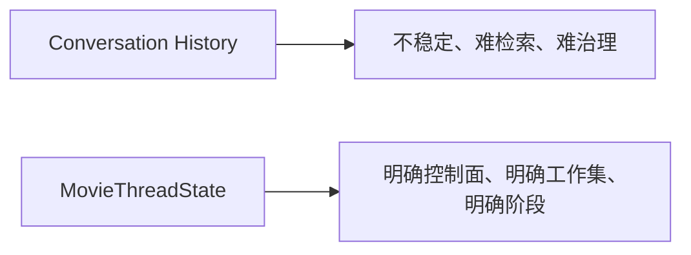

因此，线程状态必须从聊天记录中独立出来。

---

## 二、MovieThreadState 的角色定位

`MovieThreadState` 本质上承担三种职能：

- 当前阶段控制面
- 当前工作集索引
- 当前风险与审批看板

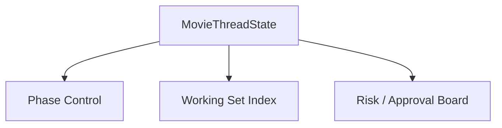

它并不是所有对象内容的存储体，而是“当前最重要对象和状态”的聚合器。

---

## 三、建议的顶层字段

建议 `MovieThreadState` 至少包含以下顶层结构：

- `project_id`
- `current_phase`
- `phase_goals`
- `active_object_refs`
- `working_set`
- `active_agents`
- `risk_register`
- `pending_reviews`
- `pending_approvals`
- `recent_decisions`
- `next_actions`
- `status_summary`

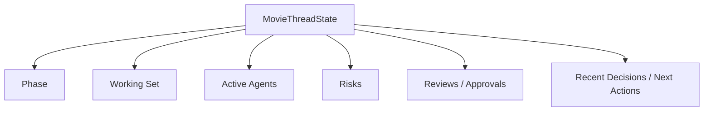

---

## 四、为什么 current_phase 是最核心字段之一

电影平台里的很多行为约束都依赖阶段。

例如：

- 前期阶段允许大规模改剧本和重做分镜
- 拍摄阶段更强调日计划、升级与变更控制
- 后期阶段更强调版本收敛和交付链

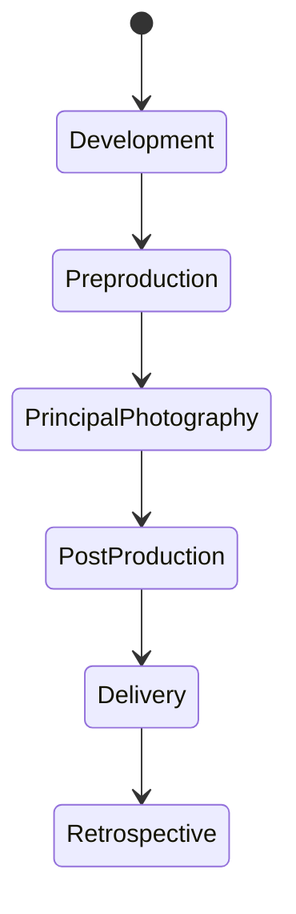

`current_phase` 决定哪些角色活跃、哪些对象可编辑、哪些审批必须触发。

---

## 五、working_set 应该怎么理解

`working_set` 不是整个项目对象全集，而是“当前线程真正需要频繁读取和写回”的小集合。

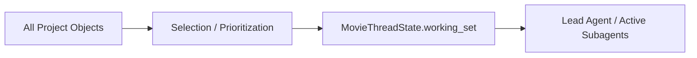

### 典型 working set 内容

- 当前活跃 `ScriptVersion`
- 当前有效 `BreakdownSheet`
- 当前候选 `BudgetDraft`
- 当前有效 `ScheduleDraft`
- 当前正在 review 的 `ShotPlan` 或 `StoryboardDraft`

这样做的好处是：

- 控制上下文成本
- 限定当前决策范围
- 让主智能体和子智能体聚焦当前对象

---

## 六、active_object_refs 与 working_set 的区别

这两个字段看起来相似，但职责不同。

### `active_object_refs`

更像“当前项目正式引用的有效对象”

例如：

- 当前正式剧本版本
- 当前正式预算版本
- 当前正式排期版本

### `working_set`

更像“当前线程正在处理的对象集合”

例如：

- 正在 review 的新预算草稿
- 正在比较的两个勘景方案
- 待确认的 cast shortlist

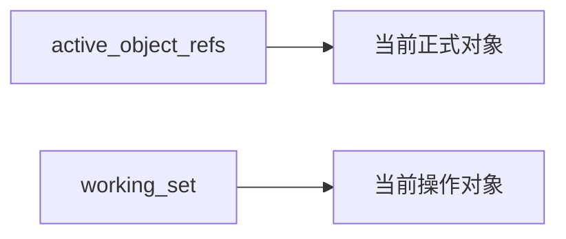

两者分开后，系统才能同时处理“正式版本”和“候选版本”。

---

## 七、风险与审批为什么必须进入 Thread State

如果风险和审批只存在于散落文档里，导演主智能体就无法稳定知道项目现在最大的阻塞是什么。

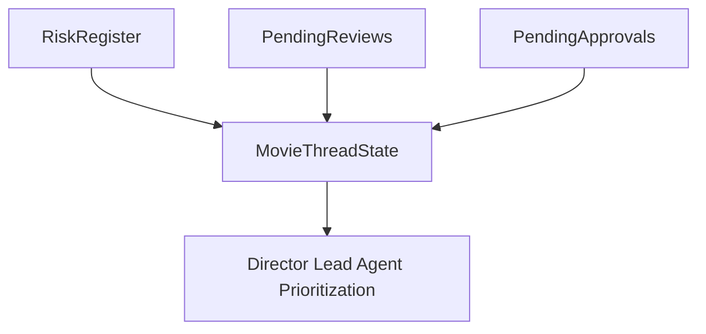

### 建议结构

- `risk_register.active_risks`
- `pending_reviews`
- `pending_approvals`
- `blocked_items`

这几个区域应该共同定义“现在最值得被处理的事情”。

---

## 八、recent_decisions 和 next_actions 为什么都要有

只知道“下一步要干什么”还不够，还必须知道“刚刚做了什么决定”。

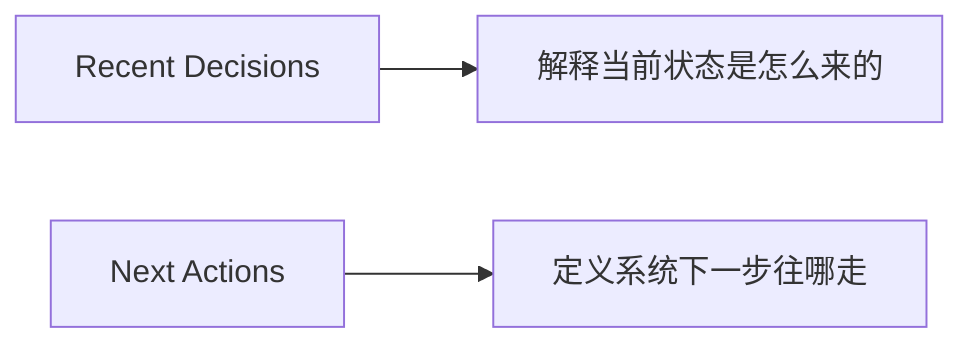

### `recent_decisions`

负责说明：

- 为什么切到这个阶段
- 为什么退回某个预算版本
- 为什么锁定某个场地或镜头方案

### `next_actions`

负责说明：

- 现在该调用哪些角色
- 该发起哪些 review
- 哪些对象需要生成新版本

---

## 九、MovieThreadState 的典型更新时序

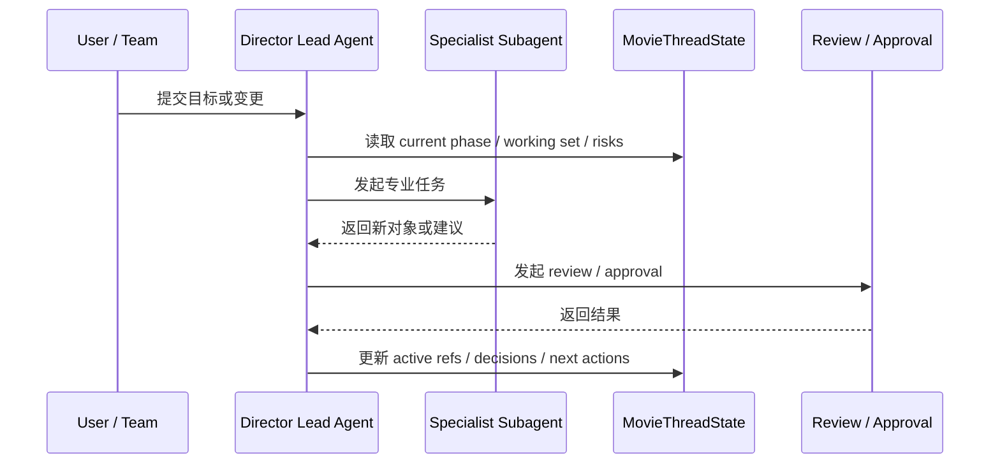

线程状态的更新应该发生在每次关键裁决之后，而不是只在项目结束时补写。

---

## 十、在 Hermes Agent 中的映射建议

`MovieThreadState` 是 Hermes 最值得优先扩展的电影域状态对象之一。

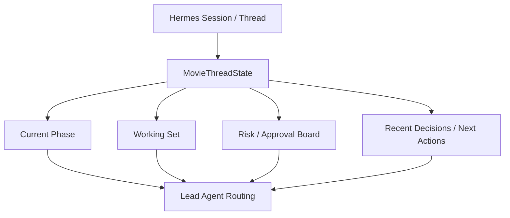

### 工程建议

- 将其作为线程级状态快照持久化
- 每次关键对象变更后同步更新
- 和 artifacts 索引保持轻耦合关联
- 提供可供主智能体直接读取的简洁摘要视图

---

## 十一、MVP 设计建议

第一版可以先把 `MovieThreadState` 收敛成五块：

1. `current_phase`
2. `active_object_refs`
3. `working_set`
4. `risk_register`
5. `next_actions`

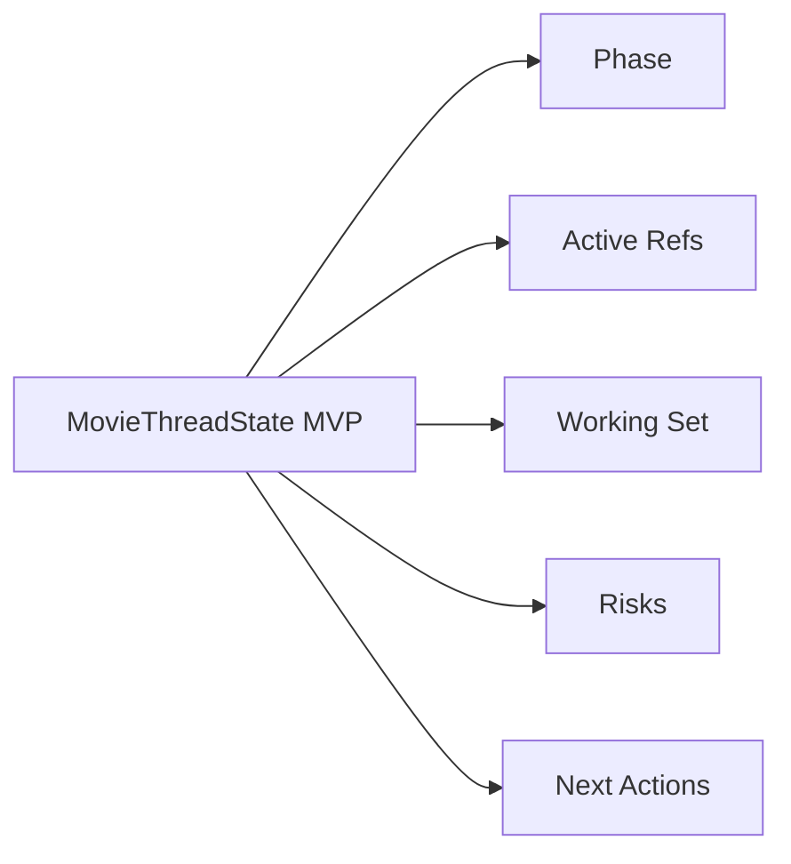

这五块一旦稳定，导演主智能体就有了可持续工作的控制面。

---

## 十二、结论

`MovieThreadState` 的意义，是把电影项目从“很多对象并存”收敛成“当前系统最重要的状态快照”。

它在导演智能体平台里不是可有可无的辅助字段，而是：

- 阶段控制面
- 当前工作集入口
- 风险与审批看板
- 最近决策与下一步任务的桥

如果 `MovieThreadState` 设计稳定，Hermes 才能真正从多轮聊天，升级成长期运行的电影项目线程。

---

## 相关文档

- [04-production-phases.md](./04-production-phases.md)
- [61-project-object-system-overview.md](./61-project-object-system-overview.md)
- [67-workflow-state-machine-design.md](./67-workflow-state-machine-design.md)
- [71-lead-agent-transformation-plan.md](./71-lead-agent-transformation-plan.md)
- [74-thread-state-extension-plan.md](./74-thread-state-extension-plan.md)
