# 63. Script / Scene / Character 对象系统

## 这篇文档回答什么问题

在导演智能体平台里，最基础也最关键的一组创作对象，就是 `ScriptVersion`、`Scene` 和 `Character`。

如果这三类对象没有正式关系，很多后续角色都会失去稳定输入：

- 剧本分析不知道分析结果挂在哪里
- 选角不知道角色对象以什么为准
- 分镜不知道镜头到底围绕哪场戏和哪个人物弧线展开

本篇重点回答：

1. 为什么必须把 Script / Scene / Character 拆成正式对象系统。
2. 这三类对象之间应如何组织关系。
3. Hermes Agent 后续应如何围绕这组创作对象做版本、review 和协作。

---

## 一、为什么剧本不能只是一份文件

一份剧本文件可以被人阅读，但它很难直接支撑多角色系统化协作。

因为平台真正需要的是：

- 可引用的版本
- 可拆解的场景
- 可追踪的人物
- 可关联的 review 和修改建议

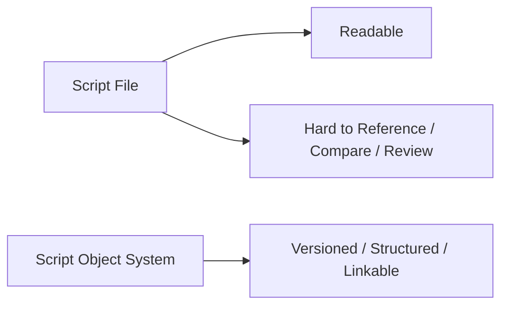

所以 `ScriptVersion` 不应只是文件路径，而应是正式对象入口。

---

## 二、三层对象结构总览

建议把这组三层对象理解为：

- `ScriptVersion`：当前故事蓝图的正式版本
- `Scene`：叙事和制作的最小工作单元
- `Character`：人物和表演的长期跟踪对象

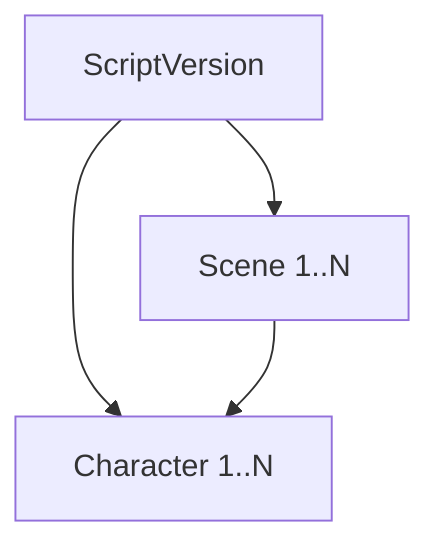

这里有两个关键点：

- 一个 `ScriptVersion` 包含多个 `Scene`
- `Scene` 与 `Character` 构成多对多关系

---

## 三、ScriptVersion 应该承载什么

`ScriptVersion` 不是所有创作对象的总桶，而是“正式剧本版本”的身份与边界。

### 建议字段

- `script_version_id`
- `version_label`
- `status`
- `source_path`
- `change_summary`
- `derived_from_version_id`
- `review_state`
- `scene_ids`
- `character_ids`

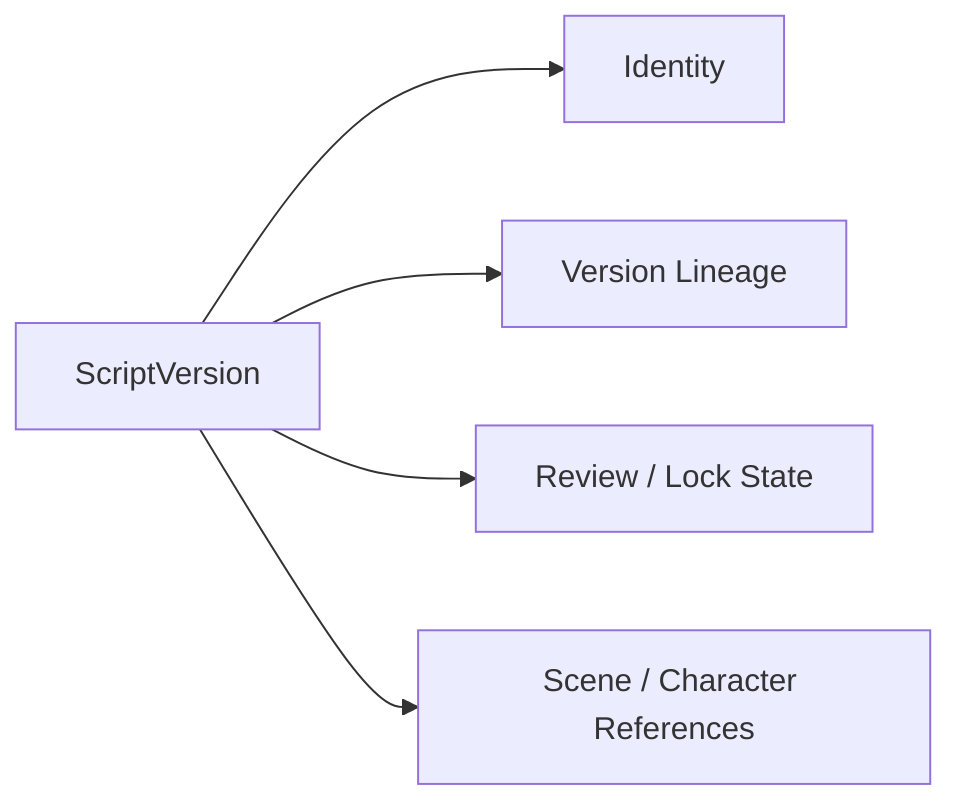

### 为什么它重要

- 剧本分析子智能体围绕它工作
- breakdown 围绕它生成
- 锁稿和返工都必须挂在它上面

---

## 四、Scene 为什么是整个系统的桥梁对象

`Scene` 是创作和生产之间最重要的桥。

因为一场戏同时承载：

- 剧情目标
- 情绪节拍
- 角色参与
- 地点和时间属性
- 制作复杂度

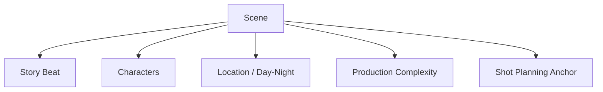

### 建议字段

- `scene_id`
- `script_version_id`
- `scene_number`
- `slugline`
- `summary`
- `day_night`
- `location_type`
- `character_ids`
- `dramatic_goal`
- `complexity_tags`

---

## 五、Character 为什么不能只是角色名字

很多系统一开始只有“角色名列表”，但这不够支撑导演平台。

正式的 `Character` 对象应该承接：

- 人物弧线
- 气质与表演方向
- 选角要求
- 跨场景连续性

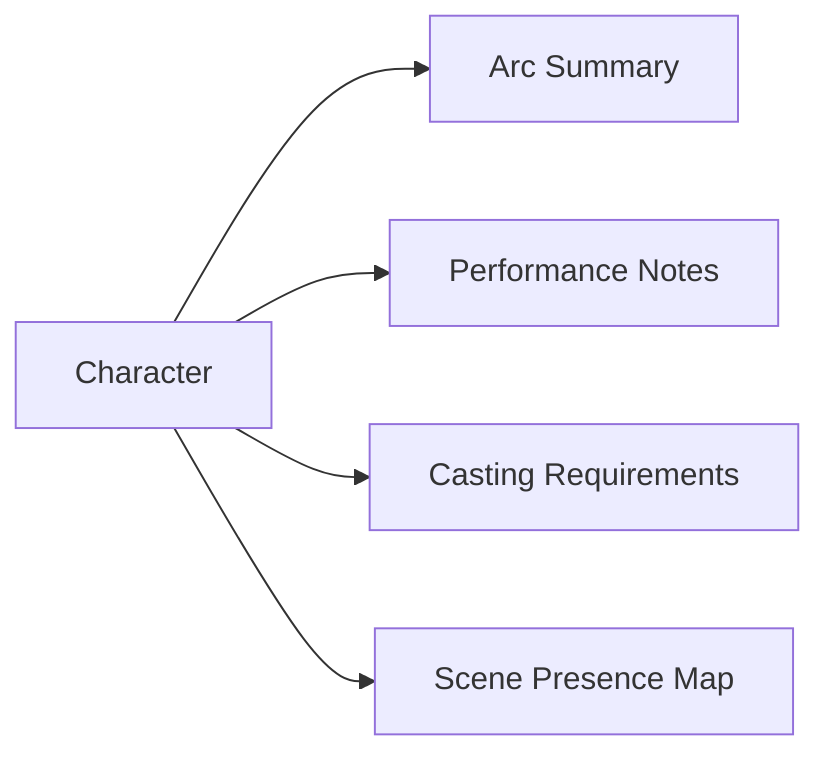

### 建议字段

- `character_id`
- `name`
- `description`
- `arc_summary`
- `casting_notes`
- `tone_notes`
- `scene_presence`
- `status`

---

## 六、三者之间的对象关系

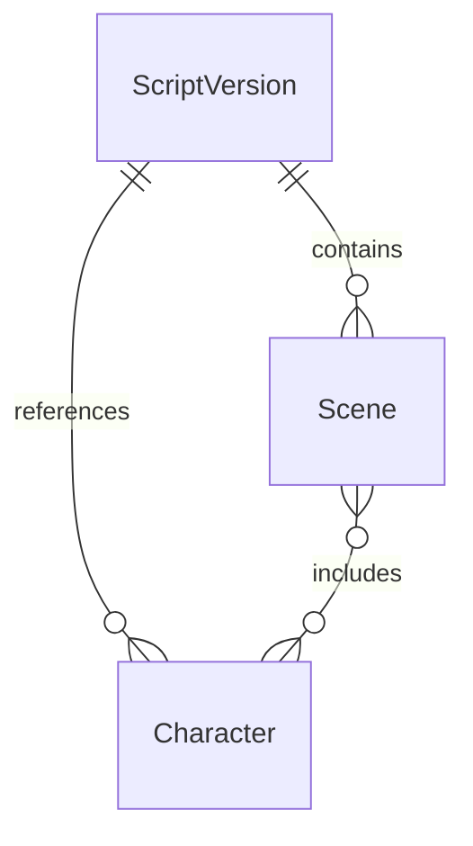

这组关系决定了：

- 结构分析可以落到 scene 级
- 人物分析可以落到 character 级
- scene 和 character 可以共同支撑分镜、选角、表演指导

---

## 七、版本链应该怎么处理

剧本系统最难的不是静态建模，而是版本收敛。

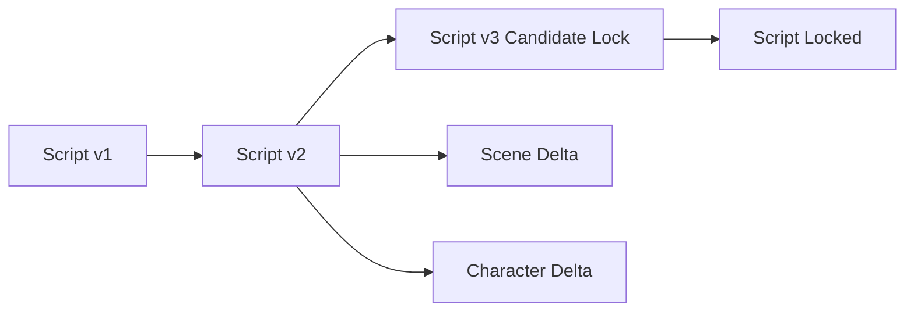

建议做法是：

- `ScriptVersion` 明确 lineage
- `Scene` 与 `Character` 支持 version-aware 引用
- review 和 rewrite 建议明确作用于哪个版本

这样系统才不会混淆“旧角色设定”和“新版本场景”。

---

## 八、它如何支撑角色系统

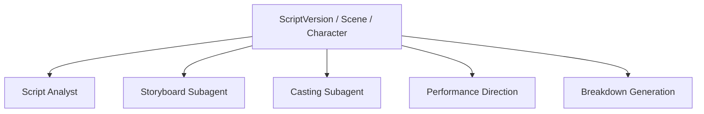

例如：

- 剧本分析基于 `ScriptVersion`
- 分镜基于 `Scene`
- 选角基于 `Character`
- 表演指导基于 `Character + SceneBeat`

---

## 九、典型工作流

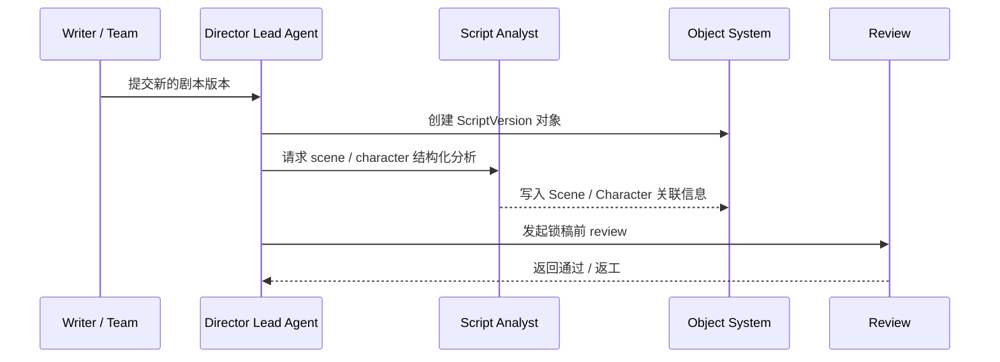

---

## 十、在 Hermes Agent 中的映射建议

这组三个对象是最适合优先落成 schema 的创作对象层。

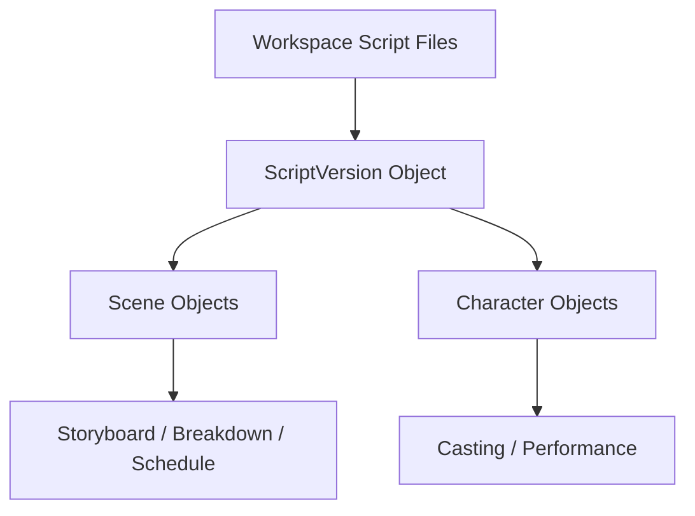

### 工程建议

- 用 `ScriptVersion` 映射工作区中的正式剧本文件
- 让 `Scene` 与 `Character` 成为结构化派生对象
- review、rewrite、lock 操作一律挂在 `ScriptVersion`
- 下游角色通过对象引用，而不是靠自然语言猜当前版本

---

## 十一、MVP 设计建议

第一版优先确保四件事：

1. `ScriptVersion` 有正式版本状态
2. `Scene` 能从剧本中稳定拆出来
3. `Character` 能和场景形成可查询关系
4. review 和 rewrite 能明确作用于版本

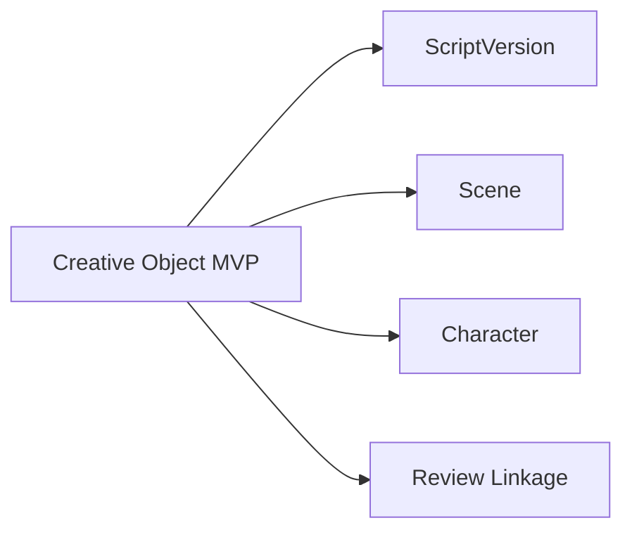

---

## 十二、结论

`ScriptVersion`、`Scene`、`Character` 是导演平台最基础的创作对象链。

它们分别回答：

- 当前故事蓝图是什么
- 每场戏到底在做什么
- 每个人物在整部片里如何存在

只有先把这组三个对象做稳定，导演平台的选角、分镜、表演指导、breakdown 和版本治理才有共同语言。

---

## 相关文档

- [25-script-development-and-lock.md](./25-script-development-and-lock.md)
- [26-script-breakdown-and-breakdown-sheet.md](./26-script-breakdown-and-breakdown-sheet.md)
- [29-casting-and-actor-management.md](./29-casting-and-actor-management.md)
- [36-dialogue-design-and-polish.md](./36-dialogue-design-and-polish.md)
- [54-script-analyst-subagent-design.md](./54-script-analyst-subagent-design.md)
