# 64. Budget / Schedule / Resource 对象系统

## 这篇文档回答什么问题

在导演智能体平台里，生产对象系统最关键的一组，就是 `BudgetDraft`、`ScheduleDraft` 和 `ResourcePlan`。

如果没有这组三角关系，平台就很容易出现两类错误：

- 创作对象很完整，但不知道怎么执行
- 有预算和排期草稿，但彼此之间无法解释为什么变动

本篇重点回答：

1. 为什么 Budget / Schedule / Resource 必须作为一个对象系统一起设计。
2. 这三类对象之间如何形成正式依赖关系。
3. Hermes Agent 应如何围绕它们实现生产侧版本链、review 和 trade-off。

---

## 一、为什么生产对象不能分开孤立设计

预算、排期和资源从来不是三张互不相干的表。

它们在现实里是同时联动的：

- 增加场景复杂度会推高资源需求
- 资源可用性会改变排期
- 排期变化又会反过来改变预算

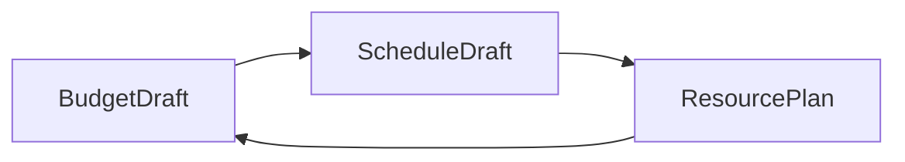

这就是为什么它们必须被设计成一组相互解释的对象。

---

## 二、三类对象的定位

### `BudgetDraft`

回答“这套方案预计花多少钱，成本驱动项在哪里”

### `ScheduleDraft`

回答“这套方案准备怎么排，哪些天和顺序最关键”

### `ResourcePlan`

回答“为了执行这套方案，需要哪些人、设备、地点和时间窗口”

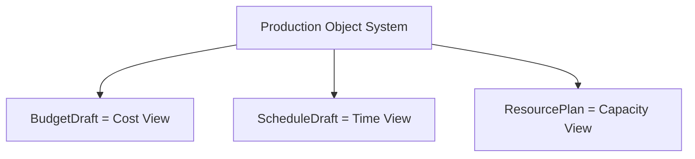

---

## 三、BudgetDraft 应承载什么

`BudgetDraft` 应该是正式的版本对象，而不是一个临时表格。

### 建议字段

- `budget_id`
- `version_label`
- `based_on_breakdown_id`
- `assumptions`
- `department_lines`
- `topline_total`
- `confidence_level`
- `status`

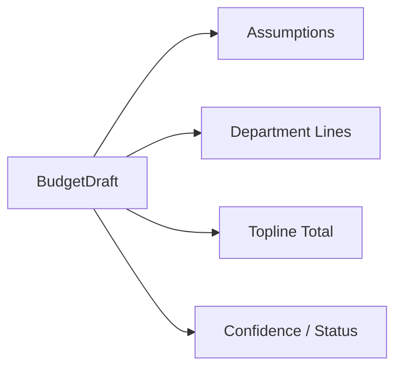

重点不是数字本身，而是数字背后的假设是否透明。

---

## 四、ScheduleDraft 应承载什么

`ScheduleDraft` 不是静态日期表，而是阶段性可执行顺序假设。

### 建议字段

- `schedule_id`
- `version_label`
- `based_on_breakdown_id`
- `stripboard`
- `shoot_days`
- `constraint_summary`
- `high_risk_days`
- `status`

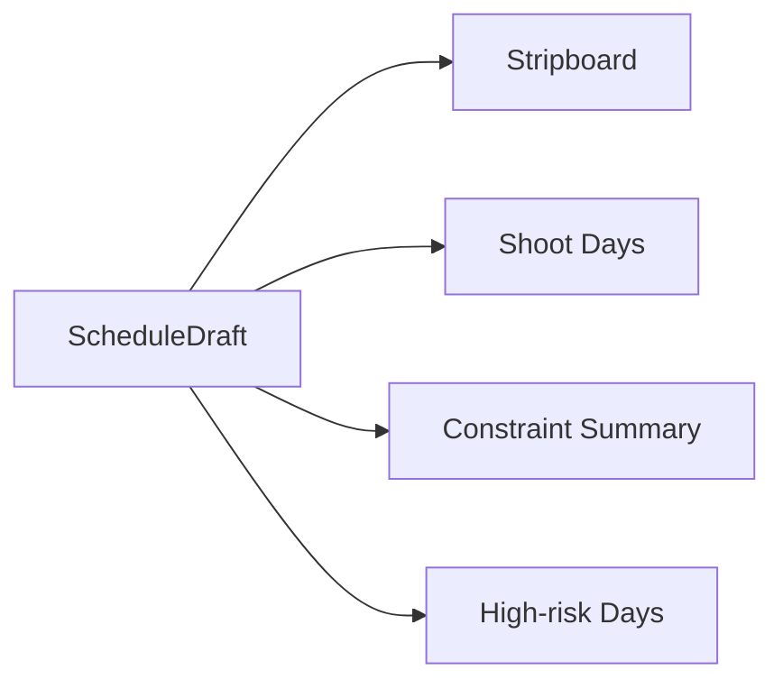

---

## 五、ResourcePlan 应承载什么

`ResourcePlan` 是把拍摄执行需要的资源正式写出来的对象。

### 建议字段

- `resource_plan_id`
- `linked_schedule_id`
- `department_allocations`
- `location_requirements`
- `equipment_requirements`
- `cast_requirements`
- `availability_risks`
- `status`

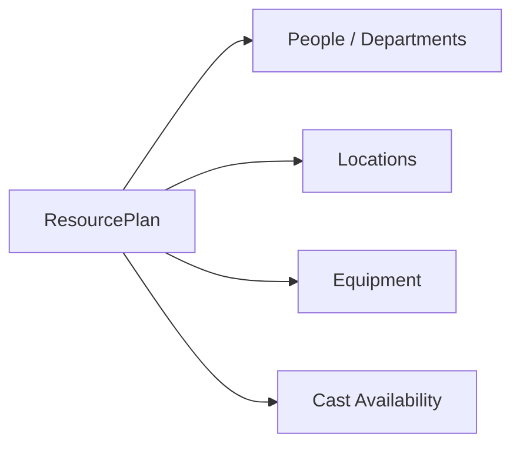

---

## 六、三者之间的正式关系

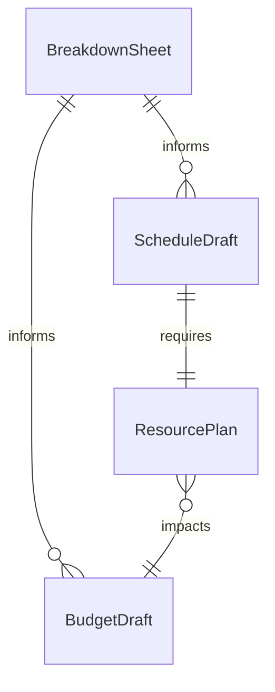

这里最关键的是：

- `BreakdownSheet` 是上游桥梁
- `BudgetDraft` 和 `ScheduleDraft` 都来源于 breakdown
- `ResourcePlan` 解释排期是否真的可执行

---

## 七、为什么一定要显式记录 assumptions

生产对象系统中，最容易失真的不是总额，而是假设。

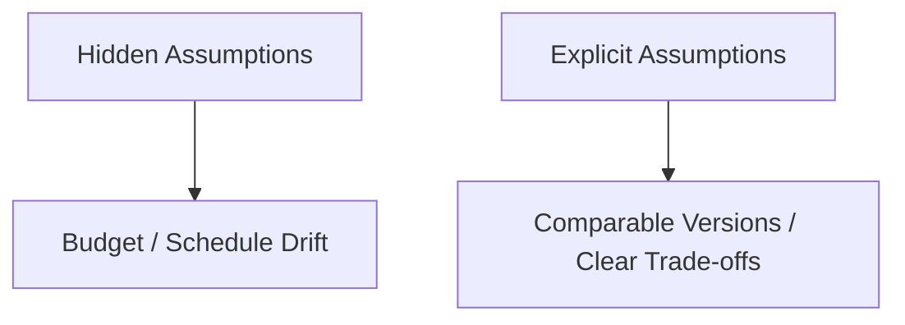

例如：

- 预算是否默认演员全部可用
- 排期是否假设某地点可连续拍三天
- 资源计划是否假设设备无需跨城调度

如果这些不显式写出，版本比较就失去意义。

---

## 八、版本链和变更传播

生产对象系统最有价值的能力之一，是看到一次改动如何沿链传播。

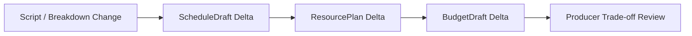

这意味着系统需要支持：

- 版本 lineage
- delta 摘要
- 影响范围说明

---

## 九、典型协作时序

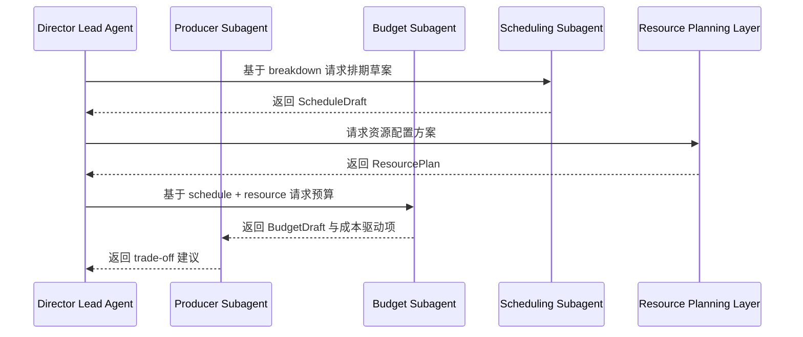

---

## 十、在 Hermes Agent 中的映射建议

生产对象系统适合成为 Hermes 后续电影化扩展的第二批核心对象。

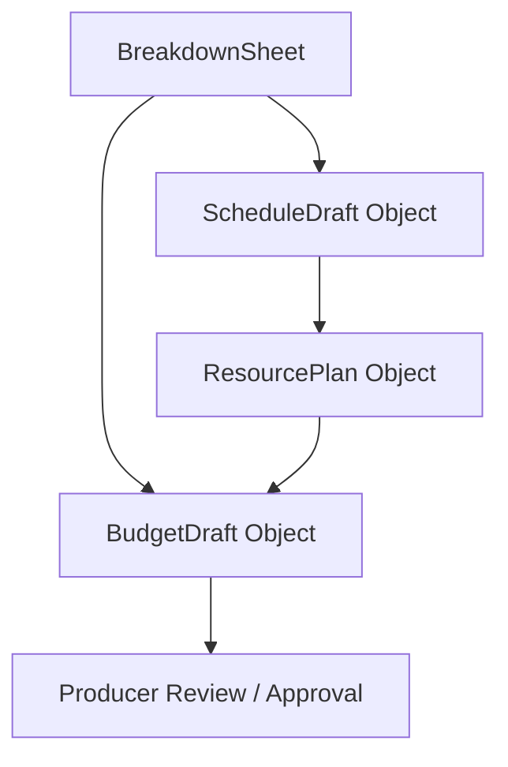

### 工程建议

- 所有预算和排期草稿都保留版本号
- `ResourcePlan` 作为排期可执行性校验层
- 变更时生成 delta 摘要，供导演和制片快速比较
- review 和 approval 明确指向具体版本

---

## 十一、MVP 设计建议

第一版先把这组对象收敛成四件事：

1. `BudgetDraft` 可版本化
2. `ScheduleDraft` 可版本化
3. `ResourcePlan` 可关联到具体排期
4. 每次变更有 assumptions 和 delta 摘要

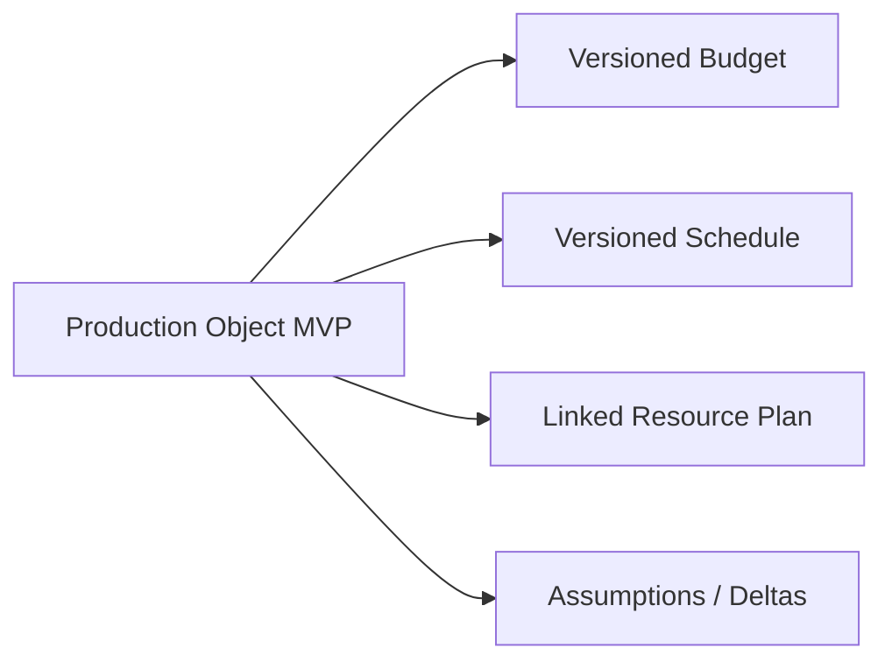

---

## 十二、结论

`BudgetDraft`、`ScheduleDraft`、`ResourcePlan` 共同构成导演平台的生产对象三角。

它们分别回答：

- 这套方案花多少钱
- 这套方案怎么排
- 这套方案靠什么资源实现

只有把这组三角对象正式化，导演主智能体和制片子智能体才真正拥有可比较、可 review、可升级的生产侧现实基础。

---

## 相关文档

- [27-budgeting-and-line-producer-view.md](./27-budgeting-and-line-producer-view.md)
- [28-scheduling-and-first-ad-view.md](./28-scheduling-and-first-ad-view.md)
- [56-budget-subagent-design.md](./56-budget-subagent-design.md)
- [57-scheduling-subagent-design.md](./57-scheduling-subagent-design.md)
- [40-progress-and-cost-control.md](./40-progress-and-cost-control.md)
