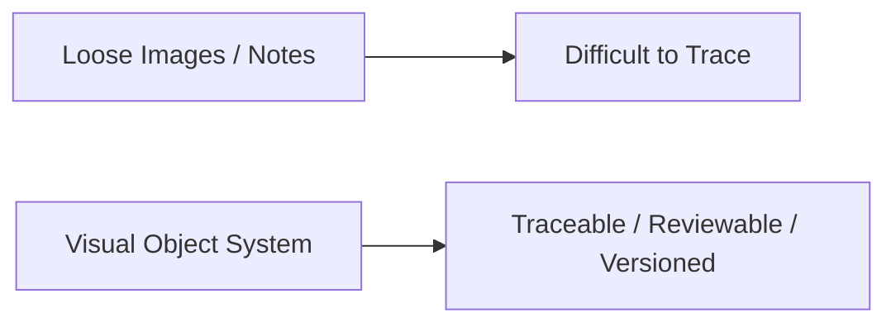
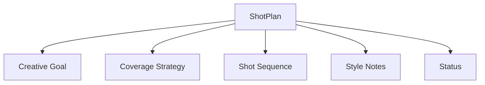
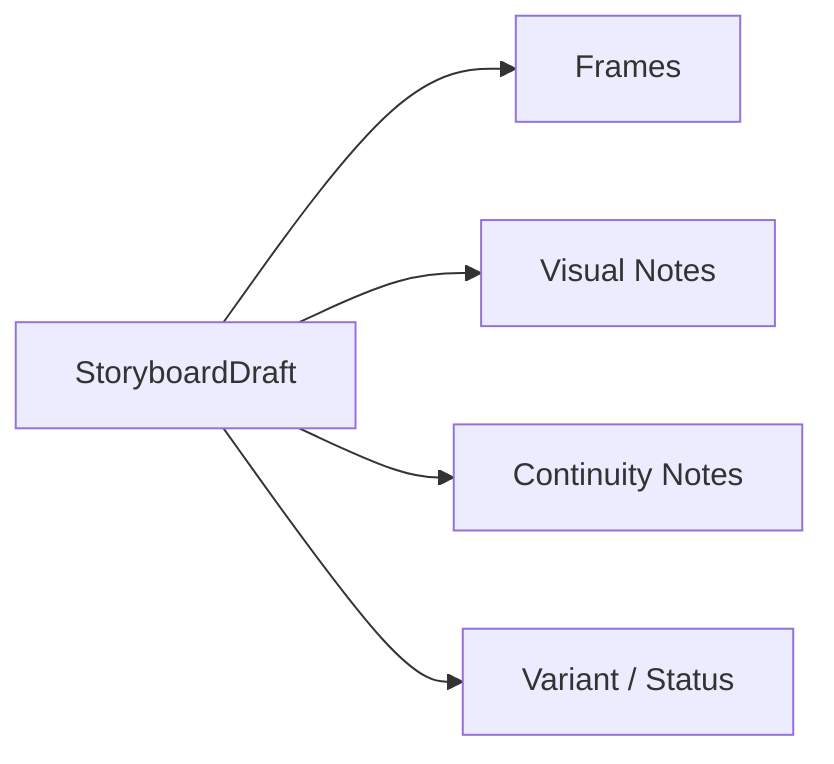
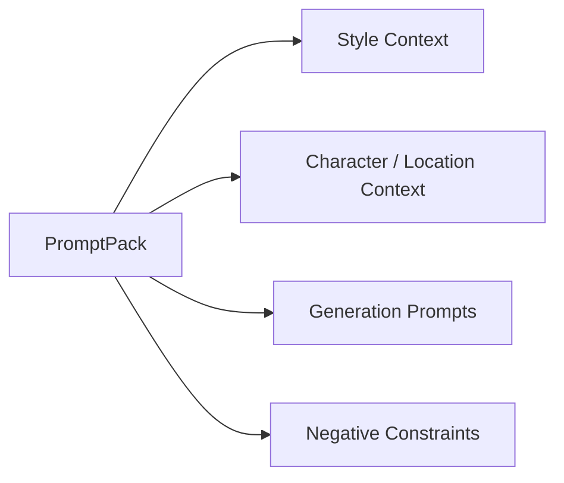
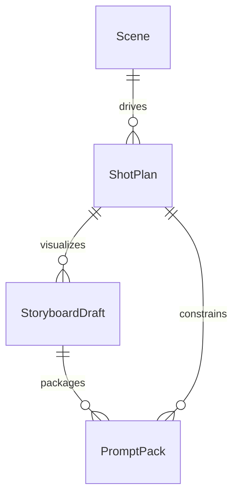
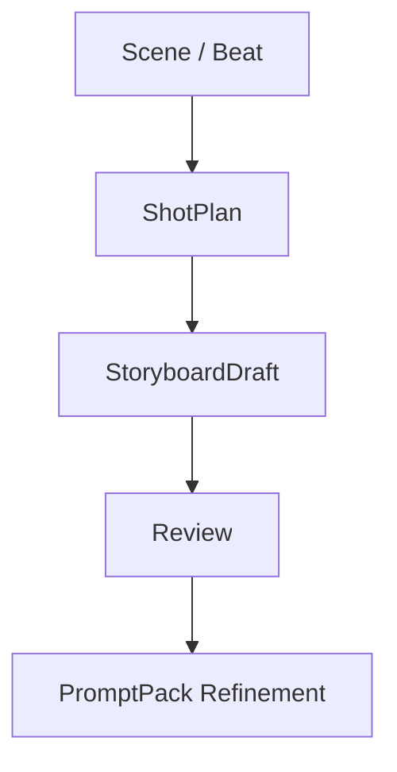
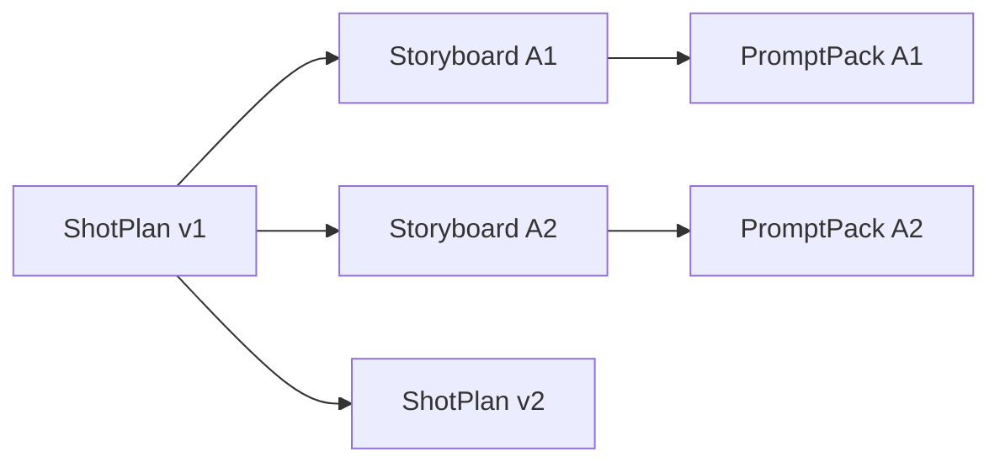
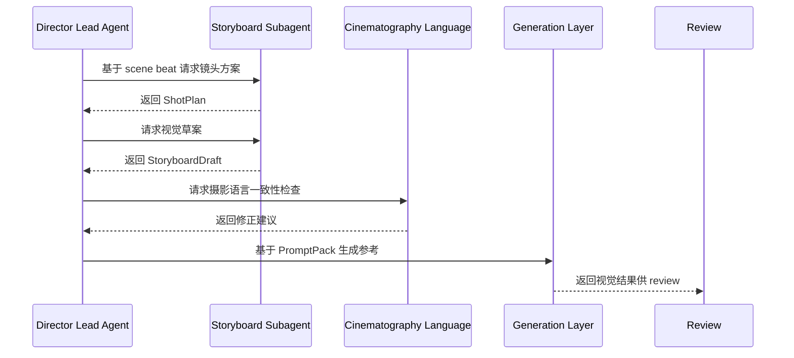
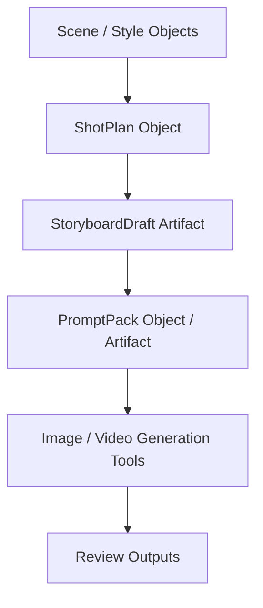
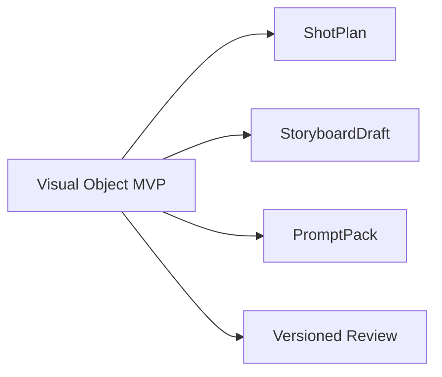

# 65. ShotPlan / Storyboard / PromptPack 对象系统

## 这篇文档回答什么问题

在导演智能体平台里，视觉执行层最关键的一组对象，不是“图片文件集合”，而是 `ShotPlan`、`StoryboardDraft` 和 `PromptPack`。

如果没有这组对象链，系统就会出现典型断裂：

- 剧本语义有了，但镜头无法稳定落地
- 分镜草图有了，但不知道它对应哪套镜头意图
- prompt 有了，但无法追溯其来自哪个场景、哪个风格版本、哪个镜头方案

本篇重点回答：

1. 为什么这三类对象必须一起设计。
2. 它们之间应如何形成正式依赖关系。
3. Hermes Agent 应如何围绕它们支持图像生成、review、版本和回溯。

---

## 一、为什么视觉执行对象不能只是素材文件

图片、草图、参考图本身并不能告诉系统：

- 它属于哪场戏
- 它对应哪个镜头意图
- 它是否仍然代表当前有效方案
- 它是生成用提示，还是最终 review 用草图

所以视觉执行层必须先有对象，再有素材。

---

## 二、三类对象的定位

### `ShotPlan`

回答“这场戏打算怎么用镜头完成叙事”

### `StoryboardDraft`

回答“这套镜头方案被视觉化后长什么样”

### `PromptPack`

回答“如果要调用图像或视频生成能力，应该用什么结构化提示来驱动”

---

## 三、ShotPlan 应承载什么

`ShotPlan` 是视觉执行层的主锚点。

### 建议字段

- `shotplan_id`
- `scene_id`
- `creative_goal`
- `coverage_strategy`
- `shot_sequence`
- `must_keep_shots`
- `style_notes`
- `status`

它决定后续分镜、摄影语言和现场执行到底围绕什么展开。

---

## 四、StoryboardDraft 应承载什么

`StoryboardDraft` 不是一堆图，而是对某个 `ShotPlan` 的视觉草案表达。

### 建议字段

- `storyboard_id`
- `linked_shotplan_id`
- `frame_set`
- `visual_notes`
- `continuity_notes`
- `variant_label`
- `status`

这样系统才能区分：

- 是同一套镜头方案的多个视觉变体
- 还是完全不同的镜头方案

---

## 五、PromptPack 应承载什么

`PromptPack` 应被理解成“生成输入的正式封装”，而不是一次性 prompt 文本。

### 建议字段

- `promptpack_id`
- `linked_storyboard_id`
- `linked_shotplan_id`
- `style_context`
- `character_context`
- `location_context`
- `generation_prompts`
- `negative_constraints`
- `status`

---

## 六、三者之间的正式关系

这组关系的关键是：

- `ShotPlan` 决定叙事与执行逻辑
- `StoryboardDraft` 决定视觉表现草案
- `PromptPack` 决定生成系统如何被驱动

---

## 七、为什么 ShotPlan 要先于 StoryboardDraft

很多团队会直接从场景跳到画图或生成图，但这样很容易把镜头逻辑做散。

先有 `ShotPlan` 的好处是：

- 可以先 review 镜头结构
- 可以减少无效视觉生成
- 可以把视觉层和叙事层分开优化

---

## 八、版本链应该怎么处理

视觉执行对象天然是高迭代对象，所以必须允许版本和变体并存。

建议：

- `ShotPlan` 版本变化视为结构性变化
- `StoryboardDraft` 变体变化视为视觉方案比较
- `PromptPack` 变化视为生成驱动优化

---

## 九、典型协作时序

---

## 十、在 Hermes Agent 中的映射建议

这组对象很适合做成 workspace artifact + object ref 的混合结构。

### 工程建议

- `ShotPlan` 作为结构化对象
- `StoryboardDraft` 与生成结果文件强关联
- `PromptPack` 既有对象化元数据，也有可执行提示内容
- review 必须绑定具体 `ShotPlan` / `StoryboardDraft` / `PromptPack`

---

## 十一、MVP 设计建议

第一版优先做四件事：

1. `Scene -> ShotPlan`
2. `ShotPlan -> StoryboardDraft`
3. `StoryboardDraft -> PromptPack`
4. 视觉对象的 review / version 绑定

---

## 十二、结论

`ShotPlan`、`StoryboardDraft` 和 `PromptPack` 共同构成导演平台的视觉执行对象链。

它们分别回答：

- 镜头逻辑怎么设计
- 视觉草案怎么表达
- 生成系统怎么被驱动

只有把这组对象正式化，导演平台才真正拥有从戏剧语义走向视觉执行和生成协作的稳定中间层。

---

## 相关文档

- [33-text-storyboard-and-shot-list.md](./33-text-storyboard-and-shot-list.md)
- [34-static-storyboards-and-moodboards.md](./34-static-storyboards-and-moodboards.md)
- [35-style-reference-analysis-and-unification.md](./35-style-reference-analysis-and-unification.md)
- [55-storyboard-subagent-design.md](./55-storyboard-subagent-design.md)
- [60-cinematography-language-subagent-design.md](./60-cinematography-language-subagent-design.md)
