# 66. Review / Approval / ReleasePackage 对象系统

## 这篇文档回答什么问题

对象系统进入治理层之后，最关键的一组对象就是 `ReviewRound`、`ApprovalRequest` 和 `ReleasePackage`。

如果没有这组三段式对象流，平台很快会陷入这些问题：

- 大家都在提意见，但不知道意见到底针对哪一版
- 有人说“可以了”，但没人知道是不是正式批准
- 交付物已经导出，但系统说不清它是不是正式出厂包

本篇重点回答：

1. 为什么治理层必须围绕 review、approval 和 release package 建模。
2. 这三类对象之间如何形成正式治理链。
3. Hermes Agent 应如何围绕它们支持审批、交付和归档。

---

## 一、为什么治理对象不能只是评论和文件夹

评论可以表达意见，文件夹可以装文件，但它们都无法天然表达正式治理状态。

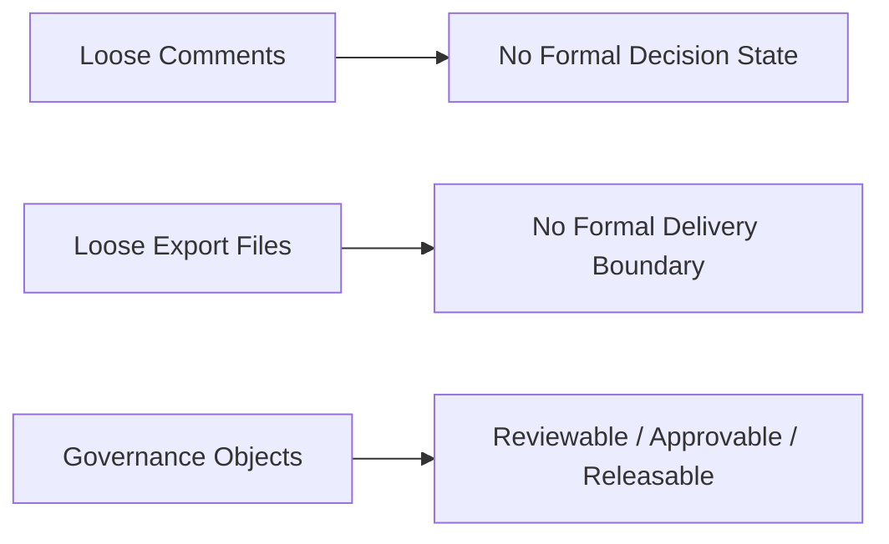

治理层真正要解决的是“状态合法性”。

---

## 二、三类对象的定位

### `ReviewRound`

回答“当前版本经历了什么评审，发现了什么问题”

### `ApprovalRequest`

回答“谁在申请批准什么对象进入下一状态”

### `ReleasePackage`

回答“哪些已经批准的对象共同构成正式交付包”

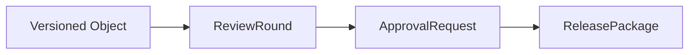

---

## 三、ReviewRound 应承载什么

`ReviewRound` 是治理链的第一道正式入口。

### 建议字段

- `review_id`
- `target_object_type`
- `target_object_id`
- `target_version_id`
- `reviewers`
- `findings`
- `recommendation`
- `status`

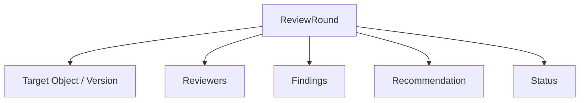

---

## 四、ApprovalRequest 应承载什么

`ApprovalRequest` 不应该等同于“请看一下”，而是正式状态跃迁的申请对象。

### 建议字段

- `approval_id`
- `source_review_id`
- `target_object_type`
- `target_object_id`
- `requested_transition`
- `approvers`
- `decision`
- `decision_notes`
- `status`

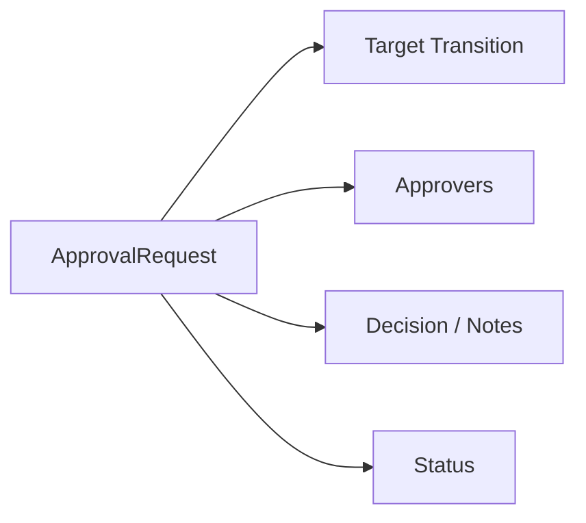

---

## 五、ReleasePackage 应承载什么

`ReleasePackage` 是治理链的末端正式对象。

### 建议字段

- `package_id`
- `package_scope`
- `approved_object_refs`
- `delivery_files`
- `approval_history`
- `release_notes`
- `archive_pointer`
- `status`

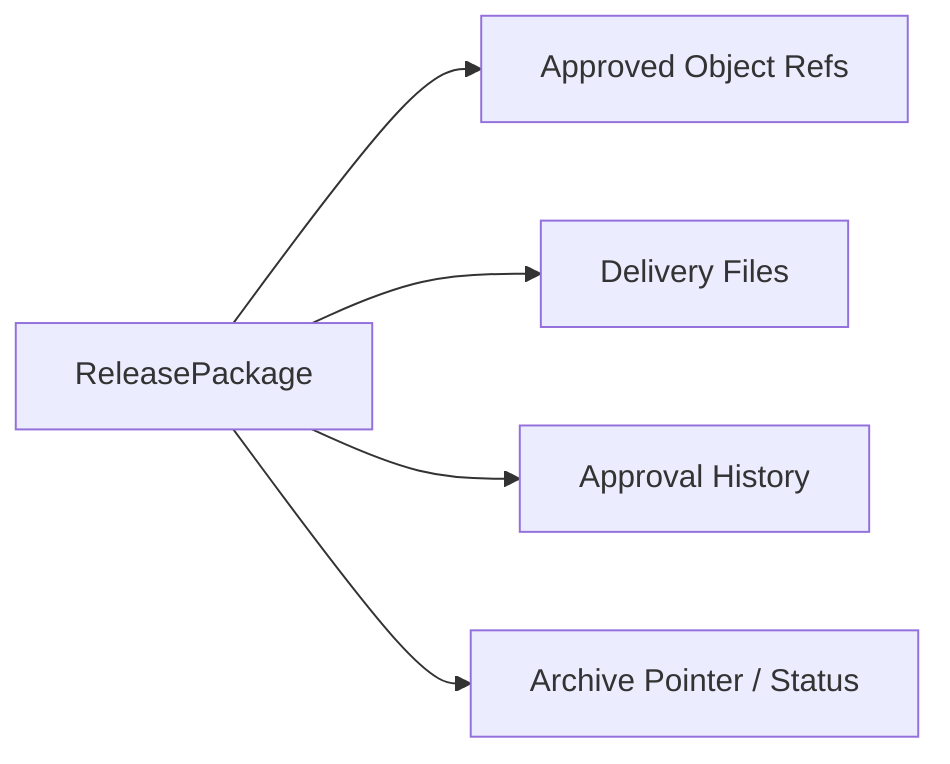

---

## 六、三者之间的正式关系

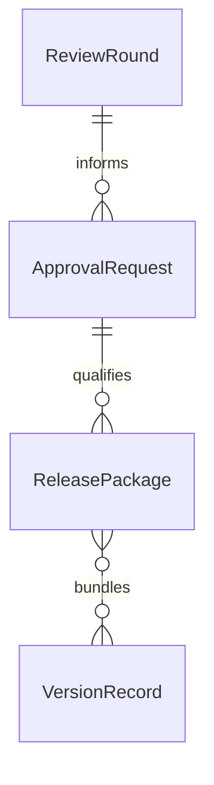

这里的关键是：

- review 负责提出结构化判断
- approval 负责状态跃迁
- release package 负责把被批准对象打包成正式交付体

---

## 七、为什么 approval 必须独立于 review

很多团队会把“review 通过了”直接等同于“批准了”，但这两者并不相同。

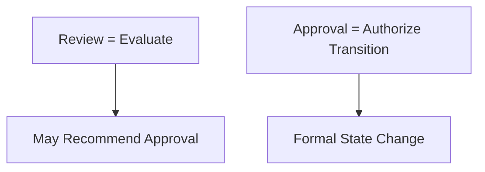

一个对象可以：

- review 通过，但仍待更高层批准
- review 没问题，但因外部约束暂不批准
- review 部分通过，只批准进入下一轮候选状态

---

## 八、治理对象的状态流

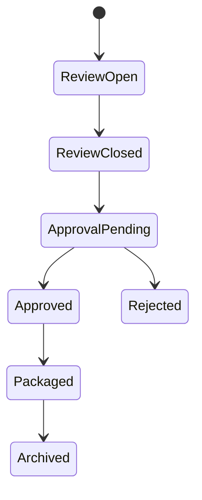

这个状态机的价值在于：让系统知道“当前只是被讨论过”，还是“已经被正式授权出厂”。

---

## 九、典型协作时序

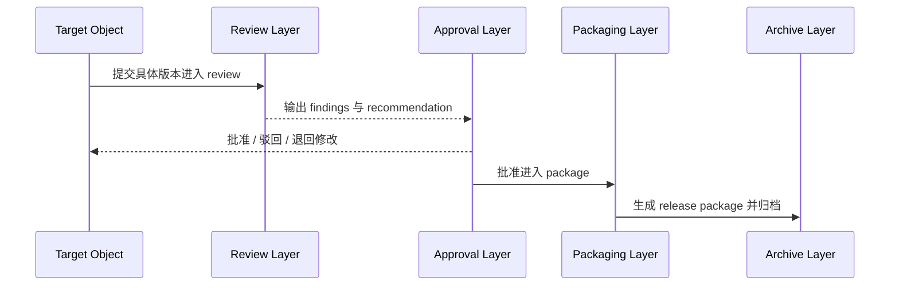

---

## 十、在 Hermes Agent 中的映射建议

治理对象系统应成为 Hermes 电影化治理层的正式入口。

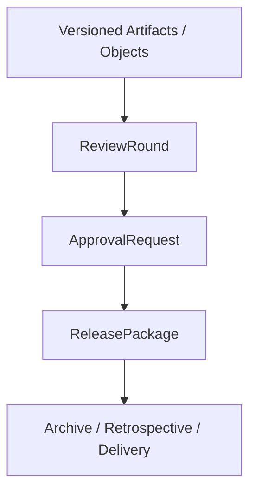

### 工程建议

- 所有 review 必须绑定具体对象和版本
- approval 必须记录状态跃迁意图
- release package 引用一组已批准对象，而不是裸文件
- archive 指针作为治理链末端标准字段

---

## 十一、MVP 设计建议

第一版先确保：

1. `ReviewRound` 可绑定对象版本
2. `ApprovalRequest` 可驱动正式状态变更
3. `ReleasePackage` 可引用已批准对象和文件
4. 审批链可追溯

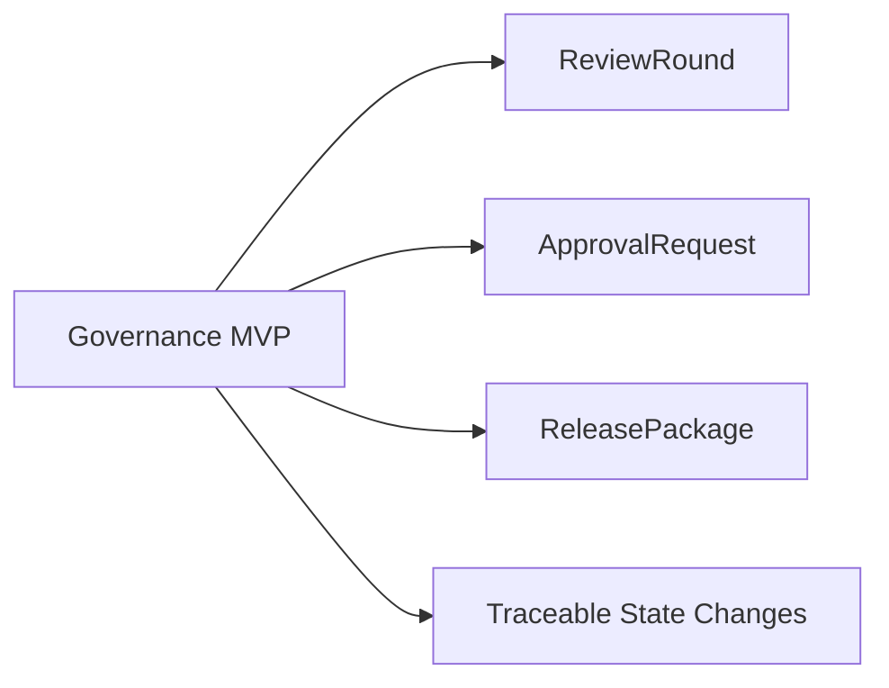

---

## 十二、结论

`ReviewRound`、`ApprovalRequest` 和 `ReleasePackage` 共同构成导演平台的治理对象主链。

它们分别回答：

- 评审发生了什么
- 谁批准了什么状态跃迁
- 哪些对象构成正式交付包

只有把这条对象链做实，平台才真正具备正式治理、正式交付和正式归档的能力。

---

## 相关文档

- [49-review-flow-versioning-and-release-package.md](./49-review-flow-versioning-and-release-package.md)
- [68-approval-and-escalation-flow-design.md](./68-approval-and-escalation-flow-design.md)
- [70-artifact-version-and-archive-system.md](./70-artifact-version-and-archive-system.md)
- [16-b-interfaces-and-data-contracts.md](./16-b-interfaces-and-data-contracts.md)
- [75-movie-tools-design.md](./75-movie-tools-design.md)
