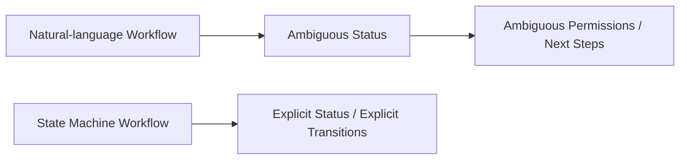
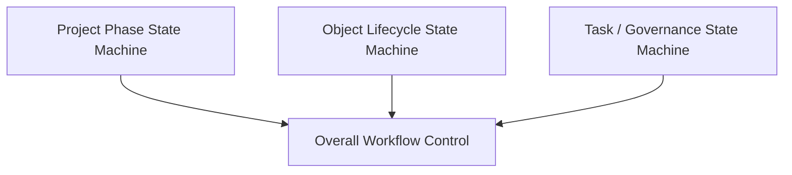
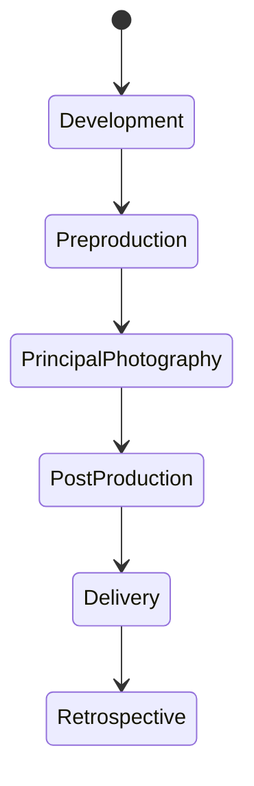
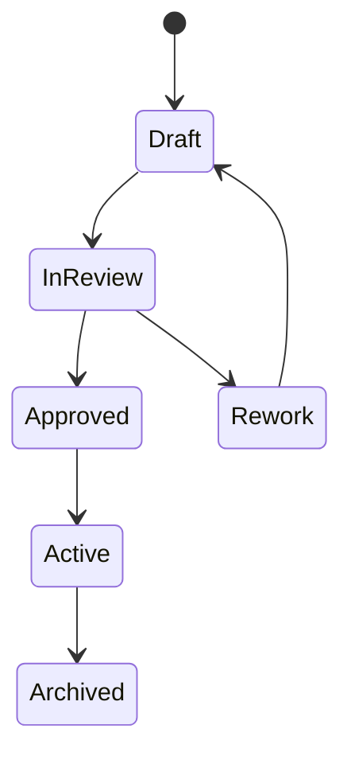
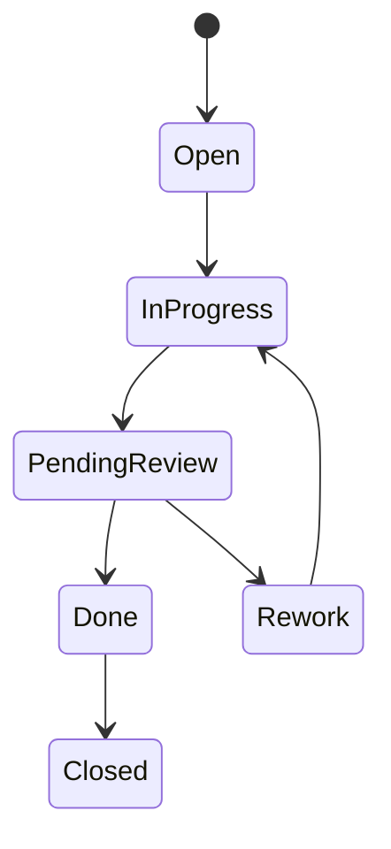
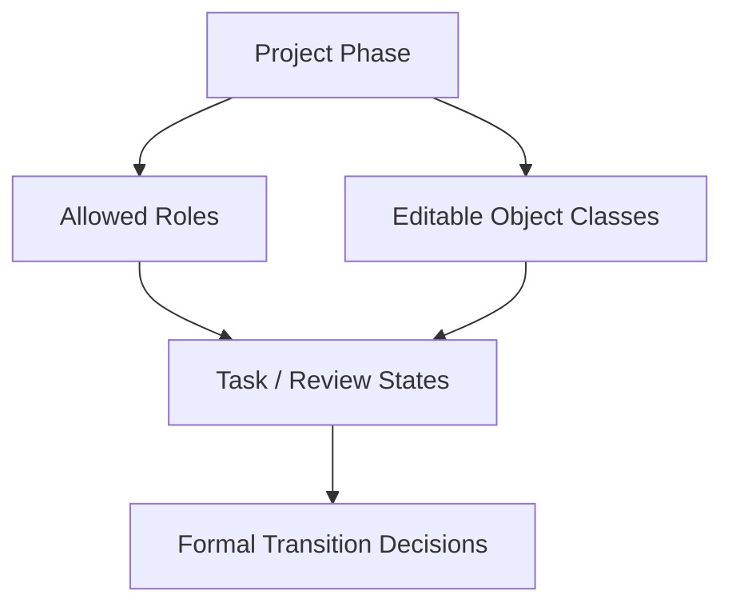
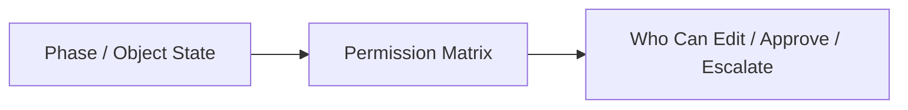
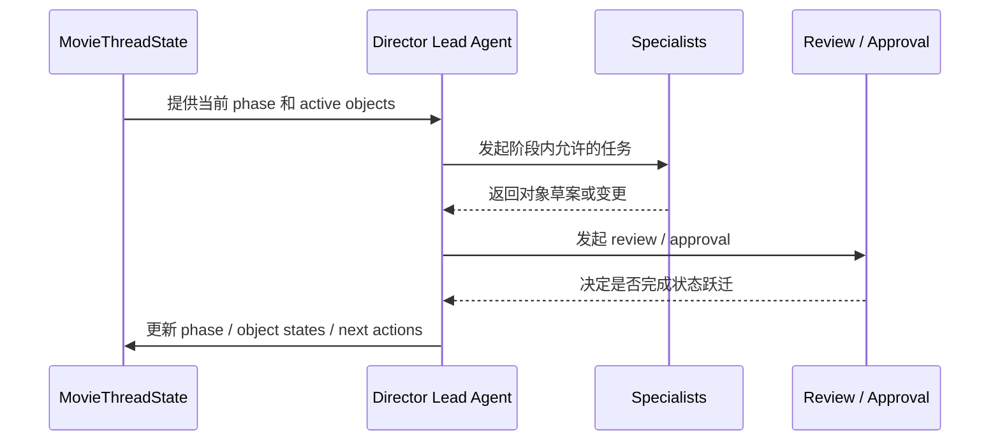
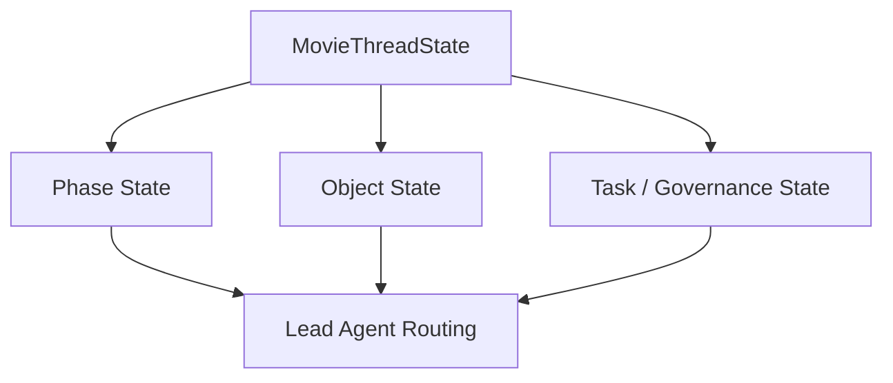
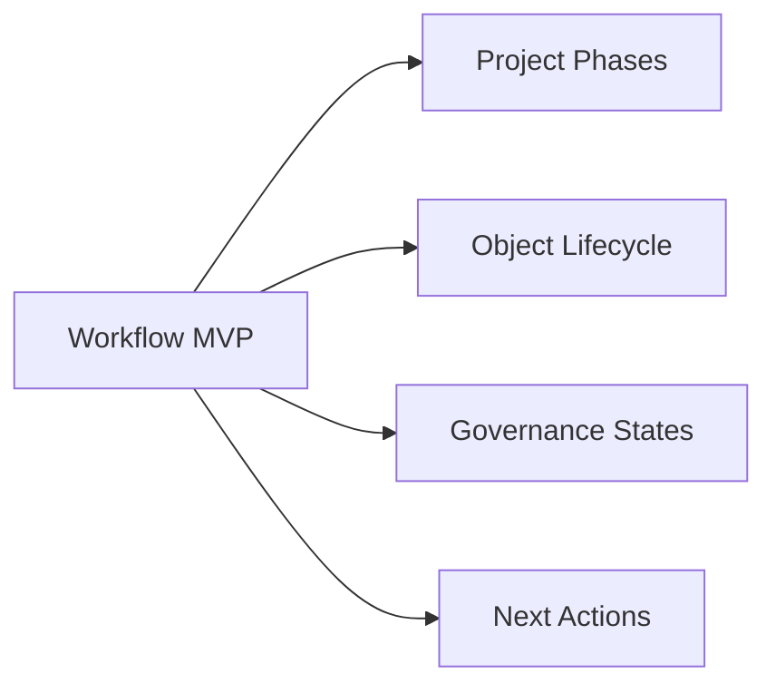

# 67. 工作流状态机设计

## 这篇文档回答什么问题

对象系统回答“系统里有什么”，角色系统回答“谁来做”，而工作流状态机回答“项目如何往前走”。

如果没有正式状态机，导演智能体平台就会出现一种常见假象：看起来每个角色都在努力工作，但没有人知道项目现在处在什么状态、下一步应该进到哪里、哪些对象可以被修改。

本篇重点回答：

1. 为什么电影项目平台必须有正式工作流状态机。
2. 状态机应如何与项目阶段、对象生命周期和角色权限联动。
3. Hermes Agent 后续如何把电影工作流收敛成可执行状态图。

---

## 一、为什么项目推进不能只靠自然语言约定

“现在差不多可以拍了”“这个版本基本定了”这种表达，对人类团队勉强可用，但对平台治理远远不够。

状态机的作用，是把“差不多”变成“明确进入某个正式状态”。

---

## 二、工作流状态机的三层视角

电影平台里的状态机不应只有一层，而应至少分三层：

- 项目阶段状态机
- 对象生命周期状态机
- 任务 / review / approval 状态机

---

## 三、项目阶段状态机

项目阶段状态机定义整个项目的大推进方向。

### 每个阶段都在控制什么

- `Development`：剧本、方向、风格、初始 feasibility
- `Preproduction`：breakdown、预算、排期、选角、勘景、分镜
- `PrincipalPhotography`：call sheet、dispatch、进度与成本控制
- `PostProduction`：cut、ADR、VFX、color、mix
- `Delivery`：release package、发行与送审
- `Retrospective`：复盘、知识沉淀、归档

---

## 四、对象生命周期状态机

每个对象也应有自己的生命周期，但总体模式可以统一。

这可以适配：

- `ScriptVersion`
- `BudgetDraft`
- `ScheduleDraft`
- `ShotPlan`
- `ReleasePackage`

---

## 五、任务与治理状态机

角色层、review 层、approval 层也需要状态机，否则系统无法知道一个任务是正在做、待审还是已关闭。

---

## 六、三层状态机如何联动

例如：

- 项目处在 `Preproduction`，允许大规模修改 `ShotPlan`
- 项目进入 `PrincipalPhotography` 后，`ShotPlan` 更偏变更控制而非自由重写
- `Delivery` 阶段只允许特定对象进入 package

---

## 七、为什么状态机必须和权限联动

状态机如果不影响权限，就会沦为装饰。

典型例子：

- 锁稿后的 `ScriptVersion` 不应被普通子智能体直接覆盖
- `Approved` 的 `BudgetDraft` 变更应自动进入新版本，而不是直接改旧版本
- `Packaged` 的 `ReleasePackage` 只能追加归档信息，不能随意重写内容

---

## 八、为什么状态机必须和 next actions 联动

状态机的意义不只是“标记现在”，更是“约束下一步”。

这也是 `MovieThreadState.next_actions` 最重要的来源之一。

---

## 九、典型项目推进时序

---

## 十、在 Hermes Agent 中的映射建议

工作流状态机很适合作为 Hermes 电影化 orchestration 的核心约束层。

### 工程建议

- phase 状态机先做线程级规则
- object 生命周期先做 schema 级枚举
- review / approval 状态机先做治理对象字段
- 后续再把这些状态接到自动 routing 和 tool gating

---

## 十一、MVP 设计建议

第一版优先确保：

1. 项目阶段状态明确
2. 关键对象有统一生命周期枚举
3. review / approval 有显式状态
4. 当前状态能推导 next actions

---

## 十二、结论

工作流状态机的意义，是把导演平台从“大家一直在做事”升级成“系统知道自己正在往哪里推进”。

它本质上是在统一三件事：

- 项目阶段如何前进
- 对象如何进入、通过、退回和归档
- 当前状态如何限制下一步行为

只有把状态机做实，角色系统和对象系统才真正能组成一个可持续运行的项目平台。

---

## 相关文档

- [62-movie-thread-state-design.md](./62-movie-thread-state-design.md)
- [66-review-approval-release-package-object-system.md](./66-review-approval-release-package-object-system.md)
- [68-approval-and-escalation-flow-design.md](./68-approval-and-escalation-flow-design.md)
- [71-lead-agent-transformation-plan.md](./71-lead-agent-transformation-plan.md)
- [74-thread-state-extension-plan.md](./74-thread-state-extension-plan.md)
- [110-hermes-agent-roadmap-for-video-agent-era.md](./110-hermes-agent-roadmap-for-video-agent-era.md)
