# 68. 审批与升级流设计

## 这篇文档回答什么问题

在电影项目里，不是所有问题都需要升级，也不是所有 review 通过都自动等于批准。

如果平台没有正式的审批与升级流，最容易出现两类混乱：

- 小问题被无限放大，决策链瘫痪
- 大问题没人接住，最后在更高成本阶段爆炸

本篇重点回答：

1. 为什么审批流和升级流必须分开设计又彼此关联。
2. 什么情况应该进入 approval，什么情况应该进入 escalation。
3. Hermes Agent 应如何围绕这两条流形成稳定治理机制。

---

## 一、审批与升级不是同一件事

审批流处理的是“某对象能否进入下一正式状态”，升级流处理的是“当前问题是否超出当前角色权限或风险容忍度”。

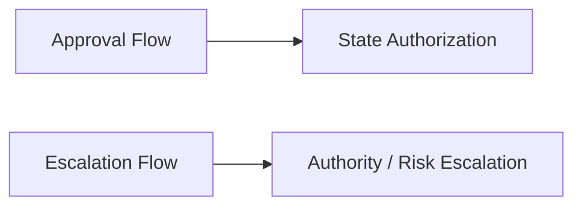

两者都很重要，但它们解决的不是同一个问题。

---

## 二、审批流在回答什么

审批流的核心问题是：

- 这个版本能不能通过
- 这个对象能不能锁定
- 这个交付包能不能正式进入下一节点

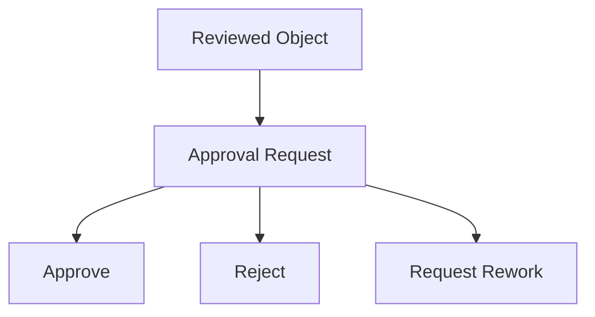

它的焦点是“状态跃迁合法性”。

---

## 三、升级流在回答什么

升级流的核心问题是：

- 当前问题是否超出当前角色权限
- 当前风险是否超出预设容忍范围
- 当前冲突是否必须由更高层裁决

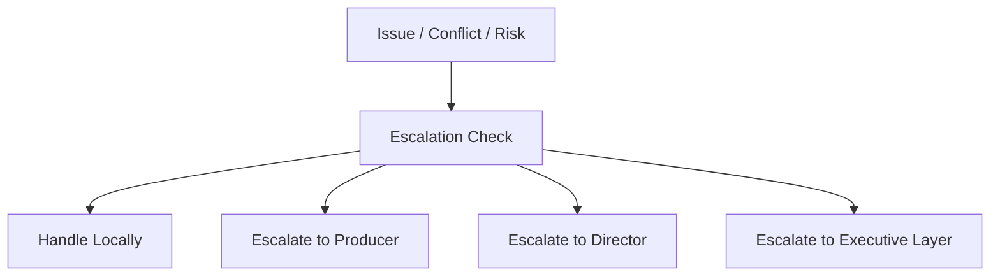

它的焦点是“谁来接这个问题”。

---

## 四、什么样的问题应该进入审批流

典型进入 approval 的情况包括：

- 剧本从 `candidate_lock` 进入 `locked`
- 预算版本从 `reviewed` 进入 `approved`
- 场地从 `recommended` 进入 `locked`
- release candidate 进入 `release package`

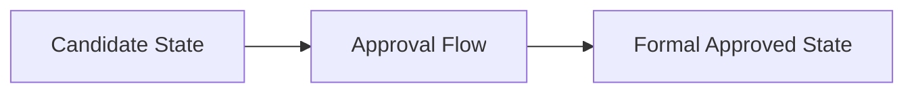

这些问题通常不是“有没有争议”，而是“现在是否满足进入下一正式状态的条件”。

---

## 五、什么样的问题应该进入升级流

典型进入 escalation 的情况包括：

- 子智能体之间给出相互冲突的结论
- 新变更可能击穿预算或拍摄天数
- 某高优先级地点或演员临时不可用
- 现场出现安全、许可或交付风险

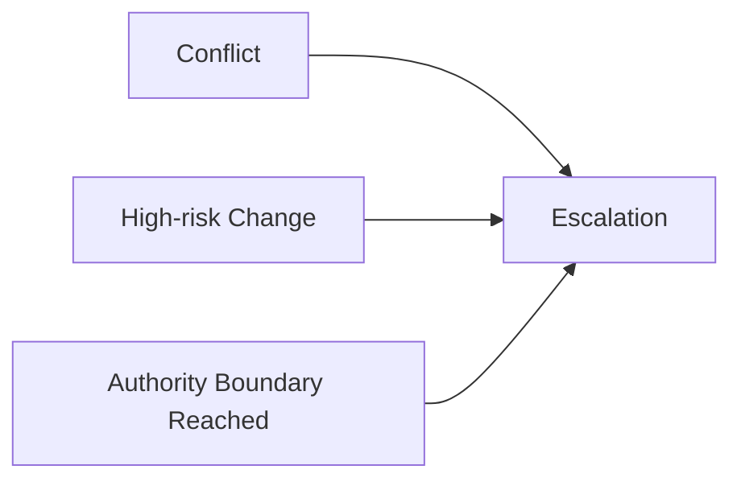

---

## 六、审批流和升级流如何交叉

现实里很多重大问题，会先经过升级，再进入审批。

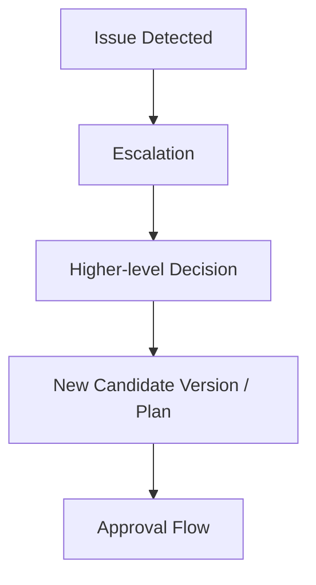

例如：

- 原预算不可行，先升级给制片 / 导演裁决 scope
- 新方案形成后，再进入正式 approval

---

## 七、建议的升级层级

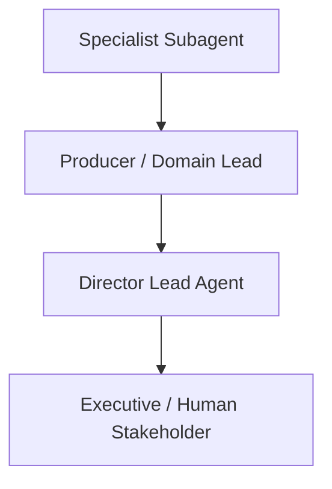

### 各层大致负责什么

- `Specialist Subagent`：先在专业域内解决
- `Producer / Domain Lead`：处理跨成本、排期、资源的 trade-off
- `Director Lead Agent`：处理创作与生产冲突的最终裁决
- `Executive / Human Stakeholder`：处理超出系统授权的大问题

---

## 八、审批与升级对象建议

建议至少建模：

- `ApprovalRequest`
- `ApprovalDecision`
- `EscalationRecord`
- `RiskTrigger`
- `DecisionRecord`

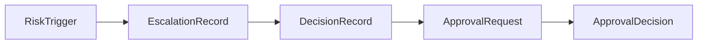

---

## 九、典型协作时序

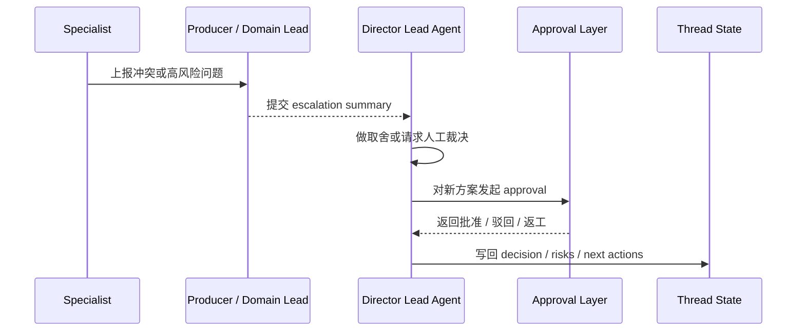

---

## 十、为什么升级流一定要留痕

如果 escalation 只发生在聊天里，系统很快会失去两类关键信息：

- 为什么当时做了这个决策
- 这个问题以后再次出现时该如何处理

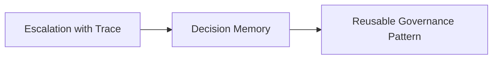

升级流是治理知识的重要来源之一。

---

## 十一、在 Hermes Agent 中的映射建议

审批和升级流很适合作为 Hermes 电影治理扩展里的高优先级模块。

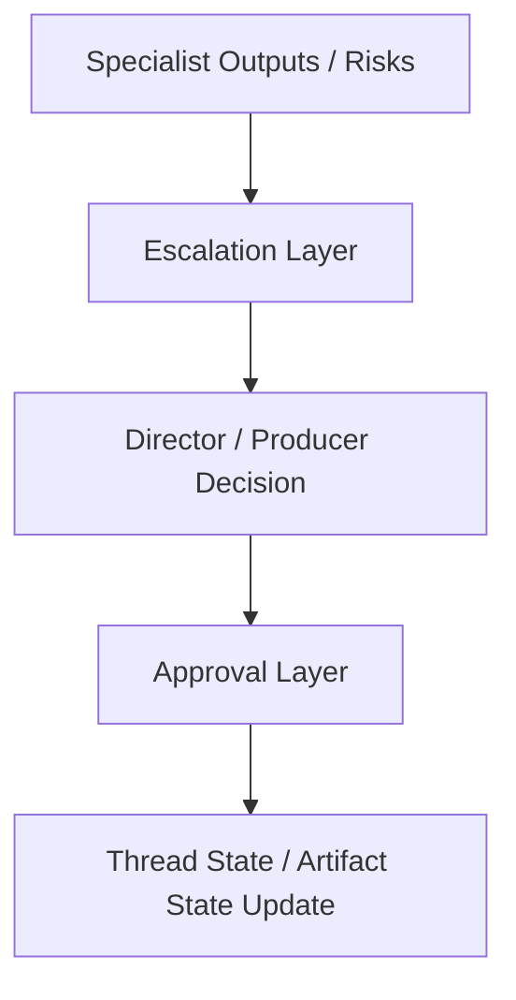

### 工程建议

- 高风险变更自动生成 `RiskTrigger`
- 超权限问题生成 `EscalationRecord`
- 关键状态跃迁统一走 `ApprovalRequest`
- 最终决策同步回 `MovieThreadState`

---

## 十二、MVP 设计建议

第一版优先做四件事：

1. 区分 approval 和 escalation
2. 为高风险问题生成 escalation 记录
3. 为关键状态跃迁生成 approval 请求
4. 把最终裁决写回状态和 artifacts

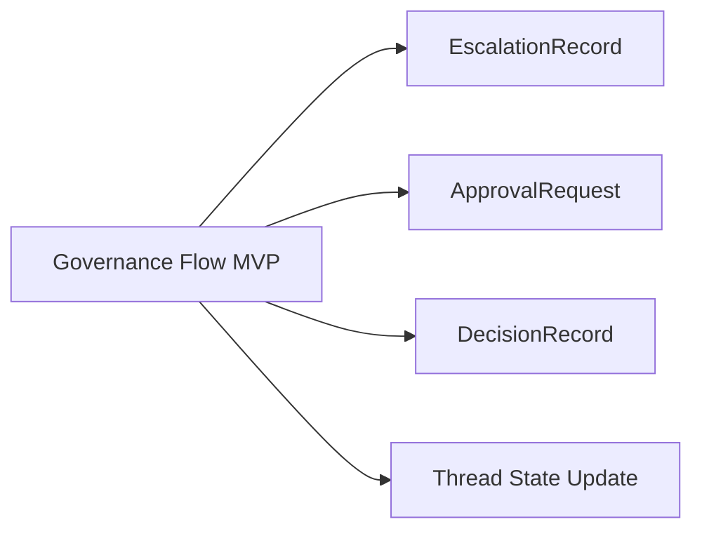

---

## 十三、结论

审批流和升级流共同构成导演平台的治理中枢。

它们分别回答：

- 这个对象能不能进入下一正式状态
- 这个问题到底该由谁来接住

只有把两条流拆清又接起来，平台才能既不失控，也不过度僵化。

---

## 相关文档

- [41-on-set-escalation-and-decision-making.md](./41-on-set-escalation-and-decision-making.md)
- [49-review-flow-versioning-and-release-package.md](./49-review-flow-versioning-and-release-package.md)
- [66-review-approval-release-package-object-system.md](./66-review-approval-release-package-object-system.md)
- [67-workflow-state-machine-design.md](./67-workflow-state-machine-design.md)
- [111-video-agents-risk-evals-and-governance.md](./111-video-agents-risk-evals-and-governance.md)
