# 69. 记忆与知识沉淀设计

## 这篇文档回答什么问题

如果导演智能体平台只会处理当前项目，而不会把有效经验沉淀下来，那么它永远只是一个一次性项目助理，而不是长期进化系统。

本篇重点回答：

1. 电影项目里哪些信息适合进入长期 memory，哪些只适合归档。
2. 记忆、知识、模板和归档应该如何分层。
3. Hermes Agent 应如何把复盘结果转成可复用能力。

---

## 一、为什么记忆系统不能等同于项目资料库

项目资料库负责“保留”，记忆系统负责“可持续复用”。

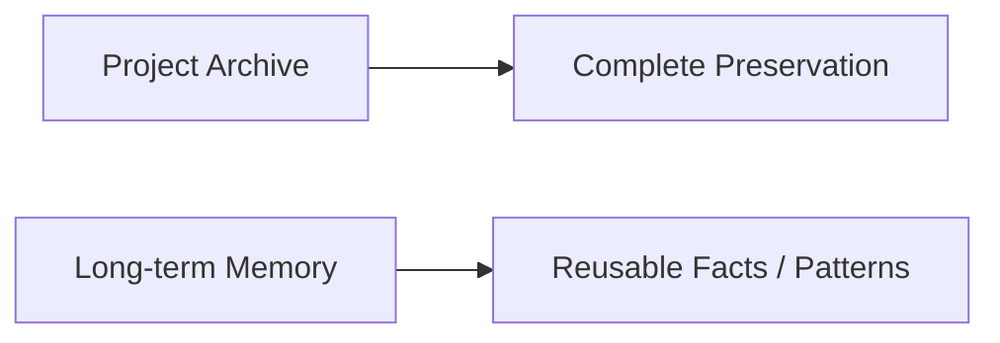

这两者都有价值，但目标完全不同。

---

## 二、什么值得进入长期 memory

真正值得进入长期 memory 的，通常具备三个特点：

- 跨项目可复用
- 稳定性较高
- 对后续决策有明显帮助

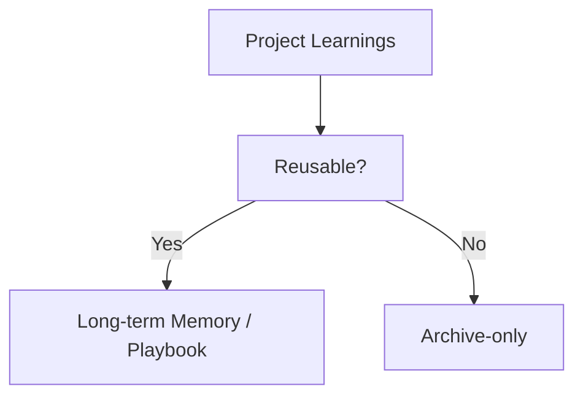

典型例子：

- 某类题材在前期分镜中高频出现的有效模式
- 某规模项目里最常见的预算风险触发器
- 某类拍摄场景中稳定有效的 tech scout checklist

---

## 三、什么不适合进入长期 memory

并不是所有项目细节都应该写入长期记忆。

不适合长期沉淀的通常包括：

- 单个项目的临时沟通琐事
- 已过时的 workaround
- 只对一次合作关系有效的偶发经验

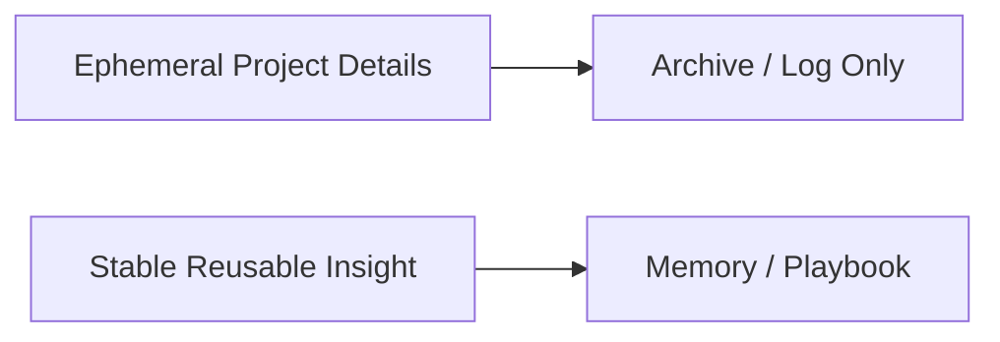

---

## 四、建议的分层结构

建议把“沉淀系统”至少分成四层：

- `ArchiveSnapshot`
- `LessonLearned`
- `ReusablePlaybook`
- `TemplateAsset`

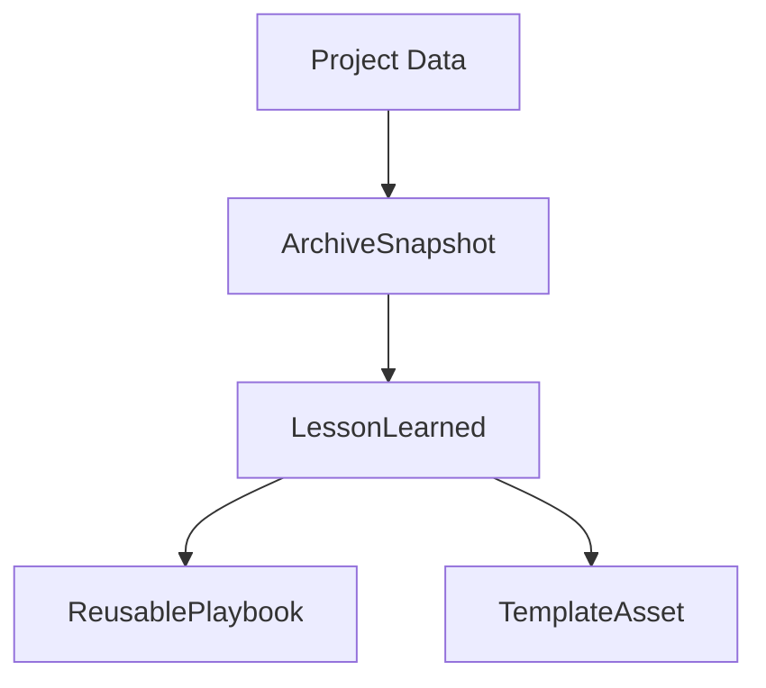

### 分层含义

- `ArchiveSnapshot`：保留项目完整上下文
- `LessonLearned`：提炼单条教训或经验
- `ReusablePlaybook`：组织成可执行方法
- `TemplateAsset`：形成可直接复用模版

---

## 五、为什么记忆必须和证据绑定

没有证据的记忆很容易变成“系统偏见”。

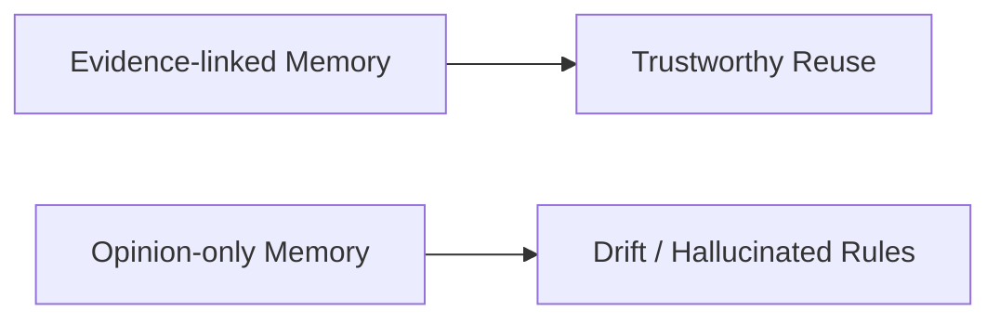

因此建议每条高价值记忆至少关联：

- 来源项目
- 证据对象
- 适用范围
- 失效条件

---

## 六、建议的对象字段

### `LessonLearned`

- `lesson_id`
- `domain`
- `summary`
- `evidence_refs`
- `reuse_scope`
- `confidence`

### `ReusablePlaybook`

- `playbook_id`
- `scenario`
- `recommended_workflow`
- `source_lessons`
- `status`

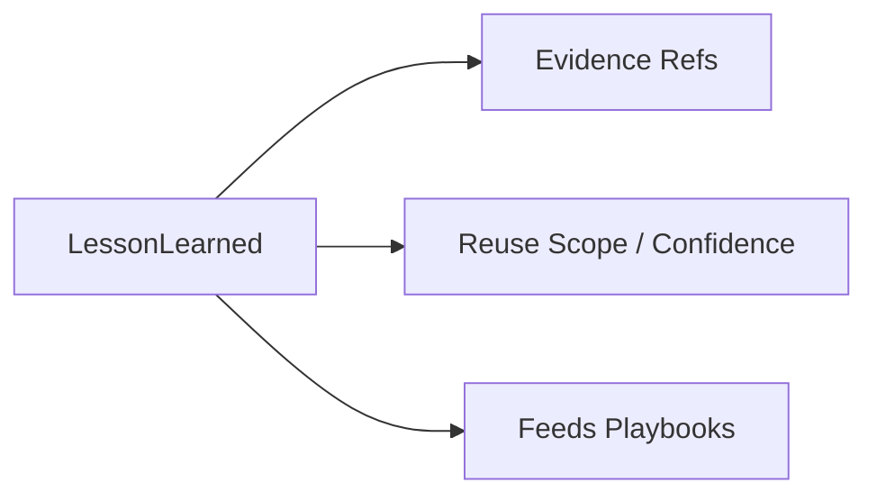

---

## 七、从项目到知识的转化链

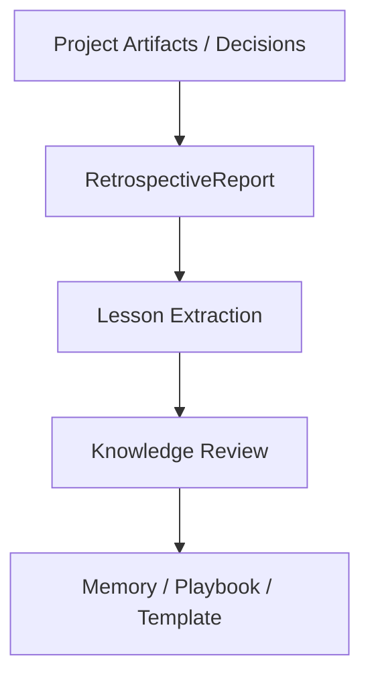

这里最重要的是中间两步：

- `Lesson Extraction`
- `Knowledge Review`

否则系统就会把所有项目噪音都写进长期记忆。

---

## 八、典型协作时序

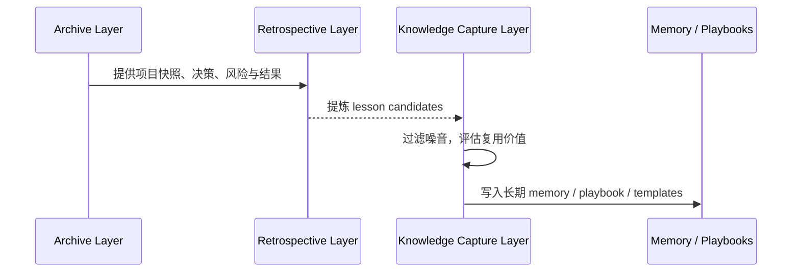

---

## 九、为什么记忆系统必须服务角色系统

长期知识如果不能被角色系统调用，就只是静态文档。

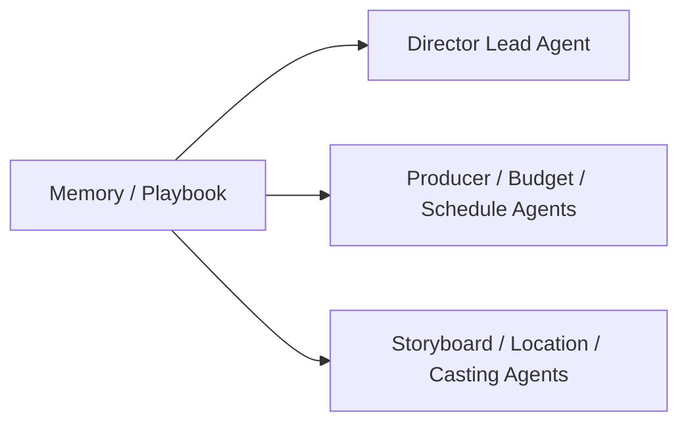

例如：

- 勘景子智能体可调用历史 `TechScoutChecklist`
- 预算子智能体可调用某类项目的高频风险模式
- 导演主智能体可调用某类风格统一 playbook

---

## 十、在 Hermes Agent 中的映射建议

记忆与知识沉淀最适合做成 Hermes 的长期能力增长层。

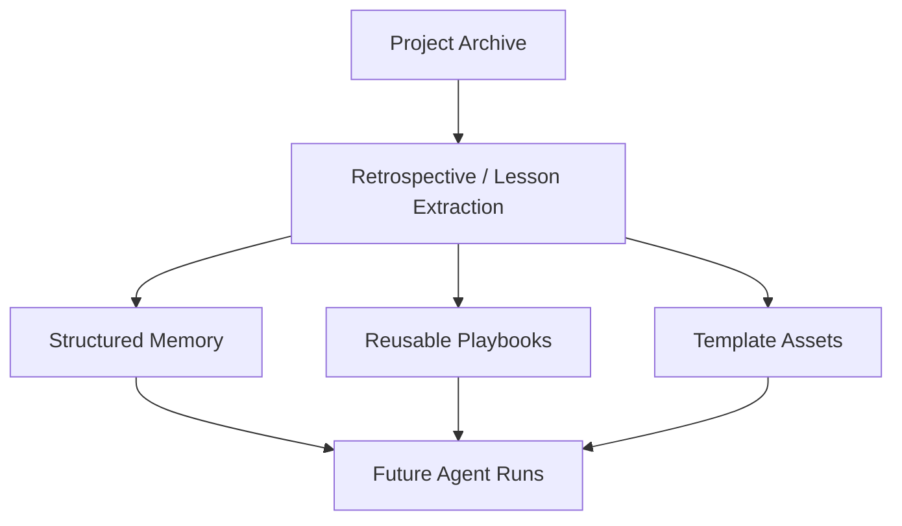

### 工程建议

- archive 和 memory 分库存放
- lesson 进入 memory 前先过 review
- playbook 与 specific role / phase 绑定
- 模板资产与 workspace artifact 流打通

---

## 十一、MVP 设计建议

第一版优先做四件事：

1. 从 retrospective 中提取 `LessonLearned`
2. 为每条 lesson 绑定 evidence refs
3. 将高价值 lesson 组织成简单 playbook
4. 让主智能体和关键子智能体可读取这些 playbook

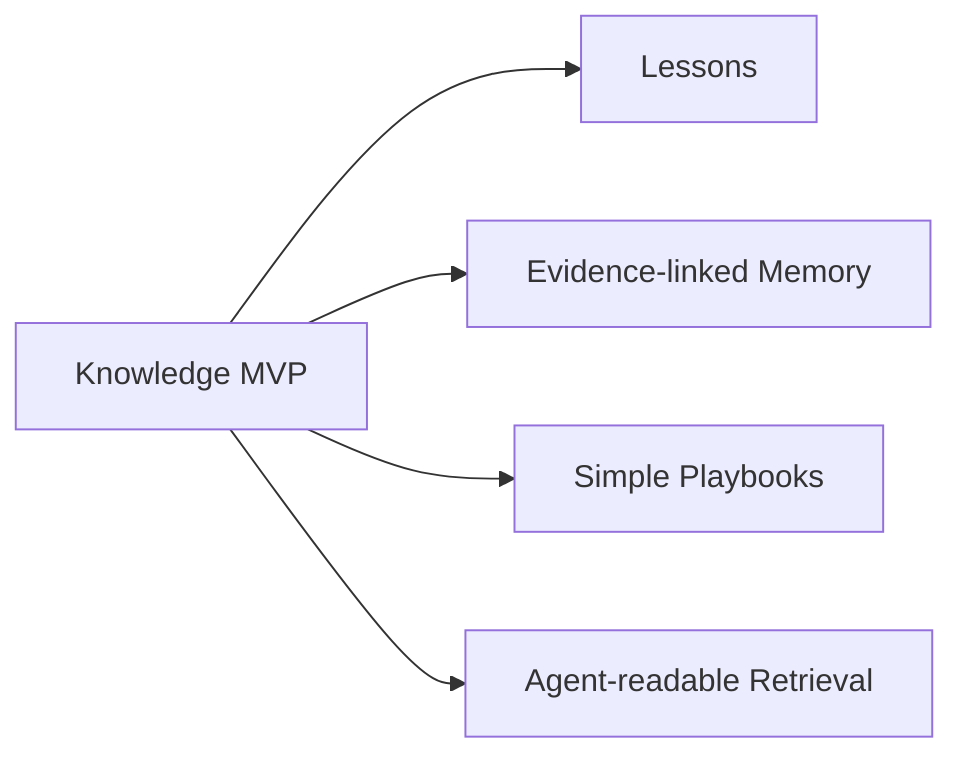

---

## 十二、结论

记忆与知识沉淀系统的价值，不是让平台“记住更多”，而是让平台“记住真正值得复用的东西”。

它本质上是在回答：

- 哪些经验应跨项目保留
- 哪些经验只是项目噪音
- 平台如何把复盘结果变成未来能力

只有把 memory、playbook、template 和 archive 分层做清，Hermes 才能真正从项目执行器进化成长期学习系统。

---

## 相关文档

- [07-tools-memory-skills.md](./07-tools-memory-skills.md)
- [51-project-retrospective-and-knowledge-capture.md](./51-project-retrospective-and-knowledge-capture.md)
- [70-artifact-version-and-archive-system.md](./70-artifact-version-and-archive-system.md)
- [76-movie-skills-design.md](./76-movie-skills-design.md)
- [116-output-management-and-agent-artifacts-system.md](./116-output-management-and-agent-artifacts-system.md)
