# 70. Artifact、版本与归档系统

## 这篇文档回答什么问题

电影导演智能体平台最终一定会产生大量 artifacts：

- 剧本文档
- 预算表
- 排期草稿
- 分镜图
- prompt 包
- review 记录
- release package

如果没有正式的 artifact、版本和归档系统，这些产物就会越积越多，但价值越来越低。

本篇重点回答：

1. 为什么 artifact、版本和归档必须作为一套统一系统设计。
2. 平台应如何区分工作版本、有效版本和归档快照。
3. Hermes Agent 应如何把 workspace 文件流与对象系统、治理系统接起来。

---

## 一、为什么 artifact 不能只是文件

文件可以保存内容，但它不能天然回答：

- 这是哪个对象的哪一版
- 这是不是当前有效版本
- 它是否已经通过 review / approval
- 它是否已经进入 archive snapshot

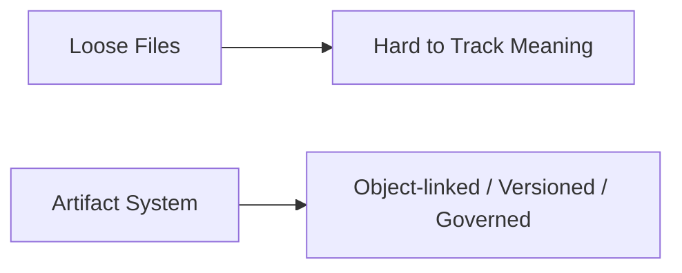

所以 artifact 系统的重点不是“多存文件”，而是“把文件和对象语义接起来”。

---

## 二、三层视角：artifact、version、archive

建议把这套系统至少拆成三层：

- `ArtifactRecord`
- `VersionRecord`
- `ArchiveSnapshot`

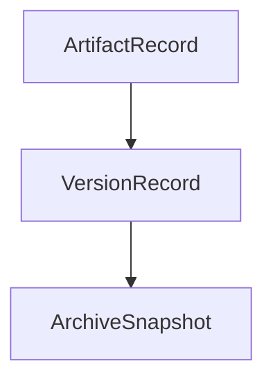

### 含义

- `ArtifactRecord`：某类产物的持久身份
- `VersionRecord`：该产物的某个具体版本
- `ArchiveSnapshot`：在某个里程碑时点对一组已批准产物的冻结快照

---

## 三、ArtifactRecord 应承载什么

`ArtifactRecord` 更像文件语义的主索引。

### 建议字段

- `artifact_id`
- `artifact_type`
- `linked_object_type`
- `linked_object_id`
- `canonical_path`
- `owner_role`
- `status`

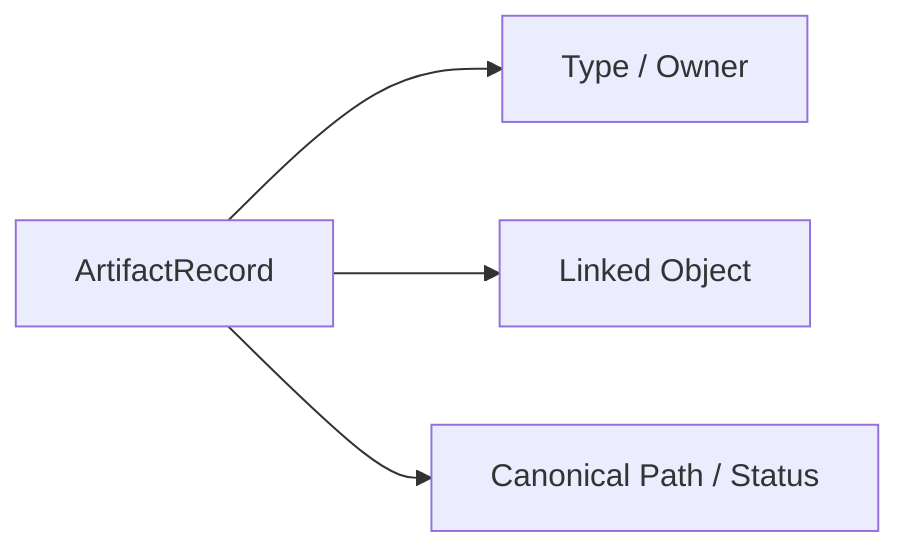

---

## 四、VersionRecord 应承载什么

`VersionRecord` 是 artifact 治理的核心。

### 建议字段

- `version_id`
- `artifact_id`
- `version_label`
- `derived_from_version_id`
- `change_summary`
- `review_state`
- `approval_state`
- `file_refs`

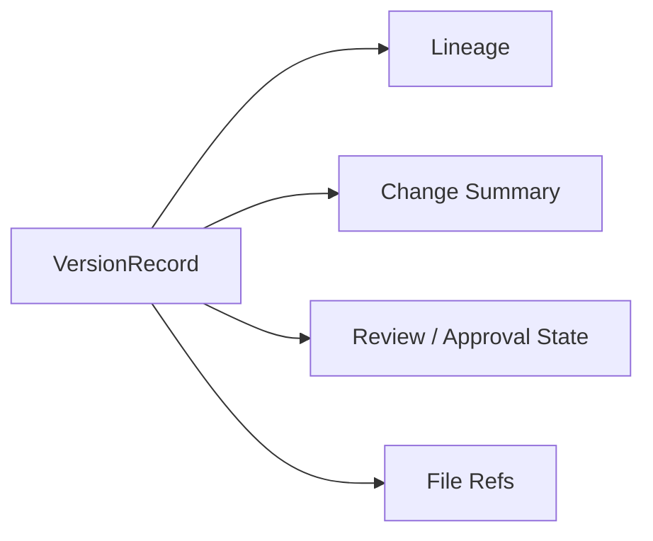

---

## 五、ArchiveSnapshot 应承载什么

`ArchiveSnapshot` 不是压缩包，而是里程碑级的冻结视图。

### 建议字段

- `snapshot_id`
- `snapshot_scope`
- `included_version_refs`
- `decision_refs`
- `release_refs`
- `created_at`
- `status`

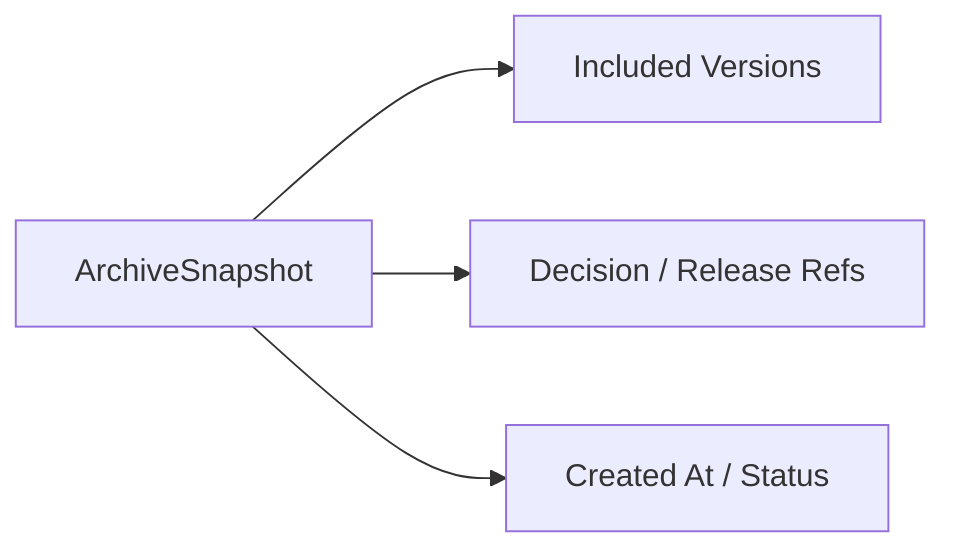

---

## 六、版本层为什么一定要比文件层更重要

文件层只能说“有这些文件”，版本层才能说“这些文件代表哪个正式对象状态”。

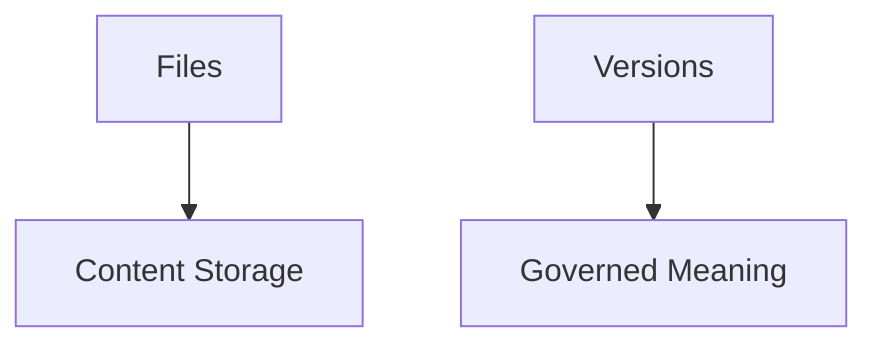

因此：

- review 应绑定 version，而不是裸文件
- approval 应批准 version，而不是目录
- archive 应冻结 version 集合，而不是任意文件列表

---

## 七、从工作版本到归档快照的主链

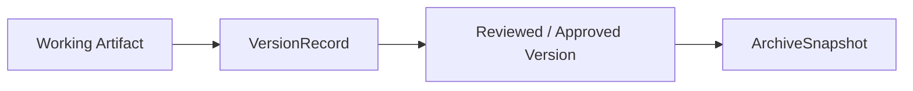

这条链的意义是把“仍在变化的工作材料”和“已经定稿的项目历史”分开。

---

## 八、典型协作时序

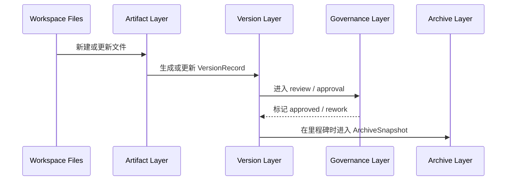

---

## 九、为什么 archive 必须是“快照”而不是“历史堆积”

如果 archive 只是把所有旧文件堆起来，未来根本无法回答“某个阶段结束时，正式有效的到底是什么”。

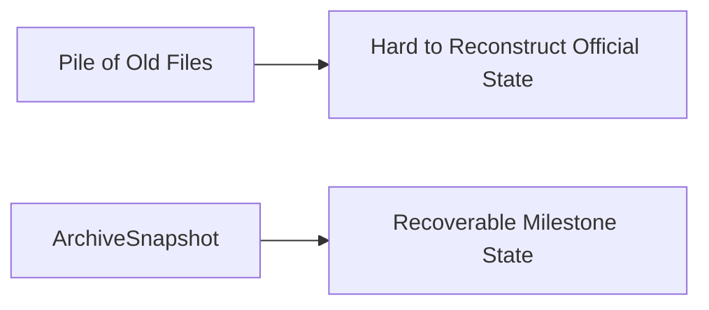

快照的价值是重建能力。

---

## 十、与知识沉淀的关系

artifact archive 和长期知识并不是一回事，但它们必须连通。

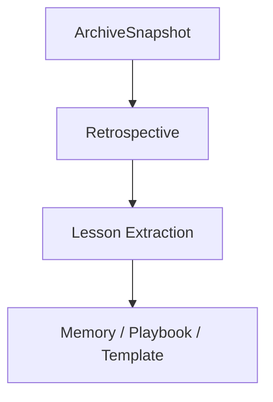

archive 负责保存证据，knowledge layer 负责提炼复用价值。

---

## 十一、在 Hermes Agent 中的映射建议

artifact、版本和归档系统很适合作为 Hermes 工作区与对象系统之间的桥。

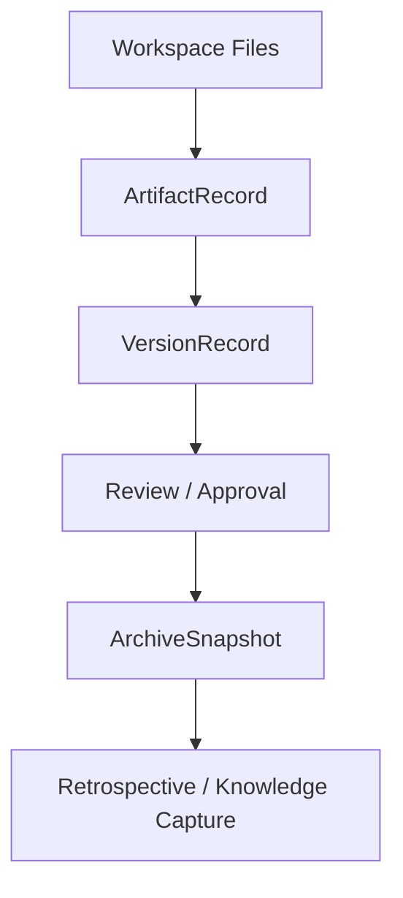

### 工程建议

- 文件改动自动映射到 artifact / version 关系
- 关键对象保留 canonical artifact path
- archive snapshot 指向一组正式 version refs
- 后续把 snapshot 接到 retrospective 和 memory 管线

---

## 十二、MVP 设计建议

第一版优先确保：

1. 关键 artifacts 有 `ArtifactRecord`
2. 每个重要产物有 `VersionRecord`
3. review / approval 绑定 version
4. 项目里程碑可生成 `ArchiveSnapshot`

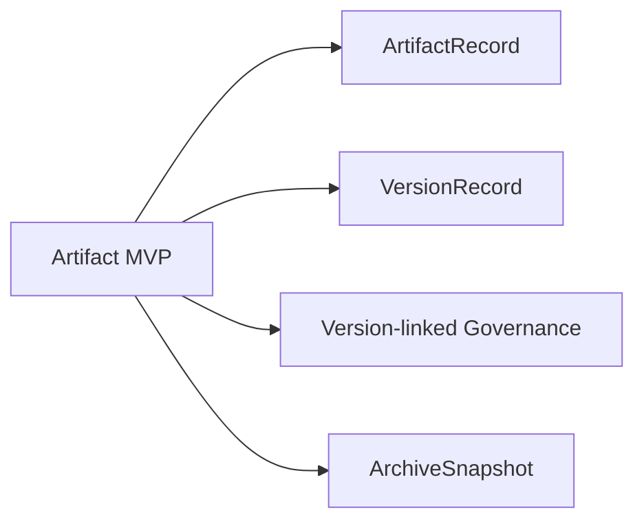

---

## 十三、结论

artifact、版本和归档系统共同构成导演平台的产物治理底座。

它们分别回答：

- 文件在系统里是什么
- 当前正式版本是哪一版
- 在某个里程碑时，系统冻结了哪些正式结果

只有把这套系统做出来，导演智能体平台才不会被不断增长的文件和草稿吞没，而能真正形成可追溯、可恢复、可复盘的长期工程资产。

---

## 相关文档

- [49-review-flow-versioning-and-release-package.md](./49-review-flow-versioning-and-release-package.md)
- [66-review-approval-release-package-object-system.md](./66-review-approval-release-package-object-system.md)
- [69-memory-and-knowledge-capture-design.md](./69-memory-and-knowledge-capture-design.md)
- [79-workspace-artifacts-and-file-flow.md](./79-workspace-artifacts-and-file-flow.md)
- [116-output-management-and-agent-artifacts-system.md](./116-output-management-and-agent-artifacts-system.md)
