# 71. Lead Agent 改造计划

## 这篇文档回答什么问题

前面的文档已经把导演主智能体的职责、对象系统和治理流讲清楚了。接下来真正的问题变成：

- Hermes 现有 `AIAgent` 应该如何逐步演进成电影域的 Director Lead Agent
- 哪些能力应该接在 `run_agent.py` 里
- 哪些能力应该放在 prompt builder、state、toolset 和 artifact 层

本篇重点回答：

1. Lead Agent 电影化改造的总路线。
2. 当前 `AIAgent` 最适合接入哪些能力。
3. 一条尽量低风险、可渐进落地的改造顺序。

---

## 一、为什么不应该重写一套新的总 Agent Loop

当前仓库里，`run_agent.py` 的 `AIAgent` 已经承担了最核心的编排责任：

- 组装 prompt
- 装载工具
- 维护对话循环
- 驱动工具调用
- 与 memory、compressor、usage 统计配合

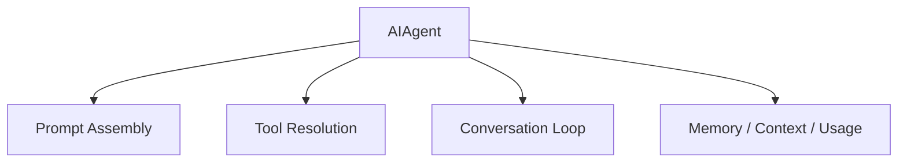

因此更合理的方向不是新造一个平行的 `MovieAgentRunner`，而是让 `AIAgent` 带上电影项目控制面。

---

## 二、Lead Agent 改造的目标是什么

Lead Agent 电影化后，不是“更会聊电影”，而是要多承担三层责任：

- 项目阶段控制
- 角色调度控制
- 对象与治理控制

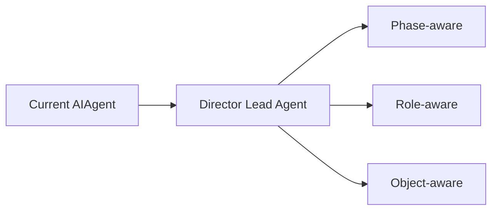

这意味着它必须知道：

- 当前项目处在哪个 phase
- 当前 working set 里有哪些对象
- 哪些角色允许被调用
- 哪些状态跃迁需要 approval

---

## 三、当前最适合接入的源码入口

从现有代码结构看，Lead Agent 改造最适合接在以下位置：

- `run_agent.py`
- `agent/prompt_builder.py`
- `model_tools.py`
- `gateway/session.py`
- `hermes_state.py`

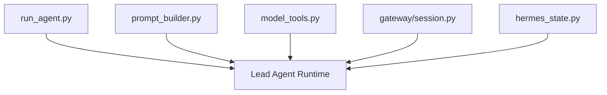

这里的原则是：

- `run_agent.py` 负责 orchestrate
- `prompt_builder.py` 负责表达
- `model_tools.py` 负责能力入口
- `session/state` 负责状态承载

---

## 四、第一阶段改造：让 AIAgent 先具备 Movie Context Awareness

第一阶段不需要改 delegation，也不需要先做很多 movie tools，先让主智能体“知道自己在一个电影项目线程里”。

### 建议第一批能力

- 读取 `MovieThreadState`
- 读取当前 phase
- 读取 active object refs
- 读取 current risks / pending approvals
- 将这些内容注入 turn prompt

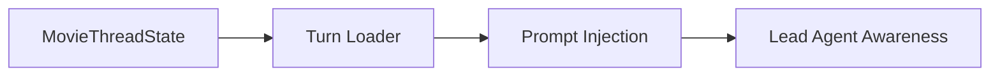

只要这层成立，`AIAgent` 就已经开始从通用 agent 进入导演主控模式。

---

## 五、第二阶段改造：让 Lead Agent 具备 Phase-aware Routing

当前 `model_tools.py` 会根据 toolsets 输出本轮可用工具。

这为 phase-aware routing 提供了天然入口。

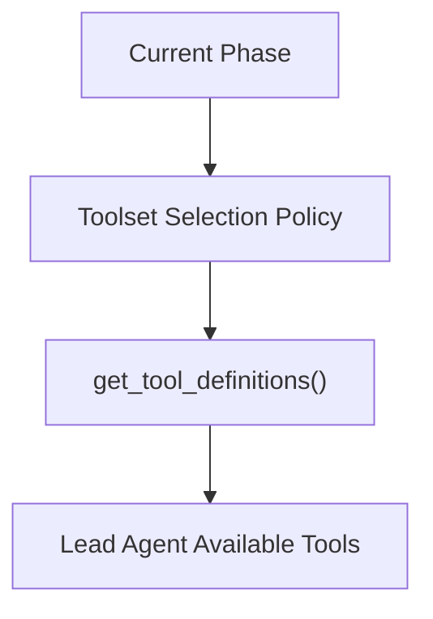

### 例如

- `Development`：更偏 script / research / note 类能力
- `Preproduction`：更偏 breakdown / budget / schedule / storyboard
- `PrincipalPhotography`：更偏 daily plan / dispatch / escalation
- `PostProduction`：更偏 review / version / release package

这一步仍然不需要大改 loop，只需要增强 toolset 选择策略。

---

## 六、第三阶段改造：让 Lead Agent 具备 Role-aware Delegation

当主智能体已经具备项目感知和阶段感知之后，再引入角色化 delegation 才更稳。

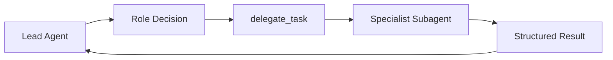

这一步的关键变化不是“开始委派”，而是：

- 不再只委派普通任务
- 而是委派到明确角色
- 并绑定对象输入输出契约

---

## 七、第四阶段改造：让 Lead Agent 具备 Governance Hooks

Lead Agent 电影化之后，不能只负责生成和调度，还要负责治理判断。

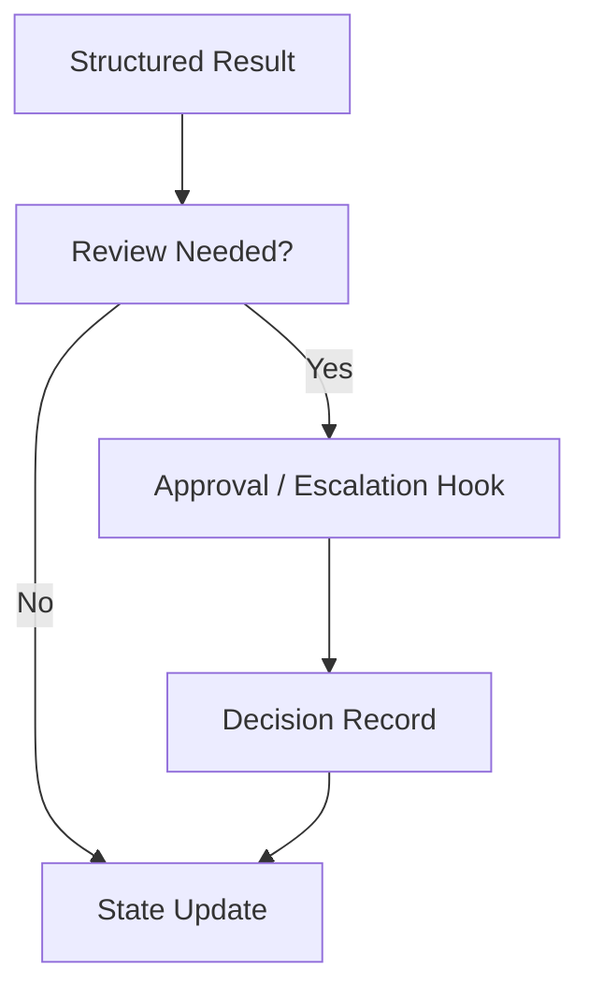

### 这一步应该补的不是大模型能力，而是：

- review 触发点
- approval 触发点
- escalation 触发点
- state / artifact 回写钩子

---

## 八、推荐的 Lead Agent 内部分层

不建议把所有电影逻辑直接堆进 `AIAgent.run_conversation()`。

更合理的结构是：

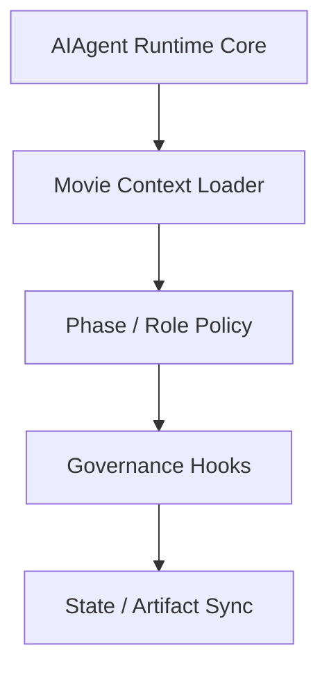

### 解释

- `AIAgent Runtime Core`：保留现有通用 loop
- `Movie Context Loader`：装载 `MovieThreadState`
- `Phase / Role Policy`：决定工具与 delegation 策略
- `Governance Hooks`：决定 review / approval / escalation
- `State / Artifact Sync`：把关键结果写回

---

## 九、为什么 prompt cache 约束对这条改造路线很重要

Hermes 当前对 prompt caching 很敏感，这决定了 Lead Agent 改造不能走“每轮彻底重建系统 prompt”的路线。

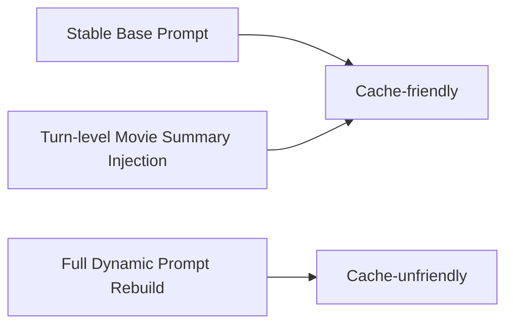

因此推荐：

- 稳定部分留在基础 prompt / persona
- 动态电影项目摘要放在 turn-level 注入
- 高频变化项尽量来自 state summary，而不是重写长 prompt

---

## 十、推荐的实施顺序

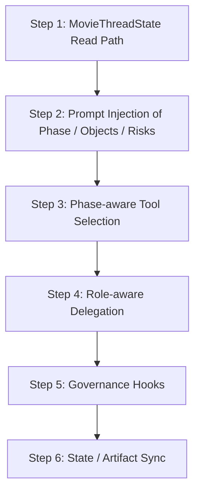

这条顺序的优势是：

- 每一步都可以单独验证
- 不需要一次性重做 agent 架构
- 能最大限度复用现有 `AIAgent`

---

## 十一、在源码层的建议拆分

建议按“少改 runtime、大量新建 movie 层辅助模块”的思路推进。

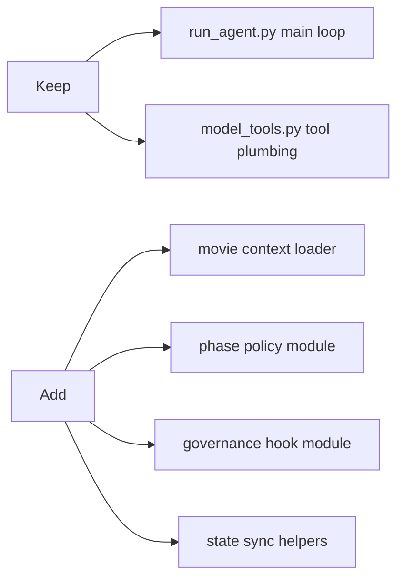

这样可以避免把电影域逻辑污染整个通用 agent core。

---

## 十二、结论

Lead Agent 改造的正确方向，不是推翻 `AIAgent`，而是让它逐步具备：

- 电影项目态感知
- 阶段化工具与角色调度
- review / approval / escalation 钩子
- 与 state / artifact 的正式同步

这是一条以现有 `run_agent.py` 为中心、低风险、可渐进演进的路线，也是 Hermes 最适合走的电影化主路径。

---

## 相关文档

- [10-source-mapping-agent-runtime.md](./10-source-mapping-agent-runtime.md)
- [52-director-lead-agent-design.md](./52-director-lead-agent-design.md)
- [67-workflow-state-machine-design.md](./67-workflow-state-machine-design.md)
- [72-task-tool-and-delegation-extension.md](./72-task-tool-and-delegation-extension.md)
- [74-thread-state-extension-plan.md](./74-thread-state-extension-plan.md)
- [103-hermes-agent-movie-integration-strategy-summary.md](./103-hermes-agent-movie-integration-strategy-summary.md)
