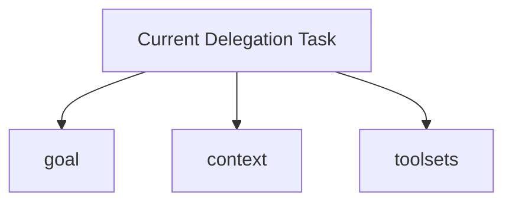
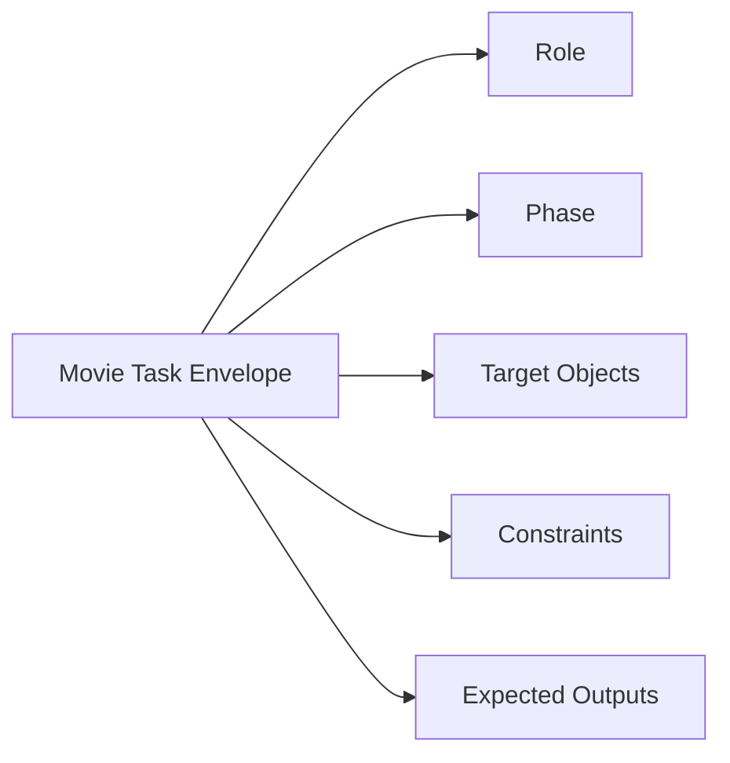
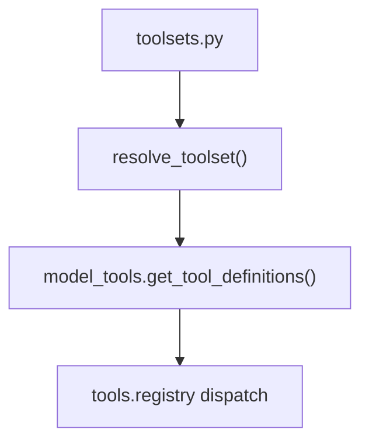
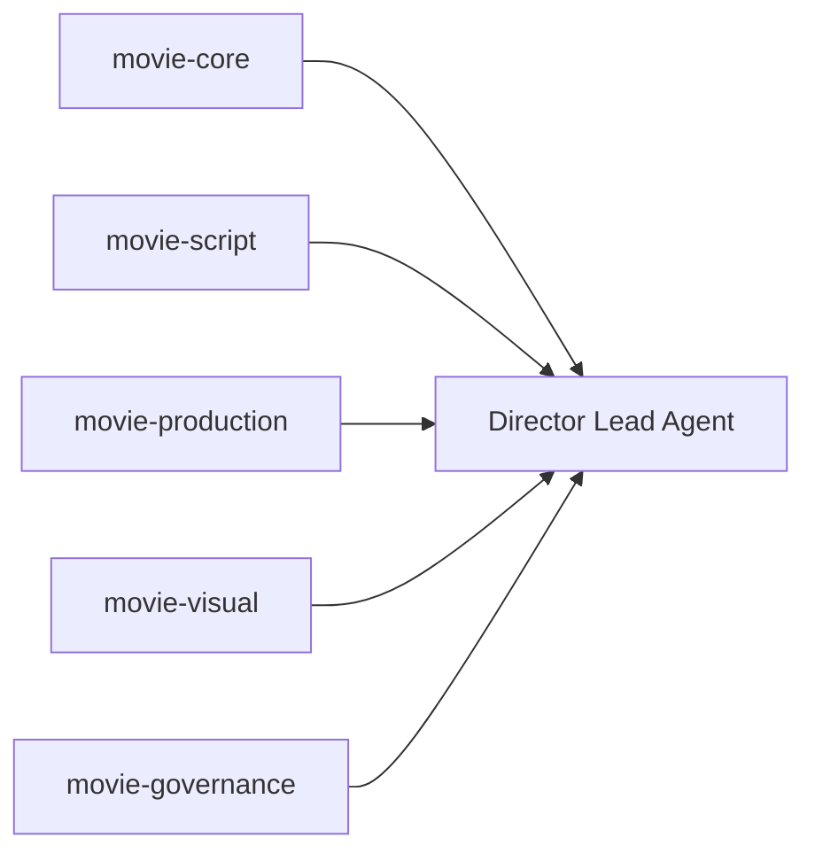
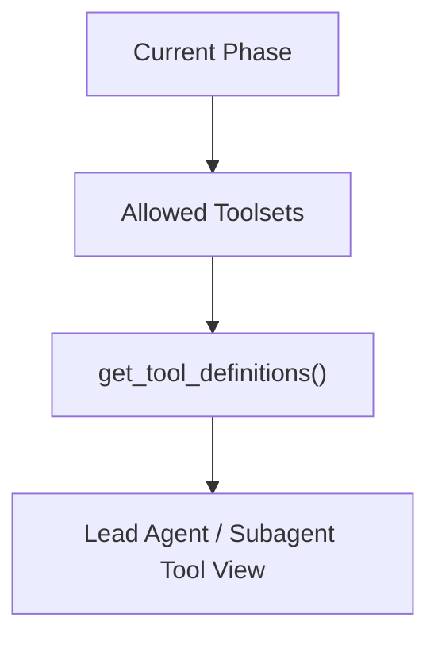
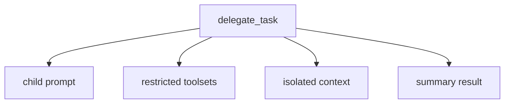
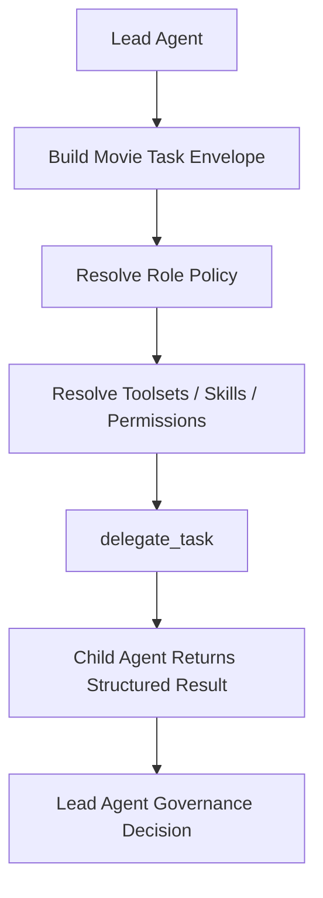
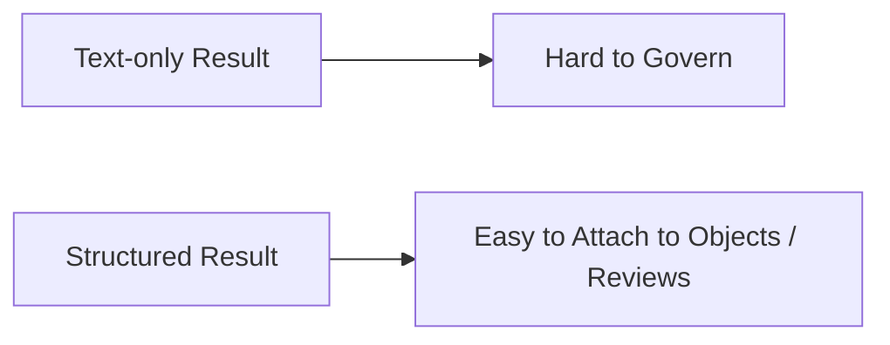
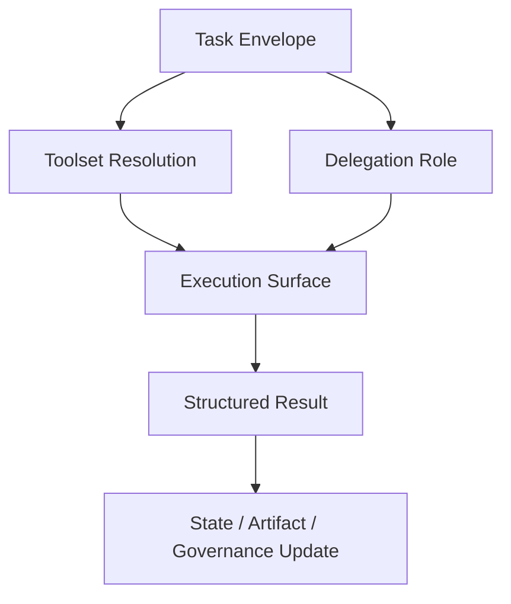

# 72. task、tool 与 delegation 扩展设计

## 这篇文档回答什么问题

电影化改造真正落到工程层时，最先需要被重新定义的，不只是角色，还有三件更基础的东西：

- task 到底怎么表达
- tool 到底怎么按 phase 和 role 暴露
- delegation 到底怎么从“通用子任务”升级成“角色化协作”

本篇重点回答：

1. 当前 Hermes 的 task / tool / delegation 链路有什么特点。
2. 电影平台要补哪些扩展层，而不是重写底座。
3. 一条和现有 `model_tools.py`、`toolsets.py`、`tools/delegate_tool.py` 兼容的改造方案。

---

## 一、当前链路的总体结构

从现有代码可以把链路简化成：

这条链本身已经足够强，电影化要做的是“加规则层”，不是“推翻实现层”。

---

## 二、当前 task 表达还偏自然语言

现在的委派任务更像：

- 一段 goal
- 一段 context
- 一个 toolset 列表

这对通用任务很好，但对电影项目还不够。

电影项目更需要的是结构化 task envelope。

---

## 三、建议的 Movie Task Envelope

建议在不破坏现有 `delegate_task` 入口的前提下，增加一层 movie 任务信封。

### 建议字段

- `task_type`
- `role`
- `phase`
- `target_object_refs`
- `input_artifacts`
- `constraints`
- `expected_outputs`
- `governance_mode`

这样主智能体发出的就不再只是“去分析一下”，而是“以某角色、围绕某对象、在某阶段、按某约束执行某任务”。

---

## 四、为什么 tool 扩展必须走 toolset 路线

当前 `toolsets.py` 和 `model_tools.py` 已经形成很清晰的工具解析链：

- `toolsets.py` 负责工具分组
- `model_tools.py` 负责工具解析和 schema 输出
- `tools.registry` 负责具体注册和分发

所以 movie 扩展不应该绕开它们重新做一套 movie tool router。

---

## 五、建议的 movie toolset 扩展方式

建议把 movie 能力拆成 domain toolsets，而不是一个巨大的 `movie` 工具包。

例如：

- `movie-core`
- `movie-script`
- `movie-production`
- `movie-visual`
- `movie-governance`

这样 phase 和 role 才能细粒度选择工具能力。

---

## 六、phase-aware tool 暴露策略

工具不是“有就全给”，而应由 phase 决定暴露范围。

### 例子

- `Development`：更偏 script / research / style note
- `Preproduction`：更偏 breakdown / budget / schedule / storyboard
- `PrincipalPhotography`：更偏 call sheet / dispatch / risk escalation
- `PostProduction`：更偏 review / release / archive

---

## 七、为什么 delegation 要从通用变成角色化

当前 `tools/delegate_tool.py` 已经具备：

- 独立上下文
- 独立 toolset
- child system prompt
- blocked tool constraints

电影化后要补的，不是这些底座，而是：

- 角色元信息
- 对象输入输出契约
- phase gating
- 权限边界

---

## 八、建议的角色化 delegation 流

这里的关键改动是：在真正调用 `delegate_task` 之前，先经过一层 movie policy resolution。

---

## 九、任务结果为什么必须结构化

如果 child agent 只返回长文本摘要，电影平台很快就会遇到两个问题：

- 主智能体难以把结果写回对象系统
- review / approval 无法明确针对哪个结果对象

### 建议的返回结构至少包括

- `summary`
- `produced_object_refs`
- `artifact_refs`
- `risk_flags`
- `recommended_next_actions`

---

## 十、task、tool、delegation 三者如何联动

### 解释

- task 定义问题
- tool 定义能力表面
- delegation 定义责任分配

三者缺一不可。

---

## 十一、推荐的实施顺序

这条路线最大的好处是：对现有 registry、toolsets、delegate tool 都是增量扩展。

---

## 十二、结论

task、tool 和 delegation 的电影化扩展，不是另造一个新系统，而是在现有 Hermes 链路上补四层：

- 结构化 movie task envelope
- phase-aware toolsets
- role-aware delegation policy
- 结构化 child result contract

这样做之后，Hermes 才能从“能委派复杂任务”，进化成“能组织电影项目里的正式多角色协作”。

---

## 相关文档

- [10-source-mapping-agent-runtime.md](./10-source-mapping-agent-runtime.md)
- [11-source-mapping-subagents.md](./11-source-mapping-subagents.md)
- [52-director-lead-agent-design.md](./52-director-lead-agent-design.md)
- [73-subagent-registry-cinema-extension.md](./73-subagent-registry-cinema-extension.md)
- [75-movie-tools-design.md](./75-movie-tools-design.md)
