# 73. Subagent Registry 电影化扩展

## 这篇文档回答什么问题

当前 Hermes 已经有非常强的 delegation 底座，但还没有“正式角色注册表”。

如果没有角色注册表，主智能体虽然可以调用 child agents，却很难稳定回答这些问题：

- 现在到底有哪些电影角色
- 每个角色默认有什么工具、skill 和权限
- 哪些阶段允许激活哪些角色
- 哪些角色的结果可以直接写对象，哪些只能给建议

本篇重点回答：

1. 为什么电影平台必须新增 subagent registry。
2. 这个 registry 应该承载哪些元信息。
3. Hermes Agent 应如何在不破坏现有 delegation 的前提下接入这层角色系统。

---

## 一、为什么需要正式角色注册表

当前 `delegate_task` 更像“按任务临时造一个 child agent”，而电影平台需要的是“按角色稳定生成 child agent”。

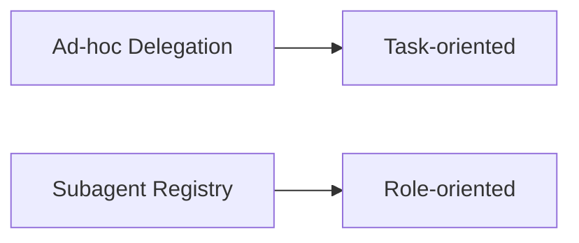

两者不是冲突关系，而是上下层关系：

- delegation 负责执行
- registry 负责定义角色

---

## 二、当前 delegation 已经提供了什么

从 `tools/delegate_tool.py` 可以看到，当前系统已经提供：

- child prompt 构造
- 默认 toolsets
- blocked tools
- workspace hint
- 并发 child execution

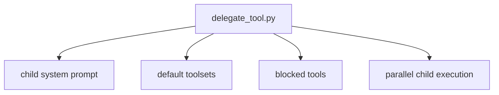

这意味着 registry 不需要重复实现 child runtime，只需要提供角色解析能力。

---

## 三、建议的 registry 角色结构

每个角色建议至少包含以下元信息：

- `role_id`
- `display_name`
- `description`
- `supported_phases`
- `default_toolsets`
- `default_skills`
- `readable_object_types`
- `writable_object_types`
- `output_contract`
- `governance_level`

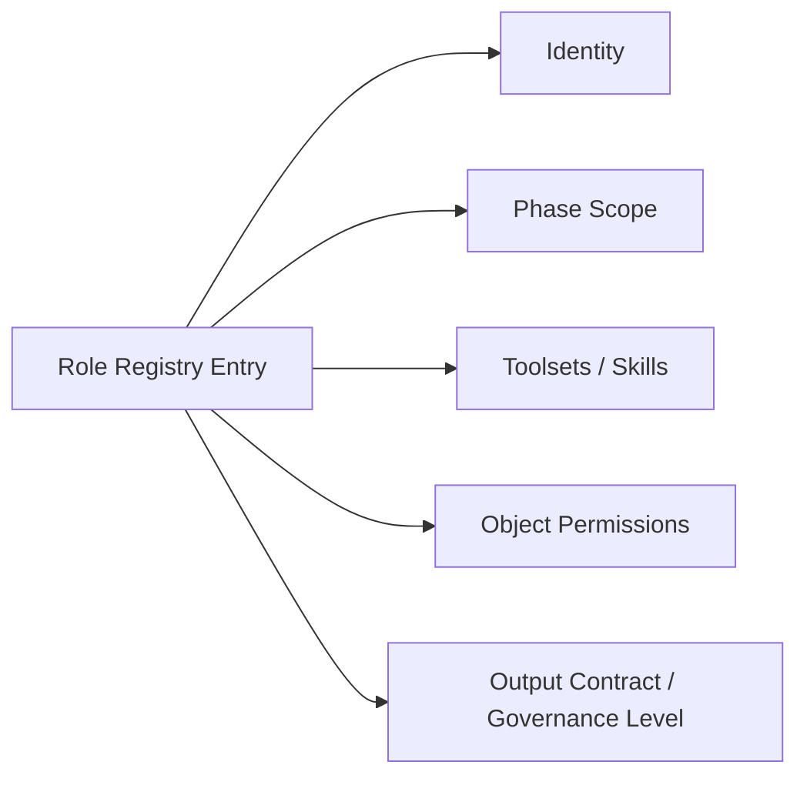

---

## 四、建议的第一批角色

第一阶段不需要一次性覆盖全产业链，建议先注册高价值角色：

- `director_lead`
- `script_analyst`
- `producer_planner`
- `budget_planner`
- `schedule_planner`
- `storyboard_planner`
- `casting_planner`
- `location_scout`
- `cinematography_language`

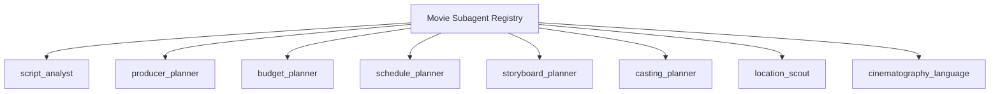

---

## 五、为什么 supported_phases 很关键

角色不是全天候常驻的。

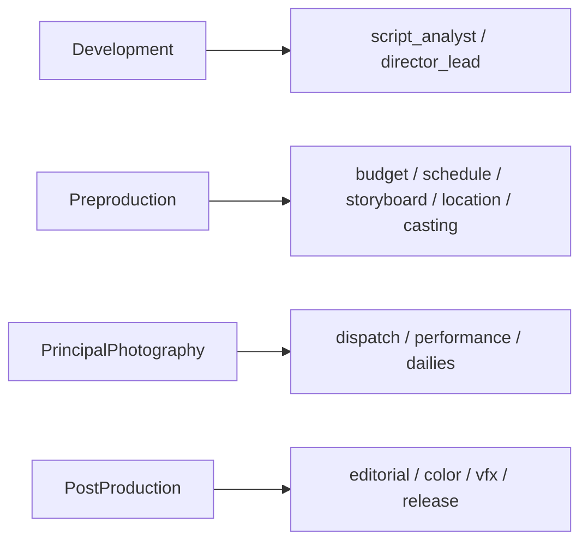

如果 registry 不记录 phase 适用范围，主智能体就会频繁在错误阶段调用错误角色。

---

## 六、为什么 writable_object_types 必须显式记录

角色系统最容易失控的地方，是写权限。

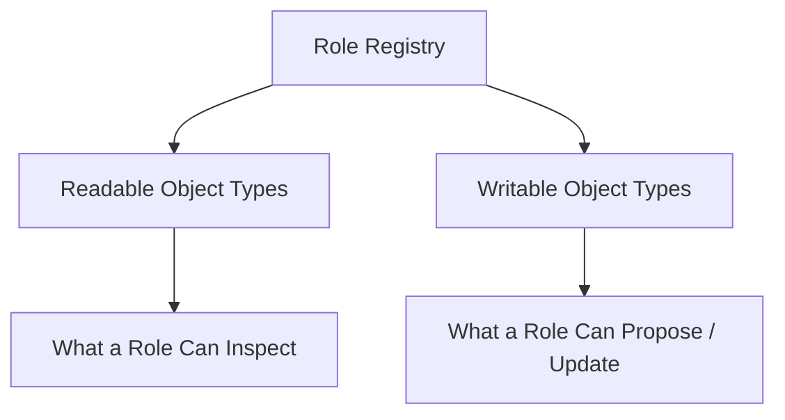

例如：

- `script_analyst` 可以读 `ScriptVersion`、`Scene`、`Character`
- 但不应直接锁定 `BudgetDraft`
- `budget_planner` 可以生成 `BudgetDraft`
- 但不应直接覆盖 `ScriptVersion`

---

## 七、output_contract 为什么是角色系统的核心之一

角色注册表如果只定义 prompt，不定义输出契约，最后还是会退化成“不同风格的长文本顾问”。

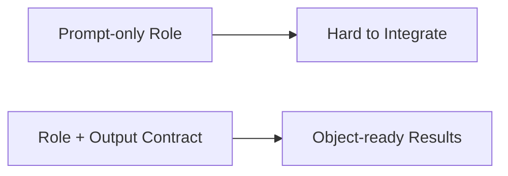

### 例子

- `script_analyst` 输出 `StoryStructureReport / SceneBeatMap`
- `budget_planner` 输出 `BudgetDraft / CostDriverReport`
- `storyboard_planner` 输出 `ShotPlan / StoryboardDraft / PromptPack`

---

## 八、registry 与 delegation 的协作关系

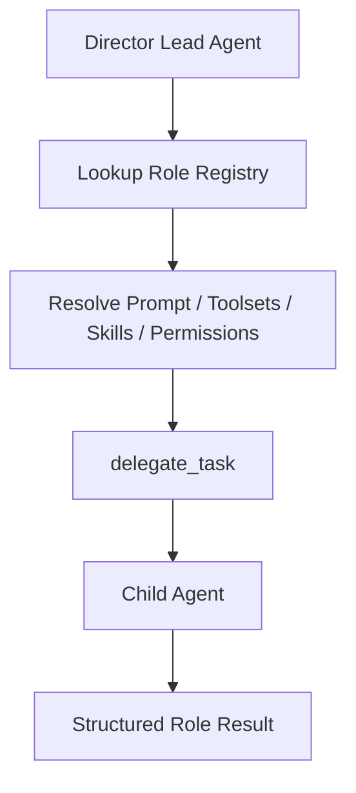

这里的关键是：

- registry 不执行任务
- registry 决定 child agent 应该长成什么样

---

## 九、建议的工程接入方式

最稳妥的方式，是增加一层 registry / policy 模块，而不是直接把角色信息写死在 `delegate_tool.py`。

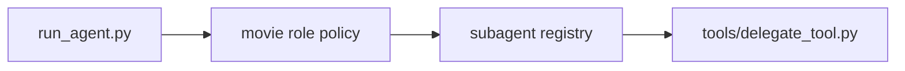

### 这样做的优势

- `delegate_tool.py` 保持通用
- movie 角色系统可以独立演进
- 后续可以扩到别的行业域，而不污染底座

---

## 十、推荐的实施顺序

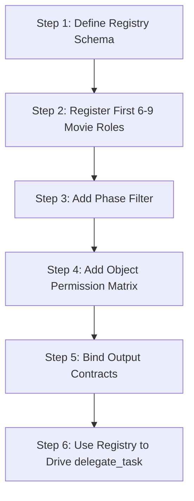

---

## 十一、MVP 设计建议

第一版 registry 先不要追求动态插件化，优先把四件事稳定下来：

1. 角色身份
2. phase 范围
3. 默认 toolsets
4. 输出契约

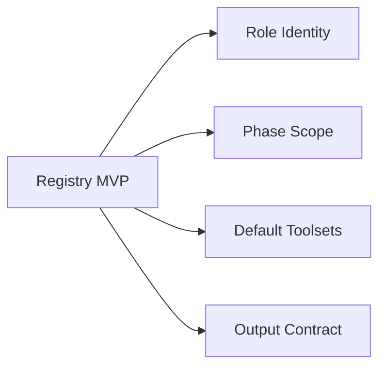

等这层稳定后，再继续补：

- skills
- object permissions
- governance level

---

## 十二、结论

subagent registry 的电影化扩展，本质上是在给 Hermes 的 delegation 系统加上一层正式角色定义。

它回答的是：

- 当前有哪些电影角色
- 每个角色应该如何被构造
- 每个角色能读什么、产出什么、在什么阶段出现

只有把 registry 做出来，Hermes 才能真正从“会开子任务”，升级成“会组织岗位化子智能体团队”。

---

## 相关文档

- [11-source-mapping-subagents.md](./11-source-mapping-subagents.md)
- [52-director-lead-agent-design.md](./52-director-lead-agent-design.md)
- [72-task-tool-and-delegation-extension.md](./72-task-tool-and-delegation-extension.md)
- [77-movie-factory-design.md](./77-movie-factory-design.md)
- [117-digital-employees-expansion-framework.md](./117-digital-employees-expansion-framework.md)
