# 74. Thread State 扩展计划

## 这篇文档回答什么问题

电影导演智能体平台要想长期运行，最终一定要回答一个工程问题：

- `MovieThreadState` 到底如何接到现有 Hermes 的 session / state 系统上

前面我们已经从概念上定义了 `MovieThreadState`。本篇进一步回答：

1. 当前仓库里最适合承接 thread state 的真实入口是什么。
2. `MovieThreadState` 应该如何与 `gateway/session.py`、`hermes_state.py`、memory、artifacts 分工。
3. 一条可渐进实现、不会一下子把现有状态系统打乱的扩展计划。

---

## 一、当前状态系统的真实分层

当前仓库里，至少已经有三层和“状态”相关的承接点：

- `gateway/session.py` 的 `SessionContext`
- `hermes_state.py` 的 `SessionDB`
- `agent/memory_manager.py` 提供的长期记忆块

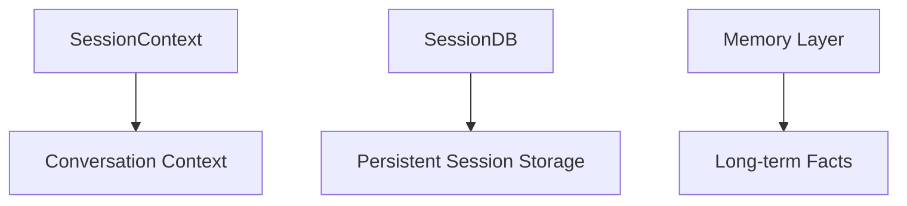

`MovieThreadState` 不应该替代其中任何一层，而应建立在它们之上。

---

## 二、为什么 MovieThreadState 必须单独存在

会话上下文、消息存储和长期 memory 都很重要，但都无法单独承担电影项目控制面。

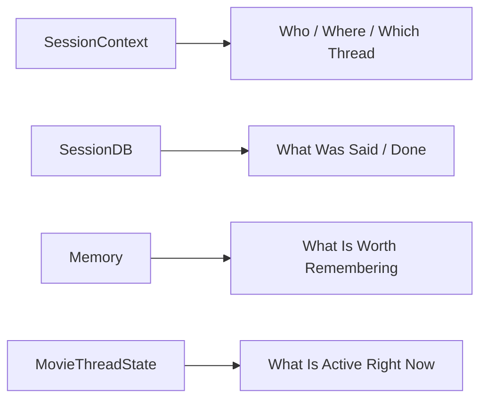

`MovieThreadState` 要解决的，正是“当前控制面”的问题。

---

## 三、建议的分工边界

### `SessionContext`

负责：

- 会话来源
- 平台与线程身份
- 入口上下文

### `SessionDB`

负责：

- 历史消息
- tool 调用历史
- 会话级持久化

### `Memory`

负责：

- 长期稳定事实
- 跨轮复用背景

### `MovieThreadState`

负责：

- 当前 phase
- active refs
- working set
- active risks
- pending approvals
- recent decisions
- next actions

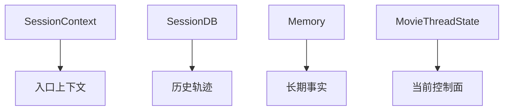

---

## 四、MovieThreadState 最适合挂在哪里

从工程角度看，最稳妥的路线不是先改数据库 schema，而是先把 `MovieThreadState` 作为独立状态对象层引入。

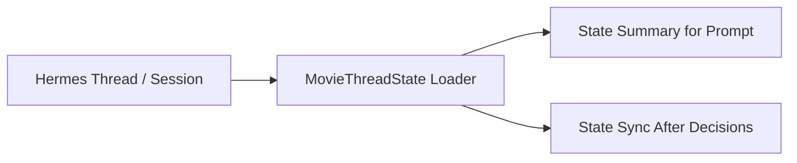

### 原则

- 先定义读写接口
- 再决定最终存储形态
- 最后再做更深层持久化整合

---

## 五、推荐的第一阶段：外挂式 MovieThreadState

第一阶段最稳妥的方案，是让 `MovieThreadState` 先作为独立 JSON / artifact / sidecar state 存在。

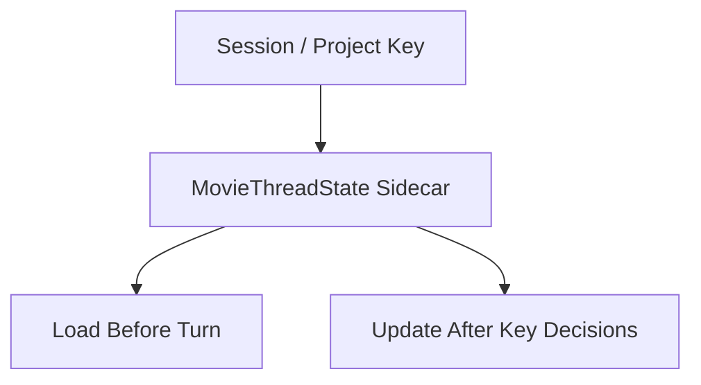

### 这一步的好处

- 不需要立刻改 `state.db`
- 可以快速验证字段设计
- 能让 runtime 尽早获得电影项目控制面

---

## 六、第二阶段：与 SessionContext 轻耦合关联

当 `MovieThreadState` 稳定后，可以开始把它和 `SessionContext` 更明确地关联起来。

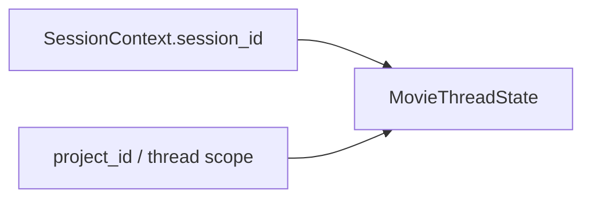

### 推荐增加的关联信息

- 当前线程对应的 `project_id`
- 当前线程是否启用 movie mode
- 当前线程的 role / phase 视角

这样能让不同会话线程更容易定位到同一个电影项目状态。

---

## 七、第三阶段：与 SessionDB 形成可检索快照

当 `MovieThreadState` 字段和更新节奏稳定后，再考虑把快照索引接到 `SessionDB` 一侧。

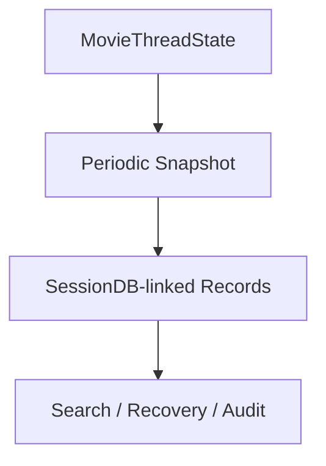

### 这一步的价值

- 能回溯某个 turn 时点的项目控制面
- 能支持调试和审计
- 能帮助恢复线程上下文

---

## 八、为什么不要一开始就把所有字段塞进 state.db

如果一开始就把完整电影对象系统塞进 `state.db`，风险很高：

- schema 变化太快
- 早期字段很可能反复调整
- 容易把消息存储和项目控制面过度耦合

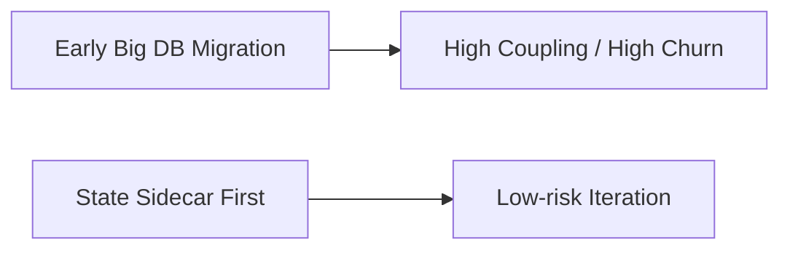

所以推荐先走 sidecar，再走深度持久化。

---

## 九、MovieThreadState 的更新触发点

不是每条消息都值得更新 thread state，推荐只在关键治理节点更新。

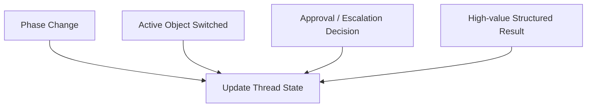

这样能避免：

- 状态抖动过于频繁
- 很多临时草稿污染控制面

---

## 十、与 memory 和 artifact 的联动方式

`MovieThreadState` 不是 artifact 仓库，也不是长期 memory。

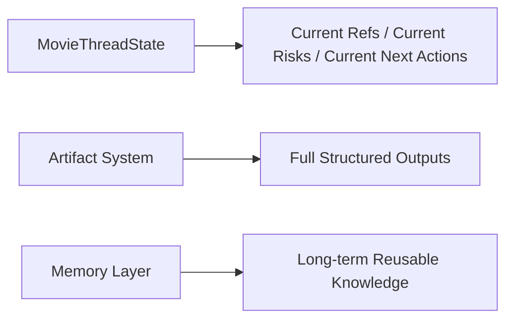

### 推荐联动方式

- `MovieThreadState` 保存对象引用和状态摘要
- artifact 系统保存详细版本和文件
- memory 系统只保存跨阶段稳定知识

---

## 十一、推荐的实施顺序

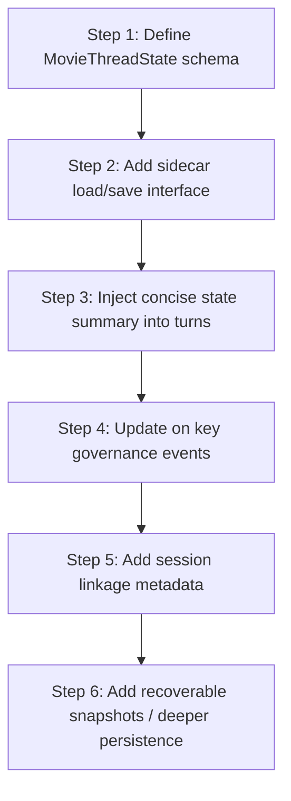

---

## 十二、MVP 设计建议

第一版 `MovieThreadState` 只需要先承接：

1. `current_phase`
2. `active_object_refs`
3. `working_set`
4. `risk_register`
5. `pending_approvals`
6. `next_actions`

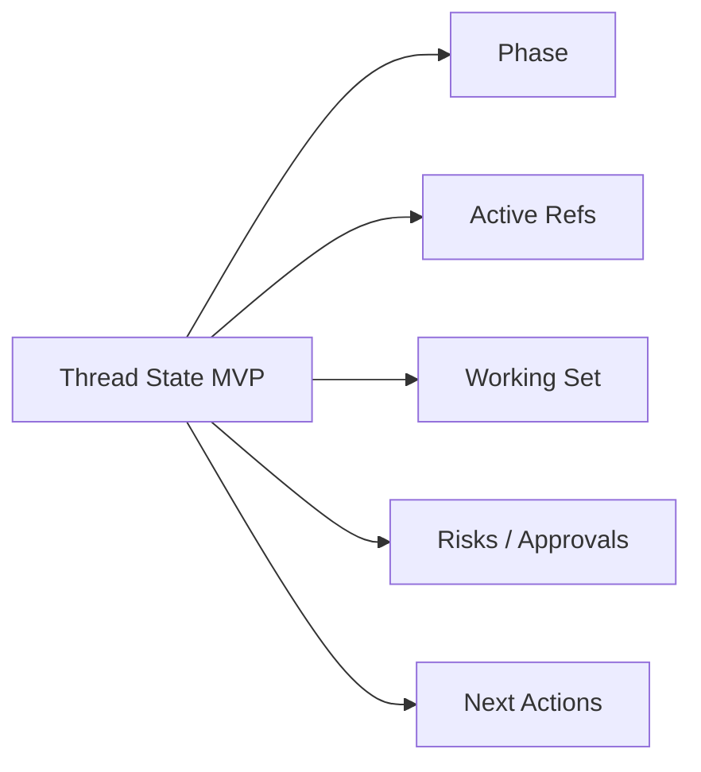

这组字段已经足够支撑 Director Lead Agent 的最小控制面。

---

## 十三、结论

Thread State 扩展计划的关键，不是立刻重做 Hermes 的状态系统，而是让 `MovieThreadState` 先以低耦合方式进入现有架构。

这条路线的核心原则是：

- 不替代 `SessionContext`
- 不替代 `SessionDB`
- 不替代 memory
- 只新增“当前电影项目控制面”

先把这层控制面稳定下来，后面的 phase policy、role registry、governance hook 和 artifact sync 才能真正有可靠落点。

---

## 相关文档

- [12-source-mapping-state-and-config.md](./12-source-mapping-state-and-config.md)
- [62-movie-thread-state-design.md](./62-movie-thread-state-design.md)
- [67-workflow-state-machine-design.md](./67-workflow-state-machine-design.md)
- [71-lead-agent-transformation-plan.md](./71-lead-agent-transformation-plan.md)
- [78-custom-agent-configuration-system.md](./78-custom-agent-configuration-system.md)
