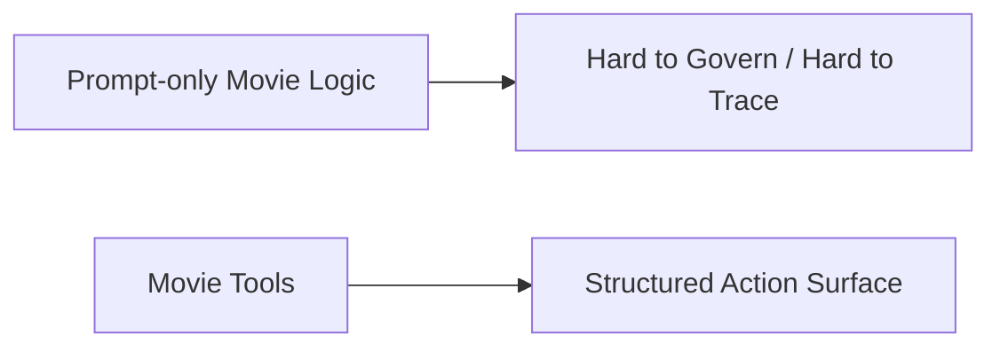
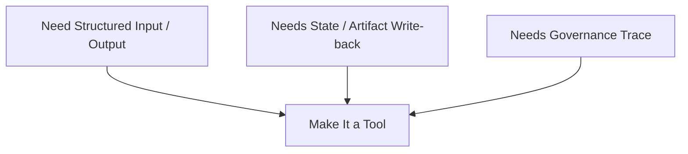
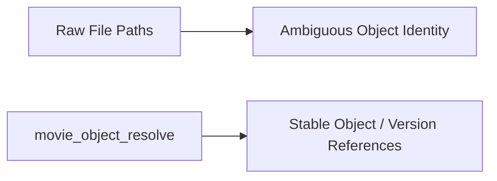
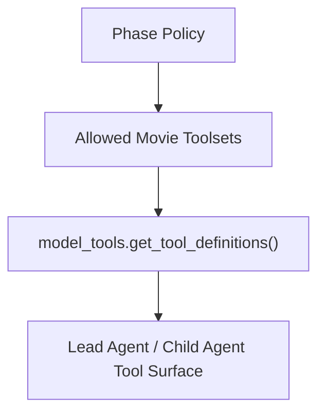
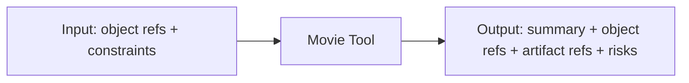
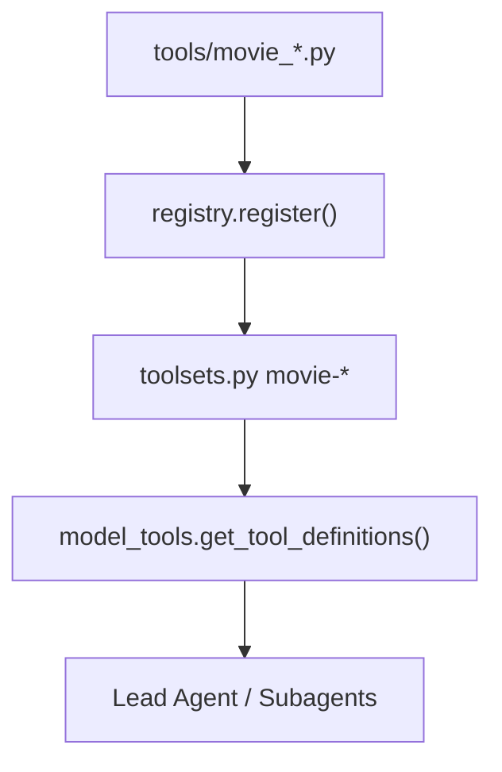
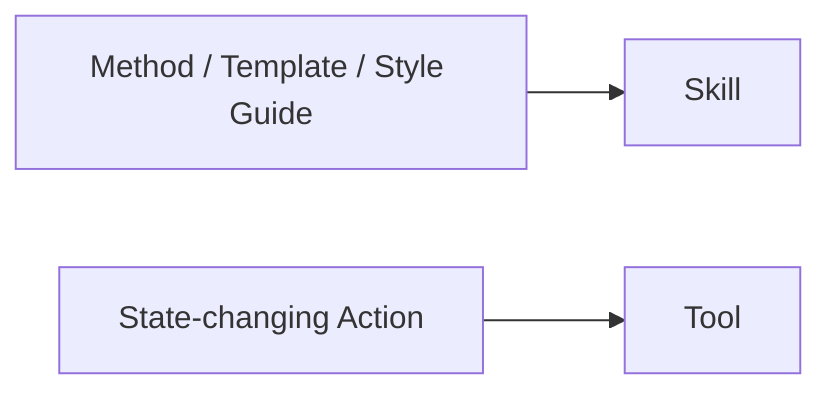
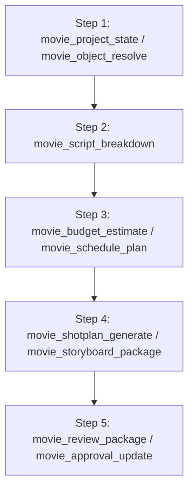
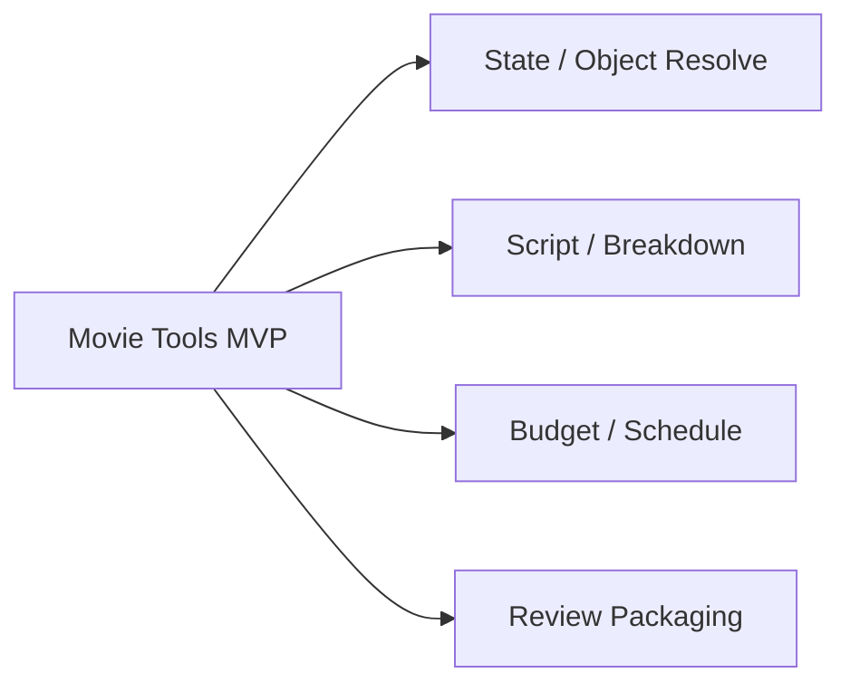

# 75. Movie Tools 设计

## 这篇文档回答什么问题

如果 Lead Agent、角色系统和对象系统都已经定义好了，下一步最现实的问题就是：

- 电影域能力到底应该通过哪些 tools 暴露出来
- 这些 tools 应该如何接到现有 `toolsets.py`、`model_tools.py`、`tools.registry.py` 上
- 什么样的能力适合做成 movie tool，什么样的能力更适合放进 skill 或对象层

本篇重点回答：

1. Movie tools 的职责边界。
2. 推荐的 movie toolset 分层。
3. 一条与现有 Hermes 工具体系兼容的扩展方案。

---

## 一、为什么 movie 能力必须有正式 tools

如果电影域能力只写在 prompt 或 skill 里，系统会很快碰到两个问题：

- 无法稳定写回状态和对象
- 无法把电影操作变成可治理、可审计的正式动作

tools 的价值不是“多一个调用接口”，而是把电影域动作正式化。

---

## 二、什么能力适合做成 tool

适合做成 tool 的通常是：

- 会读写正式对象
- 会生成结构化产物
- 会更新状态或治理记录
- 需要明确输入输出契约

反过来，不太适合单独做 tool 的包括：

- 纯输出格式规范
- 纯写作风格约束
- 可被角色 prompt 稳定吸收的方法论

这些更适合放到 skills。

---

## 三、推荐的 movie toolset 分层

不建议只做一个巨大的 `movie` 工具集，建议至少分五层：

- `movie-core`
- `movie-script`
- `movie-production`
- `movie-visual`
- `movie-governance`

### 各层含义

- `movie-core`：项目状态与对象索引
- `movie-script`：剧本语义与 breakdown
- `movie-production`：预算、排期、资源
- `movie-visual`：shot plan、storyboard、prompt pack
- `movie-governance`：review、approval、release、archive

---

## 四、第一批推荐 tools

### `movie_project_state`

读写 `MovieThreadState` 与项目摘要。

### `movie_object_resolve`

根据 object refs 查找对象、当前版本和 canonical artifact。

### `movie_script_breakdown`

从 `ScriptVersion` 派生 `Scene` / `Character` / `BreakdownSheet` 草稿。

### `movie_budget_estimate`

根据 breakdown、resource assumptions 和 schedule draft 生成 `BudgetDraft`。

### `movie_schedule_plan`

根据场景和约束生成 `ScheduleDraft` / `ConflictReport`。

### `movie_shotplan_generate`

从 scene beat 派生 `ShotPlan` / `CoveragePlan`。

### `movie_storyboard_package`

将 `ShotPlan` 组织成 `StoryboardDraft` 与 `PromptPack`。

### `movie_review_package`

将对象版本打包成正式 review 输入。

### `movie_approval_update`

提交或更新 approval / escalation 状态。

---

## 五、为什么 object_resolve 很关键

很多系统喜欢直接把对象路径或文件名塞进 prompt，但在长期项目里，这会让主智能体不断猜当前正式版本。

`movie_object_resolve` 的意义，是给所有 movie roles 一个稳定的对象入口。

---

## 六、phase-aware tool 暴露策略

movie tools 不应该全时开放。

### 例子

- `Development`：`movie-core + movie-script`
- `Preproduction`：再加 `movie-production + movie-visual`
- `PrincipalPhotography`：强化 `movie-governance`
- `PostProduction`：保留 visual/review/release 相关工具

---

## 七、tool 输入输出契约建议

每个 movie tool 都应当尽量做到：

- 输入 object refs，而不是模糊长文本
- 输出结构化 JSON，而不是只返回 prose
- 明确列出生成的对象 refs 和 artifact refs

### 推荐通用返回结构

- `success`
- `summary`
- `produced_object_refs`
- `updated_object_refs`
- `artifact_refs`
- `risk_flags`
- `next_actions`

---

## 八、如何接入现有工具体系

当前 Hermes 的标准链路已经非常清楚：

- `tools/*.py` 顶层 `registry.register()`
- `toolsets.py` 定义 toolset
- `model_tools.py` 解析可用工具

这意味着 movie tools 完全可以按现有 Hermes 规范扩展，而不需要旁路系统。

---

## 九、为什么一些能力不该直接做成 tool

例如：

- “如何写剧本分析”
- “如何写 dailies review”
- “如何组织审片问题分类”

这些更像方法论和模板，不像状态化动作。

这也是 tools 和 skills 的分界线。

---

## 十、推荐的实施顺序

这样做的优点是：先把 state/object 入口做稳，再补生产和治理能力。

---

## 十一、MVP 设计建议

第一版先做最小但高价值的一组：

1. `movie_project_state`
2. `movie_object_resolve`
3. `movie_script_breakdown`
4. `movie_budget_estimate`
5. `movie_schedule_plan`
6. `movie_review_package`

---

## 十二、结论

movie tools 的本质，是把电影域里的正式动作变成 Hermes 可调用、可治理、可追溯的能力表面。

它们最适合按现有工具体系增量接入：

- 通过 `tools.registry` 注册
- 通过 `toolsets.py` 分层
- 通过 `model_tools.py` 按 phase 和 role 暴露

只有把这层做好，电影平台才不只是“会聊流程”，而是真正具备工程化操作面。

---

## 相关文档

- [07-tools-memory-skills.md](./07-tools-memory-skills.md)
- [16-b-interfaces-and-data-contracts.md](./16-b-interfaces-and-data-contracts.md)
- [72-task-tool-and-delegation-extension.md](./72-task-tool-and-delegation-extension.md)
- [76-movie-skills-design.md](./76-movie-skills-design.md)
- [77-movie-factory-design.md](./77-movie-factory-design.md)
