# 76. Movie Skills 设计

## 这篇文档回答什么问题

movie tools 解决的是“怎么执行动作”，但电影项目里还有一类很重要的能力并不适合做成 tool：

- 标准分析方法
- 固定输出模板
- 角色协作习惯
- 阶段化工作法

这些更适合进入 skills。

本篇重点回答：

1. 为什么电影平台必须有一层 movie skills。
2. 它和 movie tools、role registry 的边界是什么。
3. Hermes 现有 skills 体系应如何扩到电影域。

---

## 一、为什么 movie 平台不能只有 tools

如果只有 tools，主智能体和子智能体会知道“可以做什么”，但不一定知道“应该按什么方法做”。

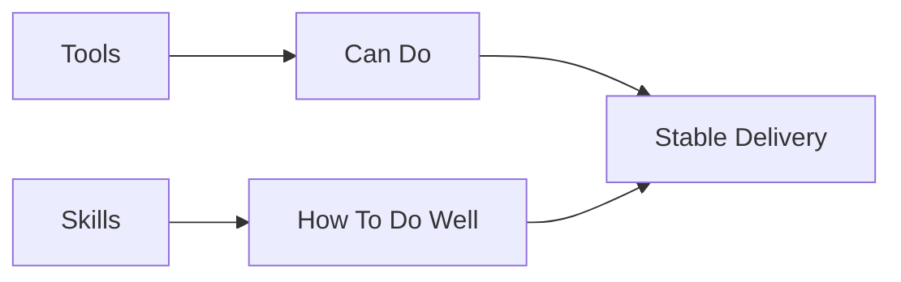

skills 的价值，是把电影工作法固化成可复用方法层。

---

## 二、当前 Hermes skills 体系已经提供了什么

从 `agent/skill_commands.py`、`hermes_cli/skills_config.py` 可以看出，当前 skills 体系已经具备：

- 技能目录扫描
- skill 内容注入消息
- supporting files 发现
- 平台级启停控制

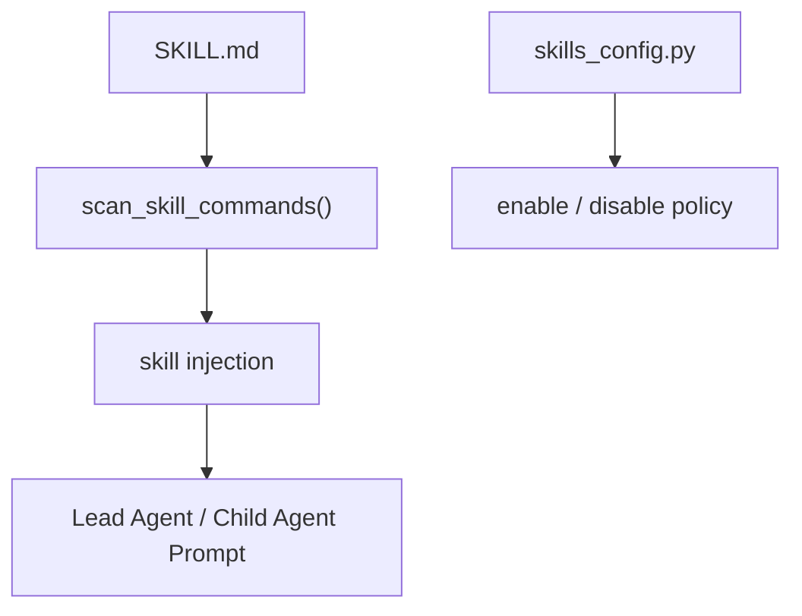

这意味着 movie skills 不需要另造机制，只需要定义好 skill 包和注入策略。

---

## 三、什么内容适合做成 skill

适合做成 skill 的内容通常具备这些特征：

- 属于方法论
- 希望跨项目复用
- 不必每次都改
- 可以直接指导输出结构

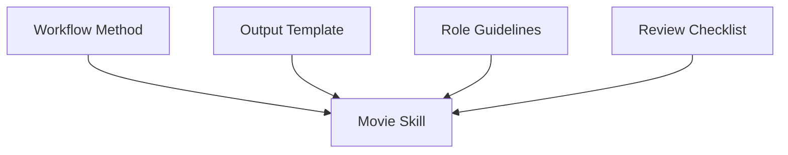

---

## 四、什么不适合做成 skill

不适合放进 skill 的通常包括：

- 当前项目活跃状态
- 当前正式对象版本
- 高速变化的风险和审批信息
- 需要工具写回的操作逻辑

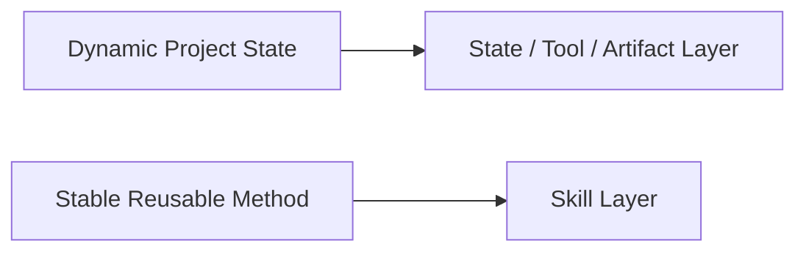

这就是 skills 和 state / tool 的边界。

---

## 五、推荐的 movie skills 分层

建议至少分四层：

- `movie-role-skills`
- `movie-phase-skills`
- `movie-output-skills`
- `movie-review-skills`

### 含义

- 角色技能：剧本分析、预算规划、分镜设计等
- 阶段技能：development、preproduction、post 的工作法
- 输出技能：如何产出固定 schema / template
- review 技能：如何做审片、审批、复盘

---

## 六、推荐的第一批 movie skills

### 角色类

- `script-analysis`
- `budget-planning`
- `schedule-planning`
- `storyboard-design`
- `location-evaluation`

### 阶段类

- `preproduction-coordination`
- `principal-photography-control`
- `postproduction-review`

### 输出类

- `scene-beat-template`
- `review-round-template`
- `retrospective-template`

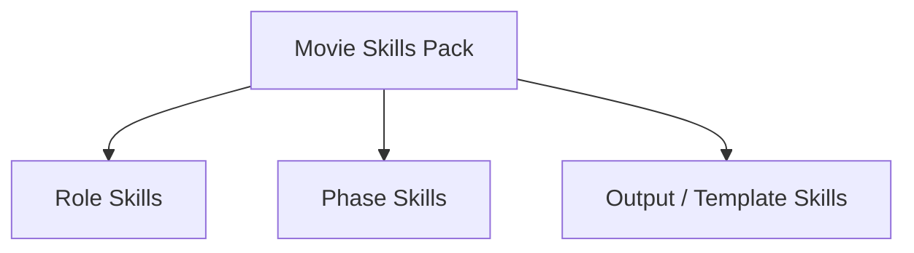

---

## 七、skills 应如何和 role registry 绑定

movie skills 最稳定的用法，不是让用户手工想起每个 skill 名称，而是由角色注册表自动绑定默认 skill 包。

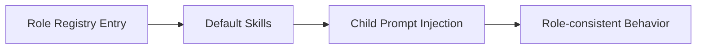

例如：

- `script_analyst` 默认注入 `script-analysis`
- `storyboard_planner` 默认注入 `storyboard-design`
- `producer_planner` 默认注入 `budget-planning + schedule-planning`

---

## 八、skills 应如何和 supporting files 结合

`agent/skill_commands.py` 已经支持 supporting files 发现，这对 movie skills 很重要。

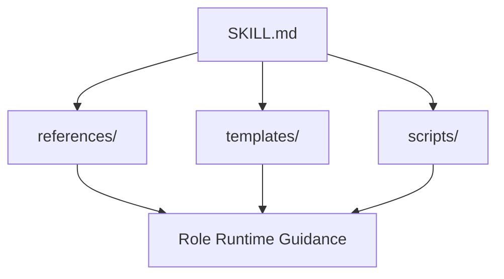

这意味着 movie skills 可以不只是一段说明，还可以带：

- checklist
- 输出模板
- 阶段清单
- prompt fragments

---

## 九、为什么 skills 要支持平台级启停

有些 movie skills 只适合 CLI / ACP，不一定适合所有 messaging surface。

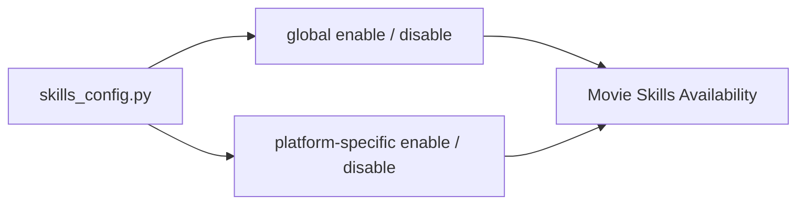

例如：

- 重模板、重 artifact 的 movie skills 更适合 CLI / ACP
- 更轻量的 review summary skill 才适合消息平台

---

## 十、movie skills 与 movie tools 的协作关系

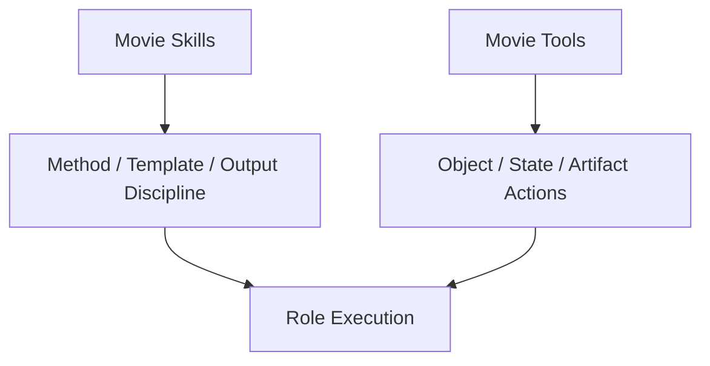

### 例子

- `movie_script_breakdown` 负责生成结构化 breakdown
- `breakdown skill` 负责规定 breakdown 的分析维度和输出模板

两者一起才稳定。

---

## 十一、推荐的实施顺序

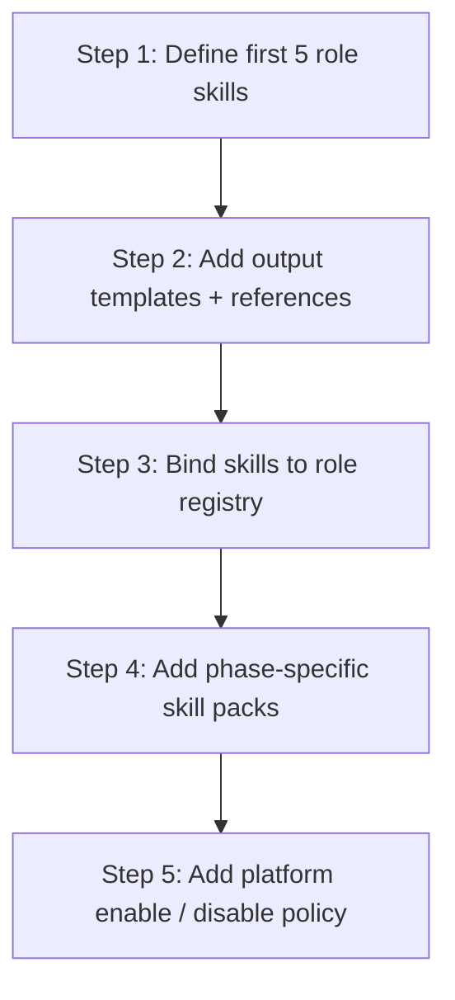

---

## 十二、MVP 设计建议

第一版 skills 不要贪多，优先做：

1. `script-analysis`
2. `budget-planning`
3. `schedule-planning`
4. `storyboard-design`
5. `review-round-template`

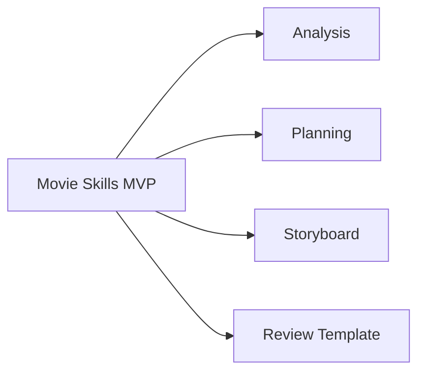

---

## 十三、结论

movie skills 是电影平台的方法论层。

它们不直接替代 tools，也不替代 state，而是负责把：

- 角色工作法
- 阶段协作方式
- 固定输出模板
- review / retrospective checklist

稳定地注入到 Hermes 的执行过程中。只有这层建立起来，电影域角色才不会只是“换了人设的通用 agent”。

---

## 相关文档

- [07-tools-memory-skills.md](./07-tools-memory-skills.md)
- [69-memory-and-knowledge-capture-design.md](./69-memory-and-knowledge-capture-design.md)
- [75-movie-tools-design.md](./75-movie-tools-design.md)
- [77-movie-factory-design.md](./77-movie-factory-design.md)
- [115-human-ai-collaboration-playbook.md](./115-human-ai-collaboration-playbook.md)
