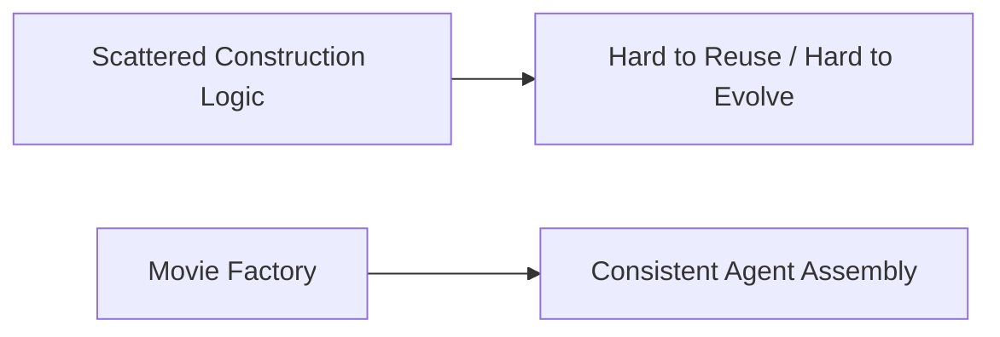
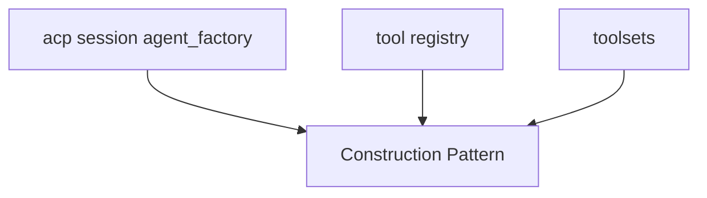
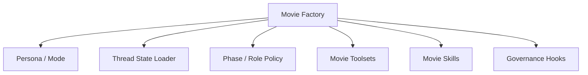
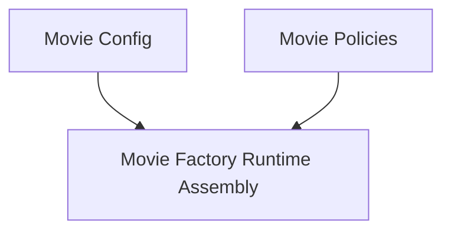
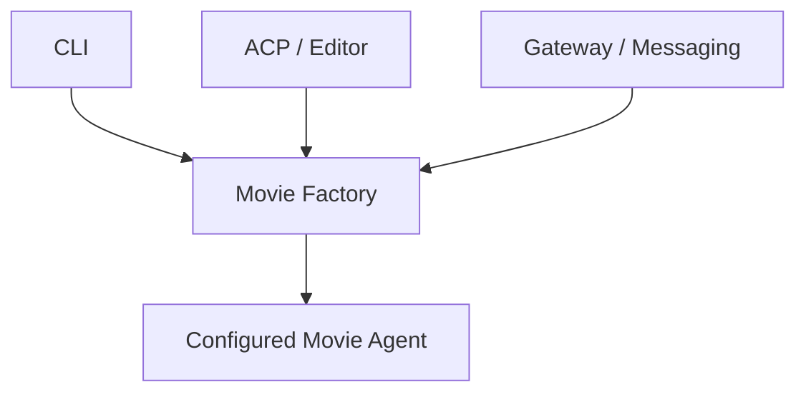
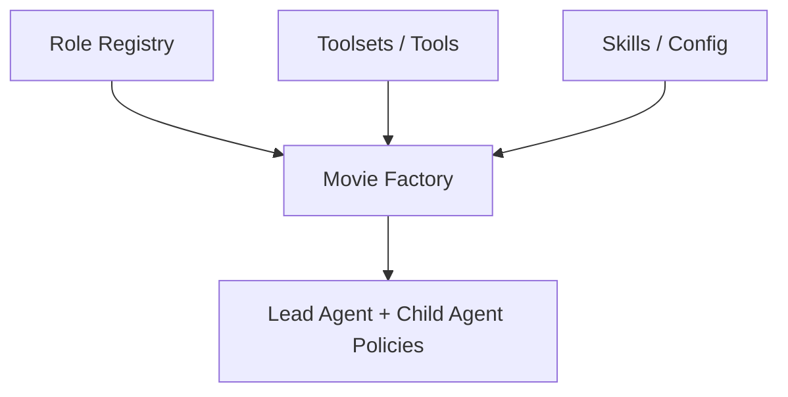
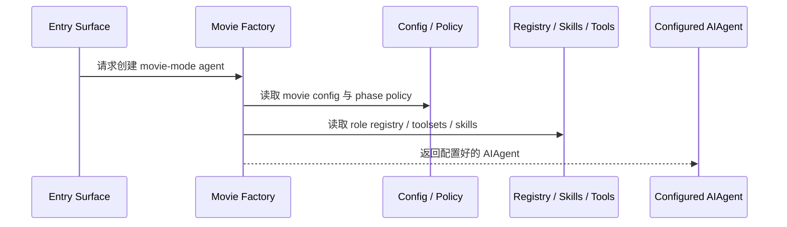
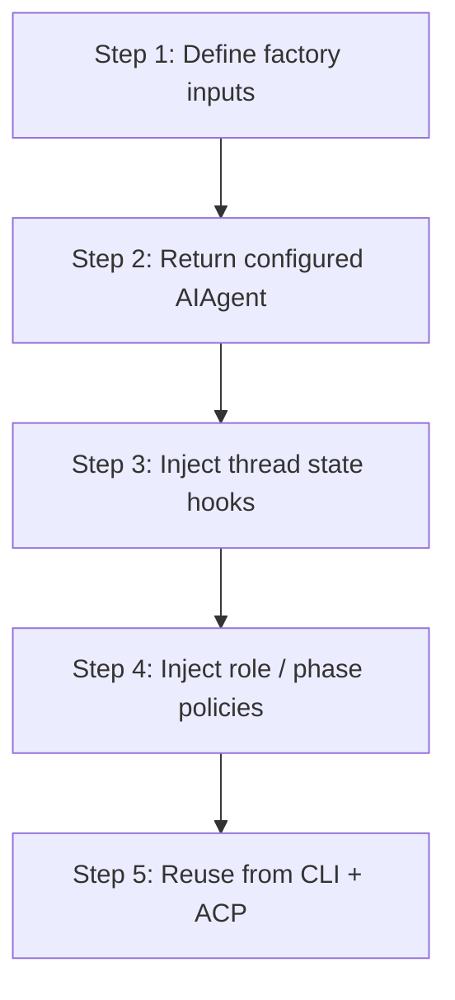
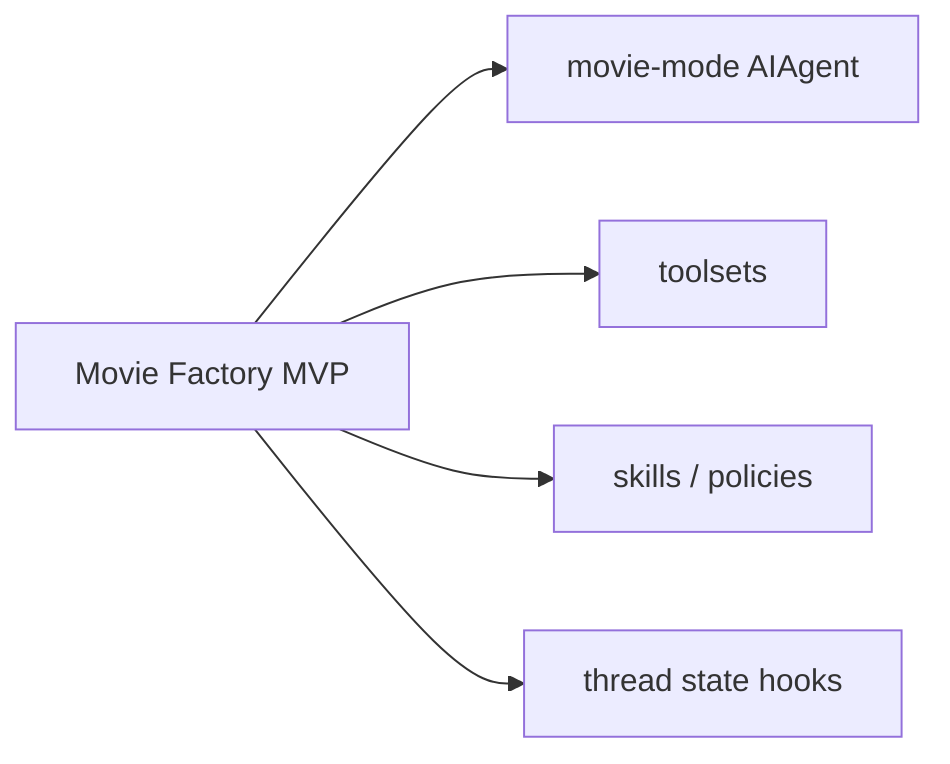

# 77. Movie Factory 设计

## 这篇文档回答什么问题

当前我们已经有：

- Lead Agent 改造路线
- role registry
- movie tools
- movie skills
- thread state 设计

接下来真正的工程问题是：这些东西到底由谁来组装成一个可运行的“movie-mode agent”。

这就是 factory 层要解决的问题。

本篇重点回答：

1. 为什么电影平台需要一个 factory 层。
2. 这个 factory 应该组装哪些内容。
3. Hermes 现有代码里最适合借力的 factory / session 构造思路是什么。

---

## 一、为什么需要 factory 层

如果没有 factory，movie-mode 的创建逻辑很容易散落在：

- `run_agent.py`
- CLI 启动逻辑
- ACP session 初始化
- gateway session 初始化

factory 的价值，就是把“如何构造一个电影域 agent”收敛成单一入口。

---

## 二、现有仓库里已经有哪些 factory 信号

虽然仓库没有统一的 `movie_factory.py`，但一些模式已经存在：

- `acp_adapter/session.py` 支持 `agent_factory`
- `tools.registry` 实际上承担了工具工厂的一部分
- `toolsets.py` 承担了能力组合工厂的一部分

这说明 factory 层不是凭空发明，而是把仓库里已有的“构造式思路”收束起来。

---

## 三、Movie Factory 应该组装什么

一个 movie factory 最少应负责六件事：

- 选择 persona / mode
- 绑定 thread state loader
- 绑定 phase / role policy
- 绑定 movie toolsets
- 绑定 movie skills
- 绑定 governance hooks

---

## 四、推荐的 factory 分层

不建议只做一个“大而全”的工厂函数，建议分三层：

- config 层
- policy 层
- runtime assembly 层

### 含义

- config 决定启用哪些能力
- policy 决定 phase / role / governance 规则
- factory 负责把它们真正拼进 agent 实例

---

## 五、建议的 Factory 输出形态

movie factory 不一定非要返回一个全新类，更稳妥的方式是返回“经过电影化配置的 `AIAgent` 实例”。

### 这一步可能包含

- `enabled_toolsets`
- `disabled_toolsets`
- mode / persona 标记
- thread state hooks
- role registry handle
- movie config handle

---

## 六、为什么 factory 应该服务多入口

movie-mode 最终不只会在 CLI 中启动。

如果 factory 只服务 CLI，后面 ACP 和 gateway 就会各自复制一套构造逻辑。

---

## 七、factory 与 role registry / toolsets 的关系

这里的关键是：

- registry 定义角色
- toolsets 定义能力表面
- factory 负责把它们组合到具体 agent 实例

---

## 八、factory 与 thread state 的关系

movie factory 不应该自己承担状态存储，但它应该负责把 state loader / saver 钩子接进 agent 生命周期。

这样主智能体启动时就天然带有电影项目控制面。

---

## 九、典型创建时序

---

## 十、推荐的实施顺序

---

## 十一、MVP 设计建议

第一版 factory 先不要做成复杂插件系统，优先把四件事做好：

1. 创建 movie-mode `AIAgent`
2. 自动启用 movie toolsets
3. 自动注入 movie skills / policies
4. 自动挂上 thread state loader

---

## 十二、结论

movie factory 的意义，是把电影域 agent 的构造逻辑从散落代码里收束成统一入口。

它不替代：

- `AIAgent`
- tool registry
- role registry
- thread state

而是把这些层真正组装成一个可复用、可跨入口启动的 movie-mode agent。只有有了这层，Hermes 的电影化能力才会从“设计很好”走向“工程上可稳定创建和运行”。

---

## 相关文档

- [52-director-lead-agent-design.md](./52-director-lead-agent-design.md)
- [71-lead-agent-transformation-plan.md](./71-lead-agent-transformation-plan.md)
- [75-movie-tools-design.md](./75-movie-tools-design.md)
- [76-movie-skills-design.md](./76-movie-skills-design.md)
- [78-custom-agent-configuration-system.md](./78-custom-agent-configuration-system.md)
