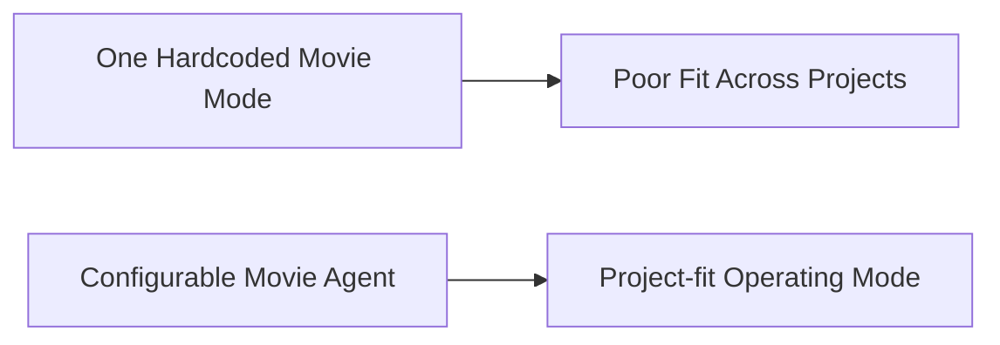
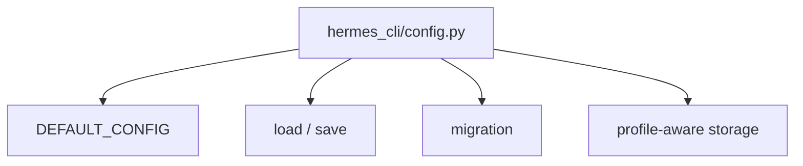
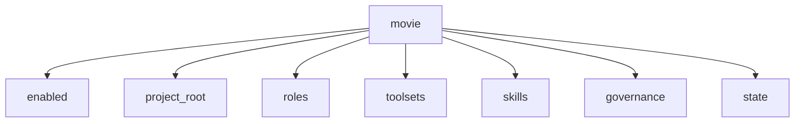
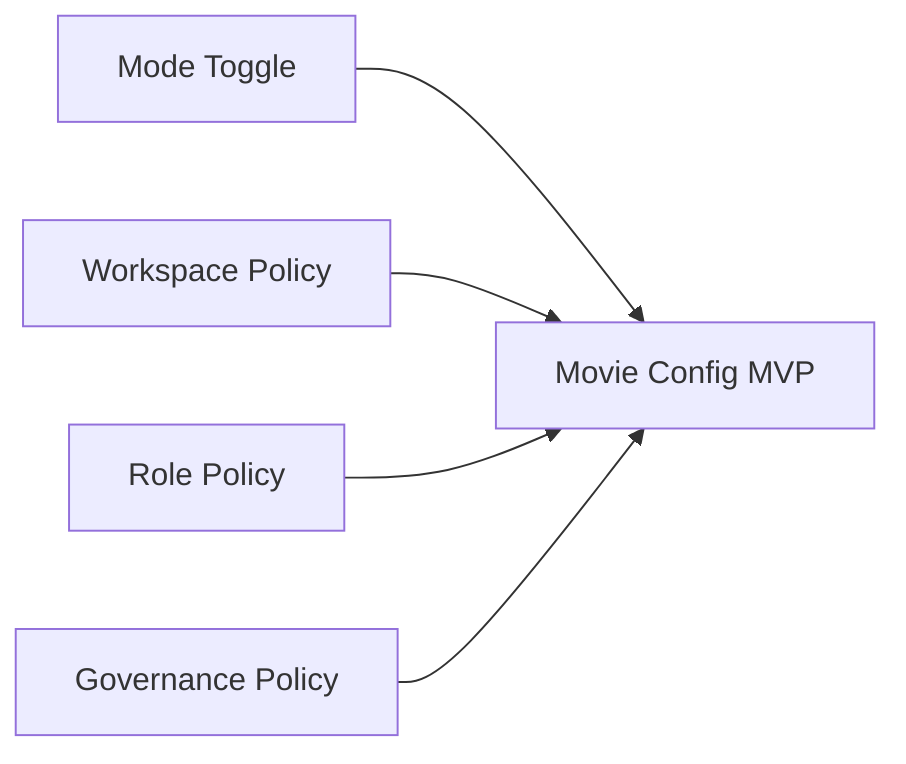
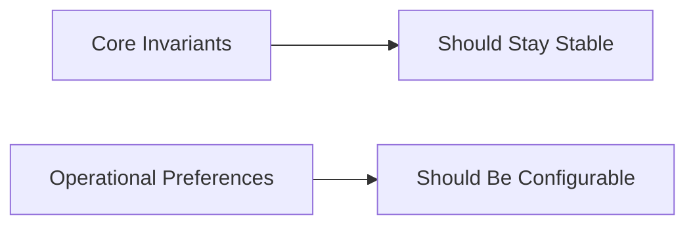
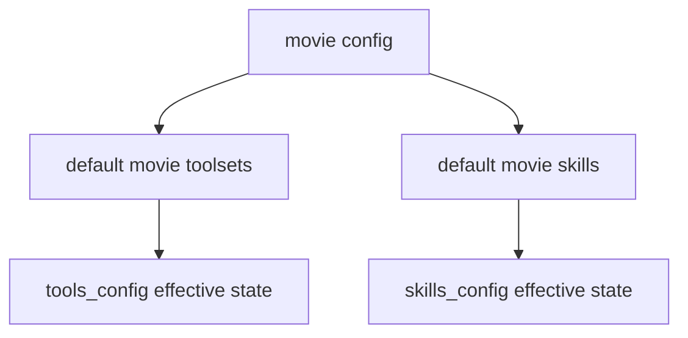
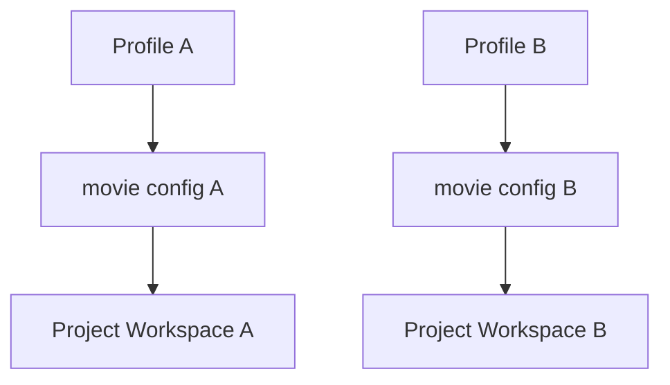
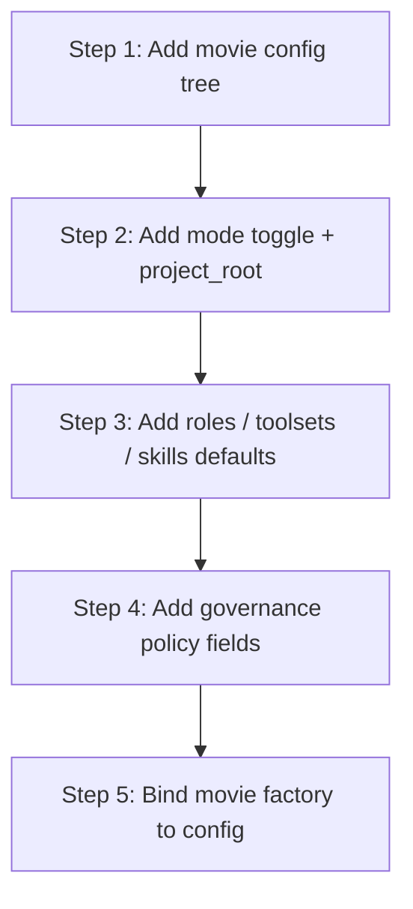
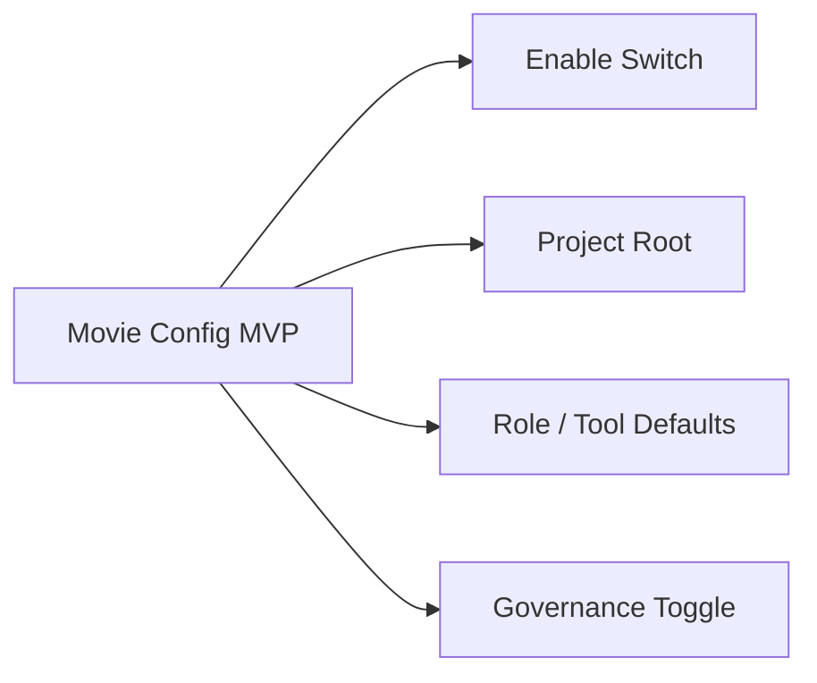

# 78. 自定义 Agent 配置系统

## 这篇文档回答什么问题

当 movie mode 逐渐成形之后，另一个关键问题会变得越来越突出：

- 不是所有电影项目都需要同一套角色、同一套工具、同一套治理强度

因此，平台最终一定要支持“可配置的电影域 agent”。

本篇重点回答：

1. 为什么电影平台需要自定义 agent 配置系统。
2. 它应如何基于现有 `hermes_cli/config.py`、toolset 配置和 skill 配置扩展。
3. 哪些内容应该可配置，哪些内容应保持固定。

---

## 一、为什么 movie mode 不能只有一套硬编码方案

不同项目可能有完全不同的特征：

- 短片 vs 长片
- 独立制作 vs 工业化制片
- 重前期锁定 vs 重现场生长
- 重国内送审治理 vs 重国际交付链

所以 configuration system 必须成为正式一层。

---

## 二、当前仓库里最适合承接配置的入口

从代码看，最适合接 movie 配置树的入口仍然是 `hermes_cli/config.py`。

它已经承担了：

- `DEFAULT_CONFIG`
- 配置加载与保存
- 配置迁移
- profile-aware 存储

这意味着 movie 配置应尽量走正式 config tree，而不是散落在环境变量或 prompt 片段中。

---

## 三、建议的 movie 配置树

建议至少增加一个顶层 `movie:` 配置域。

### 说明

- `enabled`：是否启用 movie mode
- `project_root`：默认 movie 工作区根目录
- `roles`：默认启用角色及 phase policy
- `toolsets`：默认 movie toolsets 策略
- `skills`：默认 movie skill 包
- `governance`：审批、升级、锁定规则
- `state`：thread state 存储与同步策略

---

## 四、哪些内容最值得先做成配置

### 1. movie mode 总开关

- `movie.enabled`

### 2. 默认工作区

- `movie.project_root`
- `movie.workspace_layout`

### 3. 角色策略

- `movie.roles.enabled`
- `movie.roles.phase_policy`

### 4. 治理策略

- `movie.governance.require_approval_for_phase_transition`
- `movie.governance.auto_escalation_threshold`

---

## 五、哪些内容不应该过度配置

配置系统如果过度灵活，很容易把平台变成一个没有稳定行为的参数集。

不建议第一阶段就开放太多自由度，例如：

- 任意绕过治理层
- 任意赋予子智能体写权限
- 任意重写对象生命周期状态枚举

### 原则

- 核心治理骨架尽量固定
- 项目运行偏好与默认启停可配置

---

## 六、配置如何与 toolsets / skills 配合

当前仓库已经有：

- `hermes_cli/tools_config.py`
- `hermes_cli/skills_config.py`

这意味着 movie config 不必取代它们，而应在更高一层定义默认策略。

也就是说：

- movie config 决定电影域默认能力包
- tools/skills config 决定最终平台启停

---

## 七、配置如何与 factory 协作

这是 factory 设计能真正落地的前提：

- factory 不写死策略
- factory 读取配置后装配 agent

---

## 八、推荐的 profile / project 隔离方式

当前 Hermes 已有 profile 体系，因此 movie config 最适合天然支持：

- 按 profile 隔离团队 / 项目
- 按 project root 切换工作区

这对多项目并行非常关键。

---

## 九、推荐的实施顺序

---

## 十、MVP 设计建议

第一版配置系统先做：

1. `movie.enabled`
2. `movie.project_root`
3. `movie.roles.enabled`
4. `movie.toolsets.default`
5. `movie.governance.require_approval_for_phase_transition`

---

## 十一、结论

自定义 agent 配置系统的意义，不是把电影平台做成参数迷宫，而是让同一个 Hermes 底座可以适配不同项目和不同组织现实。

它最适合建立在现有 `hermes_cli/config.py` 之上，并与：

- tools config
- skills config
- movie factory
- profile 体系

共同组成电影域的正式配置面。

---

## 相关文档

- [12-source-mapping-state-and-config.md](./12-source-mapping-state-and-config.md)
- [74-thread-state-extension-plan.md](./74-thread-state-extension-plan.md)
- [77-movie-factory-design.md](./77-movie-factory-design.md)
- [79-workspace-artifacts-and-file-flow.md](./79-workspace-artifacts-and-file-flow.md)
- [90-enterprise-rollout-roadmap.md](./90-enterprise-rollout-roadmap.md)
