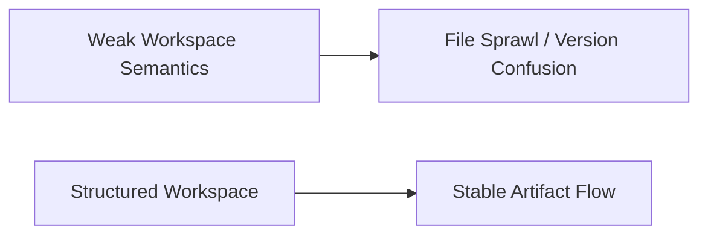
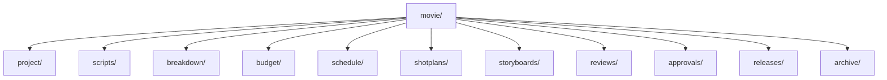
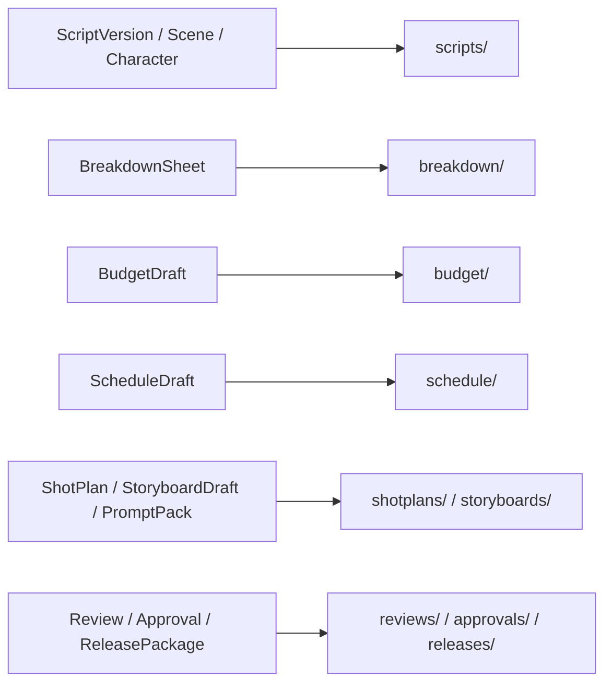
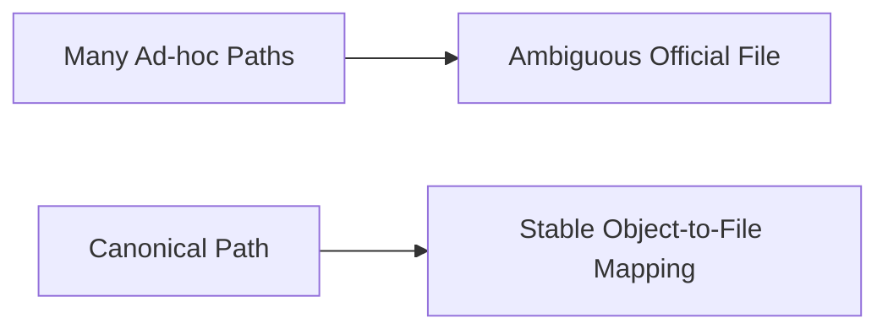
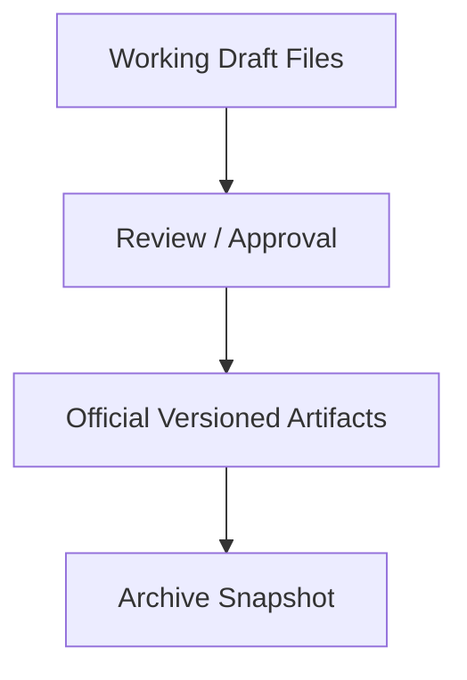
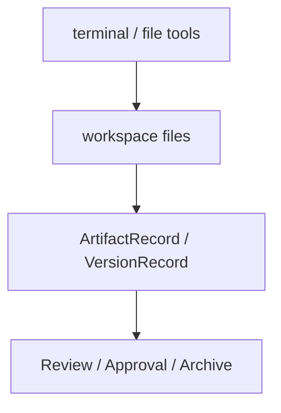
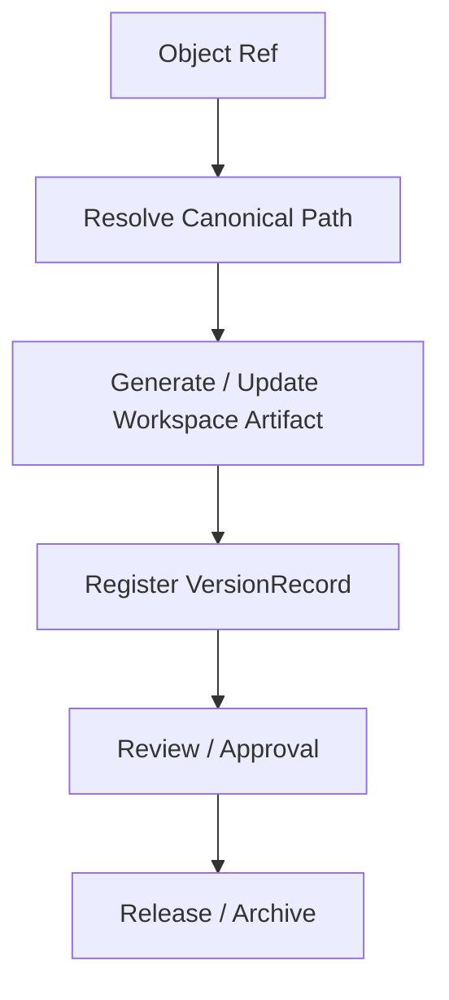
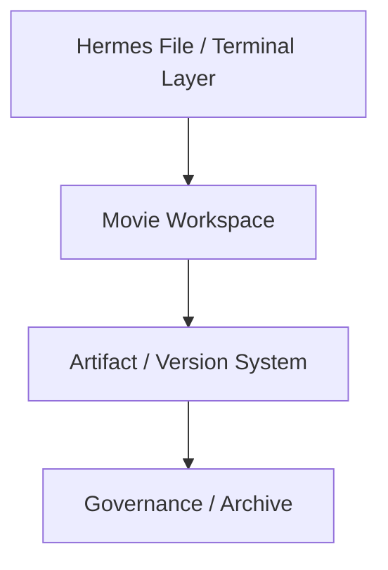
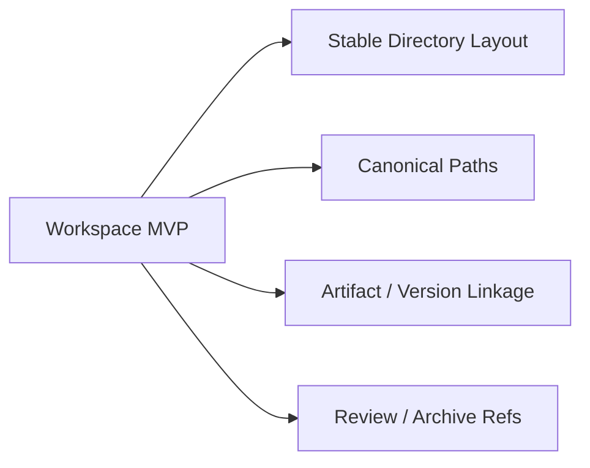

# 79. Workspace、Artifacts 与文件流设计

## 这篇文档回答什么问题

电影项目平台最终一定会产生大量文件与目录：

- 剧本版本
- breakdown 表
- 预算与排期草稿
- 分镜图和 prompt 包
- review 记录
- release package

如果没有清晰的 workspace 与文件流设计，电影域对象系统再漂亮，也会被混乱文件流拖垮。

本篇重点回答：

1. 电影平台工作区应该如何组织。
2. workspace 文件流应如何和对象系统、artifact 系统接起来。
3. Hermes 现有 file / terminal / persisted-output 体系应如何被电影域复用。

---

## 一、为什么 workspace 不是附属细节

很多 agent 系统只重 prompt，不重工作区，但电影项目恰恰是重 artifacts、重文件、重版本的工作。

工作区设计，本质上就是对象系统在文件层的投影。

---

## 二、推荐的目录分层

建议至少形成一个语义清晰的目录骨架：

---

## 三、目录层与对象层的映射关系

推荐尽量做到“一个对象族，对应一个稳定目录域”。

这样做的好处是：

- artifact path 更稳定
- 对象与文件更容易互相定位
- 工具和子智能体更容易围绕固定目录工作

---

## 四、为什么 canonical path 很关键

文件流混乱的最大根源之一，是系统不知道哪一个才是“当前正式路径”。

因此每个重要对象最好都有：

- canonical artifact path
- versioned file refs
- archive snapshot refs

---

## 五、工作版本与正式版本的文件边界

不是所有文件都应该立刻进入“正式目录”。

### 建议做法

- working drafts 可存在于阶段目录内的草稿区
- 经治理通过后再写入正式 version 路径
- 归档时再纳入 `archive/` 快照

---

## 六、为什么 persisted-output 对电影域特别有价值

现有 `tools/tool_result_storage.py` 已经支持大输出落盘，这对电影项目非常实用。

在 movie 场景里，它特别适合承接：

- 大体量 breakdown
- 长 review 记录
- 多版本差异摘要
- 资料搜集结果

---

## 七、workspace 文件流与 tools 的关系

也就是说：

- file / terminal tools 负责读写文件
- artifact 层负责赋予这些文件正式身份
- governance 层负责让版本进入正式状态

---

## 八、workspace 文件流与 child agents 的关系

子智能体不只是在“想”，它们会持续产出文件和 artifacts。

### 例子

- `storyboard_planner` 写 `storyboards/scene-xxx/...`
- `budget_planner` 写 `budget/v2/...`
- `review_package` 写 `reviews/review-round-...`

---

## 九、推荐的文件流主链

这样做之后，工作区不再只是文件堆，而是正式生产管线的一部分。

---

## 十、在 Hermes Agent 中的映射建议

Hermes 现有这些能力都能直接复用：

- file tools
- terminal tools
- persisted-output
- profile-aware home / config
- task-specific workdir

后续最值得新增的是：

- workspace layout resolver
- canonical path resolver
- artifact-to-file sync helpers

---

## 十一、MVP 设计建议

第一版优先做：

1. 固定 movie 工作区目录骨架
2. 为关键对象定义 canonical path 规则
3. 让重要文件更新后生成 artifact / version 关联
4. 让 review / archive 都能引用正式文件

---

## 十二、结论

workspace、artifacts 与文件流设计，是电影平台从“会生成文档”走向“会管理生产资料”的关键一步。

它把：

- 对象系统
- 文件系统
- 版本系统
- 治理系统

真正接成一条连续的工程链，这也是 Hermes 在电影域里形成长期资产的必要条件。

---

## 相关文档

- [70-artifact-version-and-archive-system.md](./70-artifact-version-and-archive-system.md)
- [78-custom-agent-configuration-system.md](./78-custom-agent-configuration-system.md)
- [80-observability-logging-and-evaluation.md](./80-observability-logging-and-evaluation.md)
- [87-data-and-asset-governance.md](./87-data-and-asset-governance.md)
- [116-output-management-and-agent-artifacts-system.md](./116-output-management-and-agent-artifacts-system.md)
