# 80. 可观测性、日志与评估设计

## 这篇文档回答什么问题

当电影域 agent 逐步具备：

- lead agent orchestration
- 多角色 delegation
- state / artifact / governance 更新

系统就会进入一个新阶段：如果没有可观测性，我们根本不知道它到底为什么成功或失败。

本篇重点回答：

1. 电影平台为什么必须重视 observability。
2. 当前 Hermes 代码里有哪些日志、trajectory、评估入口可以复用。
3. movie mode 最值得新增哪些指标、事件和 evaluation 视角。

---

## 一、为什么 observability 在电影域尤其重要

电影项目是长周期、多角色、多版本、多审批的系统。

如果没有可观测性，就很难回答：

- 为什么这个对象反复返工
- 为什么某阶段 delegation 爆炸增长
- 为什么主智能体总是在错误时间调用错误角色
- 为什么某种项目类型总在预算 / 排期环节失稳

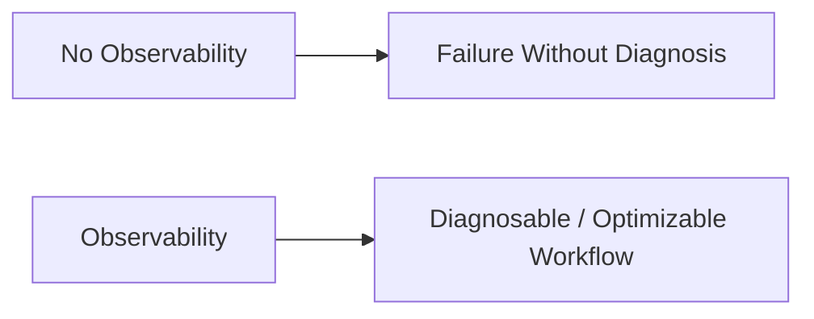

---

## 二、当前仓库里已经有哪些可复用入口

从代码看，现有 Hermes 已经有一些很好的观测基础：

- 普遍的 logging 基础
- `agent/trajectory.py` 的 trajectory 保存
- `tool_result_storage.py` 的大输出落盘
- `SessionDB` 的会话和消息持久化
- ACP / gateway 的事件回调链

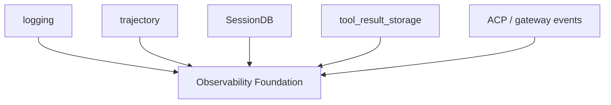

---

## 三、电影平台最该观测什么

建议至少观测五类信息：

- orchestration 事件
- delegation 事件
- state / object 生命周期事件
- governance 事件
- outcome / quality 指标

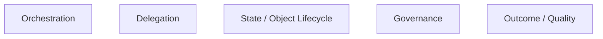

---

## 四、Orchestration 事件建议

Lead Agent 层最值得记录的是：

- 当前 phase
- 当前 working set
- 本轮激活角色
- 本轮关键 next actions

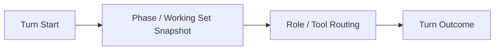

这样我们才能知道主智能体是不是一直在正确阶段做正确事。

---

## 五、Delegation 事件建议

电影平台里，delegation 是最值得观测的部分之一。

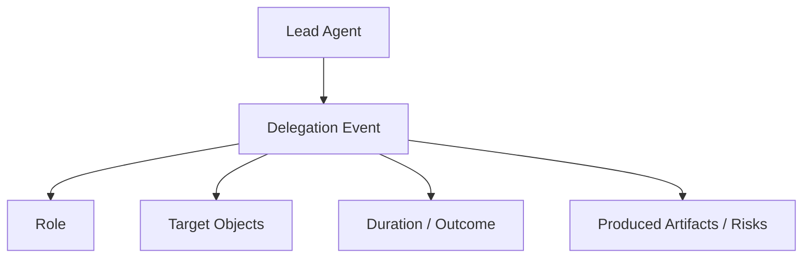

### 推荐指标

- 按角色的 delegation 次数
- 按 phase 的 delegation 失败率
- 单任务平均耗时
- 子智能体输出被采纳率

---

## 六、对象与状态生命周期事件建议

如果我们想知道系统是否真的稳定，必须记录对象状态流。

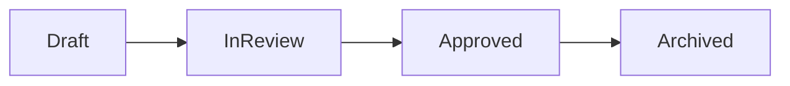

### 推荐记录

- 哪些对象最容易被退回
- 哪些类型的对象 version churn 最大
- 哪些阶段状态切换最容易卡住

---

## 七、治理事件建议

审批与升级流如果不观测，平台很难看出治理瓶颈。

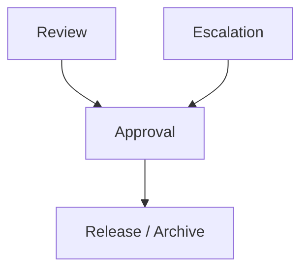

### 推荐指标

- approval 平均等待时间
- escalation 触发率
- 不同角色触发 escalation 的分布
- release package 通过率

---

## 八、Outcome / Quality 评估建议

最终还需要一层“结果质量”评估，而不是只看流程跑没跑完。

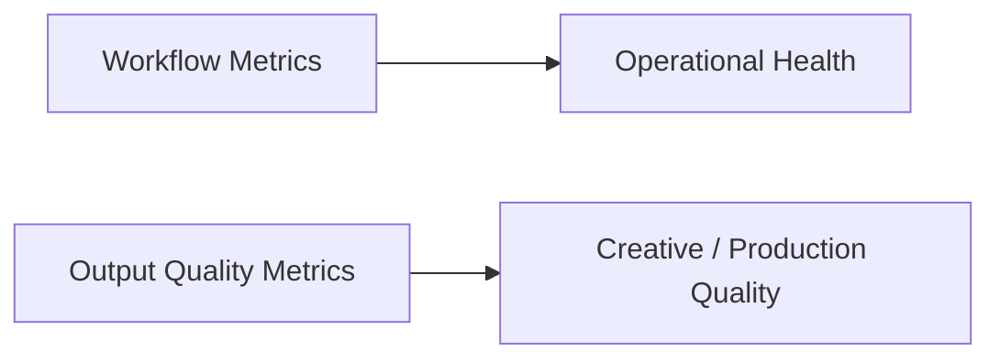

### 例子

- `ScriptVersion` 从 draft 到 lock 的轮数
- `BudgetDraft` 与最终执行偏差
- `ScheduleDraft` 与实际拍摄偏差
- shot plan 被保留到拍摄的比例
- review finding 关闭率

---

## 九、trajectory 在 movie mode 里的价值

现有 `agent/trajectory.py` 保存的是对话轨迹，这在 movie mode 里非常适合扩展成：

- phase-aware trajectory
- role-aware trajectory
- governance-aware trajectory

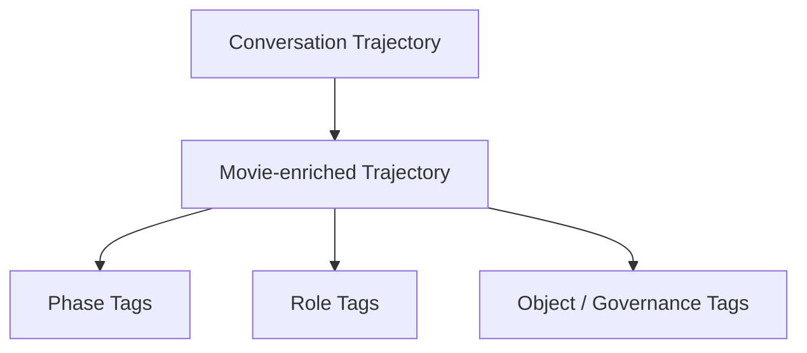

这会让后续回放、调试和评估更有价值。

---

## 十、评估系统应如何分层

建议把 evaluation 分成三层：

- 单次运行评估
- 项目周期评估
- 跨项目基准评估

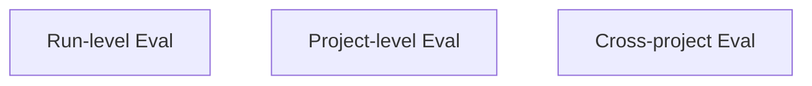

### 含义

- run-level：这次任务或这轮审批是否成功
- project-level：这一部片子的 workflow 是否稳定
- cross-project：不同类型项目下，哪套策略更优

---

## 十一、在 Hermes Agent 中的映射建议

movie observability 最适合建立在现有 logging / session / trajectory 之上，而不是旁路埋点系统。

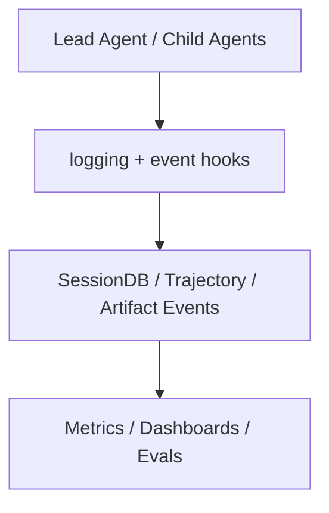

### 工程建议

- 给关键 turn 打 phase / role 标签
- 给 delegation 打 object refs 和结果标签
- 给 review / approval 打治理事件标签
- 给 artifacts / versions 打状态迁移事件

---

## 十二、MVP 设计建议

第一版先做四件事：

1. turn 级 phase / role 观测
2. delegation 级事件与耗时记录
3. governance 级通过 / 驳回 / 升级记录
4. 基于 SessionDB / trajectory 的简易评估报表

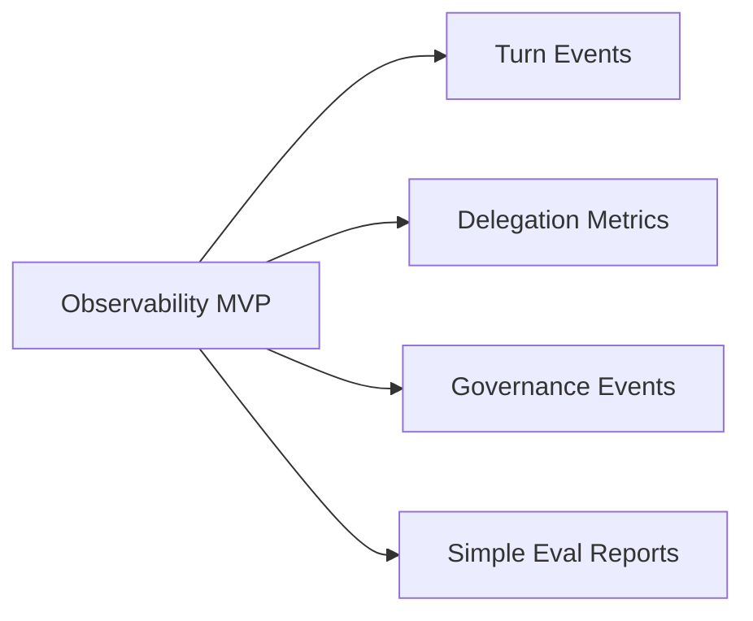

---

## 十三、结论

可观测性、日志和评估设计，是电影平台从“能运行”走向“能持续优化”的关键层。

它的目标不是多打日志，而是让系统真正能回答：

- 为什么成功
- 为什么失败
- 哪条链最脆弱
- 哪种角色 / phase / tool 组合最有效

只有把这层做起来，Hermes 的电影域扩展才会真正具备可诊断、可迭代、可企业化推进的基础。

---

## 相关文档

- [75-movie-tools-design.md](./75-movie-tools-design.md)
- [79-workspace-artifacts-and-file-flow.md](./79-workspace-artifacts-and-file-flow.md)
- [89-metrics-and-roi.md](./89-metrics-and-roi.md)
- [111-video-agents-risk-evals-and-governance.md](./111-video-agents-risk-evals-and-governance.md)
- [118-program-governance-roadmap-and-operating-metrics.md](./118-program-governance-roadmap-and-operating-metrics.md)
