# 81. MVP 范围定义

## 这篇文档回答什么问题

到了真正准备落地的时候，最危险的事情不是“做得太少”，而是 MVP 范围失控。

电影导演智能体平台天然会让人想一步做很多：

- 剧本分析
- 预算排期
- 分镜和图像生成
- 现场调度
- 后期版本治理
- 发行交付

如果第一阶段不明确划边界，研发会很快陷入一个既大又散、很难验收的项目。

本篇重点回答：

1. 电影平台 MVP 到底应该承诺什么。
2. 哪些能力应该纳入第一阶段，哪些能力应明确排除。
3. MVP 的验收标准应该怎么定义，才能真正证明路线成立。

---

## 一、MVP 的核心目标是什么

MVP 不是“做一个能聊电影的超级 agent”，也不是“做完整电影工业系统”。

MVP 的正确目标应该是：

- 跑通一个前期制作闭环
- 让 Hermes 能围绕正式对象持续推进项目
- 让主智能体 + 子智能体协作产生正式 artifacts
- 让结果进入最小治理流程

这条链如果稳定成立，就足以证明平台路线是对的。

---

## 二、MVP 的一句话定义

建议把 MVP 定义为：

**一个面向前期制作的导演智能体协作系统，能够围绕单个电影项目，完成从剧本语义拆解到 breakdown、预算、排期、镜头计划，并通过轻量 review / approval 进入正式版本状态。**

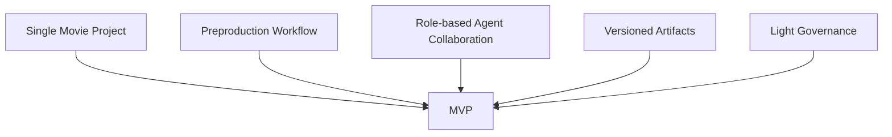

---

## 三、MVP 必须包含什么

### 1. 项目控制面

- `MovieThreadState`
- 当前 phase
- active object refs
- current risks / pending approvals

### 2. 最小创作对象链

- `ScriptVersion`
- `Scene`
- `Character`

### 3. 最小生产对象链

- `BreakdownSheet`
- `BudgetDraft`
- `ScheduleDraft`

### 4. 最小视觉对象链

- `ShotPlan`

### 5. 最小治理对象链

- `ReviewRound`
- `ApprovalRequest`

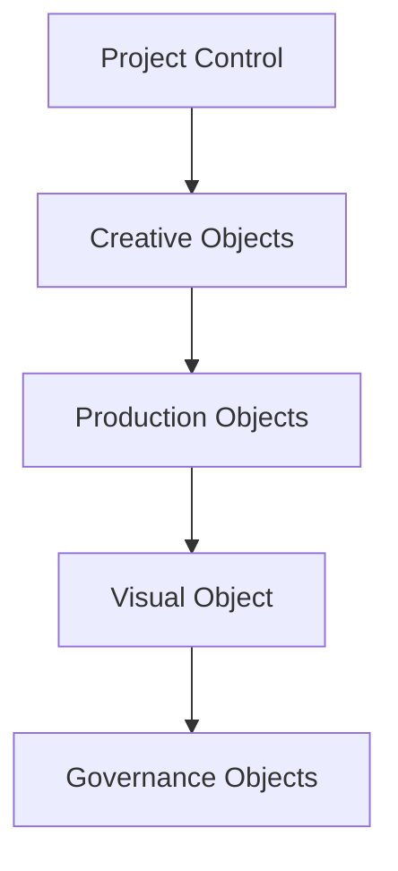

---

## 四、MVP 必须包含哪些角色

建议第一版只保留最有证明力的一组角色：

- `director_lead`
- `script_analyst`
- `budget_planner`
- `schedule_planner`
- `storyboard_planner`
- 可选第六个：`producer_planner`

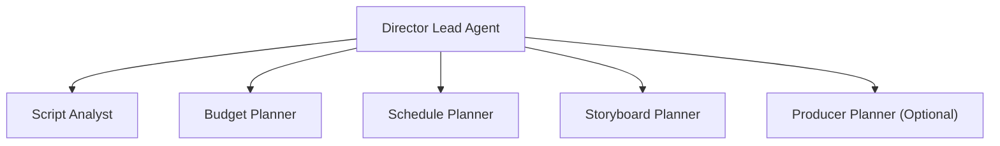

角色越少，边界越清晰；第一版证明价值，比角色覆盖更重要。

---

## 五、MVP 必须包含哪些 tools

建议第一版至少有这些 movie tools：

- `movie_project_state`
- `movie_object_resolve`
- `movie_script_breakdown`
- `movie_budget_estimate`
- `movie_schedule_plan`
- `movie_shotplan_generate`
- `movie_review_package`

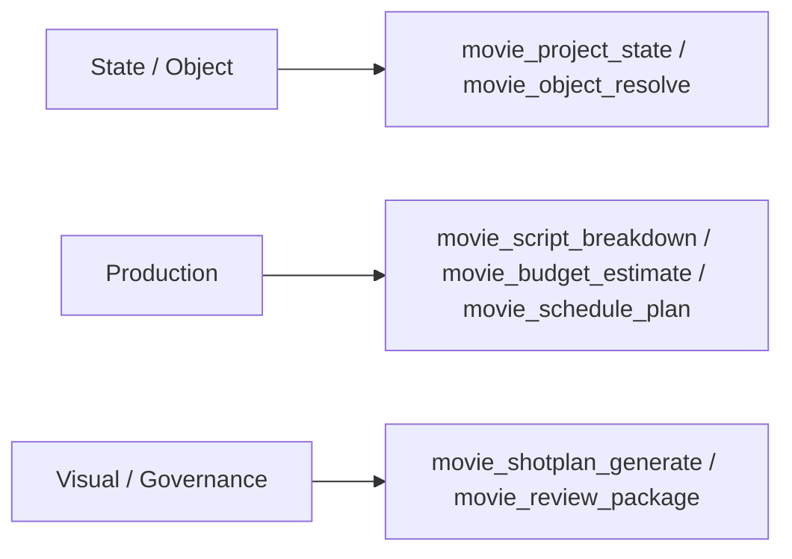

这组 tools 已经足够覆盖前期制作主链。

---

## 六、MVP 明确不包含什么

为了让范围真正可控，以下能力应明确排除在 MVP 外：

- 完整现场拍摄调度系统
- 完整后期版本治理链
- 全自动生成完整影片内容
- 企业级权限、审计与 ROI 面板
- 大规模多项目多团队协同

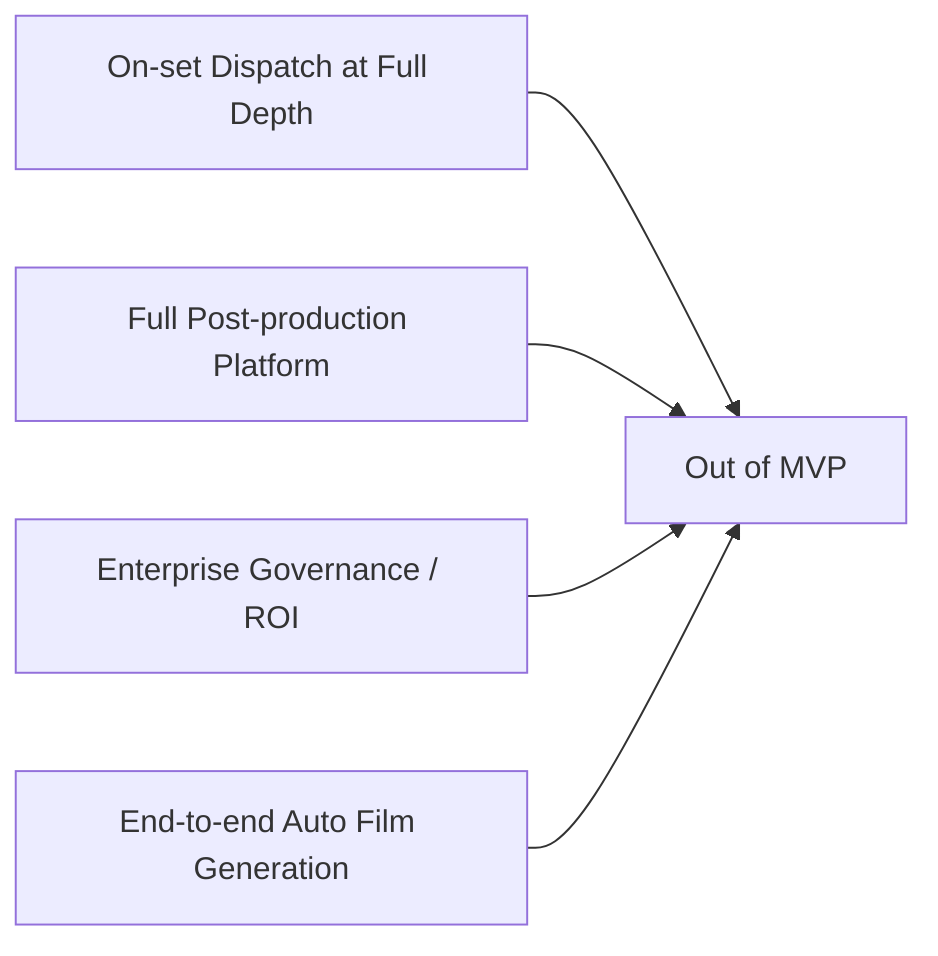

这不是否认这些能力重要，而是防止第一版失焦。

---

## 七、MVP 的典型用户故事

建议围绕一个非常具体的用户故事定义 MVP：

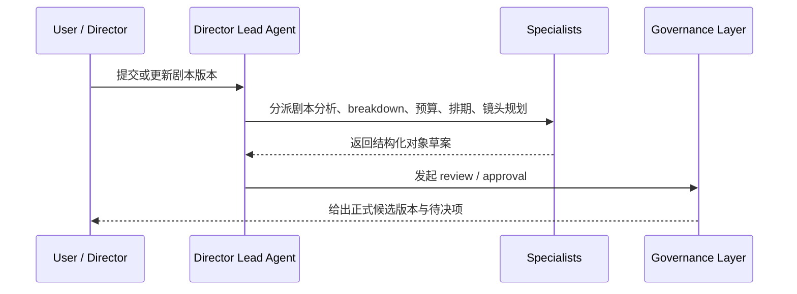

### 这个用户故事至少应支持

- 连续多轮推进
- 对象版本可追踪
- review / approval 有明确结果

---

## 八、MVP 的代码触点范围

从当前仓库结构看，MVP 主要应触达这些区域：

- `run_agent.py`
- `model_tools.py`
- `toolsets.py`
- `tools/`
- `tools/delegate_tool.py`
- `gateway/session.py`
- `hermes_state.py`
- `hermes_cli/config.py`

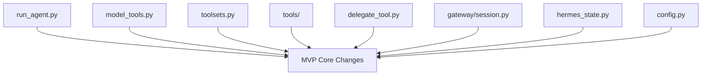

这说明 MVP 完全可以建立在现有 Hermes 主骨架之上。

---

## 九、MVP 的交付物定义

建议把交付物定义成四类，而不是只看“代码完成”。

### 1. 运行层交付

- movie-mode lead agent
- role-aware delegation
- phase-aware tool selection

### 2. 对象层交付

- `MovieThreadState`
- script / scene / breakdown / budget / schedule / shotplan schema

### 3. 文件层交付

- movie workspace layout
- artifact / version linkage

### 4. 治理层交付

- 最小 review / approval 流

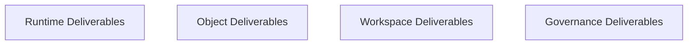

---

## 十、MVP 的成功标准

MVP 是否成功，不应只看“能不能跑”，而应看这几个问题：

1. 系统是否能围绕单个项目持续多轮推进。
2. 是否能稳定生成正式对象与 artifacts。
3. 子智能体结果是否能被主智能体整合进治理链。
4. 用户是否能看到当前 phase、working set 与 pending approvals。

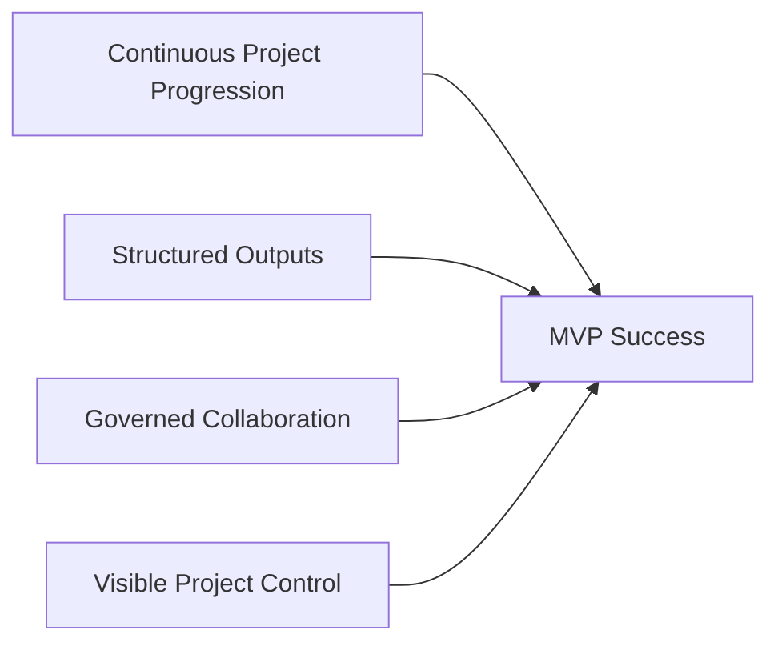

---

## 十一、MVP 的主要风险

### 风险 1：范围膨胀

角色和对象太多，导致第一版难以稳定。

### 风险 2：治理不足

如果只有产出，没有 review / approval，系统很快失去正式状态边界。

### 风险 3：状态不足

如果 `MovieThreadState` 不可靠，主智能体仍会退回聊天式工作。

### 风险 4：文件流混乱

如果 artifact 没有 canonical 路径和 version 关系，结果不可回溯。

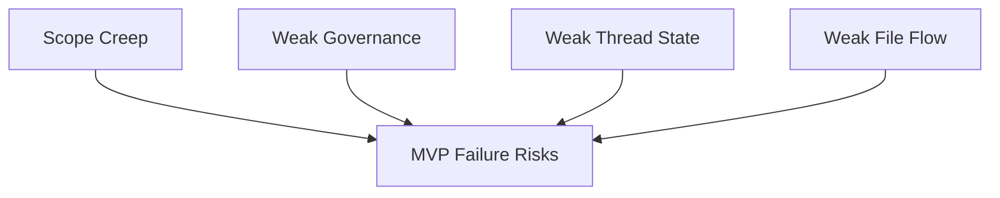

---

## 十二、推荐的 MVP 里程碑定义

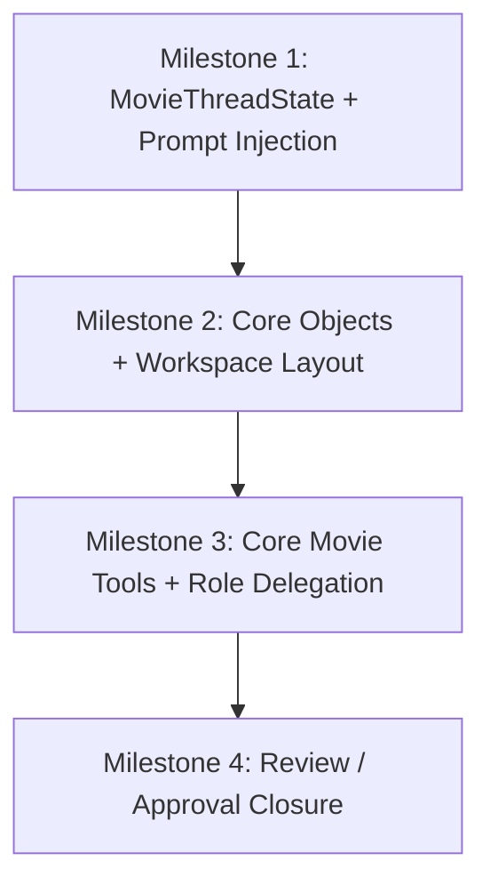

只有四个里程碑都过，MVP 才算真正闭环。

---

## 十三、结论

MVP 的关键不是“尽量少做”，而是“只做最能证明路线正确的一条链”。

对 Hermes 的电影化来说，这条链就是：

- 项目控制面
- 前期制作对象链
- 角色化协作
- 最小治理闭环

只要这条链跑通，后续现场、后期、企业化能力就有了真正可靠的起点。

---

## 相关文档

- [82-phase-1-development-plan.md](./82-phase-1-development-plan.md)
- [83-phase-2-development-plan.md](./83-phase-2-development-plan.md)
- [84-phase-3-development-plan.md](./84-phase-3-development-plan.md)
- [85-pilot-project-implementation-manual.md](./85-pilot-project-implementation-manual.md)
- [103-hermes-agent-movie-integration-strategy-summary.md](./103-hermes-agent-movie-integration-strategy-summary.md)
- [112-ai-coding-and-multi-agent-delivery-plan.md](./112-ai-coding-and-multi-agent-delivery-plan.md)
